-   [Reto 1 -- Pipeline
    CI](#reto-1-pipeline-ci)
-   [Arquitectura](#arquitectura)
    -   [Instalación](#instalación)
    -   [Creación del repo](#creación-del-repo)
-   [Pipeline](#pipeline)
    -   [Pruebas unitarias](#pruebas-unitarias)
    -   [Pruebas de
        integración](#pruebas-de-integración)
        -   [Ejemplo de resultado de las pruebas unitarias y de
            integración](#ejemplo-de-resultado-de-las-pruebas-unitarias-y-de-integración)
    -   [Pruebas de análisis de
        código](#pruebas-de-análisis-de-código)
        -   [Ejemplo de resultado de las pruebas de analisis de
            código](#ejemplo-de-resultado-de-las-pruebas-de-analisis-de-código)
    -   [Pruebas de seguridad
        (*Bandit*)](#pruebas-de-seguridad-bandit)
        -   [Ejemplo de resultado de las pruebas de
            seguridad](#ejemplo-de-resultado-de-las-pruebas-de-seguridad)
    -   [Pruebas de cobertura
        (*Coverage*)](#pruebas-de-cobertura-coverage)
    -   [Pruebas de
        *Jmeter*](#pruebas-de-jmeter)
        -   [Arquitectura](#arquitectura-1)
        -   [Fichero *JMX*](#fichero-jmx)
        -   [*Jenkinsfile*](#jenkinsfile)
        -   [Gráficas de
            rendimiento](#gráficas-de-rendimiento)
-   [Ficheros y salidas](#ficheros-y-salidas)
    -   [Fichero
        *Jenkinsfile*](#fichero-jenkinsfile)
    -   [Paralelización de la
        *pipeline*](#paralelización-de-la-pipeline)
    -   [Ejecución del *pipeline*
        anterior](#ejecución-del-pipeline-anterior)

# Reto 1 -- Pipeline CI

# Arquitectura

Para la ejecución de las pruebas de *Jenkins*, utilizamos:

-   Contenedor docker de *Jenkins* en el nodo *kvm* 192.168.150.228
-   Esclavos en los nodos *kvm*
    -   *slave1*: 192.168.150.205
    -   *slave2*: 192.168.150.229

## Instalación

Para la creación y configuración de los *slaves* utilizamos el *script*
de *terraform* incluido en la carpeta IaC

``` go
resource "null_resource" "provisioner" {
  for_each = var.vm_hostnames
  provisioner "remote-exec" {
    #script = "${path.module}/provisioner.sh"
    inline = [
      "sudo resolvectl dns ens3 1.1.1.1",
      "sudo resolvectl dns ens3 1.1.1.1 ${each.key}",
      "sudo apt update -y",
      "sudo apt install -y cloud-guest-utils",
      "sudo growpart /dev/vda 1",
      "sudo apt install -y ca-certificates curl python3-flask junit python3-flake8 python3-bandit python3-coverage",
      "sudo mkdir -p /apps/wiremock",
      "sudo curl --create-dirs -O --output-dir /apps/wiremock https://repo1.maven.org/maven2/org/wiremock/wiremock-standalone/3.5.4/wiremock-standalone-3.5.4.jar",
      "sudo chmod -R 755 /apps/wiremock",
      "sudo chmod +x  /apps/wiremock/wiremock-standalone-3.5.4.jar",


    ]

    connection {
      type        = "ssh"
      user        = var.ssh_username
      host        = libvirt_domain.domain-kvm[each.key].network_interface[0].addresses[0]
      private_key = file(var.ssh_private_key)
      timeout     = "2m"
    }
  }

  depends_on = [libvirt_domain.domain-kvm]
}
```

## Creación del repo

-   Inicialización del repositorio

``` bash
$ git init
hint: Using 'master' as the name for the initial branch. This default branch name
hint: is subject to change. To configure the initial branch name to use in all
hint: of your new repositories, which will suppress this warning, call:
hint:
hint:   git config --global init.defaultBranch <name>
hint:
hint: Names commonly chosen instead of 'master' are 'main', 'trunk' and
hint: 'development'. The just-created branch can be renamed via this command:
hint:
hint:   git branch -m <name>
```

-   Se añade el repo remoto

``` bash
$ git remote add origin git@github.com:dargamenteria/actividad1-B.git
$ git remote -v
origin  git@github.com:dargamenteria/actividad1-B.git (fetch)
origin  git@github.com:dargamenteria/actividad1-B.git (push)
```

-   Se realiza el primer commit

``` bash
$ git add iac/
$ git commit -m "setup the environment for B "
[main (root-commit) 7edde24] setup the environment for B
 10 files changed, 615 insertions(+)
 create mode 100644 iac/.terraform.lock.hcl
 create mode 100644 iac/config/cloud_init.yml
 create mode 100644 iac/config/network_config.yml
 create mode 100644 iac/kvm_nodes.tf
 create mode 100644 iac/providers.tf
 create mode 100644 iac/provisioner.sh
 create mode 100644 iac/terraform.tf
 create mode 100644 iac/terraform.tfstate
 create mode 100644 iac/terraform.tfstate.backup
 create mode 100644 iac/variables.tf
$ git push origin main
Enumerating objects: 14, done.
Counting objects: 100% (14/14), done.
Delta compression using up to 8 threads
Compressing objects: 100% (11/11), done.
Writing objects: 100% (14/14), 8.20 KiB | 1.17 MiB/s, done.
Total 14 (delta 0), reused 0 (delta 0), pack-reused 0 (from 0)
To github.com:dargamenteria/actividad1-B.git
 * [new branch]      main -> main
```

# Pipeline

## Pruebas unitarias

Se requieren que cumplan las siguintes restricciones

-   No se tendrá en cuenta ningún baremo para establecer si las pruebas
    han sido\
    satisfactorias o no por lo que esta etapa siempre se mostrará en
    verde tras la\
    ejecución de las pruebas.
-   Las pruebas unitarias solo pueden ejecutarse una vez; no se permite
    que se\
    ejecuten las mismas pruebas varias veces en el mismo pipeline.

Definimos la fase de test unidarios de la siguiente manera:

``` groovy
        stage ('Test: Unitary') {
          agent { label 'linux' }
          steps {
            catchError(buildResult: 'SUCCESS', stageResult: 'FAILURE') {
              pipelineBanner()
              unstash 'workspace'
              sh ('''
                echo "Test phase" 
                cd "$WORKSPACE/gitCode"
                export PYTHONPATH=.
                pytest-3 --junitxml=result-test.xml $(pwd)/test/unit
                exit 1
                '''
              )
            }
          }
        }

```

## Pruebas de integración

Se requiere que cumplan las siguientes restricciones.

-   En caso de no conseguir hacerla funcionar, como en el apartado A,
    será un fallo leve, pero no impide la ejecución del resto de retos.
-   Tampoco se tendrá en cuenta ningún baremo para determinar la salud
    de la aplicación; siempre finalizará en verde aunque el resultado de
    las pruebas unitarias no sea óptimo.

Definimos la fase de test unidarios de la siguiente manera:

``` groovy
       stage ('Test: Integration') {
         agent { label 'linux' }
         steps {
           catchError(buildResult: 'SUCCESS', stageResult: 'FAILURE') {
             pipelineBanner()
             unstash 'workspace'
             lock ('test-resources'){
               sh ('''
                 echo "Test phase" 
                 cd "$WORKSPACE/gitCode"

                 export PYTHONPATH=.
                 export FLASK_APP=$(pwd)/app/api.py

                 flask run &
                 java -jar /apps/wiremock/wiremock-standalone-3.5.4.jar --port 9090 --root-dir $(pwd)/test/wiremock &

                 while [ "$(ss -lnt | grep -E "9090|5000" | wc -l)" != "2" ] ; do echo "No perative yet" ; sleep 1; done

                 pytest-3 --junitxml=result-rest.xml $(pwd)/test/rest
                 '''
               )
             }
           }
         }
       }
```

### Ejemplo de resultado de las pruebas unitarias y de integración

La siguiente imagen muestra en *Jenkins* las gráficas con los resultados
de las pruebas de integración y unitarias.
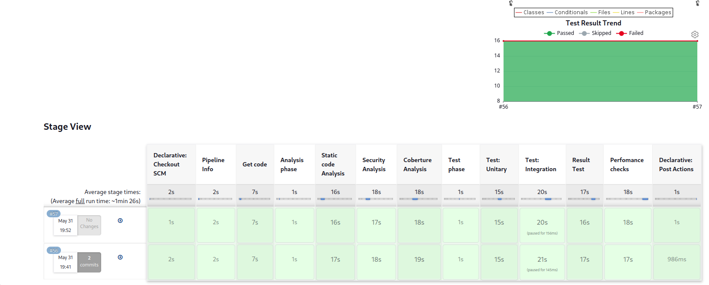

## Pruebas de análisis de código

Han de cumplir los siguientes requerimientos

-   Si se encuentran 8 o más hallazgos, debe marcarse la etapa y el
    build como *unstable* (amarillo/naranja).
-   Si se encuentran 10 o más hallazgos, debe marcarse la etapa y el
    build como unhealthy (rojo).
-   Sea cual sea el resultado, el pipeline debe continuar la ejecución
    del resto deetapas.

A continuación se muestra la definición de la fase:

``` groovy
                stage('Static code Analysis') {
          agent { label 'linux' }
          steps {
            catchError(buildResult: 'SUCCESS', stageResult: 'FAILURE') {
              pipelineBanner()
              unstash 'workspace'
              sh ('''
                cd "$WORKSPACE/gitCode"
                flake8 --format=pylint --exit-zero --max-line-length 120 $(pwd)/app >$(pwd)/flake8.out
                exit 1
                '''
              )
              recordIssues tools: [flake8(name: 'Flake8', pattern: 'gitCode/flake8.out')],
                qualityGates: [
                  [threshold: 8, type: 'TOTAL', critically: 'UNSTABLE'], 
                  [threshold: 10,  type: 'TOTAL', critically: 'FAILURE', unstable: false ]
                ]
              stash  (name: 'workspace')
            }
          }
        }
```

### Ejemplo de resultado de las pruebas de analisis de código

La siguiente imagen muestra los resultados en *Jenkins* de las pruebas
de código.

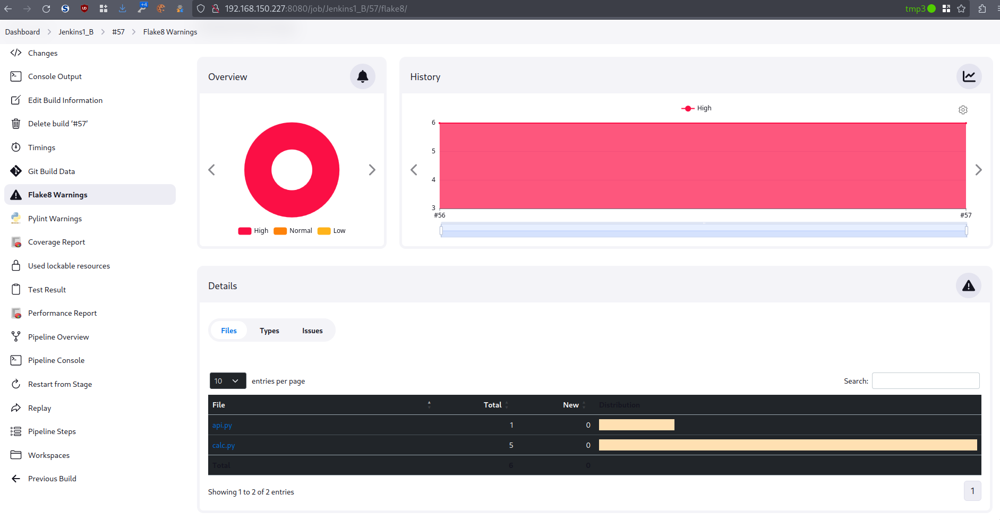
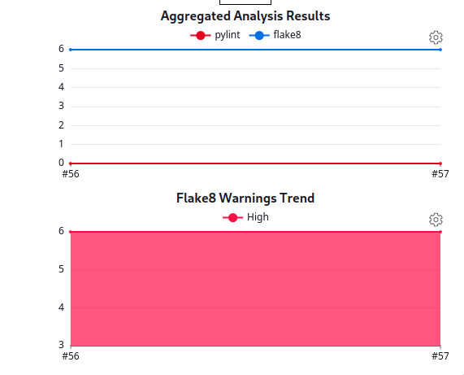

## Pruebas de seguridad (*Bandit*)

-   Si se encuentran 2 o más hallazgos, debe marcarse la etapa y el
    *build* como *unstable* (amarillo/naranja).
-   Si se encuentran 4 o más hallazgos, debe marcarse la etapa y el
    *build* como *unhealthy* (rojo).
-   Sea cual sea el resultado, el *pipeline* debe continuar la ejecución
    del resto de etapas.

``` groovy
       stage('Security Analysis') {
         agent { label 'linux' }
         steps {
           catchError(buildResult: 'SUCCESS', stageResult: 'FAILURE') {
             pipelineBanner()
             unstash 'workspace'
             sh ('''
               cd "$WORKSPACE/gitCode"
               bandit  -r . --format custom --msg-template     "{abspath}:{line}: {test_id}[bandit]: {severity}: {msg}"  -o $(pwd)/bandit.out || echo "Controlled exit" 
               '''
             )
             recordIssues tools: [pyLint(pattern: 'gitCode/bandit.out')],
               qualityGates: [
                 [threshold: 1, type: 'TOTAL', critically: 'UNSTABLE'], 
                 [threshold: 2, type: 'TOTAL', critically: 'FAILURE', unstable: false]
               ]
             stash  (name: 'workspace')
           }
         }
       }
```

### Ejemplo de resultado de las pruebas de seguridad

La siguiente imagen muestra los resultados en *Jenkins* de las pruebas
de seguridad
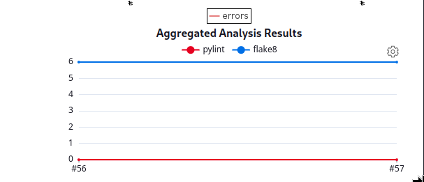
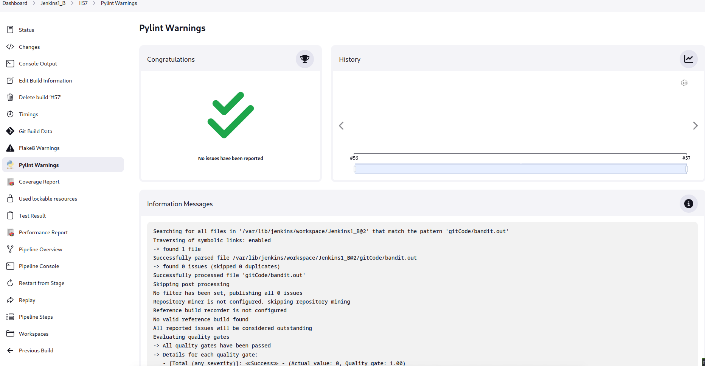

## Pruebas de cobertura (*Coverage*)

• Si la cobertura por líneas se encuentra entre 85 y 95, se marcará como
*unstable*. Por encima será verde y, por debajo, rojo.\
• Si la cobertura por ramas/condiciones se encuentra entre 80 y 90, se
marcará como *unstable*. Por encima será verde y, por debajo, rojo.\
• Sea cual sea el resultado, el *pipeline* debe continuar la ejecución
al resto de etapas.\
• Se recuerda que las pruebas unitarias solo pueden ejecutase una vez
durante todo el *pipeline*.

``` groovy
        stage('Coberture Analysis') {
        agent { label 'linux' }
        steps {
          catchError(buildResult: 'SUCCESS', stageResult: 'FAILURE') {
            pipelineBanner()
            unstash 'workspace'
            sh ('''
              cd "$WORKSPACE/gitCode"
              python3-coverage run --source=$(pwd)/app --omit=$(pwd)app/__init__.py,$(pwd)app/api.py  -m pytest test/unit/
              python3-coverage xml -o $(pwd)/coverage.xml
              exit 1
              '''
            )
            cobertura coberturaReportFile: 'gitCode/coverage.xml'
            stash  (name: 'workspace')
          }
        }
      }
    }
  }
```

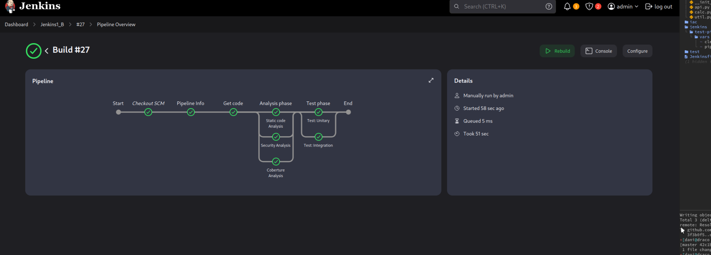\
La siguiente imagen muestra la *pipeline* con varios pasos fallidos para
verificar su avance\
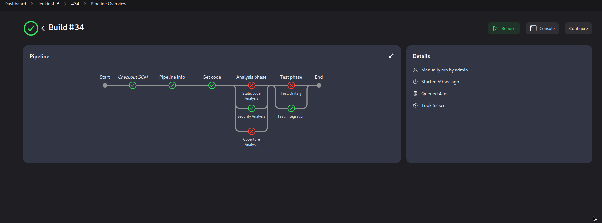
\### Ejemplo de resultado de las pruebas de cobertura La siguiente
imagen muestra los resultados en *Jenkins* de las pruebas de cobertura
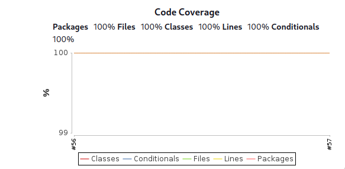
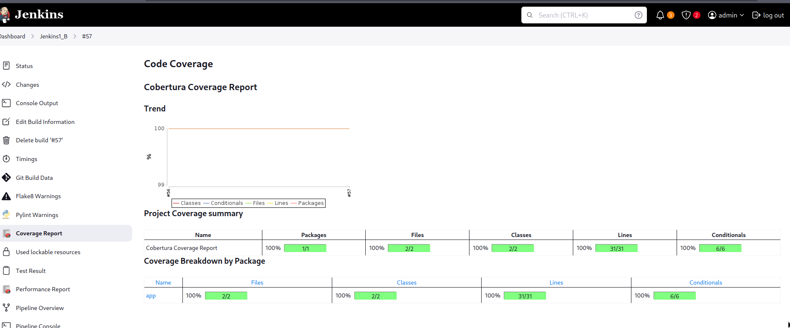

## Pruebas de *Jmeter*

### Arquitectura

Para estas pruebas hemos optado por hacer una distribución de los roles
en función de los nodos.

-   slave1 ejecuta *flask*
-   slave2 ejecuta *jmeter*

### Fichero *JMX*

La configuración de las pruebas es la siguiente. Se crean 10
threadGroups las cuales ejecutaran 40 llamadas cada uno espaciadas 0.5
segundos.

``` xml
<ThreadGroup guiclass="ThreadGroupGui" testclass="ThreadGroup" testname="Users block 1 sum" enabled="true">
     <stringProp name="ThreadGroup.on_sample_error">continue</stringProp>
     <elementProp name="ThreadGroup.main_controller" elementType="LoopController" guiclass="LoopControlPanel" testclass="LoopController" testname="Loop Controller" enabled="true">
       <boolProp name="LoopController.continue_forever">false</boolProp>
       <stringProp name="LoopController.loops">1</stringProp>
     </elementProp>
     <stringProp name="ThreadGroup.num_threads">40</stringProp>
     <stringProp name="ThreadGroup.ramp_time">0.5</stringProp>
     <boolProp name="ThreadGroup.scheduler">false</boolProp>
     <stringProp name="ThreadGroup.duration"></stringProp>
     <stringProp name="ThreadGroup.delay"></stringProp>
     <boolProp name="ThreadGroup.same_user_on_next_iteration">true</boolProp>
   </ThreadGroup>
```

### *Jenkinsfile*

Para poder distribuir la carga entre los distintos nodos slave hemos
optado por la siguiente solución

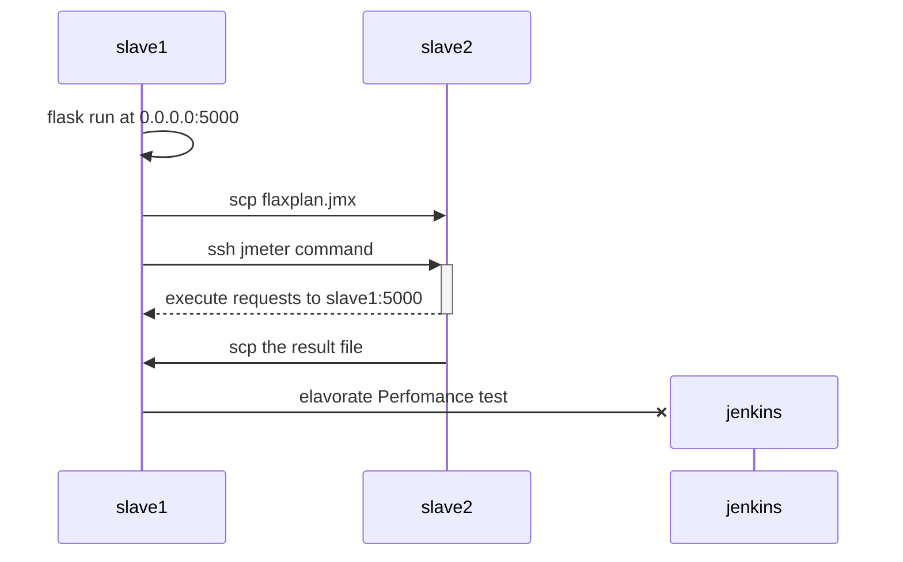

Con lo que nuestra *stage* queda de la siguiente manera:

``` groovy
stage('Perfomance checks') {
      agent { label 'flask' }
      steps {
        catchError(buildResult: 'SUCCESS', stageResult: 'FAILURE') {
          pipelineBanner()
          unstash 'workspace'
          sh ('''
            echo "Test phase" 
            cd "$WORKSPACE/gitCode"

            export PYTHONPATH=.
            export FLASK_APP=$(pwd)/app/api.py

            flask run -h 0.0.0.0 -p 5000 &
            while [ "$(ss -lnt | grep -E "5000" | wc -l)" != "1" ] ; do echo "No perative yet" ; sleep 1; done

            scp $(pwd)/test/jmeter/flaskplan.jmx jenkins@slave2.paranoidworld.es:
            ssh jenkins@slave2.paranoidworld.es 'rm ~/flaskplan.jtl; /apps/jmeter/bin/jmeter -n -t ~/flaskplan.jmx -l ~/flaskplan.jtl'
            scp jenkins@slave2.paranoidworld.es:flaskplan.jtl .

            ''')
          perfReport sourceDataFiles: 'gitCode/flaskplan.jtl'
        }
      }
    }
```

### Gráficas de rendimiento

La siguiente imagen muestra las gráficas de rendimiento. En está prueba
en concreto el valor de percentil 90 es de 1530ms, dicho de otra forma, el 90% de las peticiones tienen una duración inferior a 1530ms
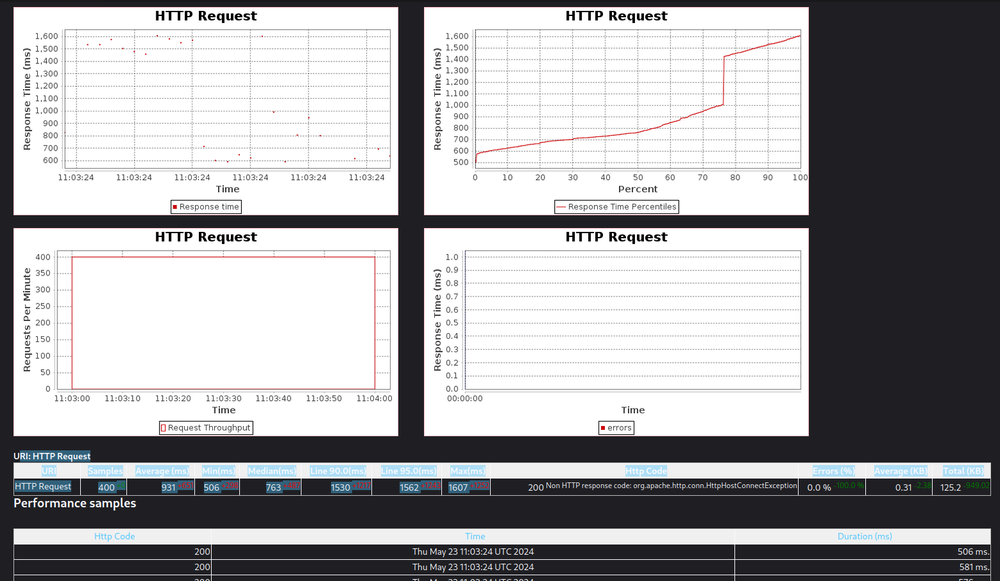

# Ficheros y salidas

## Fichero *Jenkinsfile*

``` groovy
@Library('test-pipeline-library')_


pipeline {
  agent { label 'linux' }
  environment {
    GIT_TOKEN=credentials ('dargamenteria_github_token')
  }
  stages {
    stage('Pipeline Info') {
      steps {
        sh ('echo "        pipelineBanner "')
        pipelineBanner()
      }
    }

    stage('Get code') {
      agent { label 'linux' }
      steps {
        catchError(buildResult: 'SUCCESS', stageResult: 'FAILURE') {
          pipelineBanner()
          sh ('''
            [ -e "$WORKSPACE/gitCode" ] && rm -fr "$WORKSPACE/gitCode"
            git clone https://${GIT_TOKEN}@github.com/dargamenteria/actividad1-B $WORKSPACE/gitCode
            '''
          )
          stash  (name: 'workspace')
        }
      }
    }

    stage ('Analysis phase'){
      parallel {
        stage('Static code Analysis') {
          agent { label 'linux' }
          steps {
            catchError(buildResult: 'SUCCESS', stageResult: 'FAILURE') {
              pipelineBanner()
              unstash 'workspace'
              sh ('''
                cd "$WORKSPACE/gitCode"
                flake8 --format=pylint --exit-zero --max-line-length 120 $(pwd)/app >$(pwd)/flake8.out
                '''
              )
              recordIssues tools: [flake8(name: 'Flake8', pattern: 'gitCode/flake8.out')],
                qualityGates: [
                  [threshold: 8, type: 'TOTAL', critically: 'UNSTABLE'], 
                  [threshold: 10,  type: 'TOTAL', critically: 'FAILURE', unstable: false ]
                ]
              stash  (name: 'workspace')
            }
          }
        }
        stage('Security Analysis') {
          agent { label 'linux' }
          steps {
            catchError(buildResult: 'SUCCESS', stageResult: 'FAILURE') {
              pipelineBanner()
              unstash 'workspace'
              sh ('''
                cd "$WORKSPACE/gitCode"
                bandit  -r . --format custom --msg-template     "{abspath}:{line}: {test_id}[bandit]: {severity}: {msg}"  -o $(pwd)/bandit.out || echo "Controlled exit" 
                '''
              )
              recordIssues tools: [pyLint(pattern: 'gitCode/bandit.out')],
                qualityGates: [
                  [threshold: 1, type: 'TOTAL', critically: 'UNSTABLE'], 
                  [threshold: 2, type: 'TOTAL', critically: 'FAILURE', unstable: false]
                ]
              stash  (name: 'workspace')
            }
          }
        }

        stage('Coberture Analysis') {
          agent { label 'linux' }
          steps {
            catchError(buildResult: 'SUCCESS', stageResult: 'FAILURE') {
              pipelineBanner()
              unstash 'workspace'
              sh ('''
                cd "$WORKSPACE/gitCode"
                python3-coverage run --source=$(pwd)/app --omit=$(pwd)app/__init__.py,$(pwd)app/api.py  -m pytest test/unit/
                python3-coverage xml -o $(pwd)/coverage.xml
                '''
              )
              cobertura coberturaReportFile: 'gitCode/coverage.xml'
              stash  (name: 'workspace')
            }
          }
        }
      }
    }

    stage('Test phase') {
      parallel {
        stage ('Test: Unitary') {
          agent { label 'linux' }
          steps {
            catchError(buildResult: 'SUCCESS', stageResult: 'FAILURE') {
              pipelineBanner()
              unstash 'workspace'
              sh ('''
                echo "Test phase" 
                cd "$WORKSPACE/gitCode"
                export PYTHONPATH=.
                pytest-3 --junitxml=result-test.xml $(pwd)/test/unit
                '''
              )
            }
          }
        }

        stage ('Test: Integration') {
          agent { label 'linux' }
          steps {
            catchError(buildResult: 'SUCCESS', stageResult: 'FAILURE') {
              pipelineBanner()
              unstash 'workspace'
              lock ('test-resources'){
                sh ('''
                  echo "Test phase" 
                  cd "$WORKSPACE/gitCode"

                  export PYTHONPATH=.
                  export FLASK_APP=$(pwd)/app/api.py

                  flask run -h 0.0.0.0 -p 5000 &
                  java -jar /apps/wiremock/wiremock-standalone-3.5.4.jar --port 9090 --root-dir $(pwd)/test/wiremock &

                  while [ "$(ss -lnt | grep -E "9090|5000" | wc -l)" != "2" ] ; do echo "No perative yet" ; sleep 1; done

                  pytest-3 --junitxml=result-rest.xml $(pwd)/test/rest
                  '''
                )
              }
            }
          }
        }
      }
    }
    stage('Perfomance checks') {
      agent { label 'flask' }
      steps {
        catchError(buildResult: 'SUCCESS', stageResult: 'FAILURE') {
          pipelineBanner()
          unstash 'workspace'
          sh ('''
            echo "Test phase" 
            cd "$WORKSPACE/gitCode"

            export PYTHONPATH=.
            export FLASK_APP=$(pwd)/app/api.py

            flask run -h 0.0.0.0 -p 5000 &
            while [ "$(ss -lnt | grep -E "5000" | wc -l)" != "1" ] ; do echo "No perative yet" ; sleep 1; done

            scp $(pwd)/test/jmeter/flaskplan.jmx jenkins@slave2.paranoidworld.es:
            ssh jenkins@slave2.paranoidworld.es 'rm ~/flaskplan.jtl; /apps/jmeter/bin/jmeter -n -t ~/flaskplan.jmx -l ~/flaskplan.jtl'
            scp jenkins@slave2.paranoidworld.es:flaskplan.jtl .

            ''')
          perfReport sourceDataFiles: 'gitCode/flaskplan.jtl'
        }
      }
    }
  }   
}
```

## Paralelización de la *pipeline*

La siguiente imagen muestra las distintas fases de la *pipeline* y su
paralelización.\


## Ejecución del *pipeline* anterior

``` bash
Started by user admin
Obtained Jenkinsfile from git https://github.com/dargamenteria/actividad1-B
Loading library test-pipeline-library@master
Attempting to resolve master from remote references...
 > git --version # timeout=10
 > git --version # 'git version 2.34.1'
 > git ls-remote -h -- https://github.com/dargamenteria/actividad1-B # timeout=10
Found match: refs/heads/master revision 089a29a6bcb7dd7ab8bf75b0bcdd054c3358ab6a
Selected Git installation does not exist. Using Default
The recommended git tool is: NONE
No credentials specified
 > git rev-parse --resolve-git-dir /var/lib/jenkins/workspace/Jenkins1_B@libs/f681e00ebd197507f856ad5127467ad257716f760a27a1768db2053d2db4914e/.git # timeout=10
Fetching changes from the remote Git repository
 > git config remote.origin.url https://github.com/dargamenteria/actividad1-B # timeout=10
Fetching without tags
Fetching upstream changes from https://github.com/dargamenteria/actividad1-B
 > git --version # timeout=10
 > git --version # 'git version 2.34.1'
 > git fetch --no-tags --force --progress -- https://github.com/dargamenteria/actividad1-B +refs/heads/*:refs/remotes/origin/* # timeout=10
Checking out Revision 089a29a6bcb7dd7ab8bf75b0bcdd054c3358ab6a (master)
 > git config core.sparsecheckout # timeout=10
 > git checkout -f 089a29a6bcb7dd7ab8bf75b0bcdd054c3358ab6a # timeout=10
Commit message: "Some cosmetical changes"
 > git rev-list --no-walk 95c565a95da1a17f0928d1d4446d90b534cf5166 # timeout=10
[Pipeline] Start of Pipeline
[Pipeline] node
Running on slave1_ssh in /var/lib/jenkins/workspace/Jenkins1_B
[Pipeline] {
[Pipeline] stage
[Pipeline] { (Declarative: Checkout SCM)
[Pipeline] checkout
Selected Git installation does not exist. Using Default
The recommended git tool is: NONE
No credentials specified
Fetching changes from the remote Git repository
Checking out Revision 089a29a6bcb7dd7ab8bf75b0bcdd054c3358ab6a (refs/remotes/origin/master)
Commit message: "Some cosmetical changes"
[Pipeline] }
 > git rev-parse --resolve-git-dir /var/lib/jenkins/workspace/Jenkins1_B/.git # timeout=10
 > git config remote.origin.url https://github.com/dargamenteria/actividad1-B # timeout=10
Fetching upstream changes from https://github.com/dargamenteria/actividad1-B
 > git --version # timeout=10
 > git --version # 'git version 2.34.1'
 > git fetch --tags --force --progress -- https://github.com/dargamenteria/actividad1-B +refs/heads/*:refs/remotes/origin/* # timeout=10
 > git rev-parse refs/remotes/origin/master^{commit} # timeout=10
 > git config core.sparsecheckout # timeout=10
 > git checkout -f 089a29a6bcb7dd7ab8bf75b0bcdd054c3358ab6a # timeout=10
[Pipeline] // stage
[Pipeline] withEnv
[Pipeline] {
[Pipeline] withCredentials
Masking supported pattern matches of $GIT_TOKEN
[Pipeline] {
[Pipeline] stage
[Pipeline] { (Pipeline Info)
[Pipeline] sh
+ echo         pipelineBanner 
        pipelineBanner 
[Pipeline] script
[Pipeline] {
[Pipeline] sh
+ echo ##########################
##########################
+ hostname -f
+ echo #Hostname: slave1.paranoidworld.es
#Hostname: slave1.paranoidworld.es
+ uname -a
+ echo #Hostinfo: Linux slave1.paranoidworld.es 5.15.0-105-generic #115-Ubuntu SMP Mon Apr 15 09:52:04 UTC 2024 x86_64 x86_64 x86_64 GNU/Linux
#Hostinfo: Linux slave1.paranoidworld.es 5.15.0-105-generic #115-Ubuntu SMP Mon Apr 15 09:52:04 UTC 2024 x86_64 x86_64 x86_64 GNU/Linux
+ echo ##########################
##########################
[Pipeline] }
[Pipeline] // script
[Pipeline] }
[Pipeline] // stage
[Pipeline] stage
[Pipeline] { (Get code)
[Pipeline] node
Running on slave2_ssh in /var/lib/jenkins/workspace/Jenkins1_B
[Pipeline] {
[Pipeline] checkout
Selected Git installation does not exist. Using Default
The recommended git tool is: NONE
No credentials specified
Fetching changes from the remote Git repository
Checking out Revision 089a29a6bcb7dd7ab8bf75b0bcdd054c3358ab6a (refs/remotes/origin/master)
Commit message: "Some cosmetical changes"
 > git rev-parse --resolve-git-dir /var/lib/jenkins/workspace/Jenkins1_B/.git # timeout=10
 > git config remote.origin.url https://github.com/dargamenteria/actividad1-B # timeout=10
Fetching upstream changes from https://github.com/dargamenteria/actividad1-B
 > git --version # timeout=10
 > git --version # 'git version 2.34.1'
 > git fetch --tags --force --progress -- https://github.com/dargamenteria/actividad1-B +refs/heads/*:refs/remotes/origin/* # timeout=10
 > git rev-parse refs/remotes/origin/master^{commit} # timeout=10
 > git config core.sparsecheckout # timeout=10
 > git checkout -f 089a29a6bcb7dd7ab8bf75b0bcdd054c3358ab6a # timeout=10
[Pipeline] withEnv
[Pipeline] {
[Pipeline] catchError
[Pipeline] {
[Pipeline] script
[Pipeline] {
[Pipeline] sh
+ echo ##########################
##########################
+ hostname -f
+ echo #Hostname: slave2.paranoidworld.es
#Hostname: slave2.paranoidworld.es
+ uname -a
+ echo #Hostinfo: Linux slave2.paranoidworld.es 5.15.0-107-generic #117-Ubuntu SMP Fri Apr 26 12:26:49 UTC 2024 x86_64 x86_64 x86_64 GNU/Linux
#Hostinfo: Linux slave2.paranoidworld.es 5.15.0-107-generic #117-Ubuntu SMP Fri Apr 26 12:26:49 UTC 2024 x86_64 x86_64 x86_64 GNU/Linux
+ echo ##########################
##########################
[Pipeline] }
[Pipeline] // script
[Pipeline] sh
+ [ -e /var/lib/jenkins/workspace/Jenkins1_B/gitCode ]
+ rm -fr /var/lib/jenkins/workspace/Jenkins1_B/gitCode
+ git clone https://****@github.com/dargamenteria/actividad1-B /var/lib/jenkins/workspace/Jenkins1_B/gitCode
Cloning into '/var/lib/jenkins/workspace/Jenkins1_B/gitCode'...
[Pipeline] stash
Stashed 93 file(s)
[Pipeline] }
[Pipeline] // catchError
[Pipeline] }
[Pipeline] // withEnv
[Pipeline] }
[Pipeline] // node
[Pipeline] }
[Pipeline] // stage
[Pipeline] stage
[Pipeline] { (Analysis phase)
[Pipeline] parallel
[Pipeline] { (Branch: Static code Analysis)
[Pipeline] { (Branch: Security Analysis)
[Pipeline] { (Branch: Coberture Analysis)
[Pipeline] stage
[Pipeline] { (Static code Analysis)
[Pipeline] stage
[Pipeline] { (Security Analysis)
[Pipeline] stage
[Pipeline] { (Coberture Analysis)
[Pipeline] node
[Pipeline] node
Running on slave2_ssh in /var/lib/jenkins/workspace/Jenkins1_B
Running on slave2_ssh in /var/lib/jenkins/workspace/Jenkins1_B@2
[Pipeline] node
Running on slave1_ssh in /var/lib/jenkins/workspace/Jenkins1_B@2
[Pipeline] {
[Pipeline] {
[Pipeline] {
[Pipeline] checkout
Selected Git installation does not exist. Using Default
The recommended git tool is: NONE
No credentials specified
Fetching changes from the remote Git repository
[Pipeline] checkout
Selected Git installation does not exist. Using Default
The recommended git tool is: NONE
No credentials specified
Fetching changes from the remote Git repository
[Pipeline] checkout
Selected Git installation does not exist. Using Default
The recommended git tool is: NONE
No credentials specified
Fetching changes from the remote Git repository
Checking out Revision 089a29a6bcb7dd7ab8bf75b0bcdd054c3358ab6a (refs/remotes/origin/master)
Commit message: "Some cosmetical changes"
[Pipeline] withEnv
Checking out Revision 089a29a6bcb7dd7ab8bf75b0bcdd054c3358ab6a (refs/remotes/origin/master)
[Pipeline] {
Commit message: "Some cosmetical changes"
 > git rev-parse --resolve-git-dir /var/lib/jenkins/workspace/Jenkins1_B/.git # timeout=10
 > git config remote.origin.url https://github.com/dargamenteria/actividad1-B # timeout=10
Fetching upstream changes from https://github.com/dargamenteria/actividad1-B
 > git --version # timeout=10
 > git --version # 'git version 2.34.1'
 > git fetch --tags --force --progress -- https://github.com/dargamenteria/actividad1-B +refs/heads/*:refs/remotes/origin/* # timeout=10
 > git rev-parse refs/remotes/origin/master^{commit} # timeout=10
 > git config core.sparsecheckout # timeout=10
 > git checkout -f 089a29a6bcb7dd7ab8bf75b0bcdd054c3358ab6a # timeout=10
Checking out Revision 089a29a6bcb7dd7ab8bf75b0bcdd054c3358ab6a (refs/remotes/origin/master)
Commit message: "Some cosmetical changes"
 > git rev-parse --resolve-git-dir /var/lib/jenkins/workspace/Jenkins1_B@2/.git # timeout=10
 > git config remote.origin.url https://github.com/dargamenteria/actividad1-B # timeout=10
Fetching upstream changes from https://github.com/dargamenteria/actividad1-B
 > git --version # timeout=10
 > git --version # 'git version 2.34.1'
 > git fetch --tags --force --progress -- https://github.com/dargamenteria/actividad1-B +refs/heads/*:refs/remotes/origin/* # timeout=10
 > git rev-parse refs/remotes/origin/master^{commit} # timeout=10
 > git config core.sparsecheckout # timeout=10
 > git checkout -f 089a29a6bcb7dd7ab8bf75b0bcdd054c3358ab6a # timeout=10
 > git rev-parse --resolve-git-dir /var/lib/jenkins/workspace/Jenkins1_B@2/.git # timeout=10
 > git config remote.origin.url https://github.com/dargamenteria/actividad1-B # timeout=10
Fetching upstream changes from https://github.com/dargamenteria/actividad1-B
 > git --version # timeout=10
 > git --version # 'git version 2.34.1'
 > git fetch --tags --force --progress -- https://github.com/dargamenteria/actividad1-B +refs/heads/*:refs/remotes/origin/* # timeout=10
 > git rev-parse refs/remotes/origin/master^{commit} # timeout=10
 > git config core.sparsecheckout # timeout=10
 > git checkout -f 089a29a6bcb7dd7ab8bf75b0bcdd054c3358ab6a # timeout=10
[Pipeline] withEnv
[Pipeline] {
[Pipeline] withEnv
[Pipeline] {
[Pipeline] catchError
[Pipeline] {
[Pipeline] script
[Pipeline] {
[Pipeline] sh
[Pipeline] catchError
+ echo ##########################
##########################
+ hostname -f
[Pipeline] {
[Pipeline] script
[Pipeline] {
[Pipeline] sh
+ echo #Hostname: slave2.paranoidworld.es
#Hostname: slave2.paranoidworld.es
+ uname -a
+ echo #Hostinfo: Linux slave2.paranoidworld.es 5.15.0-107-generic #117-Ubuntu SMP Fri Apr 26 12:26:49 UTC 2024 x86_64 x86_64 x86_64 GNU/Linux
#Hostinfo: Linux slave2.paranoidworld.es 5.15.0-107-generic #117-Ubuntu SMP Fri Apr 26 12:26:49 UTC 2024 x86_64 x86_64 x86_64 GNU/Linux
+ echo ##########################
##########################
+ echo ##########################
##########################
+ hostname -f
+ echo #Hostname: slave2.paranoidworld.es
#Hostname: slave2.paranoidworld.es
+ uname -a
+ echo #Hostinfo: Linux slave2.paranoidworld.es 5.15.0-107-generic #117-Ubuntu SMP Fri Apr 26 12:26:49 UTC 2024 x86_64 x86_64 x86_64 GNU/Linux
#Hostinfo: Linux slave2.paranoidworld.es 5.15.0-107-generic #117-Ubuntu SMP Fri Apr 26 12:26:49 UTC 2024 x86_64 x86_64 x86_64 GNU/Linux
+ echo ##########################
##########################
[Pipeline] catchError
[Pipeline] {
[Pipeline] script
[Pipeline] {
[Pipeline] sh
[Pipeline] }
+ echo ##########################
##########################
+ hostname -f
+ echo #Hostname: slave1.paranoidworld.es
#Hostname: slave1.paranoidworld.es
+ uname -a
+ echo #Hostinfo: Linux slave1.paranoidworld.es 5.15.0-105-generic #115-Ubuntu SMP Mon Apr 15 09:52:04 UTC 2024 x86_64 x86_64 x86_64 GNU/Linux
#Hostinfo: Linux slave1.paranoidworld.es 5.15.0-105-generic #115-Ubuntu SMP Mon Apr 15 09:52:04 UTC 2024 x86_64 x86_64 x86_64 GNU/Linux
+ echo ##########################
##########################
[Pipeline] }
[Pipeline] // script
[Pipeline] unstash
[Pipeline] }
[Pipeline] // script
[Pipeline] unstash
[Pipeline] // script
[Pipeline] sh
[Pipeline] unstash
+ cd /var/lib/jenkins/workspace/Jenkins1_B/gitCode
+ pwd
+ pwd
+ flake8 --format=pylint --exit-zero --max-line-length 120 /var/lib/jenkins/workspace/Jenkins1_B/gitCode/app
[Pipeline] sh
+ cd /var/lib/jenkins/workspace/Jenkins1_B@2/gitCode
+ pwd
+ bandit -r . --format custom --msg-template {abspath}:{line}: {test_id}[bandit]: {severity}: {msg} -o /var/lib/jenkins/workspace/Jenkins1_B@2/gitCode/bandit.out
[Pipeline] recordIssues
WARNING: Unknown parameter(s) found for class type 'io.jenkins.plugins.analysis.core.util.WarningsQualityGate': critically
WARNING: Unknown parameter(s) found for class type 'io.jenkins.plugins.analysis.core.util.WarningsQualityGate': critically
[Flake8] Searching for all files in '/var/lib/jenkins/workspace/Jenkins1_B' that match the pattern 'gitCode/flake8.out'
[Flake8] Traversing of symbolic links: enabled
[Flake8] -> found 1 file
[Flake8] Successfully parsed file /var/lib/jenkins/workspace/Jenkins1_B/gitCode/flake8.out
[Flake8] -> found 6 issues (skipped 0 duplicates)
[Flake8] Successfully processed file 'gitCode/flake8.out'
[main]  INFO    profile include tests: None
[main]  INFO    profile exclude tests: None
[main]  INFO    cli include tests: None
[main]  INFO    cli exclude tests: None
[main]  INFO    running on Python 3.10.12
[Flake8] Post processing issues on 'slave2_ssh' with source code encoding 'UTF-8'
[Flake8] Creating SCM blamer to obtain author and commit information for affected files
[Flake8] -> No blamer installed yet. You need to install the 'git-forensics' plugin to enable blaming for Git.
[Flake8] Resolving file names for all issues in workspace '/var/lib/jenkins/workspace/Jenkins1_B'
[Flake8] -> resolved paths in source directory (2 found, 0 not found)
[Flake8] Resolving module names from module definitions (build.xml, pom.xml, or Manifest.mf files)
[Flake8] -> resolved module names for 6 issues
[Flake8] Resolving package names (or namespaces) by parsing the affected files
[Flake8] -> resolved package names of 2 affected files
[Flake8] No filter has been set, publishing all 6 issues
[Flake8] Creating fingerprints for all affected code blocks to track issues over different builds
[Flake8] -> created fingerprints for 6 issues (skipped 0 issues)
[Flake8] Copying affected files to Jenkins' build folder '/var/lib/jenkins/jobs/Jenkins1_B/builds/47/files-with-issues'
[Flake8] -> 2 copied, 0 not in workspace, 0 not-found, 0 with I/O error
[Flake8] Skipping cleaning of source code files in old builds
[Flake8] Repository miner is not configured, skipping repository mining
[Flake8] Searching for all files in '/var/lib/jenkins/workspace/Jenkins1_B' that match the pattern 'gitCode/flake8.out'
[Flake8] Traversing of symbolic links: enabled
[Flake8] -> found 1 file
[Flake8] Successfully parsed file /var/lib/jenkins/workspace/Jenkins1_B/gitCode/flake8.out
[Flake8] -> found 6 issues (skipped 0 duplicates)
[Flake8] Successfully processed file 'gitCode/flake8.out'
[Flake8] Post processing issues on 'slave2_ssh' with source code encoding 'UTF-8'
[Flake8] Creating SCM blamer to obtain author and commit information for affected files
[Flake8] -> No blamer installed yet. You need to install the 'git-forensics' plugin to enable blaming for Git.
[Flake8] Resolving file names for all issues in workspace '/var/lib/jenkins/workspace/Jenkins1_B'
[Flake8] -> resolved paths in source directory (2 found, 0 not found)
[Flake8] Resolving module names from module definitions (build.xml, pom.xml, or Manifest.mf files)
[Flake8] -> resolved module names for 6 issues
[Flake8] Resolving package names (or namespaces) by parsing the affected files
[Flake8] -> resolved package names of 2 affected files
[Flake8] No filter has been set, publishing all 6 issues
[Flake8] Creating fingerprints for all affected code blocks to track issues over different builds
[Flake8] -> created fingerprints for 6 issues (skipped 0 issues)
[Flake8] Copying affected files to Jenkins' build folder '/var/lib/jenkins/jobs/Jenkins1_B/builds/47/files-with-issues'
[Flake8] -> 2 copied, 0 not in workspace, 0 not-found, 0 with I/O error
[Flake8] Skipping cleaning of source code files in old builds
[Flake8] Repository miner is not configured, skipping repository mining
[Flake8] Reference build recorder is not configured
[Flake8] No valid reference build found
[Flake8] All reported issues will be considered outstanding
[Flake8] Evaluating quality gates
[Flake8] -> All quality gates have been passed
[Flake8] -> Details for each quality gate:
[Flake8]    - [Total (any severity)]: ≪Success≫ - (Actual value: 6, Quality gate: 8.00)
[Flake8]    - [Total (any severity)]: ≪Success≫ - (Actual value: 6, Quality gate: 10.00)
[Flake8] Health report is disabled - skipping
[Flake8] Created analysis result for 6 issues (found 0 new issues, fixed 0 issues)
[Flake8] Attaching ResultAction with ID 'flake8' to build 'Jenkins1_B #47'.
[Pipeline] sh
[custom]    INFO    Result written to file: /var/lib/jenkins/workspace/Jenkins1_B@2/gitCode/bandit.out
+ echo Controlled exit
Controlled exit
+ cd /var/lib/jenkins/workspace/Jenkins1_B@2/gitCode
+ pwd
+ pwd
+ pwd
+ python3-coverage run --source=/var/lib/jenkins/workspace/Jenkins1_B@2/gitCode/app --omit=/var/lib/jenkins/workspace/Jenkins1_B@2/gitCodeapp/__init__.py,/var/lib/jenkins/workspace/Jenkins1_B@2/gitCodeapp/api.py -m pytest test/unit/
[Checks API] No suitable checks publisher found.
[Pipeline] recordIssues
WARNING: Unknown parameter(s) found for class type 'io.jenkins.plugins.analysis.core.util.WarningsQualityGate': critically
WARNING: Unknown parameter(s) found for class type 'io.jenkins.plugins.analysis.core.util.WarningsQualityGate': critically
[Pylint] Searching for all files in '/var/lib/jenkins/workspace/Jenkins1_B@2' that match the pattern 'gitCode/bandit.out'
[Pylint] Traversing of symbolic links: enabled
[Pylint] -> found 1 file
[Pylint] Successfully parsed file /var/lib/jenkins/workspace/Jenkins1_B@2/gitCode/bandit.out
[Pylint] -> found 0 issues (skipped 0 duplicates)
[Pylint] Successfully processed file 'gitCode/bandit.out'
[Pylint] Skipping post processing
[Pylint] No filter has been set, publishing all 0 issues
[Pylint] Repository miner is not configured, skipping repository mining
[Pylint] Searching for all files in '/var/lib/jenkins/workspace/Jenkins1_B@2' that match the pattern 'gitCode/bandit.out'
[Pylint] Traversing of symbolic links: enabled
[Pylint] -> found 1 file
[Pylint] Successfully parsed file /var/lib/jenkins/workspace/Jenkins1_B@2/gitCode/bandit.out
[Pylint] -> found 0 issues (skipped 0 duplicates)
[Pylint] Successfully processed file 'gitCode/bandit.out'
[Pylint] Skipping post processing
[Pylint] No filter has been set, publishing all 0 issues
[Pylint] Repository miner is not configured, skipping repository mining
[Pylint] Reference build recorder is not configured
[Pylint] No valid reference build found
[Pylint] All reported issues will be considered outstanding
[Pylint] Evaluating quality gates
[Pylint] -> All quality gates have been passed
[Pylint] -> Details for each quality gate:
[Pylint]    - [Total (any severity)]: ≪Success≫ - (Actual value: 0, Quality gate: 1.00)
[Pylint]    - [Total (any severity)]: ≪Success≫ - (Actual value: 0, Quality gate: 2.00)
[Pylint] Health report is disabled - skipping
[Pylint] Created analysis result for 0 issues (found 0 new issues, fixed 0 issues)
[Pylint] Attaching ResultAction with ID 'pylint' to build 'Jenkins1_B #47'.
============================= test session starts ==============================
platform linux -- Python 3.10.12, pytest-6.2.5, py-1.10.0, pluggy-0.13.0
rootdir: /var/lib/jenkins/workspace/Jenkins1_B@2/gitCode
collected 11 items

test/unit/calc_test.py .........                                         [ 81%]
test/unit/util_test.py ..                                                [100%]

=============================== warnings summary ===============================
test/unit/calc_test.py:7
  /var/lib/jenkins/workspace/Jenkins1_B@2/gitCode/test/unit/calc_test.py:7: PytestUnknownMarkWarning: Unknown pytest.mark.unit - is this a typo?  You can register custom marks to avoid this warning - for details, see https://docs.pytest.org/en/stable/mark.html
    @pytest.mark.unit

test/unit/util_test.py:7
  /var/lib/jenkins/workspace/Jenkins1_B@2/gitCode/test/unit/util_test.py:7: PytestUnknownMarkWarning: Unknown pytest.mark.unit - is this a typo?  You can register custom marks to avoid this warning - for details, see https://docs.pytest.org/en/stable/mark.html
    @pytest.mark.unit

-- Docs: https://docs.pytest.org/en/stable/warnings.html
======================== 11 passed, 2 warnings in 0.08s ========================
+ pwd
+ python3-coverage xml -o /var/lib/jenkins/workspace/Jenkins1_B@2/gitCode/coverage.xml
Wrote XML report to /var/lib/jenkins/workspace/Jenkins1_B@2/gitCode/coverage.xml
[Pipeline] stash
Warning: overwriting stash ‘workspace’
[Checks API] No suitable checks publisher found.
Stashed 94 file(s)
[Pipeline] }
[Pipeline] stash
Warning: overwriting stash ‘workspace’
Stashed 109 file(s)
[Pipeline] cobertura
[Cobertura] Publishing Cobertura coverage report...

[Cobertura] Publishing Cobertura coverage results...

[Cobertura] Cobertura coverage report found.

[Pipeline] // catchError
[Pipeline] }
[Pipeline] }
[Pipeline] stash
Warning: overwriting stash ‘workspace’
Stashed 131 file(s)
[Pipeline] // withEnv
[Pipeline] // catchError
[Pipeline] }
[Pipeline] }
[Pipeline] }
[Pipeline] // node
[Pipeline] // withEnv
[Pipeline] // catchError
[Pipeline] }
[Pipeline] }
[Pipeline] }
[Pipeline] // stage
[Pipeline] // node
[Pipeline] // withEnv
[Pipeline] }
[Pipeline] }
[Pipeline] }
[Pipeline] // stage
[Pipeline] // node
[Pipeline] }
[Pipeline] }
[Pipeline] // stage
[Pipeline] }
[Pipeline] // parallel
[Pipeline] }
[Pipeline] // stage
[Pipeline] stage
[Pipeline] { (Test phase)
[Pipeline] parallel
[Pipeline] { (Branch: Test: Unitary)
[Pipeline] { (Branch: Test: Integration)
[Pipeline] stage
[Pipeline] { (Test: Unitary)
[Pipeline] stage
[Pipeline] { (Test: Integration)
[Pipeline] node
Running on slave1_ssh in /var/lib/jenkins/workspace/Jenkins1_B@2
[Pipeline] node
Running on slave1_ssh in /var/lib/jenkins/workspace/Jenkins1_B@3
[Pipeline] {
[Pipeline] {
[Pipeline] checkout
Selected Git installation does not exist. Using Default
The recommended git tool is: NONE
No credentials specified
Fetching changes from the remote Git repository
[Pipeline] checkout
Selected Git installation does not exist. Using Default
The recommended git tool is: NONE
No credentials specified
Fetching changes from the remote Git repository
Checking out Revision 089a29a6bcb7dd7ab8bf75b0bcdd054c3358ab6a (refs/remotes/origin/master)
Commit message: "Some cosmetical changes"
Checking out Revision 089a29a6bcb7dd7ab8bf75b0bcdd054c3358ab6a (refs/remotes/origin/master)
[Pipeline] withEnv
Commit message: "Some cosmetical changes"
 > git rev-parse --resolve-git-dir /var/lib/jenkins/workspace/Jenkins1_B@2/.git # timeout=10
 > git config remote.origin.url https://github.com/dargamenteria/actividad1-B # timeout=10
Fetching upstream changes from https://github.com/dargamenteria/actividad1-B
 > git --version # timeout=10
 > git --version # 'git version 2.34.1'
 > git fetch --tags --force --progress -- https://github.com/dargamenteria/actividad1-B +refs/heads/*:refs/remotes/origin/* # timeout=10
 > git rev-parse refs/remotes/origin/master^{commit} # timeout=10
 > git config core.sparsecheckout # timeout=10
 > git checkout -f 089a29a6bcb7dd7ab8bf75b0bcdd054c3358ab6a # timeout=10
 > git rev-parse --resolve-git-dir /var/lib/jenkins/workspace/Jenkins1_B@3/.git # timeout=10
 > git config remote.origin.url https://github.com/dargamenteria/actividad1-B # timeout=10
Fetching upstream changes from https://github.com/dargamenteria/actividad1-B
 > git --version # timeout=10
 > git --version # 'git version 2.34.1'
 > git fetch --tags --force --progress -- https://github.com/dargamenteria/actividad1-B +refs/heads/*:refs/remotes/origin/* # timeout=10
 > git rev-parse refs/remotes/origin/master^{commit} # timeout=10
 > git config core.sparsecheckout # timeout=10
 > git checkout -f 089a29a6bcb7dd7ab8bf75b0bcdd054c3358ab6a # timeout=10
[Pipeline] {
[Pipeline] withEnv
[Pipeline] {
[Pipeline] catchError
[Pipeline] {
[Pipeline] script
[Pipeline] {
[Pipeline] sh
+ echo ##########################
##########################
+ hostname -f
+ echo #Hostname: slave1.paranoidworld.es
#Hostname: slave1.paranoidworld.es
+ uname -a
+ echo #Hostinfo: Linux slave1.paranoidworld.es 5.15.0-105-generic #115-Ubuntu SMP Mon Apr 15 09:52:04 UTC 2024 x86_64 x86_64 x86_64 GNU/Linux
#Hostinfo: Linux slave1.paranoidworld.es 5.15.0-105-generic #115-Ubuntu SMP Mon Apr 15 09:52:04 UTC 2024 x86_64 x86_64 x86_64 GNU/Linux
+ echo ##########################
##########################
[Pipeline] catchError
[Pipeline] {
[Pipeline] script
[Pipeline] {
[Pipeline] }
[Pipeline] sh
[Pipeline] // script
+ echo ##########################
##########################
+ hostname -f
+ echo #Hostname: slave1.paranoidworld.es
#Hostname: slave1.paranoidworld.es
+ uname -a
+ echo #Hostinfo: Linux slave1.paranoidworld.es 5.15.0-105-generic #115-Ubuntu SMP Mon Apr 15 09:52:04 UTC 2024 x86_64 x86_64 x86_64 GNU/Linux
#Hostinfo: Linux slave1.paranoidworld.es 5.15.0-105-generic #115-Ubuntu SMP Mon Apr 15 09:52:04 UTC 2024 x86_64 x86_64 x86_64 GNU/Linux
+ echo ##########################
##########################
[Pipeline] unstash
[Pipeline] }
[Pipeline] // script
[Pipeline] sh
[Pipeline] unstash
+ echo Test phase
Test phase
+ cd /var/lib/jenkins/workspace/Jenkins1_B@2/gitCode
+ export PYTHONPATH=.
+ pwd
+ pytest-3 --junitxml=result-test.xml /var/lib/jenkins/workspace/Jenkins1_B@2/gitCode/test/unit
============================= test session starts ==============================
platform linux -- Python 3.10.12, pytest-6.2.5, py-1.10.0, pluggy-0.13.0
rootdir: /var/lib/jenkins/workspace/Jenkins1_B@2/gitCode
collected 11 items

test/unit/calc_test.py .........                                         [ 81%]
test/unit/util_test.py ..                                                [100%]

=============================== warnings summary ===============================
test/unit/calc_test.py:7
  /var/lib/jenkins/workspace/Jenkins1_B@2/gitCode/test/unit/calc_test.py:7: PytestUnknownMarkWarning: Unknown pytest.mark.unit - is this a typo?  You can register custom marks to avoid this warning - for details, see https://docs.pytest.org/en/stable/mark.html
    @pytest.mark.unit

test/unit/util_test.py:7
  /var/lib/jenkins/workspace/Jenkins1_B@2/gitCode/test/unit/util_test.py:7: PytestUnknownMarkWarning: Unknown pytest.mark.unit - is this a typo?  You can register custom marks to avoid this warning - for details, see https://docs.pytest.org/en/stable/mark.html
    @pytest.mark.unit

-- Docs: https://docs.pytest.org/en/stable/warnings.html
- generated xml file: /var/lib/jenkins/workspace/Jenkins1_B@2/gitCode/result-test.xml -
======================== 11 passed, 2 warnings in 0.71s ========================
[Pipeline] lock
Trying to acquire lock on [Resource: test-resources]
Lock acquired on [Resource: test-resources]
[Pipeline] {
[Pipeline] }
[Pipeline] sh
+ echo Test phase
Test phase
+ cd /var/lib/jenkins/workspace/Jenkins1_B@3/gitCode
+ export PYTHONPATH=.
+ pwd
+ export FLASK_APP=/var/lib/jenkins/workspace/Jenkins1_B@3/gitCode/app/api.py
+ flask run -h 0.0.0.0 -p 5000
+ wc -l
+ grep -E 9090|5000
+ pwd
+ java -jar /apps/wiremock/wiremock-standalone-3.5.4.jar --port 9090 --root-dir /var/lib/jenkins/workspace/Jenkins1_B@3/gitCode/test/wiremock
+ ss -lnt
+ [ 0 != 2 ]
+ echo No perative yet
No perative yet
+ sleep 1
[Pipeline] // catchError
[Pipeline] }
[Pipeline] // withEnv
[Pipeline] }
[Pipeline] // node
+ wc -l
+ grep -E 9090|5000
+ ss -lnt
+ [ 0 != 2 ]
+ echo No perative yet
No perative yet
+ sleep 1
[Pipeline] }
 * Serving Flask app '/var/lib/jenkins/workspace/Jenkins1_B@3/gitCode/app/api.py' (lazy loading)
 * Environment: production
   WARNING: This is a development server. Do not use it in a production deployment.
   Use a production WSGI server instead.
 * Debug mode: off
 * Running on all addresses.
   WARNING: This is a development server. Do not use it in a production deployment.
 * Running on http://192.168.150.205:5000/ (Press CTRL+C to quit)
[Pipeline] // stage
[Pipeline] }
+ wc -l
+ grep -E 9090|5000
+ ss -lnt
+ [ 1 != 2 ]
+ echo No perative yet
No perative yet
+ sleep 1
+ wc -l
+ grep -E 9090|5000
+ ss -lnt
+ [ 1 != 2 ]
+ echo No perative yet
No perative yet
+ sleep 1

██     ██ ██ ██████  ███████ ███    ███  ██████   ██████ ██   ██ 
██     ██ ██ ██   ██ ██      ████  ████ ██    ██ ██      ██  ██  
██  █  ██ ██ ██████  █████   ██ ████ ██ ██    ██ ██      █████   
██ ███ ██ ██ ██   ██ ██      ██  ██  ██ ██    ██ ██      ██  ██  
 ███ ███  ██ ██   ██ ███████ ██      ██  ██████   ██████ ██   ██ 

----------------------------------------------------------------
|               Cloud: https://wiremock.io/cloud               |
|                                                              |
|               Slack: https://slack.wiremock.org              |
----------------------------------------------------------------

version:                      3.5.4
port:                         9090
enable-browser-proxying:      false
disable-banner:               false
no-request-journal:           false
verbose:                      false

extensions:                   response-template,webhook
+ wc -l
+ grep -E 9090|5000
+ ss -lnt
+ [ 2 != 2 ]
+ pwd
+ pytest-3 --junitxml=result-rest.xml /var/lib/jenkins/workspace/Jenkins1_B@3/gitCode/test/rest
============================= test session starts ==============================
platform linux -- Python 3.10.12, pytest-6.2.5, py-1.10.0, pluggy-0.13.0
rootdir: /var/lib/jenkins/workspace/Jenkins1_B@3/gitCode
collected 5 items

test/rest/api_test.py 127.0.0.1 - - [23/May/2024 15:07:01] "GET /calc/add/1/2 HTTP/1.1" 200 -
.127.0.0.1 - - [23/May/2024 15:07:01] "GET /calc/divide/4/2 HTTP/1.1" 200 -
.127.0.0.1 - - [23/May/2024 15:07:01] "GET /calc/divide/4/0 HTTP/1.1" 406 -
.127.0.0.1 - - [23/May/2024 15:07:01] "GET /calc/multiply/1/2 HTTP/1.1" 200 -
..                                              [100%]

=============================== warnings summary ===============================
test/rest/api_test.py:13
  /var/lib/jenkins/workspace/Jenkins1_B@3/gitCode/test/rest/api_test.py:13: PytestUnknownMarkWarning: Unknown pytest.mark.api - is this a typo?  You can register custom marks to avoid this warning - for details, see https://docs.pytest.org/en/stable/mark.html
    @pytest.mark.api

-- Docs: https://docs.pytest.org/en/stable/warnings.html
- generated xml file: /var/lib/jenkins/workspace/Jenkins1_B@3/gitCode/result-rest.xml -
========================= 5 passed, 1 warning in 0.55s =========================
[Pipeline] }
Lock released on resource [Resource: test-resources]
[Pipeline] // lock
[Pipeline] }
[Pipeline] // catchError
[Pipeline] }
[Pipeline] // withEnv
[Pipeline] }
[Pipeline] // node
[Pipeline] }
[Pipeline] // stage
[Pipeline] }
[Pipeline] // parallel
[Pipeline] }
[Pipeline] // stage
[Pipeline] stage
[Pipeline] { (Perfomance checks)
[Pipeline] node
Running on slave1_ssh in /var/lib/jenkins/workspace/Jenkins1_B@2
[Pipeline] {
[Pipeline] checkout
Selected Git installation does not exist. Using Default
The recommended git tool is: NONE
No credentials specified
Fetching changes from the remote Git repository
Checking out Revision 089a29a6bcb7dd7ab8bf75b0bcdd054c3358ab6a (refs/remotes/origin/master)
Commit message: "Some cosmetical changes"
 > git rev-parse --resolve-git-dir /var/lib/jenkins/workspace/Jenkins1_B@2/.git # timeout=10
 > git config remote.origin.url https://github.com/dargamenteria/actividad1-B # timeout=10
Fetching upstream changes from https://github.com/dargamenteria/actividad1-B
 > git --version # timeout=10
 > git --version # 'git version 2.34.1'
 > git fetch --tags --force --progress -- https://github.com/dargamenteria/actividad1-B +refs/heads/*:refs/remotes/origin/* # timeout=10
 > git rev-parse refs/remotes/origin/master^{commit} # timeout=10
 > git config core.sparsecheckout # timeout=10
 > git checkout -f 089a29a6bcb7dd7ab8bf75b0bcdd054c3358ab6a # timeout=10
[Pipeline] withEnv
[Pipeline] {
[Pipeline] catchError
[Pipeline] {
[Pipeline] script
[Pipeline] {
[Pipeline] sh
+ echo ##########################
##########################
+ hostname -f
+ echo #Hostname: slave1.paranoidworld.es
#Hostname: slave1.paranoidworld.es
+ uname -a
+ echo #Hostinfo: Linux slave1.paranoidworld.es 5.15.0-105-generic #115-Ubuntu SMP Mon Apr 15 09:52:04 UTC 2024 x86_64 x86_64 x86_64 GNU/Linux
#Hostinfo: Linux slave1.paranoidworld.es 5.15.0-105-generic #115-Ubuntu SMP Mon Apr 15 09:52:04 UTC 2024 x86_64 x86_64 x86_64 GNU/Linux
+ echo ##########################
##########################
[Pipeline] }
[Pipeline] // script
[Pipeline] unstash
[Pipeline] sh
+ echo Test phase
Test phase
+ cd /var/lib/jenkins/workspace/Jenkins1_B@2/gitCode
+ export PYTHONPATH=.
+ pwd
+ export FLASK_APP=/var/lib/jenkins/workspace/Jenkins1_B@2/gitCode/app/api.py
+ flask run -h 0.0.0.0 -p 5000
+ wc -l
+ grep -E 5000
+ ss -lnt
+ [ 0 != 1 ]
+ echo No perative yet
No perative yet
+ sleep 1
 * Serving Flask app '/var/lib/jenkins/workspace/Jenkins1_B@2/gitCode/app/api.py' (lazy loading)
 * Environment: production
   WARNING: This is a development server. Do not use it in a production deployment.
   Use a production WSGI server instead.
 * Debug mode: off
 * Running on all addresses.
   WARNING: This is a development server. Do not use it in a production deployment.
 * Running on http://192.168.150.205:5000/ (Press CTRL+C to quit)
+ wc -l
+ grep -E 5000
+ ss -lnt
+ [ 1 != 1 ]
+ pwd
+ scp /var/lib/jenkins/workspace/Jenkins1_B@2/gitCode/test/jmeter/flaskplan.jmx jenkins@slave2.paranoidworld.es:
+ ssh jenkins@slave2.paranoidworld.es rm ~/flaskplan.jtl; /apps/jmeter/bin/jmeter -n -t ~/flaskplan.jmx -l ~/flaskplan.jtl
Creating summariser <summary>
Created the tree successfully using /home/jenkins/flaskplan.jmx
Starting standalone test @ 2024 May 23 15:07:18 UTC (1716476838463)
Waiting for possible Shutdown/StopTestNow/HeapDump/ThreadDump message on port 4445
Warning: Nashorn engine is planned to be removed from a future JDK release
192.168.150.229 - - [23/May/2024 15:07:21] "GET /calc/substract/25/19 HTTP/1.1" 200 -
192.168.150.229 - - [23/May/2024 15:07:21] "GET /calc/add/4/9 HTTP/1.1" 200 -
192.168.150.229 - - [23/May/2024 15:07:21] "GET /calc/substract/25/19 HTTP/1.1" 200 -
192.168.150.229 - - [23/May/2024 15:07:21] "GET /calc/substract/25/19 HTTP/1.1" 200 -
192.168.150.229 - - [23/May/2024 15:07:21] "GET /calc/add/4/9 HTTP/1.1" 200 -
192.168.150.229 - - [23/May/2024 15:07:21] "GET /calc/substract/25/19 HTTP/1.1" 200 -
192.168.150.229 - - [23/May/2024 15:07:21] "GET /calc/substract/25/19 HTTP/1.1" 200 -
192.168.150.229 - - [23/May/2024 15:07:21] "GET /calc/add/4/9 HTTP/1.1" 200 -
192.168.150.229 - - [23/May/2024 15:07:21] "GET /calc/substract/25/19 HTTP/1.1" 200 -
192.168.150.229 - - [23/May/2024 15:07:21] "GET /calc/substract/25/19 HTTP/1.1" 200 -
192.168.150.229 - - [23/May/2024 15:07:21] "GET /calc/substract/25/19 HTTP/1.1" 200 -
192.168.150.229 - - [23/May/2024 15:07:21] "GET /calc/add/4/9 HTTP/1.1" 200 -
192.168.150.229 - - [23/May/2024 15:07:21] "GET /calc/substract/25/19 HTTP/1.1" 200 -
192.168.150.229 - - [23/May/2024 15:07:21] "GET /calc/add/4/9 HTTP/1.1" 200 -
192.168.150.229 - - [23/May/2024 15:07:21] "GET /calc/add/4/9 HTTP/1.1" 200 -
192.168.150.229 - - [23/May/2024 15:07:21] "GET /calc/add/4/9 HTTP/1.1" 200 -
192.168.150.229 - - [23/May/2024 15:07:21] "GET /calc/add/4/9 HTTP/1.1" 200 -
192.168.150.229 - - [23/May/2024 15:07:21] "GET /calc/add/4/9 HTTP/1.1" 200 -
192.168.150.229 - - [23/May/2024 15:07:21] "GET /calc/substract/25/19 HTTP/1.1" 200 -
192.168.150.229 - - [23/May/2024 15:07:21] "GET /calc/add/4/9 HTTP/1.1" 200 -
192.168.150.229 - - [23/May/2024 15:07:21] "GET /calc/substract/25/19 HTTP/1.1" 200 -
192.168.150.229 - - [23/May/2024 15:07:21] "GET /calc/substract/25/19 HTTP/1.1" 200 -
192.168.150.229 - - [23/May/2024 15:07:21] "GET /calc/substract/25/19 HTTP/1.1" 200 -
192.168.150.229 - - [23/May/2024 15:07:21] "GET /calc/substract/25/19 HTTP/1.1" 200 -
192.168.150.229 - - [23/May/2024 15:07:21] "GET /calc/add/4/9 HTTP/1.1" 200 -
192.168.150.229 - - [23/May/2024 15:07:21] "GET /calc/add/4/9 HTTP/1.1" 200 -
192.168.150.229 - - [23/May/2024 15:07:21] "GET /calc/substract/25/19 HTTP/1.1" 200 -
192.168.150.229 - - [23/May/2024 15:07:21] "GET /calc/add/4/9 HTTP/1.1" 200 -
192.168.150.229 - - [23/May/2024 15:07:21] "GET /calc/substract/25/19 HTTP/1.1" 200 -
192.168.150.229 - - [23/May/2024 15:07:21] "GET /calc/substract/25/19 HTTP/1.1" 200 -
192.168.150.229 - - [23/May/2024 15:07:21] "GET /calc/substract/25/19 HTTP/1.1" 200 -
192.168.150.229 - - [23/May/2024 15:07:21] "GET /calc/add/4/9 HTTP/1.1" 200 -
192.168.150.229 - - [23/May/2024 15:07:21] "GET /calc/substract/25/19 HTTP/1.1" 200 -
192.168.150.229 - - [23/May/2024 15:07:21] "GET /calc/add/4/9 HTTP/1.1" 200 -
192.168.150.229 - - [23/May/2024 15:07:21] "GET /calc/add/4/9 HTTP/1.1" 200 -
192.168.150.229 - - [23/May/2024 15:07:21] "GET /calc/substract/25/19 HTTP/1.1" 200 -
192.168.150.229 - - [23/May/2024 15:07:21] "GET /calc/substract/25/19 HTTP/1.1" 200 -
192.168.150.229 - - [23/May/2024 15:07:21] "GET /calc/add/4/9 HTTP/1.1" 200 -
192.168.150.229 - - [23/May/2024 15:07:21] "GET /calc/add/4/9 HTTP/1.1" 200 -
192.168.150.229 - - [23/May/2024 15:07:21] "GET /calc/substract/25/19 HTTP/1.1" 200 -
192.168.150.229 - - [23/May/2024 15:07:21] "GET /calc/add/4/9 HTTP/1.1" 200 -
192.168.150.229 - - [23/May/2024 15:07:21] "GET /calc/substract/25/19 HTTP/1.1" 200 -
192.168.150.229 - - [23/May/2024 15:07:21] "GET /calc/substract/25/19 HTTP/1.1" 200 -
192.168.150.229 - - [23/May/2024 15:07:21] "GET /calc/substract/25/19 HTTP/1.1" 200 -
192.168.150.229 - - [23/May/2024 15:07:21] "GET /calc/substract/25/19 HTTP/1.1" 200 -
192.168.150.229 - - [23/May/2024 15:07:21] "GET /calc/add/4/9 HTTP/1.1" 200 -
192.168.150.229 - - [23/May/2024 15:07:21] "GET /calc/substract/25/19 HTTP/1.1" 200 -
192.168.150.229 - - [23/May/2024 15:07:21] "GET /calc/add/4/9 HTTP/1.1" 200 -
192.168.150.229 - - [23/May/2024 15:07:21] "GET /calc/add/4/9 HTTP/1.1" 200 -
192.168.150.229 - - [23/May/2024 15:07:21] "GET /calc/add/4/9 HTTP/1.1" 200 -
192.168.150.229 - - [23/May/2024 15:07:21] "GET /calc/add/4/9 HTTP/1.1" 200 -
192.168.150.229 - - [23/May/2024 15:07:21] "GET /calc/add/4/9 HTTP/1.1" 200 -
192.168.150.229 - - [23/May/2024 15:07:21] "GET /calc/substract/25/19 HTTP/1.1" 200 -
192.168.150.229 - - [23/May/2024 15:07:21] "GET /calc/substract/25/19 HTTP/1.1" 200 -
192.168.150.229 - - [23/May/2024 15:07:21] "GET /calc/add/4/9 HTTP/1.1" 200 -
192.168.150.229 - - [23/May/2024 15:07:21] "GET /calc/substract/25/19 HTTP/1.1" 200 -
192.168.150.229 - - [23/May/2024 15:07:21] "GET /calc/add/4/9 HTTP/1.1" 200 -
192.168.150.229 - - [23/May/2024 15:07:21] "GET /calc/add/4/9 HTTP/1.1" 200 -
192.168.150.229 - - [23/May/2024 15:07:21] "GET /calc/substract/25/19 HTTP/1.1" 200 -
192.168.150.229 - - [23/May/2024 15:07:21] "GET /calc/add/4/9 HTTP/1.1" 200 -
192.168.150.229 - - [23/May/2024 15:07:21] "GET /calc/add/4/9 HTTP/1.1" 200 -
192.168.150.229 - - [23/May/2024 15:07:21] "GET /calc/substract/25/19 HTTP/1.1" 200 -
192.168.150.229 - - [23/May/2024 15:07:21] "GET /calc/add/4/9 HTTP/1.1" 200 -
192.168.150.229 - - [23/May/2024 15:07:21] "GET /calc/add/4/9 HTTP/1.1" 200 -
192.168.150.229 - - [23/May/2024 15:07:21] "GET /calc/substract/25/19 HTTP/1.1" 200 -
192.168.150.229 - - [23/May/2024 15:07:21] "GET /calc/add/4/9 HTTP/1.1" 200 -
192.168.150.229 - - [23/May/2024 15:07:21] "GET /calc/add/4/9 HTTP/1.1" 200 -
192.168.150.229 - - [23/May/2024 15:07:21] "GET /calc/add/4/9 HTTP/1.1" 200 -
192.168.150.229 - - [23/May/2024 15:07:21] "GET /calc/substract/25/19 HTTP/1.1" 200 -
192.168.150.229 - - [23/May/2024 15:07:21] "GET /calc/add/4/9 HTTP/1.1" 200 -
192.168.150.229 - - [23/May/2024 15:07:21] "GET /calc/substract/25/19 HTTP/1.1" 200 -
192.168.150.229 - - [23/May/2024 15:07:21] "GET /calc/add/4/9 HTTP/1.1" 200 -
192.168.150.229 - - [23/May/2024 15:07:21] "GET /calc/add/4/9 HTTP/1.1" 200 -
192.168.150.229 - - [23/May/2024 15:07:21] "GET /calc/substract/25/19 HTTP/1.1" 200 -
192.168.150.229 - - [23/May/2024 15:07:21] "GET /calc/substract/25/19 HTTP/1.1" 200 -
192.168.150.229 - - [23/May/2024 15:07:21] "GET /calc/add/4/9 HTTP/1.1" 200 -
192.168.150.229 - - [23/May/2024 15:07:21] "GET /calc/substract/25/19 HTTP/1.1" 200 -
192.168.150.229 - - [23/May/2024 15:07:21] "GET /calc/substract/25/19 HTTP/1.1" 200 -
192.168.150.229 - - [23/May/2024 15:07:21] "GET /calc/substract/25/19 HTTP/1.1" 200 -
192.168.150.229 - - [23/May/2024 15:07:21] "GET /calc/substract/25/19 HTTP/1.1" 200 -
192.168.150.229 - - [23/May/2024 15:07:21] "GET /calc/add/4/9 HTTP/1.1" 200 -
192.168.150.229 - - [23/May/2024 15:07:21] "GET /calc/substract/25/19 HTTP/1.1" 200 -
192.168.150.229 - - [23/May/2024 15:07:21] "GET /calc/add/4/9 HTTP/1.1" 200 -
192.168.150.229 - - [23/May/2024 15:07:21] "GET /calc/add/4/9 HTTP/1.1" 200 -
192.168.150.229 - - [23/May/2024 15:07:21] "GET /calc/add/4/9 HTTP/1.1" 200 -
192.168.150.229 - - [23/May/2024 15:07:21] "GET /calc/substract/25/19 HTTP/1.1" 200 -
192.168.150.229 - - [23/May/2024 15:07:21] "GET /calc/add/4/9 HTTP/1.1" 200 -
192.168.150.229 - - [23/May/2024 15:07:21] "GET /calc/add/4/9 HTTP/1.1" 200 -
192.168.150.229 - - [23/May/2024 15:07:21] "GET /calc/substract/25/19 HTTP/1.1" 200 -
192.168.150.229 - - [23/May/2024 15:07:21] "GET /calc/substract/25/19 HTTP/1.1" 200 -
192.168.150.229 - - [23/May/2024 15:07:21] "GET /calc/add/4/9 HTTP/1.1" 200 -
192.168.150.229 - - [23/May/2024 15:07:21] "GET /calc/add/4/9 HTTP/1.1" 200 -
192.168.150.229 - - [23/May/2024 15:07:21] "GET /calc/substract/25/19 HTTP/1.1" 200 -
192.168.150.229 - - [23/May/2024 15:07:21] "GET /calc/substract/25/19 HTTP/1.1" 200 -
192.168.150.229 - - [23/May/2024 15:07:21] "GET /calc/add/4/9 HTTP/1.1" 200 -
192.168.150.229 - - [23/May/2024 15:07:21] "GET /calc/substract/25/19 HTTP/1.1" 200 -
192.168.150.229 - - [23/May/2024 15:07:21] "GET /calc/substract/25/19 HTTP/1.1" 200 -
192.168.150.229 - - [23/May/2024 15:07:21] "GET /calc/substract/25/19 HTTP/1.1" 200 -
192.168.150.229 - - [23/May/2024 15:07:21] "GET /calc/substract/25/19 HTTP/1.1" 200 -
192.168.150.229 - - [23/May/2024 15:07:21] "GET /calc/substract/25/19 HTTP/1.1" 200 -
192.168.150.229 - - [23/May/2024 15:07:21] "GET /calc/substract/25/19 HTTP/1.1" 200 -
192.168.150.229 - - [23/May/2024 15:07:21] "GET /calc/substract/25/19 HTTP/1.1" 200 -
192.168.150.229 - - [23/May/2024 15:07:21] "GET /calc/substract/25/19 HTTP/1.1" 200 -
192.168.150.229 - - [23/May/2024 15:07:21] "GET /calc/substract/25/19 HTTP/1.1" 200 -
192.168.150.229 - - [23/May/2024 15:07:21] "GET /calc/substract/25/19 HTTP/1.1" 200 -
192.168.150.229 - - [23/May/2024 15:07:21] "GET /calc/substract/25/19 HTTP/1.1" 200 -
192.168.150.229 - - [23/May/2024 15:07:21] "GET /calc/substract/25/19 HTTP/1.1" 200 -
192.168.150.229 - - [23/May/2024 15:07:21] "GET /calc/substract/25/19 HTTP/1.1" 200 -
192.168.150.229 - - [23/May/2024 15:07:21] "GET /calc/add/4/9 HTTP/1.1" 200 -
192.168.150.229 - - [23/May/2024 15:07:21] "GET /calc/substract/25/19 HTTP/1.1" 200 -
192.168.150.229 - - [23/May/2024 15:07:21] "GET /calc/add/4/9 HTTP/1.1" 200 -
192.168.150.229 - - [23/May/2024 15:07:21] "GET /calc/add/4/9 HTTP/1.1" 200 -
192.168.150.229 - - [23/May/2024 15:07:21] "GET /calc/add/4/9 HTTP/1.1" 200 -
192.168.150.229 - - [23/May/2024 15:07:21] "GET /calc/substract/25/19 HTTP/1.1" 200 -
192.168.150.229 - - [23/May/2024 15:07:21] "GET /calc/substract/25/19 HTTP/1.1" 200 -
192.168.150.229 - - [23/May/2024 15:07:21] "GET /calc/add/4/9 HTTP/1.1" 200 -
192.168.150.229 - - [23/May/2024 15:07:21] "GET /calc/substract/25/19 HTTP/1.1" 200 -
192.168.150.229 - - [23/May/2024 15:07:21] "GET /calc/add/4/9 HTTP/1.1" 200 -
192.168.150.229 - - [23/May/2024 15:07:21] "GET /calc/substract/25/19 HTTP/1.1" 200 -
192.168.150.229 - - [23/May/2024 15:07:21] "GET /calc/add/4/9 HTTP/1.1" 200 -
192.168.150.229 - - [23/May/2024 15:07:21] "GET /calc/add/4/9 HTTP/1.1" 200 -
192.168.150.229 - - [23/May/2024 15:07:21] "GET /calc/add/4/9 HTTP/1.1" 200 -
192.168.150.229 - - [23/May/2024 15:07:21] "GET /calc/add/4/9 HTTP/1.1" 200 -
192.168.150.229 - - [23/May/2024 15:07:21] "GET /calc/add/4/9 HTTP/1.1" 200 -
192.168.150.229 - - [23/May/2024 15:07:21] "GET /calc/substract/25/19 HTTP/1.1" 200 -
192.168.150.229 - - [23/May/2024 15:07:21] "GET /calc/add/4/9 HTTP/1.1" 200 -
192.168.150.229 - - [23/May/2024 15:07:21] "GET /calc/add/4/9 HTTP/1.1" 200 -
192.168.150.229 - - [23/May/2024 15:07:21] "GET /calc/substract/25/19 HTTP/1.1" 200 -
192.168.150.229 - - [23/May/2024 15:07:21] "GET /calc/substract/25/19 HTTP/1.1" 200 -
192.168.150.229 - - [23/May/2024 15:07:21] "GET /calc/substract/25/19 HTTP/1.1" 200 -
192.168.150.229 - - [23/May/2024 15:07:21] "GET /calc/add/4/9 HTTP/1.1" 200 -
192.168.150.229 - - [23/May/2024 15:07:21] "GET /calc/add/4/9 HTTP/1.1" 200 -
192.168.150.229 - - [23/May/2024 15:07:21] "GET /calc/substract/25/19 HTTP/1.1" 200 -
192.168.150.229 - - [23/May/2024 15:07:21] "GET /calc/substract/25/19 HTTP/1.1" 200 -
192.168.150.229 - - [23/May/2024 15:07:21] "GET /calc/add/4/9 HTTP/1.1" 200 -
192.168.150.229 - - [23/May/2024 15:07:21] "GET /calc/add/4/9 HTTP/1.1" 200 -
192.168.150.229 - - [23/May/2024 15:07:21] "GET /calc/add/4/9 HTTP/1.1" 200 -
192.168.150.229 - - [23/May/2024 15:07:21] "GET /calc/add/4/9 HTTP/1.1" 200 -
192.168.150.229 - - [23/May/2024 15:07:21] "GET /calc/substract/25/19 HTTP/1.1" 200 -
192.168.150.229 - - [23/May/2024 15:07:21] "GET /calc/add/4/9 HTTP/1.1" 200 -
192.168.150.229 - - [23/May/2024 15:07:21] "GET /calc/add/4/9 HTTP/1.1" 200 -
192.168.150.229 - - [23/May/2024 15:07:21] "GET /calc/add/4/9 HTTP/1.1" 200 -
192.168.150.229 - - [23/May/2024 15:07:21] "GET /calc/substract/25/19 HTTP/1.1" 200 -
192.168.150.229 - - [23/May/2024 15:07:21] "GET /calc/add/4/9 HTTP/1.1" 200 -
192.168.150.229 - - [23/May/2024 15:07:21] "GET /calc/substract/25/19 HTTP/1.1" 200 -
192.168.150.229 - - [23/May/2024 15:07:21] "GET /calc/substract/25/19 HTTP/1.1" 200 -
192.168.150.229 - - [23/May/2024 15:07:21] "GET /calc/substract/25/19 HTTP/1.1" 200 -
192.168.150.229 - - [23/May/2024 15:07:21] "GET /calc/add/4/9 HTTP/1.1" 200 -
192.168.150.229 - - [23/May/2024 15:07:21] "GET /calc/substract/25/19 HTTP/1.1" 200 -
192.168.150.229 - - [23/May/2024 15:07:21] "GET /calc/substract/25/19 HTTP/1.1" 200 -
192.168.150.229 - - [23/May/2024 15:07:21] "GET /calc/add/4/9 HTTP/1.1" 200 -
192.168.150.229 - - [23/May/2024 15:07:21] "GET /calc/substract/25/19 HTTP/1.1" 200 -
192.168.150.229 - - [23/May/2024 15:07:21] "GET /calc/substract/25/19 HTTP/1.1" 200 -
192.168.150.229 - - [23/May/2024 15:07:21] "GET /calc/add/4/9 HTTP/1.1" 200 -
192.168.150.229 - - [23/May/2024 15:07:21] "GET /calc/substract/25/19 HTTP/1.1" 200 -
192.168.150.229 - - [23/May/2024 15:07:21] "GET /calc/substract/25/19 HTTP/1.1" 200 -
192.168.150.229 - - [23/May/2024 15:07:21] "GET /calc/add/4/9 HTTP/1.1" 200 -
192.168.150.229 - - [23/May/2024 15:07:21] "GET /calc/substract/25/19 HTTP/1.1" 200 -
192.168.150.229 - - [23/May/2024 15:07:21] "GET /calc/add/4/9 HTTP/1.1" 200 -
192.168.150.229 - - [23/May/2024 15:07:21] "GET /calc/add/4/9 HTTP/1.1" 200 -
192.168.150.229 - - [23/May/2024 15:07:21] "GET /calc/substract/25/19 HTTP/1.1" 200 -
192.168.150.229 - - [23/May/2024 15:07:21] "GET /calc/add/4/9 HTTP/1.1" 200 -
192.168.150.229 - - [23/May/2024 15:07:21] "GET /calc/substract/25/19 HTTP/1.1" 200 -
192.168.150.229 - - [23/May/2024 15:07:21] "GET /calc/substract/25/19 HTTP/1.1" 200 -
192.168.150.229 - - [23/May/2024 15:07:21] "GET /calc/add/4/9 HTTP/1.1" 200 -
192.168.150.229 - - [23/May/2024 15:07:21] "GET /calc/add/4/9 HTTP/1.1" 200 -
192.168.150.229 - - [23/May/2024 15:07:21] "GET /calc/substract/25/19 HTTP/1.1" 200 -
192.168.150.229 - - [23/May/2024 15:07:21] "GET /calc/add/4/9 HTTP/1.1" 200 -
192.168.150.229 - - [23/May/2024 15:07:21] "GET /calc/substract/25/19 HTTP/1.1" 200 -
192.168.150.229 - - [23/May/2024 15:07:21] "GET /calc/substract/25/19 HTTP/1.1" 200 -
192.168.150.229 - - [23/May/2024 15:07:21] "GET /calc/add/4/9 HTTP/1.1" 200 -
192.168.150.229 - - [23/May/2024 15:07:21] "GET /calc/substract/25/19 HTTP/1.1" 200 -
192.168.150.229 - - [23/May/2024 15:07:21] "GET /calc/add/4/9 HTTP/1.1" 200 -
192.168.150.229 - - [23/May/2024 15:07:21] "GET /calc/add/4/9 HTTP/1.1" 200 -
192.168.150.229 - - [23/May/2024 15:07:21] "GET /calc/add/4/9 HTTP/1.1" 200 -
192.168.150.229 - - [23/May/2024 15:07:21] "GET /calc/add/4/9 HTTP/1.1" 200 -
192.168.150.229 - - [23/May/2024 15:07:21] "GET /calc/substract/25/19 HTTP/1.1" 200 -
192.168.150.229 - - [23/May/2024 15:07:21] "GET /calc/substract/25/19 HTTP/1.1" 200 -
192.168.150.229 - - [23/May/2024 15:07:21] "GET /calc/add/4/9 HTTP/1.1" 200 -
192.168.150.229 - - [23/May/2024 15:07:21] "GET /calc/substract/25/19 HTTP/1.1" 200 -
192.168.150.229 - - [23/May/2024 15:07:21] "GET /calc/substract/25/19 HTTP/1.1" 200 -
192.168.150.229 - - [23/May/2024 15:07:21] "GET /calc/substract/25/19 HTTP/1.1" 200 -
192.168.150.229 - - [23/May/2024 15:07:21] "GET /calc/add/4/9 HTTP/1.1" 200 -
192.168.150.229 - - [23/May/2024 15:07:21] "GET /calc/add/4/9 HTTP/1.1" 200 -
192.168.150.229 - - [23/May/2024 15:07:21] "GET /calc/add/4/9 HTTP/1.1" 200 -
192.168.150.229 - - [23/May/2024 15:07:21] "GET /calc/substract/25/19 HTTP/1.1" 200 -
192.168.150.229 - - [23/May/2024 15:07:21] "GET /calc/substract/25/19 HTTP/1.1" 200 -
192.168.150.229 - - [23/May/2024 15:07:21] "GET /calc/substract/25/19 HTTP/1.1" 200 -
192.168.150.229 - - [23/May/2024 15:07:21] "GET /calc/substract/25/19 HTTP/1.1" 200 -
192.168.150.229 - - [23/May/2024 15:07:21] "GET /calc/add/4/9 HTTP/1.1" 200 -
192.168.150.229 - - [23/May/2024 15:07:21] "GET /calc/substract/25/19 HTTP/1.1" 200 -
192.168.150.229 - - [23/May/2024 15:07:21] "GET /calc/add/4/9 HTTP/1.1" 200 -
192.168.150.229 - - [23/May/2024 15:07:21] "GET /calc/add/4/9 HTTP/1.1" 200 -
192.168.150.229 - - [23/May/2024 15:07:21] "GET /calc/add/4/9 HTTP/1.1" 200 -
192.168.150.229 - - [23/May/2024 15:07:21] "GET /calc/add/4/9 HTTP/1.1" 200 -
192.168.150.229 - - [23/May/2024 15:07:21] "GET /calc/add/4/9 HTTP/1.1" 200 -
192.168.150.229 - - [23/May/2024 15:07:21] "GET /calc/substract/25/19 HTTP/1.1" 200 -
192.168.150.229 - - [23/May/2024 15:07:21] "GET /calc/substract/25/19 HTTP/1.1" 200 -
192.168.150.229 - - [23/May/2024 15:07:21] "GET /calc/substract/25/19 HTTP/1.1" 200 -
192.168.150.229 - - [23/May/2024 15:07:21] "GET /calc/substract/25/19 HTTP/1.1" 200 -
192.168.150.229 - - [23/May/2024 15:07:21] "GET /calc/substract/25/19 HTTP/1.1" 200 -
192.168.150.229 - - [23/May/2024 15:07:21] "GET /calc/substract/25/19 HTTP/1.1" 200 -
192.168.150.229 - - [23/May/2024 15:07:21] "GET /calc/substract/25/19 HTTP/1.1" 200 -
192.168.150.229 - - [23/May/2024 15:07:21] "GET /calc/substract/25/19 HTTP/1.1" 200 -
192.168.150.229 - - [23/May/2024 15:07:21] "GET /calc/substract/25/19 HTTP/1.1" 200 -
192.168.150.229 - - [23/May/2024 15:07:21] "GET /calc/substract/25/19 HTTP/1.1" 200 -
192.168.150.229 - - [23/May/2024 15:07:21] "GET /calc/substract/25/19 HTTP/1.1" 200 -
192.168.150.229 - - [23/May/2024 15:07:21] "GET /calc/substract/25/19 HTTP/1.1" 200 -
192.168.150.229 - - [23/May/2024 15:07:21] "GET /calc/substract/25/19 HTTP/1.1" 200 -
192.168.150.229 - - [23/May/2024 15:07:21] "GET /calc/substract/25/19 HTTP/1.1" 200 -
192.168.150.229 - - [23/May/2024 15:07:22] "GET /calc/add/4/9 HTTP/1.1" 200 -
192.168.150.229 - - [23/May/2024 15:07:22] "GET /calc/add/4/9 HTTP/1.1" 200 -
192.168.150.229 - - [23/May/2024 15:07:22] "GET /calc/add/4/9 HTTP/1.1" 200 -
192.168.150.229 - - [23/May/2024 15:07:22] "GET /calc/add/4/9 HTTP/1.1" 200 -
192.168.150.229 - - [23/May/2024 15:07:22] "GET /calc/add/4/9 HTTP/1.1" 200 -
192.168.150.229 - - [23/May/2024 15:07:22] "GET /calc/add/4/9 HTTP/1.1" 200 -
192.168.150.229 - - [23/May/2024 15:07:22] "GET /calc/substract/25/19 HTTP/1.1" 200 -
192.168.150.229 - - [23/May/2024 15:07:22] "GET /calc/add/4/9 HTTP/1.1" 200 -
192.168.150.229 - - [23/May/2024 15:07:22] "GET /calc/add/4/9 HTTP/1.1" 200 -
192.168.150.229 - - [23/May/2024 15:07:22] "GET /calc/add/4/9 HTTP/1.1" 200 -
192.168.150.229 - - [23/May/2024 15:07:22] "GET /calc/add/4/9 HTTP/1.1" 200 -
192.168.150.229 - - [23/May/2024 15:07:22] "GET /calc/add/4/9 HTTP/1.1" 200 -
192.168.150.229 - - [23/May/2024 15:07:22] "GET /calc/add/4/9 HTTP/1.1" 200 -
192.168.150.229 - - [23/May/2024 15:07:22] "GET /calc/add/4/9 HTTP/1.1" 200 -
192.168.150.229 - - [23/May/2024 15:07:22] "GET /calc/add/4/9 HTTP/1.1" 200 -
192.168.150.229 - - [23/May/2024 15:07:22] "GET /calc/add/4/9 HTTP/1.1" 200 -
192.168.150.229 - - [23/May/2024 15:07:22] "GET /calc/add/4/9 HTTP/1.1" 200 -
192.168.150.229 - - [23/May/2024 15:07:22] "GET /calc/add/4/9 HTTP/1.1" 200 -
192.168.150.229 - - [23/May/2024 15:07:22] "GET /calc/add/4/9 HTTP/1.1" 200 -
192.168.150.229 - - [23/May/2024 15:07:22] "GET /calc/add/4/9 HTTP/1.1" 200 -
192.168.150.229 - - [23/May/2024 15:07:22] "GET /calc/add/4/9 HTTP/1.1" 200 -
192.168.150.229 - - [23/May/2024 15:07:22] "GET /calc/add/4/9 HTTP/1.1" 200 -
192.168.150.229 - - [23/May/2024 15:07:22] "GET /calc/add/4/9 HTTP/1.1" 200 -
192.168.150.229 - - [23/May/2024 15:07:22] "GET /calc/substract/25/19 HTTP/1.1" 200 -
192.168.150.229 - - [23/May/2024 15:07:22] "GET /calc/add/4/9 HTTP/1.1" 200 -
192.168.150.229 - - [23/May/2024 15:07:22] "GET /calc/substract/25/19 HTTP/1.1" 200 -
192.168.150.229 - - [23/May/2024 15:07:22] "GET /calc/substract/25/19 HTTP/1.1" 200 -
192.168.150.229 - - [23/May/2024 15:07:22] "GET /calc/substract/25/19 HTTP/1.1" 200 -
192.168.150.229 - - [23/May/2024 15:07:22] "GET /calc/substract/25/19 HTTP/1.1" 200 -
192.168.150.229 - - [23/May/2024 15:07:22] "GET /calc/substract/25/19 HTTP/1.1" 200 -
192.168.150.229 - - [23/May/2024 15:07:22] "GET /calc/substract/25/19 HTTP/1.1" 200 -
192.168.150.229 - - [23/May/2024 15:07:22] "GET /calc/substract/25/19 HTTP/1.1" 200 -
192.168.150.229 - - [23/May/2024 15:07:22] "GET /calc/substract/25/19 HTTP/1.1" 200 -
192.168.150.229 - - [23/May/2024 15:07:22] "GET /calc/substract/25/19 HTTP/1.1" 200 -
192.168.150.229 - - [23/May/2024 15:07:22] "GET /calc/substract/25/19 HTTP/1.1" 200 -
192.168.150.229 - - [23/May/2024 15:07:22] "GET /calc/substract/25/19 HTTP/1.1" 200 -
192.168.150.229 - - [23/May/2024 15:07:22] "GET /calc/substract/25/19 HTTP/1.1" 200 -
192.168.150.229 - - [23/May/2024 15:07:22] "GET /calc/substract/25/19 HTTP/1.1" 200 -
192.168.150.229 - - [23/May/2024 15:07:22] "GET /calc/substract/25/19 HTTP/1.1" 200 -
192.168.150.229 - - [23/May/2024 15:07:22] "GET /calc/substract/25/19 HTTP/1.1" 200 -
192.168.150.229 - - [23/May/2024 15:07:22] "GET /calc/substract/25/19 HTTP/1.1" 200 -
192.168.150.229 - - [23/May/2024 15:07:22] "GET /calc/substract/25/19 HTTP/1.1" 200 -
192.168.150.229 - - [23/May/2024 15:07:22] "GET /calc/substract/25/19 HTTP/1.1" 200 -
192.168.150.229 - - [23/May/2024 15:07:22] "GET /calc/substract/25/19 HTTP/1.1" 200 -
192.168.150.229 - - [23/May/2024 15:07:22] "GET /calc/substract/25/19 HTTP/1.1" 200 -
192.168.150.229 - - [23/May/2024 15:07:22] "GET /calc/substract/25/19 HTTP/1.1" 200 -
192.168.150.229 - - [23/May/2024 15:07:22] "GET /calc/substract/25/19 HTTP/1.1" 200 -
192.168.150.229 - - [23/May/2024 15:07:22] "GET /calc/substract/25/19 HTTP/1.1" 200 -
192.168.150.229 - - [23/May/2024 15:07:22] "GET /calc/substract/25/19 HTTP/1.1" 200 -
192.168.150.229 - - [23/May/2024 15:07:22] "GET /calc/substract/25/19 HTTP/1.1" 200 -
192.168.150.229 - - [23/May/2024 15:07:22] "GET /calc/add/4/9 HTTP/1.1" 200 -
192.168.150.229 - - [23/May/2024 15:07:22] "GET /calc/add/4/9 HTTP/1.1" 200 -
192.168.150.229 - - [23/May/2024 15:07:22] "GET /calc/add/4/9 HTTP/1.1" 200 -
192.168.150.229 - - [23/May/2024 15:07:22] "GET /calc/add/4/9 HTTP/1.1" 200 -
192.168.150.229 - - [23/May/2024 15:07:22] "GET /calc/add/4/9 HTTP/1.1" 200 -
192.168.150.229 - - [23/May/2024 15:07:22] "GET /calc/substract/25/19 HTTP/1.1" 200 -
192.168.150.229 - - [23/May/2024 15:07:22] "GET /calc/substract/25/19 HTTP/1.1" 200 -
192.168.150.229 - - [23/May/2024 15:07:22] "GET /calc/substract/25/19 HTTP/1.1" 200 -
192.168.150.229 - - [23/May/2024 15:07:22] "GET /calc/substract/25/19 HTTP/1.1" 200 -
192.168.150.229 - - [23/May/2024 15:07:22] "GET /calc/add/4/9 HTTP/1.1" 200 -
192.168.150.229 - - [23/May/2024 15:07:22] "GET /calc/substract/25/19 HTTP/1.1" 200 -
192.168.150.229 - - [23/May/2024 15:07:22] "GET /calc/substract/25/19 HTTP/1.1" 200 -
192.168.150.229 - - [23/May/2024 15:07:22] "GET /calc/add/4/9 HTTP/1.1" 200 -
192.168.150.229 - - [23/May/2024 15:07:22] "GET /calc/add/4/9 HTTP/1.1" 200 -
192.168.150.229 - - [23/May/2024 15:07:22] "GET /calc/substract/25/19 HTTP/1.1" 200 -
192.168.150.229 - - [23/May/2024 15:07:22] "GET /calc/add/4/9 HTTP/1.1" 200 -
192.168.150.229 - - [23/May/2024 15:07:22] "GET /calc/add/4/9 HTTP/1.1" 200 -
192.168.150.229 - - [23/May/2024 15:07:22] "GET /calc/add/4/9 HTTP/1.1" 200 -
192.168.150.229 - - [23/May/2024 15:07:22] "GET /calc/substract/25/19 HTTP/1.1" 200 -
192.168.150.229 - - [23/May/2024 15:07:22] "GET /calc/substract/25/19 HTTP/1.1" 200 -
192.168.150.229 - - [23/May/2024 15:07:22] "GET /calc/add/4/9 HTTP/1.1" 200 -
192.168.150.229 - - [23/May/2024 15:07:22] "GET /calc/add/4/9 HTTP/1.1" 200 -
192.168.150.229 - - [23/May/2024 15:07:22] "GET /calc/substract/25/19 HTTP/1.1" 200 -
192.168.150.229 - - [23/May/2024 15:07:22] "GET /calc/substract/25/19 HTTP/1.1" 200 -
192.168.150.229 - - [23/May/2024 15:07:22] "GET /calc/substract/25/19 HTTP/1.1" 200 -
192.168.150.229 - - [23/May/2024 15:07:22] "GET /calc/substract/25/19 HTTP/1.1" 200 -
192.168.150.229 - - [23/May/2024 15:07:22] "GET /calc/add/4/9 HTTP/1.1" 200 -
192.168.150.229 - - [23/May/2024 15:07:22] "GET /calc/add/4/9 HTTP/1.1" 200 -
192.168.150.229 - - [23/May/2024 15:07:22] "GET /calc/add/4/9 HTTP/1.1" 200 -
192.168.150.229 - - [23/May/2024 15:07:22] "GET /calc/add/4/9 HTTP/1.1" 200 -
192.168.150.229 - - [23/May/2024 15:07:22] "GET /calc/add/4/9 HTTP/1.1" 200 -
192.168.150.229 - - [23/May/2024 15:07:22] "GET /calc/add/4/9 HTTP/1.1" 200 -
192.168.150.229 - - [23/May/2024 15:07:22] "GET /calc/add/4/9 HTTP/1.1" 200 -
192.168.150.229 - - [23/May/2024 15:07:22] "GET /calc/add/4/9 HTTP/1.1" 200 -
192.168.150.229 - - [23/May/2024 15:07:22] "GET /calc/add/4/9 HTTP/1.1" 200 -
192.168.150.229 - - [23/May/2024 15:07:22] "GET /calc/add/4/9 HTTP/1.1" 200 -
192.168.150.229 - - [23/May/2024 15:07:22] "GET /calc/add/4/9 HTTP/1.1" 200 -
192.168.150.229 - - [23/May/2024 15:07:22] "GET /calc/add/4/9 HTTP/1.1" 200 -
192.168.150.229 - - [23/May/2024 15:07:22] "GET /calc/add/4/9 HTTP/1.1" 200 -
192.168.150.229 - - [23/May/2024 15:07:22] "GET /calc/add/4/9 HTTP/1.1" 200 -
192.168.150.229 - - [23/May/2024 15:07:22] "GET /calc/add/4/9 HTTP/1.1" 200 -
192.168.150.229 - - [23/May/2024 15:07:22] "GET /calc/add/4/9 HTTP/1.1" 200 -
192.168.150.229 - - [23/May/2024 15:07:22] "GET /calc/add/4/9 HTTP/1.1" 200 -
192.168.150.229 - - [23/May/2024 15:07:22] "GET /calc/add/4/9 HTTP/1.1" 200 -
192.168.150.229 - - [23/May/2024 15:07:22] "GET /calc/add/4/9 HTTP/1.1" 200 -
192.168.150.229 - - [23/May/2024 15:07:22] "GET /calc/add/4/9 HTTP/1.1" 200 -
192.168.150.229 - - [23/May/2024 15:07:22] "GET /calc/add/4/9 HTTP/1.1" 200 -
192.168.150.229 - - [23/May/2024 15:07:22] "GET /calc/add/4/9 HTTP/1.1" 200 -
192.168.150.229 - - [23/May/2024 15:07:22] "GET /calc/add/4/9 HTTP/1.1" 200 -
192.168.150.229 - - [23/May/2024 15:07:22] "GET /calc/add/4/9 HTTP/1.1" 200 -
192.168.150.229 - - [23/May/2024 15:07:22] "GET /calc/add/4/9 HTTP/1.1" 200 -
192.168.150.229 - - [23/May/2024 15:07:22] "GET /calc/add/4/9 HTTP/1.1" 200 -
192.168.150.229 - - [23/May/2024 15:07:22] "GET /calc/add/4/9 HTTP/1.1" 200 -
192.168.150.229 - - [23/May/2024 15:07:22] "GET /calc/add/4/9 HTTP/1.1" 200 -
192.168.150.229 - - [23/May/2024 15:07:22] "GET /calc/add/4/9 HTTP/1.1" 200 -
192.168.150.229 - - [23/May/2024 15:07:22] "GET /calc/add/4/9 HTTP/1.1" 200 -
192.168.150.229 - - [23/May/2024 15:07:22] "GET /calc/add/4/9 HTTP/1.1" 200 -
192.168.150.229 - - [23/May/2024 15:07:22] "GET /calc/add/4/9 HTTP/1.1" 200 -
192.168.150.229 - - [23/May/2024 15:07:22] "GET /calc/substract/25/19 HTTP/1.1" 200 -
192.168.150.229 - - [23/May/2024 15:07:22] "GET /calc/substract/25/19 HTTP/1.1" 200 -
192.168.150.229 - - [23/May/2024 15:07:22] "GET /calc/add/4/9 HTTP/1.1" 200 -
192.168.150.229 - - [23/May/2024 15:07:22] "GET /calc/add/4/9 HTTP/1.1" 200 -
192.168.150.229 - - [23/May/2024 15:07:22] "GET /calc/add/4/9 HTTP/1.1" 200 -
192.168.150.229 - - [23/May/2024 15:07:22] "GET /calc/add/4/9 HTTP/1.1" 200 -
192.168.150.229 - - [23/May/2024 15:07:22] "GET /calc/add/4/9 HTTP/1.1" 200 -
192.168.150.229 - - [23/May/2024 15:07:22] "GET /calc/add/4/9 HTTP/1.1" 200 -
192.168.150.229 - - [23/May/2024 15:07:22] "GET /calc/add/4/9 HTTP/1.1" 200 -
192.168.150.229 - - [23/May/2024 15:07:22] "GET /calc/add/4/9 HTTP/1.1" 200 -
192.168.150.229 - - [23/May/2024 15:07:22] "GET /calc/add/4/9 HTTP/1.1" 200 -
192.168.150.229 - - [23/May/2024 15:07:22] "GET /calc/add/4/9 HTTP/1.1" 200 -
192.168.150.229 - - [23/May/2024 15:07:22] "GET /calc/add/4/9 HTTP/1.1" 200 -
192.168.150.229 - - [23/May/2024 15:07:22] "GET /calc/substract/25/19 HTTP/1.1" 200 -
192.168.150.229 - - [23/May/2024 15:07:22] "GET /calc/substract/25/19 HTTP/1.1" 200 -
192.168.150.229 - - [23/May/2024 15:07:22] "GET /calc/substract/25/19 HTTP/1.1" 200 -
192.168.150.229 - - [23/May/2024 15:07:22] "GET /calc/substract/25/19 HTTP/1.1" 200 -
192.168.150.229 - - [23/May/2024 15:07:22] "GET /calc/substract/25/19 HTTP/1.1" 200 -
192.168.150.229 - - [23/May/2024 15:07:22] "GET /calc/substract/25/19 HTTP/1.1" 200 -
192.168.150.229 - - [23/May/2024 15:07:22] "GET /calc/substract/25/19 HTTP/1.1" 200 -
192.168.150.229 - - [23/May/2024 15:07:22] "GET /calc/substract/25/19 HTTP/1.1" 200 -
192.168.150.229 - - [23/May/2024 15:07:22] "GET /calc/substract/25/19 HTTP/1.1" 200 -
192.168.150.229 - - [23/May/2024 15:07:22] "GET /calc/substract/25/19 HTTP/1.1" 200 -
192.168.150.229 - - [23/May/2024 15:07:22] "GET /calc/add/4/9 HTTP/1.1" 200 -
192.168.150.229 - - [23/May/2024 15:07:22] "GET /calc/substract/25/19 HTTP/1.1" 200 -
192.168.150.229 - - [23/May/2024 15:07:22] "GET /calc/substract/25/19 HTTP/1.1" 200 -
192.168.150.229 - - [23/May/2024 15:07:22] "GET /calc/substract/25/19 HTTP/1.1" 200 -
192.168.150.229 - - [23/May/2024 15:07:22] "GET /calc/add/4/9 HTTP/1.1" 200 -
192.168.150.229 - - [23/May/2024 15:07:22] "GET /calc/add/4/9 HTTP/1.1" 200 -
192.168.150.229 - - [23/May/2024 15:07:22] "GET /calc/add/4/9 HTTP/1.1" 200 -
192.168.150.229 - - [23/May/2024 15:07:22] "GET /calc/add/4/9 HTTP/1.1" 200 -
192.168.150.229 - - [23/May/2024 15:07:22] "GET /calc/add/4/9 HTTP/1.1" 200 -
192.168.150.229 - - [23/May/2024 15:07:22] "GET /calc/add/4/9 HTTP/1.1" 200 -
192.168.150.229 - - [23/May/2024 15:07:22] "GET /calc/add/4/9 HTTP/1.1" 200 -
192.168.150.229 - - [23/May/2024 15:07:22] "GET /calc/add/4/9 HTTP/1.1" 200 -
192.168.150.229 - - [23/May/2024 15:07:22] "GET /calc/add/4/9 HTTP/1.1" 200 -
192.168.150.229 - - [23/May/2024 15:07:22] "GET /calc/add/4/9 HTTP/1.1" 200 -
192.168.150.229 - - [23/May/2024 15:07:22] "GET /calc/add/4/9 HTTP/1.1" 200 -
192.168.150.229 - - [23/May/2024 15:07:22] "GET /calc/add/4/9 HTTP/1.1" 200 -
192.168.150.229 - - [23/May/2024 15:07:22] "GET /calc/add/4/9 HTTP/1.1" 200 -
192.168.150.229 - - [23/May/2024 15:07:22] "GET /calc/add/4/9 HTTP/1.1" 200 -
192.168.150.229 - - [23/May/2024 15:07:22] "GET /calc/add/4/9 HTTP/1.1" 200 -
192.168.150.229 - - [23/May/2024 15:07:22] "GET /calc/add/4/9 HTTP/1.1" 200 -
192.168.150.229 - - [23/May/2024 15:07:22] "GET /calc/add/4/9 HTTP/1.1" 200 -
192.168.150.229 - - [23/May/2024 15:07:22] "GET /calc/add/4/9 HTTP/1.1" 200 -
192.168.150.229 - - [23/May/2024 15:07:22] "GET /calc/substract/25/19 HTTP/1.1" 200 -
192.168.150.229 - - [23/May/2024 15:07:22] "GET /calc/substract/25/19 HTTP/1.1" 200 -
192.168.150.229 - - [23/May/2024 15:07:22] "GET /calc/substract/25/19 HTTP/1.1" 200 -
192.168.150.229 - - [23/May/2024 15:07:22] "GET /calc/substract/25/19 HTTP/1.1" 200 -
192.168.150.229 - - [23/May/2024 15:07:22] "GET /calc/substract/25/19 HTTP/1.1" 200 -
192.168.150.229 - - [23/May/2024 15:07:22] "GET /calc/substract/25/19 HTTP/1.1" 200 -
192.168.150.229 - - [23/May/2024 15:07:22] "GET /calc/substract/25/19 HTTP/1.1" 200 -
192.168.150.229 - - [23/May/2024 15:07:22] "GET /calc/substract/25/19 HTTP/1.1" 200 -
192.168.150.229 - - [23/May/2024 15:07:22] "GET /calc/substract/25/19 HTTP/1.1" 200 -
192.168.150.229 - - [23/May/2024 15:07:22] "GET /calc/substract/25/19 HTTP/1.1" 200 -
192.168.150.229 - - [23/May/2024 15:07:22] "GET /calc/substract/25/19 HTTP/1.1" 200 -
192.168.150.229 - - [23/May/2024 15:07:22] "GET /calc/substract/25/19 HTTP/1.1" 200 -
192.168.150.229 - - [23/May/2024 15:07:22] "GET /calc/substract/25/19 HTTP/1.1" 200 -
192.168.150.229 - - [23/May/2024 15:07:22] "GET /calc/substract/25/19 HTTP/1.1" 200 -
192.168.150.229 - - [23/May/2024 15:07:22] "GET /calc/substract/25/19 HTTP/1.1" 200 -
192.168.150.229 - - [23/May/2024 15:07:22] "GET /calc/substract/25/19 HTTP/1.1" 200 -
192.168.150.229 - - [23/May/2024 15:07:22] "GET /calc/substract/25/19 HTTP/1.1" 200 -
192.168.150.229 - - [23/May/2024 15:07:22] "GET /calc/substract/25/19 HTTP/1.1" 200 -
192.168.150.229 - - [23/May/2024 15:07:22] "GET /calc/substract/25/19 HTTP/1.1" 200 -
192.168.150.229 - - [23/May/2024 15:07:22] "GET /calc/substract/25/19 HTTP/1.1" 200 -
192.168.150.229 - - [23/May/2024 15:07:22] "GET /calc/substract/25/19 HTTP/1.1" 200 -
192.168.150.229 - - [23/May/2024 15:07:22] "GET /calc/substract/25/19 HTTP/1.1" 200 -
192.168.150.229 - - [23/May/2024 15:07:22] "GET /calc/substract/25/19 HTTP/1.1" 200 -
192.168.150.229 - - [23/May/2024 15:07:22] "GET /calc/substract/25/19 HTTP/1.1" 200 -
192.168.150.229 - - [23/May/2024 15:07:22] "GET /calc/substract/25/19 HTTP/1.1" 200 -
192.168.150.229 - - [23/May/2024 15:07:22] "GET /calc/substract/25/19 HTTP/1.1" 200 -
192.168.150.229 - - [23/May/2024 15:07:22] "GET /calc/substract/25/19 HTTP/1.1" 200 -
192.168.150.229 - - [23/May/2024 15:07:22] "GET /calc/substract/25/19 HTTP/1.1" 200 -
192.168.150.229 - - [23/May/2024 15:07:22] "GET /calc/substract/25/19 HTTP/1.1" 200 -
192.168.150.229 - - [23/May/2024 15:07:22] "GET /calc/substract/25/19 HTTP/1.1" 200 -
192.168.150.229 - - [23/May/2024 15:07:22] "GET /calc/substract/25/19 HTTP/1.1" 200 -
192.168.150.229 - - [23/May/2024 15:07:22] "GET /calc/add/4/9 HTTP/1.1" 200 -
192.168.150.229 - - [23/May/2024 15:07:22] "GET /calc/add/4/9 HTTP/1.1" 200 -
192.168.150.229 - - [23/May/2024 15:07:22] "GET /calc/add/4/9 HTTP/1.1" 200 -
192.168.150.229 - - [23/May/2024 15:07:22] "GET /calc/add/4/9 HTTP/1.1" 200 -
192.168.150.229 - - [23/May/2024 15:07:22] "GET /calc/add/4/9 HTTP/1.1" 200 -
192.168.150.229 - - [23/May/2024 15:07:22] "GET /calc/add/4/9 HTTP/1.1" 200 -
summary =    400 in 00:00:03 =  115.5/s Avg:   900 Min:   685 Max:  1508 Err:     0 (0.00%)
Tidying up ...    @ 2024 May 23 15:07:22 UTC (1716476842846)
... end of run
+ scp jenkins@slave2.paranoidworld.es:flaskplan.jtl .
[Pipeline] perfReport
Creating parser with percentiles:'0,50,90,95,100,' filterRegex:null
Performance: Recording JMeterCsv reports 'gitCode/flaskplan.jtl'
Performance: JMeterCsv copying reports to master, files '[/var/lib/jenkins/workspace/Jenkins1_B@2/gitCode/flaskplan.jtl]'
Performance: JMeterCsv parsing local reports '[/var/lib/jenkins/jobs/Jenkins1_B/builds/47/performance-reports/JMeterCSV/flaskplan.jtl]'
Performance: Parsing report file '/var/lib/jenkins/jobs/Jenkins1_B/builds/47/performance-reports/JMeterCSV/flaskplan.jtl' with filterRegex 'null'.
Performance: No threshold configured for making the test unstable
Performance: No threshold configured for making the test failure
Performance: File flaskplan.jtl reported 0.0% of errors [SUCCESS]. Build status is: SUCCESS
[Pipeline] }
[Pipeline] // catchError
[Pipeline] }
[Pipeline] // withEnv
[Pipeline] }
[Pipeline] // node
[Pipeline] }
[Pipeline] // stage
[Pipeline] }
[Pipeline] // withCredentials
[Pipeline] }
[Pipeline] // withEnv
[Pipeline] }
[Pipeline] // node
[Pipeline] End of Pipeline
Finished: SUCCESS
```
