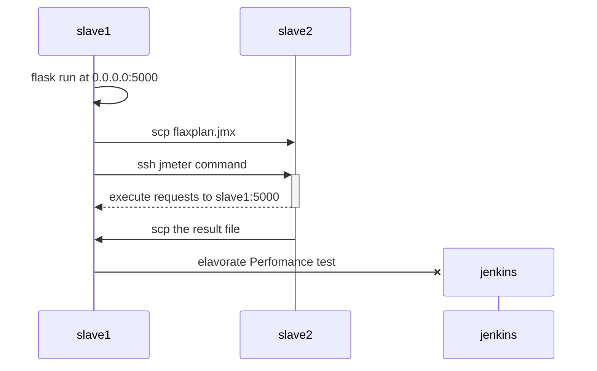
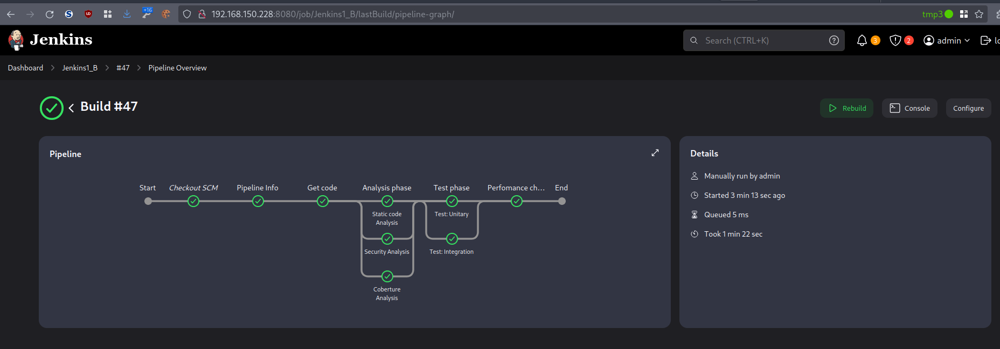
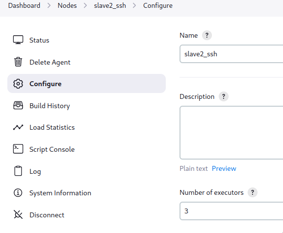
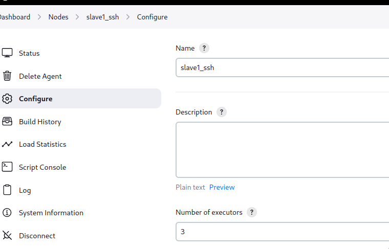
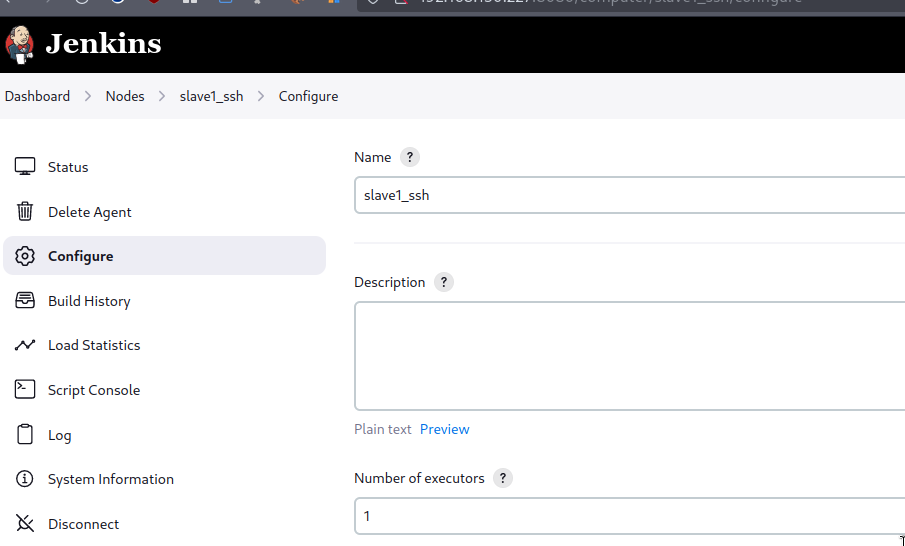
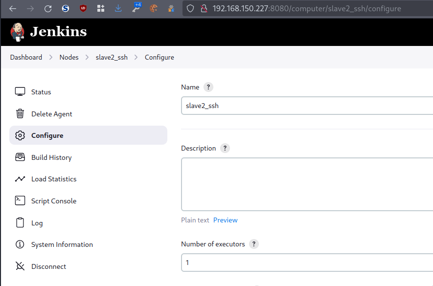

-   [Reto 2 -- Distribución de
    agentes](#reto-2-distribución-de-agentes)
-   [Arquitectura](#arquitectura)
-   [Las tareas a
    realizar](#las-tareas-a-realizar)
    -   [Elegir qué separación de agentes sería la más adecuada en este
        pipeline y justificar por
        qué.](#elegir-qué-separación-de-agentes-sería-la-más-adecuada-en-este-pipeline-y-justificar-por-qué.)
    -   [Paralelizar todas las pruebas, siempre que sea
        posible.](#paralelizar-todas-las-pruebas-siempre-que-sea-posible.)
    -   [Si alguna prueba no se puede paralelizar, explicar por qué y
        extraerla de la ejecución paralela (y dejarla como secuencial) o
        proponer una solución
        mejor.](#si-alguna-prueba-no-se-puede-paralelizar-explicar-por-qué-y-extraerla-de-la-ejecución-paralela-y-dejarla-como-secuencial-o-proponer-una-solución-mejor.)
        -   [Pipeliine Info](#pipeliine-info)
        -   [Get Code](#get-code)
        -   [Perfomance
            checks](#perfomance-checks)
    -   [Actualizar el Jenkinsfile usado en el mismo reto del apartado
        A](#actualizar-el-jenkinsfile-usado-en-el-mismo-reto-del-apartado-a)
    -   [Incluir en cada etapa los comandos whoami, hostname y echo
        \${WORKSPACE}](#incluir-en-cada-etapa-los-comandos-whoami-hostname-y-echo-workspace)
    -   [Cada agente tiene un número de "executors" o peticiones en
        paralelo que puede admitir ese agente (es un dato que se define
        en base a la capacidad de procesamiento del agente). Por
        defecto, pondremos ese valor a un número entre 2 y 4 y realizar
        la ejecución del pipeline y obtención del
        log.](#cada-agente-tiene-un-número-de-executors-o-peticiones-en-paralelo-que-puede-admitir-ese-agente-es-un-dato-que-se-define-en-base-a-la-capacidad-de-procesamiento-del-agente.-por-defecto-pondremos-ese-valor-a-un-número-entre-2-y-4-y-realizar-la-ejecución-del-pipeline-y-obtención-del-log.)
    -   [Posteriormente, debemos forzar ese valor a 1, para que el
        agente solo pueda atender 1 petición cada vez. Explicar qué
        ocurre en este caso, y adjuntar el log de ejecución donde se
        justifique este nuevo
        comportamiento.](#posteriormente-debemos-forzar-ese-valor-a-1-para-que-el-agente-solo-pueda-atender-1-petición-cada-vez.-explicar-qué-ocurre-en-este-caso-y-adjuntar-el-log-de-ejecución-donde-se-justifique-este-nuevo-comportamiento.)

# Reto 2 -- Distribución de agentes

# Arquitectura

Para la ejecución de las pruebas de *Jenkins*, utilizamos:

-   Contenedor docker de *Jenkins* en el nodo *kvm* 192.168.150.228
-   Esclavos en los nodos *kvm*
    -   *slave1*: 192.168.150.205
    -   *slave2*: 192.168.150.229

# Las tareas a realizar

## Elegir qué separación de agentes sería la más adecuada en este pipeline y justificar por qué.

Como se ha comentado anteriormente, nuestra arquitectura de integración
continua consta de un nodo maestro y dos esclavos.\
En base a la arquitectura disponible se ha decidido etiquetar los
nodos de la siguiente manera.

-   *slave1*: linux flask agent1
-   *slave2*: linux agent2 jmeter

Utilizando este etiquetado hemos distribuido los siguientes pasos del
*pipeline* de la siguiente manera

  *step*                 etiqueta   nodo
  ---------------------- ---------- ---------------------
  Pipeline Info          X          cualquiera
  Get Code               *linux*    *slave1* o *slave2*
  Analysis phase                    
  Static code Analysis   *linux*    *slave1* o *slave2*
  Security Analysis      *linux*    *slave1* o *slave2*
  Coberture Analysis     *linux*    *slave1* o *slave2*
  Test phase                        
  Test: Unitary          *linux*    *slave1* o *slave2*
  Test: Integration      *linux*    *slave1* o *slave2*
  Perfomance checks      *flask*    *slave1*

De esta manera lo que queremos conseguir es que en las fase de Analisys
y testeo sea el propio jenkins quien elija el nodo sobre el que se
ejecuta la tarea, aunque existe una excepción en la fase de rendimiento
que se ejecuta de la siguiente manera:



## Paralelizar todas las pruebas, siempre que sea posible.

En nuestra solución se ha dispuesto que las fases de analisis y de test
se ejecuten en paralelo al no existir interacciones/interdepencias entre
ellas.\
En la siguiente imagen se puede observar el flujo de fases y su
paralelización\


## Si alguna prueba no se puede paralelizar, explicar por qué y extraerla de la ejecución paralela (y dejarla como secuencial) o proponer una solución mejor.

Hemos ejecutado varias tareas/fases de forma secuencial:

### Pipeliine Info

Esta es una etapa de un solo paso, en la cual se muestra la información
de la *pipeline* más que nada la utilizamos para probar la librería
compartida. No es realmente necesaria

### Get Code

Esta es otra etapa de un solo paso, en ella obtenemos el código de
nuestro repositorio además de realizar una limpieza previa. Si fuesemos
muy puristas se podrían hacer en 2 pasos secuenciales. Uno limpieza y
otro obtención de código, aunque no hemos optado por esta solución para
simplificar la fase.

### Perfomance checks

Esta es la última fase de nuestra *pipeline* . Consta de un solo paso un
tanto peculiar que se describe a continuación.

1.  Se configuran las variables de entorno de *Flask* en el nodo *flask*
2.  Se levanta el servidor *Flask* y se hace un bucle de espera activa
    hasta que está listo
3.  Se copian el fichero **flaskplan.jmx** desde el nodo *flask* al nodo
    donde se ejecutarán las pruebas de *JMeter*
4.  Se ejecutan las pruebas de rendimiento
5.  Se copian los resultados desde el nodo *JMeter* al nodo *flask*
6.  Se genera el reporte

## Actualizar el Jenkinsfile usado en el mismo reto del apartado A

Se realizó esta paralelización en la primera parte del reto, con lo que
ambos ficheros son identicos

## Incluir en cada etapa los comandos whoami, hostname y echo \${WORKSPACE}

Para ello se utiliza la librería compartida con la llamada a la función 
`pipelineBanner()`

## Cada agente tiene un número de "executors" o peticiones en paralelo que puede admitir ese agente (es un dato que se define en base a la capacidad de procesamiento del agente). Por defecto, pondremos ese valor a un número entre 2 y 4 y realizar la ejecución del pipeline y obtención del log.

Se configuran los nodos eslavo con 3 ejecutores.



Siendo el resultado de la ejecución normal

``` bash
Started by user admin
Obtained Jenkinsfile from git https://github.com/dargamenteria/actividad1-B
Loading library test-pipeline-library@master
Attempting to resolve master from remote references...
 > git --version # timeout=10
 > git --version # 'git version 2.34.1'
 > git ls-remote -h -- https://github.com/dargamenteria/actividad1-B # timeout=10
Found match: refs/heads/master revision 3de935e5fdf550c5e23681d5125da2cf53d832b0
Selected Git installation does not exist. Using Default
The recommended git tool is: NONE
No credentials specified
 > git rev-parse --resolve-git-dir /var/lib/jenkins/workspace/Jenkins1_B@libs/f681e00ebd197507f856ad5127467ad257716f760a27a1768db2053d2db4914e/.git # timeout=10
Fetching changes from the remote Git repository
 > git config remote.origin.url https://github.com/dargamenteria/actividad1-B # timeout=10
Fetching without tags
Fetching upstream changes from https://github.com/dargamenteria/actividad1-B
 > git --version # timeout=10
 > git --version # 'git version 2.34.1'
 > git fetch --no-tags --force --progress -- https://github.com/dargamenteria/actividad1-B +refs/heads/*:refs/remotes/origin/* # timeout=10
Checking out Revision 3de935e5fdf550c5e23681d5125da2cf53d832b0 (master)
 > git config core.sparsecheckout # timeout=10
 > git checkout -f 3de935e5fdf550c5e23681d5125da2cf53d832b0 # timeout=10
Commit message: "Dammed forgot to add the junit test results"
 > git rev-list --no-walk 3de935e5fdf550c5e23681d5125da2cf53d832b0 # timeout=10
[Pipeline] Start of Pipeline
[Pipeline] node
Running on slave2_ssh in /var/lib/jenkins/workspace/Jenkins1_B
[Pipeline] {
[Pipeline] stage
[Pipeline] { (Declarative: Checkout SCM)
[Pipeline] checkout
Selected Git installation does not exist. Using Default
The recommended git tool is: NONE
No credentials specified
Fetching changes from the remote Git repository
Checking out Revision 3de935e5fdf550c5e23681d5125da2cf53d832b0 (refs/remotes/origin/master)
Commit message: "Dammed forgot to add the junit test results"
[Pipeline] }
[Pipeline] // stage
 > git rev-parse --resolve-git-dir /var/lib/jenkins/workspace/Jenkins1_B/.git # timeout=10
 > git config remote.origin.url https://github.com/dargamenteria/actividad1-B # timeout=10
Fetching upstream changes from https://github.com/dargamenteria/actividad1-B
 > git --version # timeout=10
 > git --version # 'git version 2.34.1'
 > git fetch --tags --force --progress -- https://github.com/dargamenteria/actividad1-B +refs/heads/*:refs/remotes/origin/* # timeout=10
 > git rev-parse refs/remotes/origin/master^{commit} # timeout=10
 > git config core.sparsecheckout # timeout=10
 > git checkout -f 3de935e5fdf550c5e23681d5125da2cf53d832b0 # timeout=10
[Pipeline] withEnv
[Pipeline] {
[Pipeline] withCredentials
Masking supported pattern matches of $GIT_TOKEN
[Pipeline] {
[Pipeline] stage
[Pipeline] { (Pipeline Info)
[Pipeline] sh
+ echo         pipelineBanner 
        pipelineBanner 
[Pipeline] script
[Pipeline] {
[Pipeline] sh
+ echo ##########################
##########################
+ hostname -f
+ echo #Hostname: slave2.paranoidworld.es
#Hostname: slave2.paranoidworld.es
+ uname -a
+ echo #Hostinfo: Linux slave2.paranoidworld.es 5.15.0-107-generic #117-Ubuntu SMP Fri Apr 26 12:26:49 UTC 2024 x86_64 x86_64 x86_64 GNU/Linux
#Hostinfo: Linux slave2.paranoidworld.es 5.15.0-107-generic #117-Ubuntu SMP Fri Apr 26 12:26:49 UTC 2024 x86_64 x86_64 x86_64 GNU/Linux
+ echo ##########################
##########################
[Pipeline] }
[Pipeline] // script
[Pipeline] }
[Pipeline] // stage
[Pipeline] stage
[Pipeline] { (Get code)
[Pipeline] node
Running on slave2_ssh in /var/lib/jenkins/workspace/Jenkins1_B@2
[Pipeline] {
[Pipeline] checkout
Selected Git installation does not exist. Using Default
The recommended git tool is: NONE
No credentials specified
Fetching changes from the remote Git repository
Checking out Revision 3de935e5fdf550c5e23681d5125da2cf53d832b0 (refs/remotes/origin/master)
Commit message: "Dammed forgot to add the junit test results"
[Pipeline] withEnv
[Pipeline] {
 > git rev-parse --resolve-git-dir /var/lib/jenkins/workspace/Jenkins1_B@2/.git # timeout=10
 > git config remote.origin.url https://github.com/dargamenteria/actividad1-B # timeout=10
Fetching upstream changes from https://github.com/dargamenteria/actividad1-B
 > git --version # timeout=10
 > git --version # 'git version 2.34.1'
 > git fetch --tags --force --progress -- https://github.com/dargamenteria/actividad1-B +refs/heads/*:refs/remotes/origin/* # timeout=10
 > git rev-parse refs/remotes/origin/master^{commit} # timeout=10
 > git config core.sparsecheckout # timeout=10
 > git checkout -f 3de935e5fdf550c5e23681d5125da2cf53d832b0 # timeout=10
[Pipeline] catchError
[Pipeline] {
[Pipeline] script
[Pipeline] {
[Pipeline] sh
+ echo ##########################
##########################
+ hostname -f
+ echo #Hostname: slave2.paranoidworld.es
#Hostname: slave2.paranoidworld.es
+ uname -a
+ echo #Hostinfo: Linux slave2.paranoidworld.es 5.15.0-107-generic #117-Ubuntu SMP Fri Apr 26 12:26:49 UTC 2024 x86_64 x86_64 x86_64 GNU/Linux
#Hostinfo: Linux slave2.paranoidworld.es 5.15.0-107-generic #117-Ubuntu SMP Fri Apr 26 12:26:49 UTC 2024 x86_64 x86_64 x86_64 GNU/Linux
+ echo ##########################
##########################
[Pipeline] }
[Pipeline] // script
[Pipeline] sh
+ [ -e /var/lib/jenkins/workspace/Jenkins1_B@2/gitCode ]
+ rm -fr /var/lib/jenkins/workspace/Jenkins1_B@2/gitCode
+ git clone https://****@github.com/dargamenteria/actividad1-B /var/lib/jenkins/workspace/Jenkins1_B@2/gitCode
Cloning into '/var/lib/jenkins/workspace/Jenkins1_B@2/gitCode'...
[Pipeline] stash
Stashed 136 file(s)
[Pipeline] }
[Pipeline] // catchError
[Pipeline] }
[Pipeline] // withEnv
[Pipeline] }
[Pipeline] // node
[Pipeline] }
[Pipeline] // stage
[Pipeline] stage
[Pipeline] { (Analysis phase)
[Pipeline] parallel
[Pipeline] { (Branch: Static code Analysis)
[Pipeline] { (Branch: Security Analysis)
[Pipeline] { (Branch: Coberture Analysis)
[Pipeline] stage
[Pipeline] { (Static code Analysis)
[Pipeline] stage
[Pipeline] { (Security Analysis)
[Pipeline] stage
[Pipeline] { (Coberture Analysis)
[Pipeline] node
Running on slave1_ssh in /var/lib/jenkins/workspace/Jenkins1_B
[Pipeline] node
Running on slave1_ssh in /var/lib/jenkins/workspace/Jenkins1_B@2
[Pipeline] node
Running on slave1_ssh in /var/lib/jenkins/workspace/Jenkins1_B@3
[Pipeline] {
[Pipeline] {
[Pipeline] {
[Pipeline] checkout
Selected Git installation does not exist. Using Default
The recommended git tool is: NONE
No credentials specified
Cloning the remote Git repository
[Pipeline] checkout
Selected Git installation does not exist. Using Default
The recommended git tool is: NONE
No credentials specified
Fetching changes from the remote Git repository
[Pipeline] checkout
Selected Git installation does not exist. Using Default
The recommended git tool is: NONE
No credentials specified
Fetching changes from the remote Git repository
Checking out Revision 3de935e5fdf550c5e23681d5125da2cf53d832b0 (refs/remotes/origin/master)
Commit message: "Dammed forgot to add the junit test results"
Checking out Revision 3de935e5fdf550c5e23681d5125da2cf53d832b0 (refs/remotes/origin/master)
Cloning repository https://github.com/dargamenteria/actividad1-B
 > git init /var/lib/jenkins/workspace/Jenkins1_B # timeout=10
Fetching upstream changes from https://github.com/dargamenteria/actividad1-B
 > git --version # timeout=10
 > git --version # 'git version 2.34.1'
 > git fetch --tags --force --progress -- https://github.com/dargamenteria/actividad1-B +refs/heads/*:refs/remotes/origin/* # timeout=10
Commit message: "Dammed forgot to add the junit test results"
Avoid second fetch
Checking out Revision 3de935e5fdf550c5e23681d5125da2cf53d832b0 (refs/remotes/origin/master)
Commit message: "Dammed forgot to add the junit test results"
 > git rev-parse --resolve-git-dir /var/lib/jenkins/workspace/Jenkins1_B@2/.git # timeout=10
 > git config remote.origin.url https://github.com/dargamenteria/actividad1-B # timeout=10
Fetching upstream changes from https://github.com/dargamenteria/actividad1-B
 > git --version # timeout=10
 > git --version # 'git version 2.34.1'
 > git fetch --tags --force --progress -- https://github.com/dargamenteria/actividad1-B +refs/heads/*:refs/remotes/origin/* # timeout=10
 > git rev-parse refs/remotes/origin/master^{commit} # timeout=10
 > git config core.sparsecheckout # timeout=10
 > git checkout -f 3de935e5fdf550c5e23681d5125da2cf53d832b0 # timeout=10
[Pipeline] withEnv
 > git rev-parse --resolve-git-dir /var/lib/jenkins/workspace/Jenkins1_B@3/.git # timeout=10
 > git config remote.origin.url https://github.com/dargamenteria/actividad1-B # timeout=10
Fetching upstream changes from https://github.com/dargamenteria/actividad1-B
 > git --version # timeout=10
 > git --version # 'git version 2.34.1'
 > git fetch --tags --force --progress -- https://github.com/dargamenteria/actividad1-B +refs/heads/*:refs/remotes/origin/* # timeout=10
 > git rev-parse refs/remotes/origin/master^{commit} # timeout=10
 > git config core.sparsecheckout # timeout=10
 > git checkout -f 3de935e5fdf550c5e23681d5125da2cf53d832b0 # timeout=10
[Pipeline] {
[Pipeline] withEnv
[Pipeline] {
 > git config remote.origin.url https://github.com/dargamenteria/actividad1-B # timeout=10
 > git config --add remote.origin.fetch +refs/heads/*:refs/remotes/origin/* # timeout=10
 > git rev-parse refs/remotes/origin/master^{commit} # timeout=10
 > git config core.sparsecheckout # timeout=10
 > git checkout -f 3de935e5fdf550c5e23681d5125da2cf53d832b0 # timeout=10
[Pipeline] withEnv
[Pipeline] {
[Pipeline] catchError
[Pipeline] {
[Pipeline] script
[Pipeline] {
[Pipeline] sh
[Pipeline] catchError
+ echo ##########################
##########################
+ hostname -f
+ echo #Hostname: slave1.paranoidworld.es
#Hostname: slave1.paranoidworld.es
+ uname -a
+ echo #Hostinfo: Linux slave1.paranoidworld.es 5.15.0-107-generic #117-Ubuntu SMP Fri Apr 26 12:26:49 UTC 2024 x86_64 x86_64 x86_64 GNU/Linux
#Hostinfo: Linux slave1.paranoidworld.es 5.15.0-107-generic #117-Ubuntu SMP Fri Apr 26 12:26:49 UTC 2024 x86_64 x86_64 x86_64 GNU/Linux
+ echo ##########################
##########################
[Pipeline] {
[Pipeline] catchError
[Pipeline] {
[Pipeline] script
[Pipeline] {
[Pipeline] script
[Pipeline] {
[Pipeline] sh
[Pipeline] sh
+ echo ##########################
##########################
+ hostname -f
+ echo #Hostname: slave1.paranoidworld.es
#Hostname: slave1.paranoidworld.es
+ uname -a
+ echo #Hostinfo: Linux slave1.paranoidworld.es 5.15.0-107-generic #117-Ubuntu SMP Fri Apr 26 12:26:49 UTC 2024 x86_64 x86_64 x86_64 GNU/Linux
#Hostinfo: Linux slave1.paranoidworld.es 5.15.0-107-generic #117-Ubuntu SMP Fri Apr 26 12:26:49 UTC 2024 x86_64 x86_64 x86_64 GNU/Linux
+ echo ##########################
##########################
+ echo ##########################
##########################
+ hostname -f
+ echo #Hostname: slave1.paranoidworld.es
#Hostname: slave1.paranoidworld.es
+ uname -a
+ echo #Hostinfo: Linux slave1.paranoidworld.es 5.15.0-107-generic #117-Ubuntu SMP Fri Apr 26 12:26:49 UTC 2024 x86_64 x86_64 x86_64 GNU/Linux
#Hostinfo: Linux slave1.paranoidworld.es 5.15.0-107-generic #117-Ubuntu SMP Fri Apr 26 12:26:49 UTC 2024 x86_64 x86_64 x86_64 GNU/Linux
+ echo ##########################
##########################
[Pipeline] }
[Pipeline] }
[Pipeline] // script
[Pipeline] unstash
[Pipeline] }
[Pipeline] // script
[Pipeline] unstash
[Pipeline] // script
[Pipeline] sh
+ cd /var/lib/jenkins/workspace/Jenkins1_B@2/gitCode
+ pwd
+ bandit -r . --format custom --msg-template {abspath}:{line}: {test_id}[bandit]: {severity}: {msg} -o /var/lib/jenkins/workspace/Jenkins1_B@2/gitCode/bandit.out
[Pipeline] unstash
[Pipeline] sh
+ cd /var/lib/jenkins/workspace/Jenkins1_B/gitCode
+ pwd
+ pwd
+ flake8 --format=pylint --exit-zero --max-line-length 120 /var/lib/jenkins/workspace/Jenkins1_B/gitCode/app
[Pipeline] sh
[main]  INFO    profile include tests: None
[main]  INFO    profile exclude tests: None
[main]  INFO    cli include tests: None
[main]  INFO    cli exclude tests: None
[main]  INFO    running on Python 3.10.12
+ cd /var/lib/jenkins/workspace/Jenkins1_B@3/gitCode
+ pwd
+ pwd
+ pwd
+ pwd
+ coverage run --source=/var/lib/jenkins/workspace/Jenkins1_B@3/gitCode/app --branch --omit=/var/lib/jenkins/workspace/Jenkins1_B@3/gitCode/app/__init__.py,/var/lib/jenkins/workspace/Jenkins1_B@3/gitCode/app/api.py -m pytest /var/lib/jenkins/workspace/Jenkins1_B@3/gitCode/test/unit
[custom]    INFO    Result written to file: /var/lib/jenkins/workspace/Jenkins1_B@2/gitCode/bandit.out
[Pipeline] recordIssues
WARNING: Unknown parameter(s) found for class type 'io.jenkins.plugins.analysis.core.util.WarningsQualityGate': critically
WARNING: Unknown parameter(s) found for class type 'io.jenkins.plugins.analysis.core.util.WarningsQualityGate': critically
[Flake8] Searching for all files in '/var/lib/jenkins/workspace/Jenkins1_B' that match the pattern 'gitCode/flake8.out'
[Flake8] Traversing of symbolic links: enabled
[Flake8] -> found 1 file
[Flake8] Successfully parsed file /var/lib/jenkins/workspace/Jenkins1_B/gitCode/flake8.out
[Flake8] -> found 6 issues (skipped 0 duplicates)
[Flake8] Successfully processed file 'gitCode/flake8.out'
+ echo Controlled exit
Controlled exit
[Flake8] Post processing issues on 'slave1_ssh' with source code encoding 'UTF-8'
[Flake8] Creating SCM blamer to obtain author and commit information for affected files
[Flake8] -> No blamer installed yet. You need to install the 'git-forensics' plugin to enable blaming for Git.
[Flake8] Resolving file names for all issues in workspace '/var/lib/jenkins/workspace/Jenkins1_B'
[Flake8] -> resolved paths in source directory (2 found, 0 not found)
[Flake8] Resolving module names from module definitions (build.xml, pom.xml, or Manifest.mf files)
[Flake8] -> resolved module names for 6 issues
[Flake8] Resolving package names (or namespaces) by parsing the affected files
[Flake8] -> resolved package names of 2 affected files
[Flake8] No filter has been set, publishing all 6 issues
[Flake8] Creating fingerprints for all affected code blocks to track issues over different builds
[Flake8] -> created fingerprints for 6 issues (skipped 0 issues)
[Flake8] Copying affected files to Jenkins' build folder '/var/lib/jenkins/jobs/Jenkins1_B/builds/58/files-with-issues'
[Flake8] -> 2 copied, 0 not in workspace, 0 not-found, 0 with I/O error
[Flake8] Skipping cleaning of source code files in old builds
[Flake8] Repository miner is not configured, skipping repository mining
[Flake8] Searching for all files in '/var/lib/jenkins/workspace/Jenkins1_B' that match the pattern 'gitCode/flake8.out'
[Flake8] Traversing of symbolic links: enabled
[Flake8] -> found 1 file
[Flake8] Successfully parsed file /var/lib/jenkins/workspace/Jenkins1_B/gitCode/flake8.out
[Flake8] -> found 6 issues (skipped 0 duplicates)
[Flake8] Successfully processed file 'gitCode/flake8.out'
[Flake8] Post processing issues on 'slave1_ssh' with source code encoding 'UTF-8'
[Flake8] Creating SCM blamer to obtain author and commit information for affected files
[Flake8] -> No blamer installed yet. You need to install the 'git-forensics' plugin to enable blaming for Git.
[Flake8] Resolving file names for all issues in workspace '/var/lib/jenkins/workspace/Jenkins1_B'
[Flake8] -> resolved paths in source directory (2 found, 0 not found)
[Flake8] Resolving module names from module definitions (build.xml, pom.xml, or Manifest.mf files)
[Flake8] -> resolved module names for 6 issues
[Flake8] Resolving package names (or namespaces) by parsing the affected files
[Flake8] -> resolved package names of 2 affected files
[Flake8] No filter has been set, publishing all 6 issues
[Flake8] Creating fingerprints for all affected code blocks to track issues over different builds
[Flake8] -> created fingerprints for 6 issues (skipped 0 issues)
[Flake8] Copying affected files to Jenkins' build folder '/var/lib/jenkins/jobs/Jenkins1_B/builds/58/files-with-issues'
[Flake8] -> 2 copied, 0 not in workspace, 0 not-found, 0 with I/O error
[Flake8] Skipping cleaning of source code files in old builds
[Flake8] Repository miner is not configured, skipping repository mining
[Flake8] Reference build recorder is not configured
[Flake8] No valid reference build found
[Flake8] All reported issues will be considered outstanding
[Flake8] Evaluating quality gates
[Flake8] -> All quality gates have been passed
[Flake8] -> Details for each quality gate:
[Flake8]    - [Total (any severity)]: ≪Success≫ - (Actual value: 6, Quality gate: 8.00)
[Flake8]    - [Total (any severity)]: ≪Success≫ - (Actual value: 6, Quality gate: 10.00)
[Flake8] Health report is disabled - skipping
[Flake8] Created analysis result for 6 issues (found 0 new issues, fixed 0 issues)
[Flake8] Attaching ResultAction with ID 'flake8' to build 'Jenkins1_B #58'.
============================= test session starts ==============================
platform linux -- Python 3.10.12, pytest-6.2.5, py-1.10.0, pluggy-0.13.0
rootdir: /var/lib/jenkins/workspace/Jenkins1_B@3/gitCode
collected 11 items

test/unit/calc_test.py .........                                         [ 81%]
test/unit/util_test.py ..                                                [100%]

=============================== warnings summary ===============================
test/unit/calc_test.py:7
  /var/lib/jenkins/workspace/Jenkins1_B@3/gitCode/test/unit/calc_test.py:7: PytestUnknownMarkWarning: Unknown pytest.mark.unit - is this a typo?  You can register custom marks to avoid this warning - for details, see https://docs.pytest.org/en/stable/mark.html
    @pytest.mark.unit

test/unit/util_test.py:7
  /var/lib/jenkins/workspace/Jenkins1_B@3/gitCode/test/unit/util_test.py:7: PytestUnknownMarkWarning: Unknown pytest.mark.unit - is this a typo?  You can register custom marks to avoid this warning - for details, see https://docs.pytest.org/en/stable/mark.html
    @pytest.mark.unit

-- Docs: https://docs.pytest.org/en/stable/warnings.html
======================== 11 passed, 2 warnings in 0.06s ========================
+ coverage html
Wrote HTML report to htmlcov/index.html
+ coverage report
[Pipeline] recordIssues
WARNING: Unknown parameter(s) found for class type 'io.jenkins.plugins.analysis.core.util.WarningsQualityGate': critically
WARNING: Unknown parameter(s) found for class type 'io.jenkins.plugins.analysis.core.util.WarningsQualityGate': critically
[Pylint] Searching for all files in '/var/lib/jenkins/workspace/Jenkins1_B@2' that match the pattern 'gitCode/bandit.out'
[Pylint] Traversing of symbolic links: enabled
[Pylint] -> found 1 file
[Pylint] Successfully parsed file /var/lib/jenkins/workspace/Jenkins1_B@2/gitCode/bandit.out
[Pylint] -> found 0 issues (skipped 0 duplicates)
[Pylint] Successfully processed file 'gitCode/bandit.out'
[Pylint] Skipping post processing
[Pylint] No filter has been set, publishing all 0 issues
[Pylint] Repository miner is not configured, skipping repository mining
[Pylint] Searching for all files in '/var/lib/jenkins/workspace/Jenkins1_B@2' that match the pattern 'gitCode/bandit.out'
[Pylint] Traversing of symbolic links: enabled
[Pylint] -> found 1 file
[Pylint] Successfully parsed file /var/lib/jenkins/workspace/Jenkins1_B@2/gitCode/bandit.out
[Pylint] -> found 0 issues (skipped 0 duplicates)
[Pylint] Successfully processed file 'gitCode/bandit.out'
[Pylint] Skipping post processing
[Pylint] No filter has been set, publishing all 0 issues
[Pylint] Repository miner is not configured, skipping repository mining
[Pylint] Reference build recorder is not configured
[Pylint] No valid reference build found
[Pylint] All reported issues will be considered outstanding
[Pylint] Evaluating quality gates
[Pylint] -> All quality gates have been passed
[Pylint] -> Details for each quality gate:
[Pylint]    - [Total (any severity)]: ≪Success≫ - (Actual value: 0, Quality gate: 1.00)
[Pylint]    - [Total (any severity)]: ≪Success≫ - (Actual value: 0, Quality gate: 2.00)
[Pylint] Health report is disabled - skipping
[Pylint] Created analysis result for 0 issues (found 0 new issues, fixed 0 issues)
[Pylint] Attaching ResultAction with ID 'pylint' to build 'Jenkins1_B #58'.
Name          Stmts   Miss Branch BrPart  Cover
-----------------------------------------------
app/calc.py      24      0      4      0   100%
app/util.py       7      0      2      0   100%
-----------------------------------------------
TOTAL            31      0      6      0   100%
+ pwd
+ coverage xml -o /var/lib/jenkins/workspace/Jenkins1_B@3/gitCode/coverage.xml
[Checks API] No suitable checks publisher found.
Wrote XML report to /var/lib/jenkins/workspace/Jenkins1_B@3/gitCode/coverage.xml
[Pipeline] stash
[Checks API] No suitable checks publisher found.
Warning: overwriting stash ‘workspace’
Stashed 137 file(s)
[Pipeline] cobertura
[Cobertura] Publishing Cobertura coverage report...

[Cobertura] Publishing Cobertura coverage results...

[Cobertura] Cobertura coverage report found.

[Pipeline] stash
Warning: overwriting stash ‘workspace’
[Pipeline] }
[Pipeline] stash
Warning: overwriting stash ‘workspace’
Stashed 170 file(s)
Stashed 170 file(s)
[Pipeline] // catchError
[Pipeline] }
[Pipeline] }
[Pipeline] }
[Pipeline] // withEnv
[Pipeline] // catchError
[Pipeline] // catchError
[Pipeline] }
[Pipeline] }
[Pipeline] }
[Pipeline] // node
[Pipeline] // withEnv
[Pipeline] // withEnv
[Pipeline] }
[Pipeline] }
[Pipeline] }
[Pipeline] // stage
[Pipeline] // node
[Pipeline] // node
[Pipeline] }
[Pipeline] }
[Pipeline] }
[Pipeline] // stage
[Pipeline] // stage
[Pipeline] }
[Pipeline] }
[Pipeline] // parallel
[Pipeline] }
[Pipeline] // stage
[Pipeline] stage
[Pipeline] { (Test phase)
[Pipeline] parallel
[Pipeline] { (Branch: Test: Unitary)
[Pipeline] { (Branch: Test: Integration)
[Pipeline] { (Branch: Result Test)
[Pipeline] stage
[Pipeline] { (Test: Unitary)
[Pipeline] stage
[Pipeline] { (Test: Integration)
[Pipeline] stage
[Pipeline] { (Result Test)
[Pipeline] node
[Pipeline] node
Running on slave1_ssh in /var/lib/jenkins/workspace/Jenkins1_B
Running on slave2_ssh in /var/lib/jenkins/workspace/Jenkins1_B@2
[Pipeline] node
Running on slave1_ssh in /var/lib/jenkins/workspace/Jenkins1_B@2
[Pipeline] {
[Pipeline] {
[Pipeline] {
[Pipeline] checkout
Selected Git installation does not exist. Using Default
The recommended git tool is: NONE
No credentials specified
Fetching changes from the remote Git repository
[Pipeline] checkout
Selected Git installation does not exist. Using Default
The recommended git tool is: NONE
No credentials specified
Fetching changes from the remote Git repository
[Pipeline] checkout
Selected Git installation does not exist. Using Default
The recommended git tool is: NONE
Checking out Revision 3de935e5fdf550c5e23681d5125da2cf53d832b0 (refs/remotes/origin/master)
No credentials specified
Fetching changes from the remote Git repository
Commit message: "Dammed forgot to add the junit test results"
Checking out Revision 3de935e5fdf550c5e23681d5125da2cf53d832b0 (refs/remotes/origin/master)
Commit message: "Dammed forgot to add the junit test results"
 > git rev-parse --resolve-git-dir /var/lib/jenkins/workspace/Jenkins1_B/.git # timeout=10
 > git config remote.origin.url https://github.com/dargamenteria/actividad1-B # timeout=10
Fetching upstream changes from https://github.com/dargamenteria/actividad1-B
 > git --version # timeout=10
 > git --version # 'git version 2.34.1'
 > git fetch --tags --force --progress -- https://github.com/dargamenteria/actividad1-B +refs/heads/*:refs/remotes/origin/* # timeout=10
 > git rev-parse refs/remotes/origin/master^{commit} # timeout=10
 > git config core.sparsecheckout # timeout=10
 > git checkout -f 3de935e5fdf550c5e23681d5125da2cf53d832b0 # timeout=10
[Pipeline] withEnv
Checking out Revision 3de935e5fdf550c5e23681d5125da2cf53d832b0 (refs/remotes/origin/master)
Commit message: "Dammed forgot to add the junit test results"
[Pipeline] {
 > git rev-parse --resolve-git-dir /var/lib/jenkins/workspace/Jenkins1_B@2/.git # timeout=10
 > git config remote.origin.url https://github.com/dargamenteria/actividad1-B # timeout=10
Fetching upstream changes from https://github.com/dargamenteria/actividad1-B
 > git --version # timeout=10
 > git --version # 'git version 2.34.1'
 > git fetch --tags --force --progress -- https://github.com/dargamenteria/actividad1-B +refs/heads/*:refs/remotes/origin/* # timeout=10
 > git rev-parse refs/remotes/origin/master^{commit} # timeout=10
 > git config core.sparsecheckout # timeout=10
 > git checkout -f 3de935e5fdf550c5e23681d5125da2cf53d832b0 # timeout=10
 > git rev-parse --resolve-git-dir /var/lib/jenkins/workspace/Jenkins1_B@2/.git # timeout=10
 > git config remote.origin.url https://github.com/dargamenteria/actividad1-B # timeout=10
Fetching upstream changes from https://github.com/dargamenteria/actividad1-B
 > git --version # timeout=10
 > git --version # 'git version 2.34.1'
 > git fetch --tags --force --progress -- https://github.com/dargamenteria/actividad1-B +refs/heads/*:refs/remotes/origin/* # timeout=10
 > git rev-parse refs/remotes/origin/master^{commit} # timeout=10
 > git config core.sparsecheckout # timeout=10
 > git checkout -f 3de935e5fdf550c5e23681d5125da2cf53d832b0 # timeout=10
[Pipeline] withEnv
[Pipeline] {
[Pipeline] withEnv
[Pipeline] {
[Pipeline] catchError
[Pipeline] {
[Pipeline] script
[Pipeline] {
[Pipeline] sh
[Pipeline] catchError
+ echo ##########################
##########################
+ hostname -f
+ echo #Hostname: slave1.paranoidworld.es
#Hostname: slave1.paranoidworld.es
+ uname -a
+ echo #Hostinfo: Linux slave1.paranoidworld.es 5.15.0-107-generic #117-Ubuntu SMP Fri Apr 26 12:26:49 UTC 2024 x86_64 x86_64 x86_64 GNU/Linux
#Hostinfo: Linux slave1.paranoidworld.es 5.15.0-107-generic #117-Ubuntu SMP Fri Apr 26 12:26:49 UTC 2024 x86_64 x86_64 x86_64 GNU/Linux
+ echo ##########################
##########################
[Pipeline] {
[Pipeline] script
[Pipeline] {
[Pipeline] script
[Pipeline] {
[Pipeline] sh
+ echo ##########################
##########################
+ hostname -f
+ echo #Hostname: slave1.paranoidworld.es
#Hostname: slave1.paranoidworld.es
+ uname -a
+ echo #Hostinfo: Linux slave1.paranoidworld.es 5.15.0-107-generic #117-Ubuntu SMP Fri Apr 26 12:26:49 UTC 2024 x86_64 x86_64 x86_64 GNU/Linux
#Hostinfo: Linux slave1.paranoidworld.es 5.15.0-107-generic #117-Ubuntu SMP Fri Apr 26 12:26:49 UTC 2024 x86_64 x86_64 x86_64 GNU/Linux
+ echo ##########################
##########################
[Pipeline] sh
+ echo ##########################
##########################
+ hostname -f
+ echo #Hostname: slave2.paranoidworld.es
#Hostname: slave2.paranoidworld.es
+ uname -a
+ echo #Hostinfo: Linux slave2.paranoidworld.es 5.15.0-107-generic #117-Ubuntu SMP Fri Apr 26 12:26:49 UTC 2024 x86_64 x86_64 x86_64 GNU/Linux
#Hostinfo: Linux slave2.paranoidworld.es 5.15.0-107-generic #117-Ubuntu SMP Fri Apr 26 12:26:49 UTC 2024 x86_64 x86_64 x86_64 GNU/Linux
+ echo ##########################
##########################
[Pipeline] }
[Pipeline] }
[Pipeline] }
[Pipeline] // script
[Pipeline] unstash
[Pipeline] // script
[Pipeline] // script
[Pipeline] catchError
[Pipeline] {
[Pipeline] unstash
[Pipeline] sh
[Pipeline] unstash
+ echo Test phase
Test phase
+ cd /var/lib/jenkins/workspace/Jenkins1_B/gitCode
+ export PYTHONPATH=.
+ pwd
+ pytest-3 --junitxml=result-test.xml /var/lib/jenkins/workspace/Jenkins1_B/gitCode/test/unit
============================= test session starts ==============================
platform linux -- Python 3.10.12, pytest-6.2.5, py-1.10.0, pluggy-0.13.0
rootdir: /var/lib/jenkins/workspace/Jenkins1_B/gitCode
collected 11 items

test/unit/calc_test.py .........                                         [ 81%]
test/unit/util_test.py ..                                                [100%]

=============================== warnings summary ===============================
../../Jenkins1_B@3/gitCode/test/unit/calc_test.py:7
  /var/lib/jenkins/workspace/Jenkins1_B@3/gitCode/test/unit/calc_test.py:7: PytestUnknownMarkWarning: Unknown pytest.mark.unit - is this a typo?  You can register custom marks to avoid this warning - for details, see https://docs.pytest.org/en/stable/mark.html
    @pytest.mark.unit

../../Jenkins1_B@3/gitCode/test/unit/util_test.py:7
  /var/lib/jenkins/workspace/Jenkins1_B@3/gitCode/test/unit/util_test.py:7: PytestUnknownMarkWarning: Unknown pytest.mark.unit - is this a typo?  You can register custom marks to avoid this warning - for details, see https://docs.pytest.org/en/stable/mark.html
    @pytest.mark.unit

-- Docs: https://docs.pytest.org/en/stable/warnings.html
- generated xml file: /var/lib/jenkins/workspace/Jenkins1_B/gitCode/result-test.xml -
======================== 11 passed, 2 warnings in 0.07s ========================
[Pipeline] lock
Trying to acquire lock on [Resource: test-resources]
Lock acquired on [Resource: test-resources]
[Pipeline] {
[Pipeline] }
[Pipeline] junit
Recording test results
[Pipeline] sh
[Checks API] No suitable checks publisher found.
+ echo Test phase
Test phase
+ cd /var/lib/jenkins/workspace/Jenkins1_B@2/gitCode
+ export PYTHONPATH=.
+ pwd
+ export FLASK_APP=/var/lib/jenkins/workspace/Jenkins1_B@2/gitCode/app/api.py
+ flask run -h 0.0.0.0 -p 5000
+ wc -l
+ grep -E 9090|5000
+ pwd
+ java -jar /apps/wiremock/wiremock-standalone-3.5.4.jar --port 9090 --root-dir /var/lib/jenkins/workspace/Jenkins1_B@2/gitCode/test/wiremock
+ ss -lnt
+ [ 0 != 2 ]
+ echo No perative yet
No perative yet
+ sleep 1
[Pipeline] // catchError
[Pipeline] }
[Pipeline] }
[Pipeline] // withEnv
[Pipeline] // catchError
+ wc -l
+ grep -E 9090|5000
+ ss -lnt
+ [ 0 != 2 ]
+ echo No perative yet
No perative yet
+ sleep 1
[Pipeline] }
[Pipeline] }
 * Serving Flask app '/var/lib/jenkins/workspace/Jenkins1_B@2/gitCode/app/api.py' (lazy loading)
 * Environment: production
   WARNING: This is a development server. Do not use it in a production deployment.
   Use a production WSGI server instead.
 * Debug mode: off
 * Running on all addresses.
   WARNING: This is a development server. Do not use it in a production deployment.
 * Running on http://192.168.150.228:5000/ (Press CTRL+C to quit)
[Pipeline] // node
[Pipeline] // withEnv
[Pipeline] }
+ wc -l
+ grep -E 9090|5000
+ ss -lnt
+ [ 1 != 2 ]
+ echo No perative yet
No perative yet
+ sleep 1
[Pipeline] }
[Pipeline] // stage
[Pipeline] // node
[Pipeline] }
[Pipeline] }
+ wc -l
+ grep -E 9090|5000
+ ss -lnt
+ [ 1 != 2 ]
+ echo No perative yet
No perative yet
+ sleep 1
[Pipeline] // stage

██     ██ ██ ██████  ███████ ███    ███  ██████   ██████ ██   ██ 
██     ██ ██ ██   ██ ██      ████  ████ ██    ██ ██      ██  ██  
██  █  ██ ██ ██████  █████   ██ ████ ██ ██    ██ ██      █████   
██ ███ ██ ██ ██   ██ ██      ██  ██  ██ ██    ██ ██      ██  ██  
 ███ ███  ██ ██   ██ ███████ ██      ██  ██████   ██████ ██   ██ 

----------------------------------------------------------------
|               Cloud: https://wiremock.io/cloud               |
|                                                              |
|               Slack: https://slack.wiremock.org              |
----------------------------------------------------------------

version:                      3.5.4
port:                         9090
enable-browser-proxying:      false
disable-banner:               false
no-request-journal:           false
verbose:                      false

extensions:                   response-template,webhook
[Pipeline] }
+ wc -l
+ grep -E 9090|5000
+ ss -lnt
+ [ 2 != 2 ]
+ pwd
+ pytest-3 --junitxml=result-rest.xml /var/lib/jenkins/workspace/Jenkins1_B@2/gitCode/test/rest
============================= test session starts ==============================
platform linux -- Python 3.10.12, pytest-6.2.5, py-1.10.0, pluggy-0.13.0
rootdir: /var/lib/jenkins/workspace/Jenkins1_B@2/gitCode
collected 5 items

test/rest/api_test.py 127.0.0.1 - - [31/May/2024 18:09:37] "GET /calc/add/1/2 HTTP/1.1" 200 -
.127.0.0.1 - - [31/May/2024 18:09:37] "GET /calc/divide/4/2 HTTP/1.1" 200 -
.127.0.0.1 - - [31/May/2024 18:09:37] "GET /calc/divide/4/0 HTTP/1.1" 406 -
.127.0.0.1 - - [31/May/2024 18:09:37] "GET /calc/multiply/1/2 HTTP/1.1" 200 -
..                                              [100%]

=============================== warnings summary ===============================
test/rest/api_test.py:13
  /var/lib/jenkins/workspace/Jenkins1_B@2/gitCode/test/rest/api_test.py:13: PytestUnknownMarkWarning: Unknown pytest.mark.api - is this a typo?  You can register custom marks to avoid this warning - for details, see https://docs.pytest.org/en/stable/mark.html
    @pytest.mark.api

-- Docs: https://docs.pytest.org/en/stable/warnings.html
- generated xml file: /var/lib/jenkins/workspace/Jenkins1_B@2/gitCode/result-rest.xml -
========================= 5 passed, 1 warning in 0.45s =========================
[Pipeline] }
Lock released on resource [Resource: test-resources]
[Pipeline] // lock
[Pipeline] }
[Pipeline] // catchError
[Pipeline] }
[Pipeline] // withEnv
[Pipeline] }
[Pipeline] // node
[Pipeline] }
[Pipeline] // stage
[Pipeline] }
[Pipeline] // parallel
[Pipeline] }
[Pipeline] // stage
[Pipeline] stage
[Pipeline] { (Perfomance checks)
[Pipeline] node
Running on slave1_ssh in /var/lib/jenkins/workspace/Jenkins1_B
[Pipeline] {
[Pipeline] checkout
Selected Git installation does not exist. Using Default
The recommended git tool is: NONE
No credentials specified
Fetching changes from the remote Git repository
Checking out Revision 3de935e5fdf550c5e23681d5125da2cf53d832b0 (refs/remotes/origin/master)
Commit message: "Dammed forgot to add the junit test results"
[Pipeline] withEnv
[Pipeline] {
 > git rev-parse --resolve-git-dir /var/lib/jenkins/workspace/Jenkins1_B/.git # timeout=10
 > git config remote.origin.url https://github.com/dargamenteria/actividad1-B # timeout=10
Fetching upstream changes from https://github.com/dargamenteria/actividad1-B
 > git --version # timeout=10
 > git --version # 'git version 2.34.1'
 > git fetch --tags --force --progress -- https://github.com/dargamenteria/actividad1-B +refs/heads/*:refs/remotes/origin/* # timeout=10
 > git rev-parse refs/remotes/origin/master^{commit} # timeout=10
 > git config core.sparsecheckout # timeout=10
 > git checkout -f 3de935e5fdf550c5e23681d5125da2cf53d832b0 # timeout=10
[Pipeline] catchError
[Pipeline] {
[Pipeline] script
[Pipeline] {
[Pipeline] sh
+ echo ##########################
##########################
+ hostname -f
+ echo #Hostname: slave1.paranoidworld.es
#Hostname: slave1.paranoidworld.es
+ uname -a
+ echo #Hostinfo: Linux slave1.paranoidworld.es 5.15.0-107-generic #117-Ubuntu SMP Fri Apr 26 12:26:49 UTC 2024 x86_64 x86_64 x86_64 GNU/Linux
#Hostinfo: Linux slave1.paranoidworld.es 5.15.0-107-generic #117-Ubuntu SMP Fri Apr 26 12:26:49 UTC 2024 x86_64 x86_64 x86_64 GNU/Linux
+ echo ##########################
##########################
[Pipeline] }
[Pipeline] // script
[Pipeline] unstash
[Pipeline] sh
+ echo Test phase
Test phase
+ cd /var/lib/jenkins/workspace/Jenkins1_B/gitCode
+ export PYTHONPATH=.
+ pwd
+ export FLASK_APP=/var/lib/jenkins/workspace/Jenkins1_B/gitCode/app/api.py
+ flask run -h 0.0.0.0 -p 5000
+ wc -l
+ grep -E 5000
+ ss -lnt
+ [ 0 != 1 ]
+ echo No perative yet
No perative yet
+ sleep 1
 * Serving Flask app '/var/lib/jenkins/workspace/Jenkins1_B/gitCode/app/api.py' (lazy loading)
 * Environment: production
   WARNING: This is a development server. Do not use it in a production deployment.
   Use a production WSGI server instead.
 * Debug mode: off
 * Running on all addresses.
   WARNING: This is a development server. Do not use it in a production deployment.
 * Running on http://192.168.150.204:5000/ (Press CTRL+C to quit)
+ wc -l
+ grep -E 5000
+ ss -lnt
+ [ 1 != 1 ]
+ pwd
+ scp /var/lib/jenkins/workspace/Jenkins1_B/gitCode/test/jmeter/flaskplan.jmx jenkins@slave2.paranoidworld.es:
+ ssh jenkins@slave2.paranoidworld.es rm ~/flaskplan.jtl; /apps/jmeter/bin/jmeter -n -t ~/flaskplan.jmx -l ~/flaskplan.jtl
Creating summariser <summary>
Created the tree successfully using /home/jenkins/flaskplan.jmx
Starting standalone test @ 2024 May 31 18:09:52 UTC (1717178992240)
Waiting for possible Shutdown/StopTestNow/HeapDump/ThreadDump message on port 4445
Warning: Nashorn engine is planned to be removed from a future JDK release
192.168.150.228 - - [31/May/2024 18:09:55] "GET /calc/add/4/9 HTTP/1.1" 200 -
192.168.150.228 - - [31/May/2024 18:09:55] "GET /calc/substract/25/19 HTTP/1.1" 200 -
192.168.150.228 - - [31/May/2024 18:09:55] "GET /calc/add/4/9 HTTP/1.1" 200 -
192.168.150.228 - - [31/May/2024 18:09:55] "GET /calc/substract/25/19 HTTP/1.1" 200 -
192.168.150.228 - - [31/May/2024 18:09:55] "GET /calc/add/4/9 HTTP/1.1" 200 -
192.168.150.228 - - [31/May/2024 18:09:55] "GET /calc/substract/25/19 HTTP/1.1" 200 -
192.168.150.228 - - [31/May/2024 18:09:55] "GET /calc/substract/25/19 HTTP/1.1" 200 -
192.168.150.228 - - [31/May/2024 18:09:55] "GET /calc/add/4/9 HTTP/1.1" 200 -
192.168.150.228 - - [31/May/2024 18:09:55] "GET /calc/substract/25/19 HTTP/1.1" 200 -
192.168.150.228 - - [31/May/2024 18:09:55] "GET /calc/substract/25/19 HTTP/1.1" 200 -
192.168.150.228 - - [31/May/2024 18:09:55] "GET /calc/add/4/9 HTTP/1.1" 200 -
192.168.150.228 - - [31/May/2024 18:09:55] "GET /calc/add/4/9 HTTP/1.1" 200 -
192.168.150.228 - - [31/May/2024 18:09:55] "GET /calc/add/4/9 HTTP/1.1" 200 -
192.168.150.228 - - [31/May/2024 18:09:55] "GET /calc/substract/25/19 HTTP/1.1" 200 -
192.168.150.228 - - [31/May/2024 18:09:55] "GET /calc/substract/25/19 HTTP/1.1" 200 -
192.168.150.228 - - [31/May/2024 18:09:55] "GET /calc/add/4/9 HTTP/1.1" 200 -
192.168.150.228 - - [31/May/2024 18:09:55] "GET /calc/substract/25/19 HTTP/1.1" 200 -
192.168.150.228 - - [31/May/2024 18:09:55] "GET /calc/substract/25/19 HTTP/1.1" 200 -
192.168.150.228 - - [31/May/2024 18:09:55] "GET /calc/add/4/9 HTTP/1.1" 200 -
192.168.150.228 - - [31/May/2024 18:09:55] "GET /calc/substract/25/19 HTTP/1.1" 200 -
192.168.150.228 - - [31/May/2024 18:09:55] "GET /calc/add/4/9 HTTP/1.1" 200 -
192.168.150.228 - - [31/May/2024 18:09:55] "GET /calc/substract/25/19 HTTP/1.1" 200 -
192.168.150.228 - - [31/May/2024 18:09:55] "GET /calc/substract/25/19 HTTP/1.1" 200 -
192.168.150.228 - - [31/May/2024 18:09:55] "GET /calc/add/4/9 HTTP/1.1" 200 -
192.168.150.228 - - [31/May/2024 18:09:55] "GET /calc/add/4/9 HTTP/1.1" 200 -
192.168.150.228 - - [31/May/2024 18:09:55] "GET /calc/add/4/9 HTTP/1.1" 200 -
192.168.150.228 - - [31/May/2024 18:09:55] "GET /calc/add/4/9 HTTP/1.1" 200 -
192.168.150.228 - - [31/May/2024 18:09:55] "GET /calc/add/4/9 HTTP/1.1" 200 -
192.168.150.228 - - [31/May/2024 18:09:55] "GET /calc/substract/25/19 HTTP/1.1" 200 -
192.168.150.228 - - [31/May/2024 18:09:55] "GET /calc/substract/25/19 HTTP/1.1" 200 -
192.168.150.228 - - [31/May/2024 18:09:55] "GET /calc/substract/25/19 HTTP/1.1" 200 -
192.168.150.228 - - [31/May/2024 18:09:55] "GET /calc/add/4/9 HTTP/1.1" 200 -
192.168.150.228 - - [31/May/2024 18:09:55] "GET /calc/add/4/9 HTTP/1.1" 200 -
192.168.150.228 - - [31/May/2024 18:09:55] "GET /calc/add/4/9 HTTP/1.1" 200 -
192.168.150.228 - - [31/May/2024 18:09:55] "GET /calc/add/4/9 HTTP/1.1" 200 -
192.168.150.228 - - [31/May/2024 18:09:55] "GET /calc/add/4/9 HTTP/1.1" 200 -
192.168.150.228 - - [31/May/2024 18:09:55] "GET /calc/add/4/9 HTTP/1.1" 200 -
192.168.150.228 - - [31/May/2024 18:09:55] "GET /calc/add/4/9 HTTP/1.1" 200 -
192.168.150.228 - - [31/May/2024 18:09:55] "GET /calc/substract/25/19 HTTP/1.1" 200 -
192.168.150.228 - - [31/May/2024 18:09:55] "GET /calc/substract/25/19 HTTP/1.1" 200 -
192.168.150.228 - - [31/May/2024 18:09:55] "GET /calc/add/4/9 HTTP/1.1" 200 -
192.168.150.228 - - [31/May/2024 18:09:55] "GET /calc/add/4/9 HTTP/1.1" 200 -
192.168.150.228 - - [31/May/2024 18:09:55] "GET /calc/add/4/9 HTTP/1.1" 200 -
192.168.150.228 - - [31/May/2024 18:09:55] "GET /calc/add/4/9 HTTP/1.1" 200 -
192.168.150.228 - - [31/May/2024 18:09:55] "GET /calc/substract/25/19 HTTP/1.1" 200 -
192.168.150.228 - - [31/May/2024 18:09:55] "GET /calc/substract/25/19 HTTP/1.1" 200 -
192.168.150.228 - - [31/May/2024 18:09:55] "GET /calc/add/4/9 HTTP/1.1" 200 -
192.168.150.228 - - [31/May/2024 18:09:55] "GET /calc/substract/25/19 HTTP/1.1" 200 -
192.168.150.228 - - [31/May/2024 18:09:55] "GET /calc/add/4/9 HTTP/1.1" 200 -
192.168.150.228 - - [31/May/2024 18:09:55] "GET /calc/add/4/9 HTTP/1.1" 200 -
192.168.150.228 - - [31/May/2024 18:09:55] "GET /calc/add/4/9 HTTP/1.1" 200 -
192.168.150.228 - - [31/May/2024 18:09:55] "GET /calc/add/4/9 HTTP/1.1" 200 -
192.168.150.228 - - [31/May/2024 18:09:55] "GET /calc/substract/25/19 HTTP/1.1" 200 -
192.168.150.228 - - [31/May/2024 18:09:55] "GET /calc/add/4/9 HTTP/1.1" 200 -
192.168.150.228 - - [31/May/2024 18:09:55] "GET /calc/add/4/9 HTTP/1.1" 200 -
192.168.150.228 - - [31/May/2024 18:09:55] "GET /calc/add/4/9 HTTP/1.1" 200 -
192.168.150.228 - - [31/May/2024 18:09:55] "GET /calc/add/4/9 HTTP/1.1" 200 -
192.168.150.228 - - [31/May/2024 18:09:55] "GET /calc/substract/25/19 HTTP/1.1" 200 -
192.168.150.228 - - [31/May/2024 18:09:55] "GET /calc/add/4/9 HTTP/1.1" 200 -
192.168.150.228 - - [31/May/2024 18:09:55] "GET /calc/add/4/9 HTTP/1.1" 200 -
192.168.150.228 - - [31/May/2024 18:09:55] "GET /calc/substract/25/19 HTTP/1.1" 200 -
192.168.150.228 - - [31/May/2024 18:09:55] "GET /calc/add/4/9 HTTP/1.1" 200 -
192.168.150.228 - - [31/May/2024 18:09:55] "GET /calc/add/4/9 HTTP/1.1" 200 -
192.168.150.228 - - [31/May/2024 18:09:55] "GET /calc/add/4/9 HTTP/1.1" 200 -
192.168.150.228 - - [31/May/2024 18:09:55] "GET /calc/substract/25/19 HTTP/1.1" 200 -
192.168.150.228 - - [31/May/2024 18:09:55] "GET /calc/add/4/9 HTTP/1.1" 200 -
192.168.150.228 - - [31/May/2024 18:09:55] "GET /calc/add/4/9 HTTP/1.1" 200 -
192.168.150.228 - - [31/May/2024 18:09:55] "GET /calc/substract/25/19 HTTP/1.1" 200 -
192.168.150.228 - - [31/May/2024 18:09:55] "GET /calc/substract/25/19 HTTP/1.1" 200 -
192.168.150.228 - - [31/May/2024 18:09:55] "GET /calc/add/4/9 HTTP/1.1" 200 -
192.168.150.228 - - [31/May/2024 18:09:55] "GET /calc/add/4/9 HTTP/1.1" 200 -
192.168.150.228 - - [31/May/2024 18:09:55] "GET /calc/add/4/9 HTTP/1.1" 200 -
192.168.150.228 - - [31/May/2024 18:09:55] "GET /calc/add/4/9 HTTP/1.1" 200 -
192.168.150.228 - - [31/May/2024 18:09:55] "GET /calc/add/4/9 HTTP/1.1" 200 -
192.168.150.228 - - [31/May/2024 18:09:55] "GET /calc/substract/25/19 HTTP/1.1" 200 -
192.168.150.228 - - [31/May/2024 18:09:55] "GET /calc/add/4/9 HTTP/1.1" 200 -
192.168.150.228 - - [31/May/2024 18:09:55] "GET /calc/add/4/9 HTTP/1.1" 200 -
192.168.150.228 - - [31/May/2024 18:09:55] "GET /calc/add/4/9 HTTP/1.1" 200 -
192.168.150.228 - - [31/May/2024 18:09:55] "GET /calc/substract/25/19 HTTP/1.1" 200 -
192.168.150.228 - - [31/May/2024 18:09:55] "GET /calc/substract/25/19 HTTP/1.1" 200 -
192.168.150.228 - - [31/May/2024 18:09:55] "GET /calc/add/4/9 HTTP/1.1" 200 -
192.168.150.228 - - [31/May/2024 18:09:55] "GET /calc/add/4/9 HTTP/1.1" 200 -
192.168.150.228 - - [31/May/2024 18:09:55] "GET /calc/substract/25/19 HTTP/1.1" 200 -
192.168.150.228 - - [31/May/2024 18:09:55] "GET /calc/substract/25/19 HTTP/1.1" 200 -
192.168.150.228 - - [31/May/2024 18:09:55] "GET /calc/substract/25/19 HTTP/1.1" 200 -
192.168.150.228 - - [31/May/2024 18:09:55] "GET /calc/add/4/9 HTTP/1.1" 200 -
192.168.150.228 - - [31/May/2024 18:09:55] "GET /calc/add/4/9 HTTP/1.1" 200 -
192.168.150.228 - - [31/May/2024 18:09:55] "GET /calc/add/4/9 HTTP/1.1" 200 -
192.168.150.228 - - [31/May/2024 18:09:55] "GET /calc/substract/25/19 HTTP/1.1" 200 -
192.168.150.228 - - [31/May/2024 18:09:55] "GET /calc/add/4/9 HTTP/1.1" 200 -
192.168.150.228 - - [31/May/2024 18:09:55] "GET /calc/substract/25/19 HTTP/1.1" 200 -
192.168.150.228 - - [31/May/2024 18:09:55] "GET /calc/add/4/9 HTTP/1.1" 200 -
192.168.150.228 - - [31/May/2024 18:09:55] "GET /calc/substract/25/19 HTTP/1.1" 200 -
192.168.150.228 - - [31/May/2024 18:09:55] "GET /calc/add/4/9 HTTP/1.1" 200 -
192.168.150.228 - - [31/May/2024 18:09:55] "GET /calc/substract/25/19 HTTP/1.1" 200 -
192.168.150.228 - - [31/May/2024 18:09:55] "GET /calc/add/4/9 HTTP/1.1" 200 -
192.168.150.228 - - [31/May/2024 18:09:55] "GET /calc/add/4/9 HTTP/1.1" 200 -
192.168.150.228 - - [31/May/2024 18:09:55] "GET /calc/substract/25/19 HTTP/1.1" 200 -
192.168.150.228 - - [31/May/2024 18:09:55] "GET /calc/substract/25/19 HTTP/1.1" 200 -
192.168.150.228 - - [31/May/2024 18:09:55] "GET /calc/substract/25/19 HTTP/1.1" 200 -
192.168.150.228 - - [31/May/2024 18:09:55] "GET /calc/substract/25/19 HTTP/1.1" 200 -
192.168.150.228 - - [31/May/2024 18:09:55] "GET /calc/substract/25/19 HTTP/1.1" 200 -
192.168.150.228 - - [31/May/2024 18:09:55] "GET /calc/substract/25/19 HTTP/1.1" 200 -
192.168.150.228 - - [31/May/2024 18:09:55] "GET /calc/add/4/9 HTTP/1.1" 200 -
192.168.150.228 - - [31/May/2024 18:09:55] "GET /calc/substract/25/19 HTTP/1.1" 200 -
192.168.150.228 - - [31/May/2024 18:09:55] "GET /calc/substract/25/19 HTTP/1.1" 200 -
192.168.150.228 - - [31/May/2024 18:09:55] "GET /calc/substract/25/19 HTTP/1.1" 200 -
192.168.150.228 - - [31/May/2024 18:09:55] "GET /calc/add/4/9 HTTP/1.1" 200 -
192.168.150.228 - - [31/May/2024 18:09:55] "GET /calc/substract/25/19 HTTP/1.1" 200 -
192.168.150.228 - - [31/May/2024 18:09:55] "GET /calc/add/4/9 HTTP/1.1" 200 -
192.168.150.228 - - [31/May/2024 18:09:55] "GET /calc/add/4/9 HTTP/1.1" 200 -
192.168.150.228 - - [31/May/2024 18:09:55] "GET /calc/add/4/9 HTTP/1.1" 200 -
192.168.150.228 - - [31/May/2024 18:09:55] "GET /calc/add/4/9 HTTP/1.1" 200 -
192.168.150.228 - - [31/May/2024 18:09:55] "GET /calc/substract/25/19 HTTP/1.1" 200 -
192.168.150.228 - - [31/May/2024 18:09:55] "GET /calc/substract/25/19 HTTP/1.1" 200 -
192.168.150.228 - - [31/May/2024 18:09:55] "GET /calc/add/4/9 HTTP/1.1" 200 -
192.168.150.228 - - [31/May/2024 18:09:55] "GET /calc/substract/25/19 HTTP/1.1" 200 -
192.168.150.228 - - [31/May/2024 18:09:55] "GET /calc/add/4/9 HTTP/1.1" 200 -
192.168.150.228 - - [31/May/2024 18:09:55] "GET /calc/add/4/9 HTTP/1.1" 200 -
192.168.150.228 - - [31/May/2024 18:09:55] "GET /calc/add/4/9 HTTP/1.1" 200 -
192.168.150.228 - - [31/May/2024 18:09:55] "GET /calc/substract/25/19 HTTP/1.1" 200 -
192.168.150.228 - - [31/May/2024 18:09:55] "GET /calc/add/4/9 HTTP/1.1" 200 -
192.168.150.228 - - [31/May/2024 18:09:55] "GET /calc/substract/25/19 HTTP/1.1" 200 -
192.168.150.228 - - [31/May/2024 18:09:55] "GET /calc/add/4/9 HTTP/1.1" 200 -
192.168.150.228 - - [31/May/2024 18:09:55] "GET /calc/substract/25/19 HTTP/1.1" 200 -
192.168.150.228 - - [31/May/2024 18:09:55] "GET /calc/substract/25/19 HTTP/1.1" 200 -
192.168.150.228 - - [31/May/2024 18:09:55] "GET /calc/substract/25/19 HTTP/1.1" 200 -
192.168.150.228 - - [31/May/2024 18:09:55] "GET /calc/substract/25/19 HTTP/1.1" 200 -
192.168.150.228 - - [31/May/2024 18:09:55] "GET /calc/add/4/9 HTTP/1.1" 200 -
192.168.150.228 - - [31/May/2024 18:09:55] "GET /calc/add/4/9 HTTP/1.1" 200 -
192.168.150.228 - - [31/May/2024 18:09:55] "GET /calc/substract/25/19 HTTP/1.1" 200 -
192.168.150.228 - - [31/May/2024 18:09:55] "GET /calc/substract/25/19 HTTP/1.1" 200 -
192.168.150.228 - - [31/May/2024 18:09:55] "GET /calc/add/4/9 HTTP/1.1" 200 -
192.168.150.228 - - [31/May/2024 18:09:55] "GET /calc/add/4/9 HTTP/1.1" 200 -
192.168.150.228 - - [31/May/2024 18:09:55] "GET /calc/substract/25/19 HTTP/1.1" 200 -
192.168.150.228 - - [31/May/2024 18:09:55] "GET /calc/add/4/9 HTTP/1.1" 200 -
192.168.150.228 - - [31/May/2024 18:09:55] "GET /calc/substract/25/19 HTTP/1.1" 200 -
192.168.150.228 - - [31/May/2024 18:09:55] "GET /calc/substract/25/19 HTTP/1.1" 200 -
192.168.150.228 - - [31/May/2024 18:09:55] "GET /calc/add/4/9 HTTP/1.1" 200 -
192.168.150.228 - - [31/May/2024 18:09:55] "GET /calc/substract/25/19 HTTP/1.1" 200 -
192.168.150.228 - - [31/May/2024 18:09:55] "GET /calc/add/4/9 HTTP/1.1" 200 -
192.168.150.228 - - [31/May/2024 18:09:55] "GET /calc/substract/25/19 HTTP/1.1" 200 -
192.168.150.228 - - [31/May/2024 18:09:55] "GET /calc/add/4/9 HTTP/1.1" 200 -
192.168.150.228 - - [31/May/2024 18:09:55] "GET /calc/add/4/9 HTTP/1.1" 200 -
192.168.150.228 - - [31/May/2024 18:09:55] "GET /calc/add/4/9 HTTP/1.1" 200 -
192.168.150.228 - - [31/May/2024 18:09:55] "GET /calc/add/4/9 HTTP/1.1" 200 -
192.168.150.228 - - [31/May/2024 18:09:55] "GET /calc/add/4/9 HTTP/1.1" 200 -
192.168.150.228 - - [31/May/2024 18:09:55] "GET /calc/substract/25/19 HTTP/1.1" 200 -
192.168.150.228 - - [31/May/2024 18:09:55] "GET /calc/substract/25/19 HTTP/1.1" 200 -
192.168.150.228 - - [31/May/2024 18:09:55] "GET /calc/substract/25/19 HTTP/1.1" 200 -
192.168.150.228 - - [31/May/2024 18:09:55] "GET /calc/add/4/9 HTTP/1.1" 200 -
192.168.150.228 - - [31/May/2024 18:09:55] "GET /calc/substract/25/19 HTTP/1.1" 200 -
192.168.150.228 - - [31/May/2024 18:09:55] "GET /calc/substract/25/19 HTTP/1.1" 200 -
192.168.150.228 - - [31/May/2024 18:09:55] "GET /calc/substract/25/19 HTTP/1.1" 200 -
192.168.150.228 - - [31/May/2024 18:09:55] "GET /calc/substract/25/19 HTTP/1.1" 200 -
192.168.150.228 - - [31/May/2024 18:09:55] "GET /calc/add/4/9 HTTP/1.1" 200 -
192.168.150.228 - - [31/May/2024 18:09:55] "GET /calc/substract/25/19 HTTP/1.1" 200 -
192.168.150.228 - - [31/May/2024 18:09:55] "GET /calc/add/4/9 HTTP/1.1" 200 -
192.168.150.228 - - [31/May/2024 18:09:55] "GET /calc/substract/25/19 HTTP/1.1" 200 -
192.168.150.228 - - [31/May/2024 18:09:55] "GET /calc/add/4/9 HTTP/1.1" 200 -
192.168.150.228 - - [31/May/2024 18:09:55] "GET /calc/substract/25/19 HTTP/1.1" 200 -
192.168.150.228 - - [31/May/2024 18:09:55] "GET /calc/substract/25/19 HTTP/1.1" 200 -
192.168.150.228 - - [31/May/2024 18:09:55] "GET /calc/substract/25/19 HTTP/1.1" 200 -
192.168.150.228 - - [31/May/2024 18:09:55] "GET /calc/add/4/9 HTTP/1.1" 200 -
192.168.150.228 - - [31/May/2024 18:09:55] "GET /calc/substract/25/19 HTTP/1.1" 200 -
192.168.150.228 - - [31/May/2024 18:09:55] "GET /calc/add/4/9 HTTP/1.1" 200 -
192.168.150.228 - - [31/May/2024 18:09:55] "GET /calc/add/4/9 HTTP/1.1" 200 -
192.168.150.228 - - [31/May/2024 18:09:55] "GET /calc/substract/25/19 HTTP/1.1" 200 -
192.168.150.228 - - [31/May/2024 18:09:55] "GET /calc/substract/25/19 HTTP/1.1" 200 -
192.168.150.228 - - [31/May/2024 18:09:55] "GET /calc/add/4/9 HTTP/1.1" 200 -
192.168.150.228 - - [31/May/2024 18:09:55] "GET /calc/substract/25/19 HTTP/1.1" 200 -
192.168.150.228 - - [31/May/2024 18:09:55] "GET /calc/add/4/9 HTTP/1.1" 200 -
192.168.150.228 - - [31/May/2024 18:09:55] "GET /calc/substract/25/19 HTTP/1.1" 200 -
192.168.150.228 - - [31/May/2024 18:09:55] "GET /calc/add/4/9 HTTP/1.1" 200 -
192.168.150.228 - - [31/May/2024 18:09:55] "GET /calc/substract/25/19 HTTP/1.1" 200 -
192.168.150.228 - - [31/May/2024 18:09:55] "GET /calc/add/4/9 HTTP/1.1" 200 -
192.168.150.228 - - [31/May/2024 18:09:55] "GET /calc/add/4/9 HTTP/1.1" 200 -
192.168.150.228 - - [31/May/2024 18:09:55] "GET /calc/add/4/9 HTTP/1.1" 200 -
192.168.150.228 - - [31/May/2024 18:09:55] "GET /calc/substract/25/19 HTTP/1.1" 200 -
192.168.150.228 - - [31/May/2024 18:09:55] "GET /calc/substract/25/19 HTTP/1.1" 200 -
192.168.150.228 - - [31/May/2024 18:09:55] "GET /calc/substract/25/19 HTTP/1.1" 200 -
192.168.150.228 - - [31/May/2024 18:09:55] "GET /calc/add/4/9 HTTP/1.1" 200 -
192.168.150.228 - - [31/May/2024 18:09:55] "GET /calc/substract/25/19 HTTP/1.1" 200 -
192.168.150.228 - - [31/May/2024 18:09:55] "GET /calc/substract/25/19 HTTP/1.1" 200 -
192.168.150.228 - - [31/May/2024 18:09:55] "GET /calc/substract/25/19 HTTP/1.1" 200 -
192.168.150.228 - - [31/May/2024 18:09:55] "GET /calc/substract/25/19 HTTP/1.1" 200 -
192.168.150.228 - - [31/May/2024 18:09:55] "GET /calc/add/4/9 HTTP/1.1" 200 -
192.168.150.228 - - [31/May/2024 18:09:55] "GET /calc/add/4/9 HTTP/1.1" 200 -
192.168.150.228 - - [31/May/2024 18:09:55] "GET /calc/add/4/9 HTTP/1.1" 200 -
192.168.150.228 - - [31/May/2024 18:09:55] "GET /calc/add/4/9 HTTP/1.1" 200 -
192.168.150.228 - - [31/May/2024 18:09:55] "GET /calc/substract/25/19 HTTP/1.1" 200 -
192.168.150.228 - - [31/May/2024 18:09:55] "GET /calc/substract/25/19 HTTP/1.1" 200 -
192.168.150.228 - - [31/May/2024 18:09:55] "GET /calc/substract/25/19 HTTP/1.1" 200 -
192.168.150.228 - - [31/May/2024 18:09:55] "GET /calc/add/4/9 HTTP/1.1" 200 -
192.168.150.228 - - [31/May/2024 18:09:55] "GET /calc/add/4/9 HTTP/1.1" 200 -
192.168.150.228 - - [31/May/2024 18:09:55] "GET /calc/add/4/9 HTTP/1.1" 200 -
192.168.150.228 - - [31/May/2024 18:09:55] "GET /calc/add/4/9 HTTP/1.1" 200 -
192.168.150.228 - - [31/May/2024 18:09:55] "GET /calc/substract/25/19 HTTP/1.1" 200 -
192.168.150.228 - - [31/May/2024 18:09:55] "GET /calc/add/4/9 HTTP/1.1" 200 -
192.168.150.228 - - [31/May/2024 18:09:55] "GET /calc/substract/25/19 HTTP/1.1" 200 -
192.168.150.228 - - [31/May/2024 18:09:55] "GET /calc/add/4/9 HTTP/1.1" 200 -
192.168.150.228 - - [31/May/2024 18:09:55] "GET /calc/add/4/9 HTTP/1.1" 200 -
192.168.150.228 - - [31/May/2024 18:09:55] "GET /calc/add/4/9 HTTP/1.1" 200 -
192.168.150.228 - - [31/May/2024 18:09:55] "GET /calc/substract/25/19 HTTP/1.1" 200 -
192.168.150.228 - - [31/May/2024 18:09:55] "GET /calc/substract/25/19 HTTP/1.1" 200 -
192.168.150.228 - - [31/May/2024 18:09:55] "GET /calc/substract/25/19 HTTP/1.1" 200 -
192.168.150.228 - - [31/May/2024 18:09:55] "GET /calc/add/4/9 HTTP/1.1" 200 -
192.168.150.228 - - [31/May/2024 18:09:55] "GET /calc/substract/25/19 HTTP/1.1" 200 -
192.168.150.228 - - [31/May/2024 18:09:55] "GET /calc/substract/25/19 HTTP/1.1" 200 -
192.168.150.228 - - [31/May/2024 18:09:55] "GET /calc/substract/25/19 HTTP/1.1" 200 -
192.168.150.228 - - [31/May/2024 18:09:55] "GET /calc/add/4/9 HTTP/1.1" 200 -
192.168.150.228 - - [31/May/2024 18:09:55] "GET /calc/substract/25/19 HTTP/1.1" 200 -
192.168.150.228 - - [31/May/2024 18:09:55] "GET /calc/substract/25/19 HTTP/1.1" 200 -
192.168.150.228 - - [31/May/2024 18:09:55] "GET /calc/add/4/9 HTTP/1.1" 200 -
192.168.150.228 - - [31/May/2024 18:09:55] "GET /calc/add/4/9 HTTP/1.1" 200 -
192.168.150.228 - - [31/May/2024 18:09:55] "GET /calc/add/4/9 HTTP/1.1" 200 -
192.168.150.228 - - [31/May/2024 18:09:55] "GET /calc/substract/25/19 HTTP/1.1" 200 -
192.168.150.228 - - [31/May/2024 18:09:55] "GET /calc/add/4/9 HTTP/1.1" 200 -
192.168.150.228 - - [31/May/2024 18:09:55] "GET /calc/substract/25/19 HTTP/1.1" 200 -
192.168.150.228 - - [31/May/2024 18:09:55] "GET /calc/substract/25/19 HTTP/1.1" 200 -
192.168.150.228 - - [31/May/2024 18:09:55] "GET /calc/substract/25/19 HTTP/1.1" 200 -
192.168.150.228 - - [31/May/2024 18:09:55] "GET /calc/add/4/9 HTTP/1.1" 200 -
192.168.150.228 - - [31/May/2024 18:09:55] "GET /calc/substract/25/19 HTTP/1.1" 200 -
192.168.150.228 - - [31/May/2024 18:09:55] "GET /calc/substract/25/19 HTTP/1.1" 200 -
192.168.150.228 - - [31/May/2024 18:09:55] "GET /calc/substract/25/19 HTTP/1.1" 200 -
192.168.150.228 - - [31/May/2024 18:09:55] "GET /calc/add/4/9 HTTP/1.1" 200 -
192.168.150.228 - - [31/May/2024 18:09:55] "GET /calc/add/4/9 HTTP/1.1" 200 -
192.168.150.228 - - [31/May/2024 18:09:55] "GET /calc/substract/25/19 HTTP/1.1" 200 -
192.168.150.228 - - [31/May/2024 18:09:55] "GET /calc/substract/25/19 HTTP/1.1" 200 -
192.168.150.228 - - [31/May/2024 18:09:55] "GET /calc/substract/25/19 HTTP/1.1" 200 -
192.168.150.228 - - [31/May/2024 18:09:55] "GET /calc/add/4/9 HTTP/1.1" 200 -
192.168.150.228 - - [31/May/2024 18:09:55] "GET /calc/substract/25/19 HTTP/1.1" 200 -
192.168.150.228 - - [31/May/2024 18:09:55] "GET /calc/add/4/9 HTTP/1.1" 200 -
192.168.150.228 - - [31/May/2024 18:09:55] "GET /calc/substract/25/19 HTTP/1.1" 200 -
192.168.150.228 - - [31/May/2024 18:09:55] "GET /calc/add/4/9 HTTP/1.1" 200 -
192.168.150.228 - - [31/May/2024 18:09:55] "GET /calc/add/4/9 HTTP/1.1" 200 -
192.168.150.228 - - [31/May/2024 18:09:55] "GET /calc/add/4/9 HTTP/1.1" 200 -
192.168.150.228 - - [31/May/2024 18:09:55] "GET /calc/substract/25/19 HTTP/1.1" 200 -
192.168.150.228 - - [31/May/2024 18:09:55] "GET /calc/substract/25/19 HTTP/1.1" 200 -
192.168.150.228 - - [31/May/2024 18:09:55] "GET /calc/add/4/9 HTTP/1.1" 200 -
192.168.150.228 - - [31/May/2024 18:09:55] "GET /calc/substract/25/19 HTTP/1.1" 200 -
192.168.150.228 - - [31/May/2024 18:09:55] "GET /calc/add/4/9 HTTP/1.1" 200 -
192.168.150.228 - - [31/May/2024 18:09:55] "GET /calc/add/4/9 HTTP/1.1" 200 -
192.168.150.228 - - [31/May/2024 18:09:55] "GET /calc/substract/25/19 HTTP/1.1" 200 -
192.168.150.228 - - [31/May/2024 18:09:55] "GET /calc/substract/25/19 HTTP/1.1" 200 -
192.168.150.228 - - [31/May/2024 18:09:55] "GET /calc/substract/25/19 HTTP/1.1" 200 -
192.168.150.228 - - [31/May/2024 18:09:55] "GET /calc/substract/25/19 HTTP/1.1" 200 -
192.168.150.228 - - [31/May/2024 18:09:55] "GET /calc/substract/25/19 HTTP/1.1" 200 -
192.168.150.228 - - [31/May/2024 18:09:55] "GET /calc/add/4/9 HTTP/1.1" 200 -
192.168.150.228 - - [31/May/2024 18:09:55] "GET /calc/substract/25/19 HTTP/1.1" 200 -
192.168.150.228 - - [31/May/2024 18:09:55] "GET /calc/add/4/9 HTTP/1.1" 200 -
192.168.150.228 - - [31/May/2024 18:09:55] "GET /calc/substract/25/19 HTTP/1.1" 200 -
192.168.150.228 - - [31/May/2024 18:09:55] "GET /calc/substract/25/19 HTTP/1.1" 200 -
192.168.150.228 - - [31/May/2024 18:09:55] "GET /calc/add/4/9 HTTP/1.1" 200 -
192.168.150.228 - - [31/May/2024 18:09:55] "GET /calc/substract/25/19 HTTP/1.1" 200 -
192.168.150.228 - - [31/May/2024 18:09:55] "GET /calc/substract/25/19 HTTP/1.1" 200 -
192.168.150.228 - - [31/May/2024 18:09:55] "GET /calc/add/4/9 HTTP/1.1" 200 -
192.168.150.228 - - [31/May/2024 18:09:55] "GET /calc/add/4/9 HTTP/1.1" 200 -
192.168.150.228 - - [31/May/2024 18:09:55] "GET /calc/add/4/9 HTTP/1.1" 200 -
192.168.150.228 - - [31/May/2024 18:09:55] "GET /calc/add/4/9 HTTP/1.1" 200 -
192.168.150.228 - - [31/May/2024 18:09:55] "GET /calc/substract/25/19 HTTP/1.1" 200 -
192.168.150.228 - - [31/May/2024 18:09:55] "GET /calc/add/4/9 HTTP/1.1" 200 -
192.168.150.228 - - [31/May/2024 18:09:55] "GET /calc/add/4/9 HTTP/1.1" 200 -
192.168.150.228 - - [31/May/2024 18:09:55] "GET /calc/add/4/9 HTTP/1.1" 200 -
192.168.150.228 - - [31/May/2024 18:09:55] "GET /calc/substract/25/19 HTTP/1.1" 200 -
192.168.150.228 - - [31/May/2024 18:09:55] "GET /calc/add/4/9 HTTP/1.1" 200 -
192.168.150.228 - - [31/May/2024 18:09:55] "GET /calc/add/4/9 HTTP/1.1" 200 -
192.168.150.228 - - [31/May/2024 18:09:55] "GET /calc/substract/25/19 HTTP/1.1" 200 -
192.168.150.228 - - [31/May/2024 18:09:55] "GET /calc/add/4/9 HTTP/1.1" 200 -
192.168.150.228 - - [31/May/2024 18:09:55] "GET /calc/substract/25/19 HTTP/1.1" 200 -
192.168.150.228 - - [31/May/2024 18:09:55] "GET /calc/add/4/9 HTTP/1.1" 200 -
192.168.150.228 - - [31/May/2024 18:09:55] "GET /calc/substract/25/19 HTTP/1.1" 200 -
192.168.150.228 - - [31/May/2024 18:09:55] "GET /calc/substract/25/19 HTTP/1.1" 200 -
192.168.150.228 - - [31/May/2024 18:09:55] "GET /calc/add/4/9 HTTP/1.1" 200 -
192.168.150.228 - - [31/May/2024 18:09:55] "GET /calc/add/4/9 HTTP/1.1" 200 -
192.168.150.228 - - [31/May/2024 18:09:55] "GET /calc/substract/25/19 HTTP/1.1" 200 -
192.168.150.228 - - [31/May/2024 18:09:55] "GET /calc/substract/25/19 HTTP/1.1" 200 -
192.168.150.228 - - [31/May/2024 18:09:55] "GET /calc/substract/25/19 HTTP/1.1" 200 -
192.168.150.228 - - [31/May/2024 18:09:55] "GET /calc/substract/25/19 HTTP/1.1" 200 -
192.168.150.228 - - [31/May/2024 18:09:55] "GET /calc/substract/25/19 HTTP/1.1" 200 -
192.168.150.228 - - [31/May/2024 18:09:55] "GET /calc/substract/25/19 HTTP/1.1" 200 -
192.168.150.228 - - [31/May/2024 18:09:55] "GET /calc/add/4/9 HTTP/1.1" 200 -
192.168.150.228 - - [31/May/2024 18:09:55] "GET /calc/add/4/9 HTTP/1.1" 200 -
192.168.150.228 - - [31/May/2024 18:09:55] "GET /calc/substract/25/19 HTTP/1.1" 200 -
192.168.150.228 - - [31/May/2024 18:09:55] "GET /calc/substract/25/19 HTTP/1.1" 200 -
192.168.150.228 - - [31/May/2024 18:09:55] "GET /calc/add/4/9 HTTP/1.1" 200 -
192.168.150.228 - - [31/May/2024 18:09:55] "GET /calc/substract/25/19 HTTP/1.1" 200 -
192.168.150.228 - - [31/May/2024 18:09:55] "GET /calc/add/4/9 HTTP/1.1" 200 -
192.168.150.228 - - [31/May/2024 18:09:55] "GET /calc/substract/25/19 HTTP/1.1" 200 -
192.168.150.228 - - [31/May/2024 18:09:55] "GET /calc/add/4/9 HTTP/1.1" 200 -
192.168.150.228 - - [31/May/2024 18:09:55] "GET /calc/substract/25/19 HTTP/1.1" 200 -
192.168.150.228 - - [31/May/2024 18:09:55] "GET /calc/add/4/9 HTTP/1.1" 200 -
192.168.150.228 - - [31/May/2024 18:09:55] "GET /calc/add/4/9 HTTP/1.1" 200 -
192.168.150.228 - - [31/May/2024 18:09:55] "GET /calc/substract/25/19 HTTP/1.1" 200 -
192.168.150.228 - - [31/May/2024 18:09:55] "GET /calc/add/4/9 HTTP/1.1" 200 -
192.168.150.228 - - [31/May/2024 18:09:55] "GET /calc/add/4/9 HTTP/1.1" 200 -
192.168.150.228 - - [31/May/2024 18:09:55] "GET /calc/add/4/9 HTTP/1.1" 200 -
192.168.150.228 - - [31/May/2024 18:09:55] "GET /calc/add/4/9 HTTP/1.1" 200 -
192.168.150.228 - - [31/May/2024 18:09:55] "GET /calc/substract/25/19 HTTP/1.1" 200 -
192.168.150.228 - - [31/May/2024 18:09:55] "GET /calc/add/4/9 HTTP/1.1" 200 -
192.168.150.228 - - [31/May/2024 18:09:55] "GET /calc/add/4/9 HTTP/1.1" 200 -
192.168.150.228 - - [31/May/2024 18:09:55] "GET /calc/add/4/9 HTTP/1.1" 200 -
192.168.150.228 - - [31/May/2024 18:09:55] "GET /calc/substract/25/19 HTTP/1.1" 200 -
192.168.150.228 - - [31/May/2024 18:09:55] "GET /calc/substract/25/19 HTTP/1.1" 200 -
192.168.150.228 - - [31/May/2024 18:09:55] "GET /calc/add/4/9 HTTP/1.1" 200 -
192.168.150.228 - - [31/May/2024 18:09:55] "GET /calc/add/4/9 HTTP/1.1" 200 -
192.168.150.228 - - [31/May/2024 18:09:55] "GET /calc/add/4/9 HTTP/1.1" 200 -
192.168.150.228 - - [31/May/2024 18:09:55] "GET /calc/add/4/9 HTTP/1.1" 200 -
192.168.150.228 - - [31/May/2024 18:09:55] "GET /calc/substract/25/19 HTTP/1.1" 200 -
192.168.150.228 - - [31/May/2024 18:09:55] "GET /calc/substract/25/19 HTTP/1.1" 200 -
192.168.150.228 - - [31/May/2024 18:09:55] "GET /calc/substract/25/19 HTTP/1.1" 200 -
192.168.150.228 - - [31/May/2024 18:09:55] "GET /calc/substract/25/19 HTTP/1.1" 200 -
192.168.150.228 - - [31/May/2024 18:09:55] "GET /calc/substract/25/19 HTTP/1.1" 200 -
192.168.150.228 - - [31/May/2024 18:09:55] "GET /calc/substract/25/19 HTTP/1.1" 200 -
192.168.150.228 - - [31/May/2024 18:09:55] "GET /calc/substract/25/19 HTTP/1.1" 200 -
192.168.150.228 - - [31/May/2024 18:09:55] "GET /calc/substract/25/19 HTTP/1.1" 200 -
192.168.150.228 - - [31/May/2024 18:09:55] "GET /calc/substract/25/19 HTTP/1.1" 200 -
192.168.150.228 - - [31/May/2024 18:09:55] "GET /calc/add/4/9 HTTP/1.1" 200 -
192.168.150.228 - - [31/May/2024 18:09:55] "GET /calc/substract/25/19 HTTP/1.1" 200 -
192.168.150.228 - - [31/May/2024 18:09:55] "GET /calc/add/4/9 HTTP/1.1" 200 -
192.168.150.228 - - [31/May/2024 18:09:55] "GET /calc/substract/25/19 HTTP/1.1" 200 -
192.168.150.228 - - [31/May/2024 18:09:55] "GET /calc/add/4/9 HTTP/1.1" 200 -
192.168.150.228 - - [31/May/2024 18:09:55] "GET /calc/substract/25/19 HTTP/1.1" 200 -
192.168.150.228 - - [31/May/2024 18:09:56] "GET /calc/add/4/9 HTTP/1.1" 200 -
192.168.150.228 - - [31/May/2024 18:09:56] "GET /calc/add/4/9 HTTP/1.1" 200 -
192.168.150.228 - - [31/May/2024 18:09:56] "GET /calc/substract/25/19 HTTP/1.1" 200 -
192.168.150.228 - - [31/May/2024 18:09:56] "GET /calc/substract/25/19 HTTP/1.1" 200 -
192.168.150.228 - - [31/May/2024 18:09:56] "GET /calc/substract/25/19 HTTP/1.1" 200 -
192.168.150.228 - - [31/May/2024 18:09:56] "GET /calc/substract/25/19 HTTP/1.1" 200 -
192.168.150.228 - - [31/May/2024 18:09:56] "GET /calc/substract/25/19 HTTP/1.1" 200 -
192.168.150.228 - - [31/May/2024 18:09:56] "GET /calc/substract/25/19 HTTP/1.1" 200 -
192.168.150.228 - - [31/May/2024 18:09:56] "GET /calc/substract/25/19 HTTP/1.1" 200 -
192.168.150.228 - - [31/May/2024 18:09:56] "GET /calc/substract/25/19 HTTP/1.1" 200 -
192.168.150.228 - - [31/May/2024 18:09:56] "GET /calc/substract/25/19 HTTP/1.1" 200 -
192.168.150.228 - - [31/May/2024 18:09:56] "GET /calc/substract/25/19 HTTP/1.1" 200 -
192.168.150.228 - - [31/May/2024 18:09:56] "GET /calc/substract/25/19 HTTP/1.1" 200 -
192.168.150.228 - - [31/May/2024 18:09:56] "GET /calc/substract/25/19 HTTP/1.1" 200 -
192.168.150.228 - - [31/May/2024 18:09:56] "GET /calc/substract/25/19 HTTP/1.1" 200 -
192.168.150.228 - - [31/May/2024 18:09:56] "GET /calc/substract/25/19 HTTP/1.1" 200 -
192.168.150.228 - - [31/May/2024 18:09:56] "GET /calc/substract/25/19 HTTP/1.1" 200 -
192.168.150.228 - - [31/May/2024 18:09:56] "GET /calc/substract/25/19 HTTP/1.1" 200 -
192.168.150.228 - - [31/May/2024 18:09:56] "GET /calc/substract/25/19 HTTP/1.1" 200 -
192.168.150.228 - - [31/May/2024 18:09:56] "GET /calc/substract/25/19 HTTP/1.1" 200 -
192.168.150.228 - - [31/May/2024 18:09:56] "GET /calc/substract/25/19 HTTP/1.1" 200 -
192.168.150.228 - - [31/May/2024 18:09:56] "GET /calc/substract/25/19 HTTP/1.1" 200 -
192.168.150.228 - - [31/May/2024 18:09:56] "GET /calc/substract/25/19 HTTP/1.1" 200 -
192.168.150.228 - - [31/May/2024 18:09:56] "GET /calc/substract/25/19 HTTP/1.1" 200 -
192.168.150.228 - - [31/May/2024 18:09:56] "GET /calc/substract/25/19 HTTP/1.1" 200 -
192.168.150.228 - - [31/May/2024 18:09:56] "GET /calc/substract/25/19 HTTP/1.1" 200 -
192.168.150.228 - - [31/May/2024 18:09:56] "GET /calc/substract/25/19 HTTP/1.1" 200 -
192.168.150.228 - - [31/May/2024 18:09:56] "GET /calc/add/4/9 HTTP/1.1" 200 -
192.168.150.228 - - [31/May/2024 18:09:56] "GET /calc/add/4/9 HTTP/1.1" 200 -
192.168.150.228 - - [31/May/2024 18:09:56] "GET /calc/add/4/9 HTTP/1.1" 200 -
192.168.150.228 - - [31/May/2024 18:09:56] "GET /calc/substract/25/19 HTTP/1.1" 200 -
192.168.150.228 - - [31/May/2024 18:09:56] "GET /calc/substract/25/19 HTTP/1.1" 200 -
192.168.150.228 - - [31/May/2024 18:09:56] "GET /calc/substract/25/19 HTTP/1.1" 200 -
192.168.150.228 - - [31/May/2024 18:09:56] "GET /calc/add/4/9 HTTP/1.1" 200 -
192.168.150.228 - - [31/May/2024 18:09:56] "GET /calc/add/4/9 HTTP/1.1" 200 -
192.168.150.228 - - [31/May/2024 18:09:56] "GET /calc/substract/25/19 HTTP/1.1" 200 -
192.168.150.228 - - [31/May/2024 18:09:56] "GET /calc/substract/25/19 HTTP/1.1" 200 -
192.168.150.228 - - [31/May/2024 18:09:56] "GET /calc/substract/25/19 HTTP/1.1" 200 -
192.168.150.228 - - [31/May/2024 18:09:56] "GET /calc/substract/25/19 HTTP/1.1" 200 -
192.168.150.228 - - [31/May/2024 18:09:56] "GET /calc/substract/25/19 HTTP/1.1" 200 -
192.168.150.228 - - [31/May/2024 18:09:56] "GET /calc/add/4/9 HTTP/1.1" 200 -
192.168.150.228 - - [31/May/2024 18:09:56] "GET /calc/add/4/9 HTTP/1.1" 200 -
192.168.150.228 - - [31/May/2024 18:09:56] "GET /calc/add/4/9 HTTP/1.1" 200 -
192.168.150.228 - - [31/May/2024 18:09:56] "GET /calc/add/4/9 HTTP/1.1" 200 -
192.168.150.228 - - [31/May/2024 18:09:56] "GET /calc/substract/25/19 HTTP/1.1" 200 -
192.168.150.228 - - [31/May/2024 18:09:56] "GET /calc/substract/25/19 HTTP/1.1" 200 -
192.168.150.228 - - [31/May/2024 18:09:56] "GET /calc/substract/25/19 HTTP/1.1" 200 -
192.168.150.228 - - [31/May/2024 18:09:56] "GET /calc/substract/25/19 HTTP/1.1" 200 -
192.168.150.228 - - [31/May/2024 18:09:56] "GET /calc/substract/25/19 HTTP/1.1" 200 -
192.168.150.228 - - [31/May/2024 18:09:56] "GET /calc/substract/25/19 HTTP/1.1" 200 -
192.168.150.228 - - [31/May/2024 18:09:56] "GET /calc/substract/25/19 HTTP/1.1" 200 -
192.168.150.228 - - [31/May/2024 18:09:56] "GET /calc/substract/25/19 HTTP/1.1" 200 -
192.168.150.228 - - [31/May/2024 18:09:56] "GET /calc/add/4/9 HTTP/1.1" 200 -
192.168.150.228 - - [31/May/2024 18:09:56] "GET /calc/add/4/9 HTTP/1.1" 200 -
192.168.150.228 - - [31/May/2024 18:09:56] "GET /calc/add/4/9 HTTP/1.1" 200 -
192.168.150.228 - - [31/May/2024 18:09:56] "GET /calc/add/4/9 HTTP/1.1" 200 -
192.168.150.228 - - [31/May/2024 18:09:56] "GET /calc/add/4/9 HTTP/1.1" 200 -
192.168.150.228 - - [31/May/2024 18:09:56] "GET /calc/add/4/9 HTTP/1.1" 200 -
192.168.150.228 - - [31/May/2024 18:09:56] "GET /calc/add/4/9 HTTP/1.1" 200 -
192.168.150.228 - - [31/May/2024 18:09:56] "GET /calc/add/4/9 HTTP/1.1" 200 -
192.168.150.228 - - [31/May/2024 18:09:56] "GET /calc/add/4/9 HTTP/1.1" 200 -
192.168.150.228 - - [31/May/2024 18:09:56] "GET /calc/add/4/9 HTTP/1.1" 200 -
192.168.150.228 - - [31/May/2024 18:09:56] "GET /calc/add/4/9 HTTP/1.1" 200 -
192.168.150.228 - - [31/May/2024 18:09:56] "GET /calc/add/4/9 HTTP/1.1" 200 -
192.168.150.228 - - [31/May/2024 18:09:56] "GET /calc/add/4/9 HTTP/1.1" 200 -
192.168.150.228 - - [31/May/2024 18:09:56] "GET /calc/add/4/9 HTTP/1.1" 200 -
192.168.150.228 - - [31/May/2024 18:09:56] "GET /calc/add/4/9 HTTP/1.1" 200 -
192.168.150.228 - - [31/May/2024 18:09:56] "GET /calc/add/4/9 HTTP/1.1" 200 -
192.168.150.228 - - [31/May/2024 18:09:56] "GET /calc/add/4/9 HTTP/1.1" 200 -
192.168.150.228 - - [31/May/2024 18:09:56] "GET /calc/add/4/9 HTTP/1.1" 200 -
192.168.150.228 - - [31/May/2024 18:09:56] "GET /calc/add/4/9 HTTP/1.1" 200 -
192.168.150.228 - - [31/May/2024 18:09:56] "GET /calc/add/4/9 HTTP/1.1" 200 -
192.168.150.228 - - [31/May/2024 18:09:56] "GET /calc/add/4/9 HTTP/1.1" 200 -
192.168.150.228 - - [31/May/2024 18:09:56] "GET /calc/add/4/9 HTTP/1.1" 200 -
192.168.150.228 - - [31/May/2024 18:09:56] "GET /calc/add/4/9 HTTP/1.1" 200 -
192.168.150.228 - - [31/May/2024 18:09:56] "GET /calc/add/4/9 HTTP/1.1" 200 -
192.168.150.228 - - [31/May/2024 18:09:56] "GET /calc/add/4/9 HTTP/1.1" 200 -
summary =    400 in 00:00:03 =  129.1/s Avg:  1011 Min:   837 Max:  1485 Err:     0 (0.00%)
Tidying up ...    @ 2024 May 31 18:09:56 UTC (1717178996274)
... end of run
+ scp jenkins@slave2.paranoidworld.es:flaskplan.jtl .
[Pipeline] perfReport
Creating parser with percentiles:'0,50,90,95,100,' filterRegex:null
Performance: Recording JMeterCsv reports 'gitCode/flaskplan.jtl'
Performance: JMeterCsv copying reports to master, files '[/var/lib/jenkins/workspace/Jenkins1_B/gitCode/flaskplan.jtl]'
Performance: JMeterCsv parsing local reports '[/var/lib/jenkins/jobs/Jenkins1_B/builds/58/performance-reports/JMeterCSV/flaskplan.jtl]'
Performance: Parsing report file '/var/lib/jenkins/jobs/Jenkins1_B/builds/58/performance-reports/JMeterCSV/flaskplan.jtl' with filterRegex 'null'.
Performance: No threshold configured for making the test unstable
Performance: No threshold configured for making the test failure
Performance: File flaskplan.jtl reported 0.0% of errors [SUCCESS]. Build status is: SUCCESS
[Pipeline] }
[Pipeline] // catchError
[Pipeline] }
[Pipeline] // withEnv
[Pipeline] }
[Pipeline] // node
[Pipeline] }
[Pipeline] // stage
[Pipeline] stage
[Pipeline] { (Declarative: Post Actions)
[Pipeline] cleanWs
[WS-CLEANUP] Deleting project workspace...
[WS-CLEANUP] Deferred wipeout is used...
[WS-CLEANUP] done
[Pipeline] }
[Pipeline] // stage
[Pipeline] }
[Pipeline] // withCredentials
[Pipeline] }
[Pipeline] // withEnv
[Pipeline] }
[Pipeline] // node
[Pipeline] End of Pipeline
Finished: SUCCESS
```

## Posteriormente, debemos forzar ese valor a 1, para que el agente solo pueda atender 1 petición cada vez. Explicar qué ocurre en este caso, y adjuntar el log de ejecución donde se justifique este nuevo comportamiento.

Configuramos los esclavos con un solo ejecutor



La diferencia entre ambas ejecuciones se puede ver claramente en este
fragmento de la ejecución con 3 ejecutores donde se ejecutane en
paralelo las fases de análisis de código, seguridad y cobertura.

``` bash
Pipeline] stage
[Pipeline] { (Static code Analysis)
[Pipeline] stage
[Pipeline] { (Security Analysis)
[Pipeline] stage
[Pipeline] { (Coberture Analysis)
[Pipeline] node
Running on slave1_ssh in /var/lib/jenkins/workspace/Jenkins1_B
[Pipeline] node
Running on slave1_ssh in /var/lib/jenkins/workspace/Jenkins1_B@2
[Pipeline] node
Running on slave1_ssh in /var/lib/jenkins/workspace/Jenkins1_B@3
```

Mientras que en el otro se ejecutan de forma más secuencial

    SStarted by user admin
    Obtained Jenkinsfile from git https://github.com/dargamenteria/actividad1-B
    Loading library test-pipeline-library@master
    Attempting to resolve master from remote references...
     > git --version # timeout=10
     > git --version # 'git version 2.34.1'
     > git ls-remote -h -- https://github.com/dargamenteria/actividad1-B # timeout=10
    Found match: refs/heads/master revision 3de935e5fdf550c5e23681d5125da2cf53d832b0
    Selected Git installation does not exist. Using Default
    The recommended git tool is: NONE
    No credentials specified
     > git rev-parse --resolve-git-dir /var/lib/jenkins/workspace/Jenkins1_B@libs/f681e00ebd197507f856ad5127467ad257716f760a27a1768db2053d2db4914e/.git # timeout=10
    Fetching changes from the remote Git repository
     > git config remote.origin.url https://github.com/dargamenteria/actividad1-B # timeout=10
    Fetching without tags
    Fetching upstream changes from https://github.com/dargamenteria/actividad1-B
     > git --version # timeout=10
     > git --version # 'git version 2.34.1'
     > git fetch --no-tags --force --progress -- https://github.com/dargamenteria/actividad1-B +refs/heads/*:refs/remotes/origin/* # timeout=10
    Checking out Revision 3de935e5fdf550c5e23681d5125da2cf53d832b0 (master)
     > git config core.sparsecheckout # timeout=10
     > git checkout -f 3de935e5fdf550c5e23681d5125da2cf53d832b0 # timeout=10
    Commit message: "Dammed forgot to add the junit test results"
     > git rev-list --no-walk 3de935e5fdf550c5e23681d5125da2cf53d832b0 # timeout=10
    [Pipeline] Start of Pipeline
    [Pipeline] node
    Running on slave2_ssh in /var/lib/jenkins/workspace/Jenkins1_B
    [Pipeline] {
    [Pipeline] stage
    [Pipeline] { (Declarative: Checkout SCM)
    [Pipeline] checkout
    Selected Git installation does not exist. Using Default
    The recommended git tool is: NONE
    No credentials specified
    Cloning the remote Git repository
    Cloning repository https://github.com/dargamenteria/actividad1-B
     > git init /var/lib/jenkins/workspace/Jenkins1_B # timeout=10
    Fetching upstream changes from https://github.com/dargamenteria/actividad1-B
     > git --version # timeout=10
     > git --version # 'git version 2.34.1'
     > git fetch --tags --force --progress -- https://github.com/dargamenteria/actividad1-B +refs/heads/*:refs/remotes/origin/* # timeout=10
    Avoid second fetch
    Checking out Revision 3de935e5fdf550c5e23681d5125da2cf53d832b0 (refs/remotes/origin/master)
    Commit message: "Dammed forgot to add the junit test results"
    [Pipeline] }
    [Pipeline] // stage
    [Pipeline] withEnv
    [Pipeline] {
     > git config remote.origin.url https://github.com/dargamenteria/actividad1-B # timeout=10
     > git config --add remote.origin.fetch +refs/heads/*:refs/remotes/origin/* # timeout=10
     > git rev-parse refs/remotes/origin/master^{commit} # timeout=10
     > git config core.sparsecheckout # timeout=10
     > git checkout -f 3de935e5fdf550c5e23681d5125da2cf53d832b0 # timeout=10
    [Pipeline] withCredentials
    Masking supported pattern matches of $GIT_TOKEN
    [Pipeline] {
    [Pipeline] stage
    [Pipeline] { (Pipeline Info)
    [Pipeline] sh
    + echo         pipelineBanner 
            pipelineBanner 
    [Pipeline] script
    [Pipeline] {
    [Pipeline] sh
    + echo ##########################
    ##########################
    + hostname -f
    + echo #Hostname: slave2.paranoidworld.es
    #Hostname: slave2.paranoidworld.es
    + uname -a
    + echo #Hostinfo: Linux slave2.paranoidworld.es 5.15.0-107-generic #117-Ubuntu SMP Fri Apr 26 12:26:49 UTC 2024 x86_64 x86_64 x86_64 GNU/Linux
    #Hostinfo: Linux slave2.paranoidworld.es 5.15.0-107-generic #117-Ubuntu SMP Fri Apr 26 12:26:49 UTC 2024 x86_64 x86_64 x86_64 GNU/Linux
    + echo ##########################
    ##########################
    [Pipeline] }
    [Pipeline] // script
    [Pipeline] }
    [Pipeline] // stage
    [Pipeline] stage
    [Pipeline] { (Get code)
    [Pipeline] node
    Running on slave1_ssh in /var/lib/jenkins/workspace/Jenkins1_B
    [Pipeline] {
    [Pipeline] checkout
    Selected Git installation does not exist. Using Default
    The recommended git tool is: NONE
    No credentials specified
    Fetching changes from the remote Git repository
    Checking out Revision 3de935e5fdf550c5e23681d5125da2cf53d832b0 (refs/remotes/origin/master)
    Commit message: "Dammed forgot to add the junit test results"
    [Pipeline] withEnv
    [Pipeline] {
     > git rev-parse --resolve-git-dir /var/lib/jenkins/workspace/Jenkins1_B/.git # timeout=10
     > git config remote.origin.url https://github.com/dargamenteria/actividad1-B # timeout=10
    Fetching upstream changes from https://github.com/dargamenteria/actividad1-B
     > git --version # timeout=10
     > git --version # 'git version 2.34.1'
     > git fetch --tags --force --progress -- https://github.com/dargamenteria/actividad1-B +refs/heads/*:refs/remotes/origin/* # timeout=10
     > git rev-parse refs/remotes/origin/master^{commit} # timeout=10
     > git config core.sparsecheckout # timeout=10
     > git checkout -f 3de935e5fdf550c5e23681d5125da2cf53d832b0 # timeout=10
    [Pipeline] catchError
    [Pipeline] {
    [Pipeline] script
    [Pipeline] {
    [Pipeline] sh
    + echo ##########################
    ##########################
    + hostname -f
    + echo #Hostname: slave1.paranoidworld.es
    #Hostname: slave1.paranoidworld.es
    + uname -a
    + echo #Hostinfo: Linux slave1.paranoidworld.es 5.15.0-107-generic #117-Ubuntu SMP Fri Apr 26 12:26:49 UTC 2024 x86_64 x86_64 x86_64 GNU/Linux
    #Hostinfo: Linux slave1.paranoidworld.es 5.15.0-107-generic #117-Ubuntu SMP Fri Apr 26 12:26:49 UTC 2024 x86_64 x86_64 x86_64 GNU/Linux
    + echo ##########################
    ##########################
    [Pipeline] }
    [Pipeline] // script
    [Pipeline] sh
    + [ -e /var/lib/jenkins/workspace/Jenkins1_B/gitCode ]
    + rm -fr /var/lib/jenkins/workspace/Jenkins1_B/gitCode
    + git clone https://****@github.com/dargamenteria/actividad1-B /var/lib/jenkins/workspace/Jenkins1_B/gitCode
    Cloning into '/var/lib/jenkins/workspace/Jenkins1_B/gitCode'...
    [Pipeline] stash
    Stashed 141 file(s)
    [Pipeline] }
    [Pipeline] // catchError
    [Pipeline] }
    [Pipeline] // withEnv
    [Pipeline] }
    [Pipeline] // node
    [Pipeline] }
    [Pipeline] // stage
    [Pipeline] stage
    [Pipeline] { (Analysis phase)
    [Pipeline] parallel
    [Pipeline] { (Branch: Static code Analysis)
    [Pipeline] { (Branch: Security Analysis)
    [Pipeline] { (Branch: Coberture Analysis)
    [Pipeline] stage
    [Pipeline] { (Static code Analysis)
    [Pipeline] stage
    [Pipeline] { (Security Analysis)
    [Pipeline] stage
    [Pipeline] { (Coberture Analysis)
    [Pipeline] node
    Running on slave1_ssh in /var/lib/jenkins/workspace/Jenkins1_B
    [Pipeline] node
    [Pipeline] node
    [Pipeline] {
    [Pipeline] checkout
    Selected Git installation does not exist. Using Default
    The recommended git tool is: NONE
    No credentials specified
    Fetching changes from the remote Git repository
    Checking out Revision 3de935e5fdf550c5e23681d5125da2cf53d832b0 (refs/remotes/origin/master)
    Commit message: "Dammed forgot to add the junit test results"
    [Pipeline] withEnv
    [Pipeline] {
     > git rev-parse --resolve-git-dir /var/lib/jenkins/workspace/Jenkins1_B/.git # timeout=10
     > git config remote.origin.url https://github.com/dargamenteria/actividad1-B # timeout=10
    Fetching upstream changes from https://github.com/dargamenteria/actividad1-B
     > git --version # timeout=10
     > git --version # 'git version 2.34.1'
     > git fetch --tags --force --progress -- https://github.com/dargamenteria/actividad1-B +refs/heads/*:refs/remotes/origin/* # timeout=10
     > git rev-parse refs/remotes/origin/master^{commit} # timeout=10
     > git config core.sparsecheckout # timeout=10
     > git checkout -f 3de935e5fdf550c5e23681d5125da2cf53d832b0 # timeout=10
    [Pipeline] catchError
    [Pipeline] {
    [Pipeline] script
    [Pipeline] {
    [Pipeline] sh
    + echo ##########################
    ##########################
    + hostname -f
    + echo #Hostname: slave1.paranoidworld.es
    #Hostname: slave1.paranoidworld.es
    + uname -a
    + echo #Hostinfo: Linux slave1.paranoidworld.es 5.15.0-107-generic #117-Ubuntu SMP Fri Apr 26 12:26:49 UTC 2024 x86_64 x86_64 x86_64 GNU/Linux
    #Hostinfo: Linux slave1.paranoidworld.es 5.15.0-107-generic #117-Ubuntu SMP Fri Apr 26 12:26:49 UTC 2024 x86_64 x86_64 x86_64 GNU/Linux
    + echo ##########################
    ##########################
    [Pipeline] }
    [Pipeline] // script
    [Pipeline] unstash
    [Pipeline] sh
    + cd /var/lib/jenkins/workspace/Jenkins1_B/gitCode
    + pwd
    + pwd
    + flake8 --format=pylint --exit-zero --max-line-length 120 /var/lib/jenkins/workspace/Jenkins1_B/gitCode/app
    [Pipeline] recordIssues
    WARNING: Unknown parameter(s) found for class type 'io.jenkins.plugins.analysis.core.util.WarningsQualityGate': critically
    WARNING: Unknown parameter(s) found for class type 'io.jenkins.plugins.analysis.core.util.WarningsQualityGate': critically
    [Flake8] Searching for all files in '/var/lib/jenkins/workspace/Jenkins1_B' that match the pattern 'gitCode/flake8.out'
    [Flake8] Traversing of symbolic links: enabled
    [Flake8] -> found 1 file
    [Flake8] Successfully parsed file /var/lib/jenkins/workspace/Jenkins1_B/gitCode/flake8.out
    [Flake8] -> found 6 issues (skipped 0 duplicates)
    [Flake8] Successfully processed file 'gitCode/flake8.out'
    [Flake8] Post processing issues on 'slave1_ssh' with source code encoding 'UTF-8'
    [Flake8] Creating SCM blamer to obtain author and commit information for affected files
    [Flake8] -> No blamer installed yet. You need to install the 'git-forensics' plugin to enable blaming for Git.
    [Flake8] Resolving file names for all issues in workspace '/var/lib/jenkins/workspace/Jenkins1_B'
    [Flake8] -> resolved paths in source directory (2 found, 0 not found)
    [Flake8] Resolving module names from module definitions (build.xml, pom.xml, or Manifest.mf files)
    [Flake8] -> resolved module names for 6 issues
    [Flake8] Resolving package names (or namespaces) by parsing the affected files
    [Flake8] -> resolved package names of 2 affected files
    [Flake8] No filter has been set, publishing all 6 issues
    [Flake8] Creating fingerprints for all affected code blocks to track issues over different builds
    [Flake8] -> created fingerprints for 6 issues (skipped 0 issues)
    [Flake8] Copying affected files to Jenkins' build folder '/var/lib/jenkins/jobs/Jenkins1_B/builds/59/files-with-issues'
    [Flake8] -> 2 copied, 0 not in workspace, 0 not-found, 0 with I/O error
    [Flake8] Skipping cleaning of source code files in old builds
    [Flake8] Repository miner is not configured, skipping repository mining
    [Flake8] Searching for all files in '/var/lib/jenkins/workspace/Jenkins1_B' that match the pattern 'gitCode/flake8.out'
    [Flake8] Traversing of symbolic links: enabled
    [Flake8] -> found 1 file
    [Flake8] Successfully parsed file /var/lib/jenkins/workspace/Jenkins1_B/gitCode/flake8.out
    [Flake8] -> found 6 issues (skipped 0 duplicates)
    [Flake8] Successfully processed file 'gitCode/flake8.out'
    [Flake8] Post processing issues on 'slave1_ssh' with source code encoding 'UTF-8'
    [Flake8] Creating SCM blamer to obtain author and commit information for affected files
    [Flake8] -> No blamer installed yet. You need to install the 'git-forensics' plugin to enable blaming for Git.
    [Flake8] Resolving file names for all issues in workspace '/var/lib/jenkins/workspace/Jenkins1_B'
    [Flake8] -> resolved paths in source directory (2 found, 0 not found)
    [Flake8] Resolving module names from module definitions (build.xml, pom.xml, or Manifest.mf files)
    [Flake8] -> resolved module names for 6 issues
    [Flake8] Resolving package names (or namespaces) by parsing the affected files
    [Flake8] -> resolved package names of 2 affected files
    [Flake8] No filter has been set, publishing all 6 issues
    [Flake8] Creating fingerprints for all affected code blocks to track issues over different builds
    [Flake8] -> created fingerprints for 6 issues (skipped 0 issues)
    [Flake8] Copying affected files to Jenkins' build folder '/var/lib/jenkins/jobs/Jenkins1_B/builds/59/files-with-issues'
    [Flake8] -> 2 copied, 0 not in workspace, 0 not-found, 0 with I/O error
    [Flake8] Skipping cleaning of source code files in old builds
    [Flake8] Repository miner is not configured, skipping repository mining
    [Flake8] Reference build recorder is not configured
    [Flake8] No valid reference build found
    [Flake8] All reported issues will be considered outstanding
    [Flake8] Evaluating quality gates
    [Flake8] -> All quality gates have been passed
    [Flake8] -> Details for each quality gate:
    [Flake8]    - [Total (any severity)]: ≪Success≫ - (Actual value: 6, Quality gate: 8.00)
    [Flake8]    - [Total (any severity)]: ≪Success≫ - (Actual value: 6, Quality gate: 10.00)
    [Flake8] Health report is disabled - skipping
    [Flake8] Created analysis result for 6 issues (found 0 new issues, fixed 0 issues)
    [Flake8] Attaching ResultAction with ID 'flake8' to build 'Jenkins1_B #59'.
    [Checks API] No suitable checks publisher found.
    [Pipeline] stash
    Warning: overwriting stash ‘workspace’
    Stashed 142 file(s)
    [Pipeline] }
    [Pipeline] // catchError
    [Pipeline] }
    [Pipeline] // withEnv
    [Pipeline] }
    Running on slave1_ssh in /var/lib/jenkins/workspace/Jenkins1_B
    [Pipeline] // node
    [Pipeline] }
    [Pipeline] {
    [Pipeline] // stage
    [Pipeline] }
    [Pipeline] checkout
    Selected Git installation does not exist. Using Default
    The recommended git tool is: NONE
    No credentials specified
    Fetching changes from the remote Git repository
    Checking out Revision 3de935e5fdf550c5e23681d5125da2cf53d832b0 (refs/remotes/origin/master)
    Commit message: "Dammed forgot to add the junit test results"
    [Pipeline] withEnv
    [Pipeline] {
     > git rev-parse --resolve-git-dir /var/lib/jenkins/workspace/Jenkins1_B/.git # timeout=10
     > git config remote.origin.url https://github.com/dargamenteria/actividad1-B # timeout=10
    Fetching upstream changes from https://github.com/dargamenteria/actividad1-B
     > git --version # timeout=10
     > git --version # 'git version 2.34.1'
     > git fetch --tags --force --progress -- https://github.com/dargamenteria/actividad1-B +refs/heads/*:refs/remotes/origin/* # timeout=10
     > git rev-parse refs/remotes/origin/master^{commit} # timeout=10
     > git config core.sparsecheckout # timeout=10
     > git checkout -f 3de935e5fdf550c5e23681d5125da2cf53d832b0 # timeout=10
    [Pipeline] catchError
    [Pipeline] {
    [Pipeline] script
    [Pipeline] {
    [Pipeline] sh
    + echo ##########################
    ##########################
    + hostname -f
    + echo #Hostname: slave1.paranoidworld.es
    #Hostname: slave1.paranoidworld.es
    + uname -a
    + echo #Hostinfo: Linux slave1.paranoidworld.es 5.15.0-107-generic #117-Ubuntu SMP Fri Apr 26 12:26:49 UTC 2024 x86_64 x86_64 x86_64 GNU/Linux
    #Hostinfo: Linux slave1.paranoidworld.es 5.15.0-107-generic #117-Ubuntu SMP Fri Apr 26 12:26:49 UTC 2024 x86_64 x86_64 x86_64 GNU/Linux
    + echo ##########################
    ##########################
    [Pipeline] }
    [Pipeline] // script
    [Pipeline] unstash
    [Pipeline] sh
    + cd /var/lib/jenkins/workspace/Jenkins1_B/gitCode
    + pwd
    + bandit -r . --format custom --msg-template {abspath}:{line}: {test_id}[bandit]: {severity}: {msg} -o /var/lib/jenkins/workspace/Jenkins1_B/gitCode/bandit.out
    [main]  INFO    profile include tests: None
    [main]  INFO    profile exclude tests: None
    [main]  INFO    cli include tests: None
    [main]  INFO    cli exclude tests: None
    [main]  INFO    running on Python 3.10.12
    [custom]    INFO    Result written to file: /var/lib/jenkins/workspace/Jenkins1_B/gitCode/bandit.out
    + echo Controlled exit
    Controlled exit
    [Pipeline] recordIssues
    WARNING: Unknown parameter(s) found for class type 'io.jenkins.plugins.analysis.core.util.WarningsQualityGate': critically
    WARNING: Unknown parameter(s) found for class type 'io.jenkins.plugins.analysis.core.util.WarningsQualityGate': critically
    [Pylint] Searching for all files in '/var/lib/jenkins/workspace/Jenkins1_B' that match the pattern 'gitCode/bandit.out'
    [Pylint] Traversing of symbolic links: enabled
    [Pylint] -> found 1 file
    [Pylint] Successfully parsed file /var/lib/jenkins/workspace/Jenkins1_B/gitCode/bandit.out
    [Pylint] -> found 0 issues (skipped 0 duplicates)
    [Pylint] Successfully processed file 'gitCode/bandit.out'
    [Pylint] Skipping post processing
    [Pylint] No filter has been set, publishing all 0 issues
    [Pylint] Repository miner is not configured, skipping repository mining
    [Pylint] Searching for all files in '/var/lib/jenkins/workspace/Jenkins1_B' that match the pattern 'gitCode/bandit.out'
    [Pylint] Traversing of symbolic links: enabled
    [Pylint] -> found 1 file
    [Pylint] Successfully parsed file /var/lib/jenkins/workspace/Jenkins1_B/gitCode/bandit.out
    [Pylint] -> found 0 issues (skipped 0 duplicates)
    [Pylint] Successfully processed file 'gitCode/bandit.out'
    [Pylint] Skipping post processing
    [Pylint] No filter has been set, publishing all 0 issues
    [Pylint] Repository miner is not configured, skipping repository mining
    [Pylint] Reference build recorder is not configured
    [Pylint] No valid reference build found
    [Pylint] All reported issues will be considered outstanding
    [Pylint] Evaluating quality gates
    [Pylint] -> All quality gates have been passed
    [Pylint] -> Details for each quality gate:
    [Pylint]    - [Total (any severity)]: ≪Success≫ - (Actual value: 0, Quality gate: 1.00)
    [Pylint]    - [Total (any severity)]: ≪Success≫ - (Actual value: 0, Quality gate: 2.00)
    [Pylint] Health report is disabled - skipping
    [Pylint] Created analysis result for 0 issues (found 0 new issues, fixed 0 issues)
    [Pylint] Attaching ResultAction with ID 'pylint' to build 'Jenkins1_B #59'.
    [Checks API] No suitable checks publisher found.
    [Pipeline] stash
    Warning: overwriting stash ‘workspace’
    Stashed 143 file(s)
    [Pipeline] }
    Still waiting to schedule task
    Waiting for next available executor on ‘linux’
    [Pipeline] // catchError
    [Pipeline] }
    [Pipeline] // withEnv
    [Pipeline] }
    Running on slave1_ssh in /var/lib/jenkins/workspace/Jenkins1_B
    [Pipeline] // node
    [Pipeline] }
    [Pipeline] {
    [Pipeline] // stage
    [Pipeline] }
    [Pipeline] checkout
    Selected Git installation does not exist. Using Default
    The recommended git tool is: NONE
    No credentials specified
    Fetching changes from the remote Git repository
    Checking out Revision 3de935e5fdf550c5e23681d5125da2cf53d832b0 (refs/remotes/origin/master)
    Commit message: "Dammed forgot to add the junit test results"
     > git rev-parse --resolve-git-dir /var/lib/jenkins/workspace/Jenkins1_B/.git # timeout=10
     > git config remote.origin.url https://github.com/dargamenteria/actividad1-B # timeout=10
    Fetching upstream changes from https://github.com/dargamenteria/actividad1-B
     > git --version # timeout=10
     > git --version # 'git version 2.34.1'
     > git fetch --tags --force --progress -- https://github.com/dargamenteria/actividad1-B +refs/heads/*:refs/remotes/origin/* # timeout=10
     > git rev-parse refs/remotes/origin/master^{commit} # timeout=10
     > git config core.sparsecheckout # timeout=10
     > git checkout -f 3de935e5fdf550c5e23681d5125da2cf53d832b0 # timeout=10
    [Pipeline] withEnv
    [Pipeline] {
    [Pipeline] catchError
    [Pipeline] {
    [Pipeline] script
    [Pipeline] {
    [Pipeline] sh
    + echo ##########################
    ##########################
    + hostname -f
    + echo #Hostname: slave1.paranoidworld.es
    #Hostname: slave1.paranoidworld.es
    + uname -a
    + echo #Hostinfo: Linux slave1.paranoidworld.es 5.15.0-107-generic #117-Ubuntu SMP Fri Apr 26 12:26:49 UTC 2024 x86_64 x86_64 x86_64 GNU/Linux
    #Hostinfo: Linux slave1.paranoidworld.es 5.15.0-107-generic #117-Ubuntu SMP Fri Apr 26 12:26:49 UTC 2024 x86_64 x86_64 x86_64 GNU/Linux
    + echo ##########################
    ##########################
    [Pipeline] }
    [Pipeline] // script
    [Pipeline] unstash
    [Pipeline] sh
    + cd /var/lib/jenkins/workspace/Jenkins1_B/gitCode
    + pwd
    + pwd
    + pwd
    + pwd
    + coverage run --source=/var/lib/jenkins/workspace/Jenkins1_B/gitCode/app --branch --omit=/var/lib/jenkins/workspace/Jenkins1_B/gitCode/app/__init__.py,/var/lib/jenkins/workspace/Jenkins1_B/gitCode/app/api.py -m pytest /var/lib/jenkins/workspace/Jenkins1_B/gitCode/test/unit
    ============================= test session starts ==============================
    platform linux -- Python 3.10.12, pytest-6.2.5, py-1.10.0, pluggy-0.13.0
    rootdir: /var/lib/jenkins/workspace/Jenkins1_B/gitCode
    collected 11 items

    test/unit/calc_test.py .........                                         [ 81%]
    test/unit/util_test.py ..                                                [100%]

    =============================== warnings summary ===============================
    test/unit/calc_test.py:7
      /var/lib/jenkins/workspace/Jenkins1_B/gitCode/test/unit/calc_test.py:7: PytestUnknownMarkWarning: Unknown pytest.mark.unit - is this a typo?  You can register custom marks to avoid this warning - for details, see https://docs.pytest.org/en/stable/mark.html
        @pytest.mark.unit

    test/unit/util_test.py:7
      /var/lib/jenkins/workspace/Jenkins1_B/gitCode/test/unit/util_test.py:7: PytestUnknownMarkWarning: Unknown pytest.mark.unit - is this a typo?  You can register custom marks to avoid this warning - for details, see https://docs.pytest.org/en/stable/mark.html
        @pytest.mark.unit

    -- Docs: https://docs.pytest.org/en/stable/warnings.html
    ======================== 11 passed, 2 warnings in 0.05s ========================
    + coverage html
    Wrote HTML report to htmlcov/index.html
    + coverage report
    Name          Stmts   Miss Branch BrPart  Cover
    -----------------------------------------------
    app/calc.py      24      0      4      0   100%
    app/util.py       7      0      2      0   100%
    -----------------------------------------------
    TOTAL            31      0      6      0   100%
    + pwd
    + coverage xml -o /var/lib/jenkins/workspace/Jenkins1_B/gitCode/coverage.xml
    Wrote XML report to /var/lib/jenkins/workspace/Jenkins1_B/gitCode/coverage.xml
    [Pipeline] cobertura
    [Cobertura] Publishing Cobertura coverage report...

    [Cobertura] Publishing Cobertura coverage results...

    [Cobertura] Cobertura coverage report found.

    [Pipeline] stash
    Warning: overwriting stash ‘workspace’
    Stashed 165 file(s)
    [Pipeline] }
    [Pipeline] // catchError
    [Pipeline] }
    [Pipeline] // withEnv
    [Pipeline] }
    [Pipeline] // node
    [Pipeline] }
    [Pipeline] // stage
    [Pipeline] }
    [Pipeline] // parallel
    [Pipeline] }
    [Pipeline] // stage
    [Pipeline] stage
    [Pipeline] { (Test phase)
    [Pipeline] parallel
    [Pipeline] { (Branch: Test: Unitary)
    [Pipeline] { (Branch: Test: Integration)
    [Pipeline] { (Branch: Result Test)
    [Pipeline] stage
    [Pipeline] { (Test: Unitary)
    [Pipeline] stage
    [Pipeline] { (Test: Integration)
    [Pipeline] stage
    [Pipeline] { (Result Test)
    [Pipeline] node
    Running on slave1_ssh in /var/lib/jenkins/workspace/Jenkins1_B
    [Pipeline] node
    [Pipeline] node
    [Pipeline] {
    [Pipeline] checkout
    Selected Git installation does not exist. Using Default
    The recommended git tool is: NONE
    No credentials specified
    Fetching changes from the remote Git repository
    Checking out Revision 3de935e5fdf550c5e23681d5125da2cf53d832b0 (refs/remotes/origin/master)
     > git rev-parse --resolve-git-dir /var/lib/jenkins/workspace/Jenkins1_B/.git # timeout=10
     > git config remote.origin.url https://github.com/dargamenteria/actividad1-B # timeout=10
    Fetching upstream changes from https://github.com/dargamenteria/actividad1-B
     > git --version # timeout=10
     > git --version # 'git version 2.34.1'
     > git fetch --tags --force --progress -- https://github.com/dargamenteria/actividad1-B +refs/heads/*:refs/remotes/origin/* # timeout=10
     > git rev-parse refs/remotes/origin/master^{commit} # timeout=10
     > git config core.sparsecheckout # timeout=10
     > git checkout -f 3de935e5fdf550c5e23681d5125da2cf53d832b0 # timeout=10
    Commit message: "Dammed forgot to add the junit test results"
    [Pipeline] withEnv
    [Pipeline] {
    [Pipeline] catchError
    [Pipeline] {
    [Pipeline] script
    [Pipeline] {
    [Pipeline] sh
    + echo ##########################
    ##########################
    + hostname -f
    + echo #Hostname: slave1.paranoidworld.es
    #Hostname: slave1.paranoidworld.es
    + uname -a
    + echo #Hostinfo: Linux slave1.paranoidworld.es 5.15.0-107-generic #117-Ubuntu SMP Fri Apr 26 12:26:49 UTC 2024 x86_64 x86_64 x86_64 GNU/Linux
    #Hostinfo: Linux slave1.paranoidworld.es 5.15.0-107-generic #117-Ubuntu SMP Fri Apr 26 12:26:49 UTC 2024 x86_64 x86_64 x86_64 GNU/Linux
    + echo ##########################
    ##########################
    [Pipeline] }
    [Pipeline] // script
    [Pipeline] unstash
    [Pipeline] sh
    + echo Test phase
    Test phase
    + cd /var/lib/jenkins/workspace/Jenkins1_B/gitCode
    + export PYTHONPATH=.
    + pwd
    + pytest-3 --junitxml=result-test.xml /var/lib/jenkins/workspace/Jenkins1_B/gitCode/test/unit
    ============================= test session starts ==============================
    platform linux -- Python 3.10.12, pytest-6.2.5, py-1.10.0, pluggy-0.13.0
    rootdir: /var/lib/jenkins/workspace/Jenkins1_B/gitCode
    collected 11 items

    test/unit/calc_test.py .........                                         [ 81%]
    test/unit/util_test.py ..                                                [100%]

    =============================== warnings summary ===============================
    test/unit/calc_test.py:7
      /var/lib/jenkins/workspace/Jenkins1_B/gitCode/test/unit/calc_test.py:7: PytestUnknownMarkWarning: Unknown pytest.mark.unit - is this a typo?  You can register custom marks to avoid this warning - for details, see https://docs.pytest.org/en/stable/mark.html
        @pytest.mark.unit

    test/unit/util_test.py:7
      /var/lib/jenkins/workspace/Jenkins1_B/gitCode/test/unit/util_test.py:7: PytestUnknownMarkWarning: Unknown pytest.mark.unit - is this a typo?  You can register custom marks to avoid this warning - for details, see https://docs.pytest.org/en/stable/mark.html
        @pytest.mark.unit

    -- Docs: https://docs.pytest.org/en/stable/warnings.html
    - generated xml file: /var/lib/jenkins/workspace/Jenkins1_B/gitCode/result-test.xml -
    ======================== 11 passed, 2 warnings in 0.05s ========================
    [Pipeline] }
    [Pipeline] // catchError
    [Pipeline] }
    [Pipeline] // withEnv
    [Pipeline] }
    Running on slave1_ssh in /var/lib/jenkins/workspace/Jenkins1_B
    [Pipeline] // node
    [Pipeline] }
    [Pipeline] {
    [Pipeline] // stage
    [Pipeline] }
    [Pipeline] checkout
    Selected Git installation does not exist. Using Default
    The recommended git tool is: NONE
    No credentials specified
    Fetching changes from the remote Git repository
    Checking out Revision 3de935e5fdf550c5e23681d5125da2cf53d832b0 (refs/remotes/origin/master)
    Commit message: "Dammed forgot to add the junit test results"
    [Pipeline] withEnv
     > git rev-parse --resolve-git-dir /var/lib/jenkins/workspace/Jenkins1_B/.git # timeout=10
     > git config remote.origin.url https://github.com/dargamenteria/actividad1-B # timeout=10
    Fetching upstream changes from https://github.com/dargamenteria/actividad1-B
     > git --version # timeout=10
     > git --version # 'git version 2.34.1'
     > git fetch --tags --force --progress -- https://github.com/dargamenteria/actividad1-B +refs/heads/*:refs/remotes/origin/* # timeout=10
     > git rev-parse refs/remotes/origin/master^{commit} # timeout=10
     > git config core.sparsecheckout # timeout=10
     > git checkout -f 3de935e5fdf550c5e23681d5125da2cf53d832b0 # timeout=10
    [Pipeline] {
    [Pipeline] catchError
    [Pipeline] {
    [Pipeline] script
    [Pipeline] {
    [Pipeline] sh
    + echo ##########################
    ##########################
    + hostname -f
    + echo #Hostname: slave1.paranoidworld.es
    #Hostname: slave1.paranoidworld.es
    + uname -a
    + echo #Hostinfo: Linux slave1.paranoidworld.es 5.15.0-107-generic #117-Ubuntu SMP Fri Apr 26 12:26:49 UTC 2024 x86_64 x86_64 x86_64 GNU/Linux
    #Hostinfo: Linux slave1.paranoidworld.es 5.15.0-107-generic #117-Ubuntu SMP Fri Apr 26 12:26:49 UTC 2024 x86_64 x86_64 x86_64 GNU/Linux
    + echo ##########################
    ##########################
    [Pipeline] }
    [Pipeline] // script
    [Pipeline] unstash
    [Pipeline] lock
    Trying to acquire lock on [Resource: test-resources]
    Lock acquired on [Resource: test-resources]
    [Pipeline] {
    [Pipeline] sh
    + echo Test phase
    Test phase
    + cd /var/lib/jenkins/workspace/Jenkins1_B/gitCode
    + export PYTHONPATH=.
    + pwd
    + export FLASK_APP=/var/lib/jenkins/workspace/Jenkins1_B/gitCode/app/api.py
    + flask run -h 0.0.0.0 -p 5000
    + wc -l
    + grep -E 9090|5000
    + ss -lnt
    + pwd
    + java -jar /apps/wiremock/wiremock-standalone-3.5.4.jar --port 9090 --root-dir /var/lib/jenkins/workspace/Jenkins1_B/gitCode/test/wiremock
    + [ 0 != 2 ]
    + echo No perative yet
    No perative yet
    + sleep 1
    + wc -l
    + grep -E 9090|5000
    + ss -lnt
    + [ 0 != 2 ]
    + echo No perative yet
    No perative yet
    + sleep 1
     * Serving Flask app '/var/lib/jenkins/workspace/Jenkins1_B/gitCode/app/api.py' (lazy loading)
     * Environment: production
       WARNING: This is a development server. Do not use it in a production deployment.
       Use a production WSGI server instead.
     * Debug mode: off
     * Running on all addresses.
       WARNING: This is a development server. Do not use it in a production deployment.
     * Running on http://192.168.150.204:5000/ (Press CTRL+C to quit)
    + wc -l
    + grep -E 9090|5000
    + ss -lnt
    + [ 1 != 2 ]
    + echo No perative yet
    No perative yet
    + sleep 1
    + wc -l
    + grep -E 9090|5000
    + ss -lnt
    + [ 1 != 2 ]
    + echo No perative yet
    No perative yet
    + sleep 1
    Still waiting to schedule task
    Waiting for next available executor on ‘slave1_ssh’

    ██     ██ ██ ██████  ███████ ███    ███  ██████   ██████ ██   ██ 
    ██     ██ ██ ██   ██ ██      ████  ████ ██    ██ ██      ██  ██  
    ██  █  ██ ██ ██████  █████   ██ ████ ██ ██    ██ ██      █████   
    ██ ███ ██ ██ ██   ██ ██      ██  ██  ██ ██    ██ ██      ██  ██  
     ███ ███  ██ ██   ██ ███████ ██      ██  ██████   ██████ ██   ██ 

    ----------------------------------------------------------------
    |               Cloud: https://wiremock.io/cloud               |
    |                                                              |
    |               Slack: https://slack.wiremock.org              |
    ----------------------------------------------------------------

    version:                      3.5.4
    port:                         9090
    enable-browser-proxying:      false
    disable-banner:               false
    no-request-journal:           false
    verbose:                      false

    extensions:                   response-template,webhook
    + wc -l
    + grep -E 9090|5000
    + ss -lnt
    + [ 2 != 2 ]
    + pwd
    + pytest-3 --junitxml=result-rest.xml /var/lib/jenkins/workspace/Jenkins1_B/gitCode/test/rest
    ============================= test session starts ==============================
    platform linux -- Python 3.10.12, pytest-6.2.5, py-1.10.0, pluggy-0.13.0
    rootdir: /var/lib/jenkins/workspace/Jenkins1_B/gitCode
    collected 5 items

    test/rest/api_test.py 127.0.0.1 - - [31/May/2024 18:13:57] "GET /calc/add/1/2 HTTP/1.1" 200 -
    .127.0.0.1 - - [31/May/2024 18:13:57] "GET /calc/divide/4/2 HTTP/1.1" 200 -
    .127.0.0.1 - - [31/May/2024 18:13:57] "GET /calc/divide/4/0 HTTP/1.1" 406 -
    .127.0.0.1 - - [31/May/2024 18:13:57] "GET /calc/multiply/1/2 HTTP/1.1" 200 -
    ..                                              [100%]

    =============================== warnings summary ===============================
    test/rest/api_test.py:13
      /var/lib/jenkins/workspace/Jenkins1_B/gitCode/test/rest/api_test.py:13: PytestUnknownMarkWarning: Unknown pytest.mark.api - is this a typo?  You can register custom marks to avoid this warning - for details, see https://docs.pytest.org/en/stable/mark.html
        @pytest.mark.api

    -- Docs: https://docs.pytest.org/en/stable/warnings.html
    - generated xml file: /var/lib/jenkins/workspace/Jenkins1_B/gitCode/result-rest.xml -
    ========================= 5 passed, 1 warning in 0.44s =========================
    [Pipeline] }
    Lock released on resource [Resource: test-resources]
    [Pipeline] // lock
    [Pipeline] }
    [Pipeline] // catchError
    [Pipeline] }
    [Pipeline] // withEnv
    [Pipeline] }
    Running on slave1_ssh in /var/lib/jenkins/workspace/Jenkins1_B
    [Pipeline] // node
    [Pipeline] }
    [Pipeline] {
    [Pipeline] // stage
    [Pipeline] }
    [Pipeline] checkout
    Selected Git installation does not exist. Using Default
    The recommended git tool is: NONE
    No credentials specified
    Fetching changes from the remote Git repository
    Checking out Revision 3de935e5fdf550c5e23681d5125da2cf53d832b0 (refs/remotes/origin/master)
    Commit message: "Dammed forgot to add the junit test results"
    [Pipeline] withEnv
     > git rev-parse --resolve-git-dir /var/lib/jenkins/workspace/Jenkins1_B/.git # timeout=10
     > git config remote.origin.url https://github.com/dargamenteria/actividad1-B # timeout=10
    Fetching upstream changes from https://github.com/dargamenteria/actividad1-B
     > git --version # timeout=10
     > git --version # 'git version 2.34.1'
     > git fetch --tags --force --progress -- https://github.com/dargamenteria/actividad1-B +refs/heads/*:refs/remotes/origin/* # timeout=10
     > git rev-parse refs/remotes/origin/master^{commit} # timeout=10
     > git config core.sparsecheckout # timeout=10
     > git checkout -f 3de935e5fdf550c5e23681d5125da2cf53d832b0 # timeout=10
    [Pipeline] {
    [Pipeline] script
    [Pipeline] {
    [Pipeline] sh
    + echo ##########################
    ##########################
    + hostname -f
    + echo #Hostname: slave1.paranoidworld.es
    #Hostname: slave1.paranoidworld.es
    + uname -a
    + echo #Hostinfo: Linux slave1.paranoidworld.es 5.15.0-107-generic #117-Ubuntu SMP Fri Apr 26 12:26:49 UTC 2024 x86_64 x86_64 x86_64 GNU/Linux
    #Hostinfo: Linux slave1.paranoidworld.es 5.15.0-107-generic #117-Ubuntu SMP Fri Apr 26 12:26:49 UTC 2024 x86_64 x86_64 x86_64 GNU/Linux
    + echo ##########################
    ##########################
    [Pipeline] }
    [Pipeline] // script
    [Pipeline] catchError
    [Pipeline] {
    [Pipeline] unstash
    [Pipeline] junit
    Recording test results
    [Checks API] No suitable checks publisher found.
    [Pipeline] }
    [Pipeline] // catchError
    [Pipeline] }
    [Pipeline] // withEnv
    [Pipeline] }
    [Pipeline] // node
    [Pipeline] }
    [Pipeline] // stage
    [Pipeline] }
    [Pipeline] // parallel
    [Pipeline] }
    [Pipeline] // stage
    [Pipeline] stage
    [Pipeline] { (Perfomance checks)
    [Pipeline] node
    Running on slave1_ssh in /var/lib/jenkins/workspace/Jenkins1_B
    [Pipeline] {
    [Pipeline] checkout
    Selected Git installation does not exist. Using Default
    The recommended git tool is: NONE
    No credentials specified
    Fetching changes from the remote Git repository
    Checking out Revision 3de935e5fdf550c5e23681d5125da2cf53d832b0 (refs/remotes/origin/master)
    Commit message: "Dammed forgot to add the junit test results"
    [Pipeline] withEnv
    [Pipeline] {
     > git rev-parse --resolve-git-dir /var/lib/jenkins/workspace/Jenkins1_B/.git # timeout=10
     > git config remote.origin.url https://github.com/dargamenteria/actividad1-B # timeout=10
    Fetching upstream changes from https://github.com/dargamenteria/actividad1-B
     > git --version # timeout=10
     > git --version # 'git version 2.34.1'
     > git fetch --tags --force --progress -- https://github.com/dargamenteria/actividad1-B +refs/heads/*:refs/remotes/origin/* # timeout=10
     > git rev-parse refs/remotes/origin/master^{commit} # timeout=10
     > git config core.sparsecheckout # timeout=10
     > git checkout -f 3de935e5fdf550c5e23681d5125da2cf53d832b0 # timeout=10
    [Pipeline] catchError
    [Pipeline] {
    [Pipeline] script
    [Pipeline] {
    [Pipeline] sh
    + echo ##########################
    ##########################
    + hostname -f
    + echo #Hostname: slave1.paranoidworld.es
    #Hostname: slave1.paranoidworld.es
    + uname -a
    + echo #Hostinfo: Linux slave1.paranoidworld.es 5.15.0-107-generic #117-Ubuntu SMP Fri Apr 26 12:26:49 UTC 2024 x86_64 x86_64 x86_64 GNU/Linux
    #Hostinfo: Linux slave1.paranoidworld.es 5.15.0-107-generic #117-Ubuntu SMP Fri Apr 26 12:26:49 UTC 2024 x86_64 x86_64 x86_64 GNU/Linux
    + echo ##########################
    ##########################
    [Pipeline] }
    [Pipeline] // script
    [Pipeline] unstash
    [Pipeline] sh
    + echo Test phase
    Test phase
    + cd /var/lib/jenkins/workspace/Jenkins1_B/gitCode
    + export PYTHONPATH=.
    + pwd
    + export FLASK_APP=/var/lib/jenkins/workspace/Jenkins1_B/gitCode/app/api.py
    + flask run -h 0.0.0.0 -p 5000
    + wc -l
    + grep -E 5000
    + ss -lnt
    + [ 0 != 1 ]
    + echo No perative yet
    No perative yet
    + sleep 1
     * Serving Flask app '/var/lib/jenkins/workspace/Jenkins1_B/gitCode/app/api.py' (lazy loading)
     * Environment: production
       WARNING: This is a development server. Do not use it in a production deployment.
       Use a production WSGI server instead.
     * Debug mode: off
     * Running on all addresses.
       WARNING: This is a development server. Do not use it in a production deployment.
     * Running on http://192.168.150.204:5000/ (Press CTRL+C to quit)
    + wc -l
    + grep -E 5000
    + ss -lnt
    + [ 1 != 1 ]
    + pwd
    + scp /var/lib/jenkins/workspace/Jenkins1_B/gitCode/test/jmeter/flaskplan.jmx jenkins@slave2.paranoidworld.es:
    + ssh jenkins@slave2.paranoidworld.es rm ~/flaskplan.jtl; /apps/jmeter/bin/jmeter -n -t ~/flaskplan.jmx -l ~/flaskplan.jtl
    Creating summariser <summary>
    Created the tree successfully using /home/jenkins/flaskplan.jmx
    Starting standalone test @ 2024 May 31 18:14:16 UTC (1717179256905)
    Waiting for possible Shutdown/StopTestNow/HeapDump/ThreadDump message on port 4445
    Warning: Nashorn engine is planned to be removed from a future JDK release
    192.168.150.228 - - [31/May/2024 18:14:19] "GET /calc/add/4/9 HTTP/1.1" 200 -
    192.168.150.228 - - [31/May/2024 18:14:19] "GET /calc/add/4/9 HTTP/1.1" 200 -
    192.168.150.228 - - [31/May/2024 18:14:19] "GET /calc/substract/25/19 HTTP/1.1" 200 -
    192.168.150.228 - - [31/May/2024 18:14:19] "GET /calc/substract/25/19 HTTP/1.1" 200 -
    192.168.150.228 - - [31/May/2024 18:14:19] "GET /calc/substract/25/19 HTTP/1.1" 200 -
    192.168.150.228 - - [31/May/2024 18:14:19] "GET /calc/substract/25/19 HTTP/1.1" 200 -
    192.168.150.228 - - [31/May/2024 18:14:20] "GET /calc/add/4/9 HTTP/1.1" 200 -
    192.168.150.228 - - [31/May/2024 18:14:19] "GET /calc/substract/25/19 HTTP/1.1" 200 -
    192.168.150.228 - - [31/May/2024 18:14:20] "GET /calc/add/4/9 HTTP/1.1" 200 -
    192.168.150.228 - - [31/May/2024 18:14:19] "GET /calc/substract/25/19 HTTP/1.1" 200 -
    192.168.150.228 - - [31/May/2024 18:14:19] "GET /calc/add/4/9 HTTP/1.1" 200 -
    192.168.150.228 - - [31/May/2024 18:14:19] "GET /calc/add/4/9 HTTP/1.1" 200 -
    192.168.150.228 - - [31/May/2024 18:14:19] "GET /calc/add/4/9 HTTP/1.1" 200 -
    192.168.150.228 - - [31/May/2024 18:14:19] "GET /calc/substract/25/19 HTTP/1.1" 200 -
    192.168.150.228 - - [31/May/2024 18:14:19] "GET /calc/add/4/9 HTTP/1.1" 200 -
    192.168.150.228 - - [31/May/2024 18:14:19] "GET /calc/add/4/9 HTTP/1.1" 200 -
    192.168.150.228 - - [31/May/2024 18:14:20] "GET /calc/add/4/9 HTTP/1.1" 200 -
    192.168.150.228 - - [31/May/2024 18:14:19] "GET /calc/add/4/9 HTTP/1.1" 200 -
    192.168.150.228 - - [31/May/2024 18:14:19] "GET /calc/substract/25/19 HTTP/1.1" 200 -
    192.168.150.228 - - [31/May/2024 18:14:20] "GET /calc/add/4/9 HTTP/1.1" 200 -
    192.168.150.228 - - [31/May/2024 18:14:19] "GET /calc/add/4/9 HTTP/1.1" 200 -
    192.168.150.228 - - [31/May/2024 18:14:19] "GET /calc/add/4/9 HTTP/1.1" 200 -
    192.168.150.228 - - [31/May/2024 18:14:19] "GET /calc/add/4/9 HTTP/1.1" 200 -
    192.168.150.228 - - [31/May/2024 18:14:19] "GET /calc/add/4/9 HTTP/1.1" 200 -
    192.168.150.228 - - [31/May/2024 18:14:19] "GET /calc/add/4/9 HTTP/1.1" 200 -
    192.168.150.228 - - [31/May/2024 18:14:19] "GET /calc/add/4/9 HTTP/1.1" 200 -
    192.168.150.228 - - [31/May/2024 18:14:19] "GET /calc/add/4/9 HTTP/1.1" 200 -
    192.168.150.228 - - [31/May/2024 18:14:19] "GET /calc/add/4/9 HTTP/1.1" 200 -
    192.168.150.228 - - [31/May/2024 18:14:19] "GET /calc/substract/25/19 HTTP/1.1" 200 -
    192.168.150.228 - - [31/May/2024 18:14:19] "GET /calc/add/4/9 HTTP/1.1" 200 -
    192.168.150.228 - - [31/May/2024 18:14:19] "GET /calc/substract/25/19 HTTP/1.1" 200 -
    192.168.150.228 - - [31/May/2024 18:14:19] "GET /calc/substract/25/19 HTTP/1.1" 200 -
    192.168.150.228 - - [31/May/2024 18:14:19] "GET /calc/add/4/9 HTTP/1.1" 200 -
    192.168.150.228 - - [31/May/2024 18:14:19] "GET /calc/add/4/9 HTTP/1.1" 200 -
    192.168.150.228 - - [31/May/2024 18:14:19] "GET /calc/add/4/9 HTTP/1.1" 200 -
    192.168.150.228 - - [31/May/2024 18:14:19] "GET /calc/add/4/9 HTTP/1.1" 200 -
    192.168.150.228 - - [31/May/2024 18:14:19] "GET /calc/substract/25/19 HTTP/1.1" 200 -
    192.168.150.228 - - [31/May/2024 18:14:19] "GET /calc/add/4/9 HTTP/1.1" 200 -
    192.168.150.228 - - [31/May/2024 18:14:19] "GET /calc/substract/25/19 HTTP/1.1" 200 -
    192.168.150.228 - - [31/May/2024 18:14:19] "GET /calc/add/4/9 HTTP/1.1" 200 -
    192.168.150.228 - - [31/May/2024 18:14:19] "GET /calc/substract/25/19 HTTP/1.1" 200 -
    192.168.150.228 - - [31/May/2024 18:14:19] "GET /calc/add/4/9 HTTP/1.1" 200 -
    192.168.150.228 - - [31/May/2024 18:14:19] "GET /calc/add/4/9 HTTP/1.1" 200 -
    192.168.150.228 - - [31/May/2024 18:14:20] "GET /calc/add/4/9 HTTP/1.1" 200 -
    192.168.150.228 - - [31/May/2024 18:14:20] "GET /calc/add/4/9 HTTP/1.1" 200 -
    192.168.150.228 - - [31/May/2024 18:14:20] "GET /calc/add/4/9 HTTP/1.1" 200 -
    192.168.150.228 - - [31/May/2024 18:14:20] "GET /calc/add/4/9 HTTP/1.1" 200 -
    192.168.150.228 - - [31/May/2024 18:14:20] "GET /calc/add/4/9 HTTP/1.1" 200 -
    192.168.150.228 - - [31/May/2024 18:14:20] "GET /calc/add/4/9 HTTP/1.1" 200 -
    192.168.150.228 - - [31/May/2024 18:14:20] "GET /calc/add/4/9 HTTP/1.1" 200 -
    192.168.150.228 - - [31/May/2024 18:14:20] "GET /calc/add/4/9 HTTP/1.1" 200 -
    192.168.150.228 - - [31/May/2024 18:14:20] "GET /calc/add/4/9 HTTP/1.1" 200 -
    192.168.150.228 - - [31/May/2024 18:14:20] "GET /calc/add/4/9 HTTP/1.1" 200 -
    192.168.150.228 - - [31/May/2024 18:14:20] "GET /calc/add/4/9 HTTP/1.1" 200 -
    192.168.150.228 - - [31/May/2024 18:14:20] "GET /calc/add/4/9 HTTP/1.1" 200 -
    192.168.150.228 - - [31/May/2024 18:14:20] "GET /calc/add/4/9 HTTP/1.1" 200 -
    192.168.150.228 - - [31/May/2024 18:14:20] "GET /calc/substract/25/19 HTTP/1.1" 200 -
    192.168.150.228 - - [31/May/2024 18:14:20] "GET /calc/add/4/9 HTTP/1.1" 200 -
    192.168.150.228 - - [31/May/2024 18:14:20] "GET /calc/substract/25/19 HTTP/1.1" 200 -
    192.168.150.228 - - [31/May/2024 18:14:20] "GET /calc/add/4/9 HTTP/1.1" 200 -
    192.168.150.228 - - [31/May/2024 18:14:20] "GET /calc/substract/25/19 HTTP/1.1" 200 -
    192.168.150.228 - - [31/May/2024 18:14:20] "GET /calc/add/4/9 HTTP/1.1" 200 -
    192.168.150.228 - - [31/May/2024 18:14:20] "GET /calc/substract/25/19 HTTP/1.1" 200 -
    192.168.150.228 - - [31/May/2024 18:14:20] "GET /calc/substract/25/19 HTTP/1.1" 200 -
    192.168.150.228 - - [31/May/2024 18:14:20] "GET /calc/add/4/9 HTTP/1.1" 200 -
    192.168.150.228 - - [31/May/2024 18:14:20] "GET /calc/add/4/9 HTTP/1.1" 200 -
    192.168.150.228 - - [31/May/2024 18:14:20] "GET /calc/add/4/9 HTTP/1.1" 200 -
    192.168.150.228 - - [31/May/2024 18:14:20] "GET /calc/add/4/9 HTTP/1.1" 200 -
    192.168.150.228 - - [31/May/2024 18:14:20] "GET /calc/add/4/9 HTTP/1.1" 200 -
    192.168.150.228 - - [31/May/2024 18:14:20] "GET /calc/substract/25/19 HTTP/1.1" 200 -
    192.168.150.228 - - [31/May/2024 18:14:20] "GET /calc/add/4/9 HTTP/1.1" 200 -
    192.168.150.228 - - [31/May/2024 18:14:20] "GET /calc/add/4/9 HTTP/1.1" 200 -
    192.168.150.228 - - [31/May/2024 18:14:20] "GET /calc/add/4/9 HTTP/1.1" 200 -
    192.168.150.228 - - [31/May/2024 18:14:20] "GET /calc/add/4/9 HTTP/1.1" 200 -
    192.168.150.228 - - [31/May/2024 18:14:20] "GET /calc/add/4/9 HTTP/1.1" 200 -
    192.168.150.228 - - [31/May/2024 18:14:20] "GET /calc/add/4/9 HTTP/1.1" 200 -
    192.168.150.228 - - [31/May/2024 18:14:20] "GET /calc/substract/25/19 HTTP/1.1" 200 -
    192.168.150.228 - - [31/May/2024 18:14:20] "GET /calc/substract/25/19 HTTP/1.1" 200 -
    192.168.150.228 - - [31/May/2024 18:14:20] "GET /calc/add/4/9 HTTP/1.1" 200 -
    192.168.150.228 - - [31/May/2024 18:14:20] "GET /calc/add/4/9 HTTP/1.1" 200 -
    192.168.150.228 - - [31/May/2024 18:14:20] "GET /calc/add/4/9 HTTP/1.1" 200 -
    192.168.150.228 - - [31/May/2024 18:14:20] "GET /calc/add/4/9 HTTP/1.1" 200 -
    192.168.150.228 - - [31/May/2024 18:14:20] "GET /calc/add/4/9 HTTP/1.1" 200 -
    192.168.150.228 - - [31/May/2024 18:14:20] "GET /calc/add/4/9 HTTP/1.1" 200 -
    192.168.150.228 - - [31/May/2024 18:14:20] "GET /calc/add/4/9 HTTP/1.1" 200 -
    192.168.150.228 - - [31/May/2024 18:14:20] "GET /calc/add/4/9 HTTP/1.1" 200 -
    192.168.150.228 - - [31/May/2024 18:14:20] "GET /calc/add/4/9 HTTP/1.1" 200 -
    192.168.150.228 - - [31/May/2024 18:14:20] "GET /calc/add/4/9 HTTP/1.1" 200 -
    192.168.150.228 - - [31/May/2024 18:14:20] "GET /calc/substract/25/19 HTTP/1.1" 200 -
    192.168.150.228 - - [31/May/2024 18:14:20] "GET /calc/add/4/9 HTTP/1.1" 200 -
    192.168.150.228 - - [31/May/2024 18:14:20] "GET /calc/add/4/9 HTTP/1.1" 200 -
    192.168.150.228 - - [31/May/2024 18:14:20] "GET /calc/add/4/9 HTTP/1.1" 200 -
    192.168.150.228 - - [31/May/2024 18:14:20] "GET /calc/add/4/9 HTTP/1.1" 200 -
    192.168.150.228 - - [31/May/2024 18:14:20] "GET /calc/add/4/9 HTTP/1.1" 200 -
    192.168.150.228 - - [31/May/2024 18:14:20] "GET /calc/substract/25/19 HTTP/1.1" 200 -
    192.168.150.228 - - [31/May/2024 18:14:20] "GET /calc/substract/25/19 HTTP/1.1" 200 -
    192.168.150.228 - - [31/May/2024 18:14:20] "GET /calc/add/4/9 HTTP/1.1" 200 -
    192.168.150.228 - - [31/May/2024 18:14:20] "GET /calc/add/4/9 HTTP/1.1" 200 -
    192.168.150.228 - - [31/May/2024 18:14:20] "GET /calc/add/4/9 HTTP/1.1" 200 -
    192.168.150.228 - - [31/May/2024 18:14:20] "GET /calc/add/4/9 HTTP/1.1" 200 -
    192.168.150.228 - - [31/May/2024 18:14:20] "GET /calc/add/4/9 HTTP/1.1" 200 -
    192.168.150.228 - - [31/May/2024 18:14:20] "GET /calc/add/4/9 HTTP/1.1" 200 -
    192.168.150.228 - - [31/May/2024 18:14:20] "GET /calc/substract/25/19 HTTP/1.1" 200 -
    192.168.150.228 - - [31/May/2024 18:14:20] "GET /calc/add/4/9 HTTP/1.1" 200 -
    192.168.150.228 - - [31/May/2024 18:14:20] "GET /calc/add/4/9 HTTP/1.1" 200 -
    192.168.150.228 - - [31/May/2024 18:14:20] "GET /calc/add/4/9 HTTP/1.1" 200 -
    192.168.150.228 - - [31/May/2024 18:14:20] "GET /calc/add/4/9 HTTP/1.1" 200 -
    192.168.150.228 - - [31/May/2024 18:14:20] "GET /calc/add/4/9 HTTP/1.1" 200 -
    192.168.150.228 - - [31/May/2024 18:14:20] "GET /calc/add/4/9 HTTP/1.1" 200 -
    192.168.150.228 - - [31/May/2024 18:14:20] "GET /calc/add/4/9 HTTP/1.1" 200 -
    192.168.150.228 - - [31/May/2024 18:14:20] "GET /calc/add/4/9 HTTP/1.1" 200 -
    192.168.150.228 - - [31/May/2024 18:14:20] "GET /calc/add/4/9 HTTP/1.1" 200 -
    192.168.150.228 - - [31/May/2024 18:14:20] "GET /calc/add/4/9 HTTP/1.1" 200 -
    192.168.150.228 - - [31/May/2024 18:14:20] "GET /calc/add/4/9 HTTP/1.1" 200 -
    192.168.150.228 - - [31/May/2024 18:14:20] "GET /calc/add/4/9 HTTP/1.1" 200 -
    192.168.150.228 - - [31/May/2024 18:14:20] "GET /calc/substract/25/19 HTTP/1.1" 200 -
    192.168.150.228 - - [31/May/2024 18:14:20] "GET /calc/add/4/9 HTTP/1.1" 200 -
    192.168.150.228 - - [31/May/2024 18:14:20] "GET /calc/substract/25/19 HTTP/1.1" 200 -
    192.168.150.228 - - [31/May/2024 18:14:20] "GET /calc/add/4/9 HTTP/1.1" 200 -
    192.168.150.228 - - [31/May/2024 18:14:20] "GET /calc/add/4/9 HTTP/1.1" 200 -
    192.168.150.228 - - [31/May/2024 18:14:20] "GET /calc/add/4/9 HTTP/1.1" 200 -
    192.168.150.228 - - [31/May/2024 18:14:20] "GET /calc/add/4/9 HTTP/1.1" 200 -
    192.168.150.228 - - [31/May/2024 18:14:20] "GET /calc/add/4/9 HTTP/1.1" 200 -
    192.168.150.228 - - [31/May/2024 18:14:20] "GET /calc/substract/25/19 HTTP/1.1" 200 -
    192.168.150.228 - - [31/May/2024 18:14:20] "GET /calc/add/4/9 HTTP/1.1" 200 -
    192.168.150.228 - - [31/May/2024 18:14:20] "GET /calc/add/4/9 HTTP/1.1" 200 -
    192.168.150.228 - - [31/May/2024 18:14:20] "GET /calc/add/4/9 HTTP/1.1" 200 -
    192.168.150.228 - - [31/May/2024 18:14:20] "GET /calc/add/4/9 HTTP/1.1" 200 -
    192.168.150.228 - - [31/May/2024 18:14:20] "GET /calc/add/4/9 HTTP/1.1" 200 -
    192.168.150.228 - - [31/May/2024 18:14:20] "GET /calc/add/4/9 HTTP/1.1" 200 -
    192.168.150.228 - - [31/May/2024 18:14:20] "GET /calc/add/4/9 HTTP/1.1" 200 -
    192.168.150.228 - - [31/May/2024 18:14:20] "GET /calc/add/4/9 HTTP/1.1" 200 -
    192.168.150.228 - - [31/May/2024 18:14:20] "GET /calc/add/4/9 HTTP/1.1" 200 -
    192.168.150.228 - - [31/May/2024 18:14:20] "GET /calc/add/4/9 HTTP/1.1" 200 -
    192.168.150.228 - - [31/May/2024 18:14:20] "GET /calc/add/4/9 HTTP/1.1" 200 -
    192.168.150.228 - - [31/May/2024 18:14:20] "GET /calc/add/4/9 HTTP/1.1" 200 -
    192.168.150.228 - - [31/May/2024 18:14:20] "GET /calc/add/4/9 HTTP/1.1" 200 -
    192.168.150.228 - - [31/May/2024 18:14:20] "GET /calc/add/4/9 HTTP/1.1" 200 -
    192.168.150.228 - - [31/May/2024 18:14:20] "GET /calc/add/4/9 HTTP/1.1" 200 -
    192.168.150.228 - - [31/May/2024 18:14:20] "GET /calc/add/4/9 HTTP/1.1" 200 -
    192.168.150.228 - - [31/May/2024 18:14:20] "GET /calc/add/4/9 HTTP/1.1" 200 -
    192.168.150.228 - - [31/May/2024 18:14:20] "GET /calc/add/4/9 HTTP/1.1" 200 -
    192.168.150.228 - - [31/May/2024 18:14:20] "GET /calc/substract/25/19 HTTP/1.1" 200 -
    192.168.150.228 - - [31/May/2024 18:14:20] "GET /calc/add/4/9 HTTP/1.1" 200 -
    192.168.150.228 - - [31/May/2024 18:14:19] "GET /calc/add/4/9 HTTP/1.1" 200 -
    192.168.150.228 - - [31/May/2024 18:14:20] "GET /calc/add/4/9 HTTP/1.1" 200 -
    192.168.150.228 - - [31/May/2024 18:14:19] "GET /calc/substract/25/19 HTTP/1.1" 200 -
    192.168.150.228 - - [31/May/2024 18:14:20] "GET /calc/add/4/9 HTTP/1.1" 200 -
    192.168.150.228 - - [31/May/2024 18:14:20] "GET /calc/add/4/9 HTTP/1.1" 200 -
    192.168.150.228 - - [31/May/2024 18:14:20] "GET /calc/add/4/9 HTTP/1.1" 200 -
    192.168.150.228 - - [31/May/2024 18:14:20] "GET /calc/add/4/9 HTTP/1.1" 200 -
    192.168.150.228 - - [31/May/2024 18:14:20] "GET /calc/add/4/9 HTTP/1.1" 200 -
    192.168.150.228 - - [31/May/2024 18:14:20] "GET /calc/add/4/9 HTTP/1.1" 200 -
    192.168.150.228 - - [31/May/2024 18:14:20] "GET /calc/add/4/9 HTTP/1.1" 200 -
    192.168.150.228 - - [31/May/2024 18:14:20] "GET /calc/add/4/9 HTTP/1.1" 200 -
    192.168.150.228 - - [31/May/2024 18:14:20] "GET /calc/add/4/9 HTTP/1.1" 200 -
    192.168.150.228 - - [31/May/2024 18:14:20] "GET /calc/add/4/9 HTTP/1.1" 200 -
    192.168.150.228 - - [31/May/2024 18:14:20] "GET /calc/substract/25/19 HTTP/1.1" 200 -
    192.168.150.228 - - [31/May/2024 18:14:20] "GET /calc/add/4/9 HTTP/1.1" 200 -
    192.168.150.228 - - [31/May/2024 18:14:20] "GET /calc/add/4/9 HTTP/1.1" 200 -
    192.168.150.228 - - [31/May/2024 18:14:20] "GET /calc/add/4/9 HTTP/1.1" 200 -
    192.168.150.228 - - [31/May/2024 18:14:20] "GET /calc/substract/25/19 HTTP/1.1" 200 -
    192.168.150.228 - - [31/May/2024 18:14:20] "GET /calc/add/4/9 HTTP/1.1" 200 -
    192.168.150.228 - - [31/May/2024 18:14:20] "GET /calc/add/4/9 HTTP/1.1" 200 -
    192.168.150.228 - - [31/May/2024 18:14:20] "GET /calc/add/4/9 HTTP/1.1" 200 -
    192.168.150.228 - - [31/May/2024 18:14:20] "GET /calc/add/4/9 HTTP/1.1" 200 -
    192.168.150.228 - - [31/May/2024 18:14:20] "GET /calc/add/4/9 HTTP/1.1" 200 -
    192.168.150.228 - - [31/May/2024 18:14:20] "GET /calc/substract/25/19 HTTP/1.1" 200 -
    192.168.150.228 - - [31/May/2024 18:14:20] "GET /calc/add/4/9 HTTP/1.1" 200 -
    192.168.150.228 - - [31/May/2024 18:14:20] "GET /calc/add/4/9 HTTP/1.1" 200 -
    192.168.150.228 - - [31/May/2024 18:14:20] "GET /calc/add/4/9 HTTP/1.1" 200 -
    192.168.150.228 - - [31/May/2024 18:14:20] "GET /calc/add/4/9 HTTP/1.1" 200 -
    192.168.150.228 - - [31/May/2024 18:14:20] "GET /calc/add/4/9 HTTP/1.1" 200 -
    192.168.150.228 - - [31/May/2024 18:14:20] "GET /calc/substract/25/19 HTTP/1.1" 200 -
    192.168.150.228 - - [31/May/2024 18:14:20] "GET /calc/substract/25/19 HTTP/1.1" 200 -
    192.168.150.228 - - [31/May/2024 18:14:20] "GET /calc/add/4/9 HTTP/1.1" 200 -
    192.168.150.228 - - [31/May/2024 18:14:20] "GET /calc/add/4/9 HTTP/1.1" 200 -
    192.168.150.228 - - [31/May/2024 18:14:20] "GET /calc/add/4/9 HTTP/1.1" 200 -
    192.168.150.228 - - [31/May/2024 18:14:20] "GET /calc/add/4/9 HTTP/1.1" 200 -
    192.168.150.228 - - [31/May/2024 18:14:20] "GET /calc/add/4/9 HTTP/1.1" 200 -
    192.168.150.228 - - [31/May/2024 18:14:20] "GET /calc/add/4/9 HTTP/1.1" 200 -
    192.168.150.228 - - [31/May/2024 18:14:20] "GET /calc/add/4/9 HTTP/1.1" 200 -
    192.168.150.228 - - [31/May/2024 18:14:20] "GET /calc/add/4/9 HTTP/1.1" 200 -
    192.168.150.228 - - [31/May/2024 18:14:20] "GET /calc/add/4/9 HTTP/1.1" 200 -
    192.168.150.228 - - [31/May/2024 18:14:20] "GET /calc/substract/25/19 HTTP/1.1" 200 -
    192.168.150.228 - - [31/May/2024 18:14:20] "GET /calc/add/4/9 HTTP/1.1" 200 -
    192.168.150.228 - - [31/May/2024 18:14:20] "GET /calc/add/4/9 HTTP/1.1" 200 -
    192.168.150.228 - - [31/May/2024 18:14:20] "GET /calc/substract/25/19 HTTP/1.1" 200 -
    192.168.150.228 - - [31/May/2024 18:14:20] "GET /calc/substract/25/19 HTTP/1.1" 200 -
    192.168.150.228 - - [31/May/2024 18:14:20] "GET /calc/add/4/9 HTTP/1.1" 200 -
    192.168.150.228 - - [31/May/2024 18:14:20] "GET /calc/add/4/9 HTTP/1.1" 200 -
    192.168.150.228 - - [31/May/2024 18:14:20] "GET /calc/substract/25/19 HTTP/1.1" 200 -
    192.168.150.228 - - [31/May/2024 18:14:20] "GET /calc/substract/25/19 HTTP/1.1" 200 -
    192.168.150.228 - - [31/May/2024 18:14:20] "GET /calc/substract/25/19 HTTP/1.1" 200 -
    192.168.150.228 - - [31/May/2024 18:14:20] "GET /calc/add/4/9 HTTP/1.1" 200 -
    192.168.150.228 - - [31/May/2024 18:14:20] "GET /calc/add/4/9 HTTP/1.1" 200 -
    192.168.150.228 - - [31/May/2024 18:14:20] "GET /calc/add/4/9 HTTP/1.1" 200 -
    192.168.150.228 - - [31/May/2024 18:14:20] "GET /calc/substract/25/19 HTTP/1.1" 200 -
    192.168.150.228 - - [31/May/2024 18:14:20] "GET /calc/substract/25/19 HTTP/1.1" 200 -
    192.168.150.228 - - [31/May/2024 18:14:20] "GET /calc/add/4/9 HTTP/1.1" 200 -
    192.168.150.228 - - [31/May/2024 18:14:20] "GET /calc/substract/25/19 HTTP/1.1" 200 -
    192.168.150.228 - - [31/May/2024 18:14:20] "GET /calc/add/4/9 HTTP/1.1" 200 -
    192.168.150.228 - - [31/May/2024 18:14:20] "GET /calc/add/4/9 HTTP/1.1" 200 -
    192.168.150.228 - - [31/May/2024 18:14:20] "GET /calc/add/4/9 HTTP/1.1" 200 -
    192.168.150.228 - - [31/May/2024 18:14:20] "GET /calc/add/4/9 HTTP/1.1" 200 -
    192.168.150.228 - - [31/May/2024 18:14:20] "GET /calc/add/4/9 HTTP/1.1" 200 -
    192.168.150.228 - - [31/May/2024 18:14:20] "GET /calc/substract/25/19 HTTP/1.1" 200 -
    192.168.150.228 - - [31/May/2024 18:14:20] "GET /calc/add/4/9 HTTP/1.1" 200 -
    192.168.150.228 - - [31/May/2024 18:14:20] "GET /calc/add/4/9 HTTP/1.1" 200 -
    192.168.150.228 - - [31/May/2024 18:14:20] "GET /calc/substract/25/19 HTTP/1.1" 200 -
    192.168.150.228 - - [31/May/2024 18:14:19] "GET /calc/add/4/9 HTTP/1.1" 200 -
    192.168.150.228 - - [31/May/2024 18:14:19] "GET /calc/add/4/9 HTTP/1.1" 200 -
    192.168.150.228 - - [31/May/2024 18:14:20] "GET /calc/add/4/9 HTTP/1.1" 200 -
    192.168.150.228 - - [31/May/2024 18:14:20] "GET /calc/add/4/9 HTTP/1.1" 200 -
    192.168.150.228 - - [31/May/2024 18:14:20] "GET /calc/substract/25/19 HTTP/1.1" 200 -
    192.168.150.228 - - [31/May/2024 18:14:20] "GET /calc/add/4/9 HTTP/1.1" 200 -
    192.168.150.228 - - [31/May/2024 18:14:20] "GET /calc/substract/25/19 HTTP/1.1" 200 -
    192.168.150.228 - - [31/May/2024 18:14:20] "GET /calc/add/4/9 HTTP/1.1" 200 -
    192.168.150.228 - - [31/May/2024 18:14:20] "GET /calc/add/4/9 HTTP/1.1" 200 -
    192.168.150.228 - - [31/May/2024 18:14:20] "GET /calc/add/4/9 HTTP/1.1" 200 -
    192.168.150.228 - - [31/May/2024 18:14:20] "GET /calc/add/4/9 HTTP/1.1" 200 -
    192.168.150.228 - - [31/May/2024 18:14:20] "GET /calc/add/4/9 HTTP/1.1" 200 -
    192.168.150.228 - - [31/May/2024 18:14:20] "GET /calc/add/4/9 HTTP/1.1" 200 -
    192.168.150.228 - - [31/May/2024 18:14:20] "GET /calc/add/4/9 HTTP/1.1" 200 -
    192.168.150.228 - - [31/May/2024 18:14:20] "GET /calc/add/4/9 HTTP/1.1" 200 -
    192.168.150.228 - - [31/May/2024 18:14:20] "GET /calc/substract/25/19 HTTP/1.1" 200 -
    192.168.150.228 - - [31/May/2024 18:14:20] "GET /calc/add/4/9 HTTP/1.1" 200 -
    192.168.150.228 - - [31/May/2024 18:14:20] "GET /calc/add/4/9 HTTP/1.1" 200 -
    192.168.150.228 - - [31/May/2024 18:14:20] "GET /calc/substract/25/19 HTTP/1.1" 200 -
    192.168.150.228 - - [31/May/2024 18:14:20] "GET /calc/add/4/9 HTTP/1.1" 200 -
    192.168.150.228 - - [31/May/2024 18:14:20] "GET /calc/substract/25/19 HTTP/1.1" 200 -
    192.168.150.228 - - [31/May/2024 18:14:20] "GET /calc/substract/25/19 HTTP/1.1" 200 -
    192.168.150.228 - - [31/May/2024 18:14:20] "GET /calc/add/4/9 HTTP/1.1" 200 -
    192.168.150.228 - - [31/May/2024 18:14:20] "GET /calc/add/4/9 HTTP/1.1" 200 -
    192.168.150.228 - - [31/May/2024 18:14:20] "GET /calc/add/4/9 HTTP/1.1" 200 -
    192.168.150.228 - - [31/May/2024 18:14:20] "GET /calc/add/4/9 HTTP/1.1" 200 -
    192.168.150.228 - - [31/May/2024 18:14:20] "GET /calc/add/4/9 HTTP/1.1" 200 -
    192.168.150.228 - - [31/May/2024 18:14:20] "GET /calc/add/4/9 HTTP/1.1" 200 -
    192.168.150.228 - - [31/May/2024 18:14:20] "GET /calc/add/4/9 HTTP/1.1" 200 -
    192.168.150.228 - - [31/May/2024 18:14:20] "GET /calc/add/4/9 HTTP/1.1" 200 -
    192.168.150.228 - - [31/May/2024 18:14:20] "GET /calc/add/4/9 HTTP/1.1" 200 -
    192.168.150.228 - - [31/May/2024 18:14:20] "GET /calc/add/4/9 HTTP/1.1" 200 -
    192.168.150.228 - - [31/May/2024 18:14:20] "GET /calc/add/4/9 HTTP/1.1" 200 -
    192.168.150.228 - - [31/May/2024 18:14:20] "GET /calc/substract/25/19 HTTP/1.1" 200 -
    192.168.150.228 - - [31/May/2024 18:14:20] "GET /calc/substract/25/19 HTTP/1.1" 200 -
    192.168.150.228 - - [31/May/2024 18:14:20] "GET /calc/substract/25/19 HTTP/1.1" 200 -
    192.168.150.228 - - [31/May/2024 18:14:20] "GET /calc/substract/25/19 HTTP/1.1" 200 -
    192.168.150.228 - - [31/May/2024 18:14:20] "GET /calc/substract/25/19 HTTP/1.1" 200 -
    192.168.150.228 - - [31/May/2024 18:14:20] "GET /calc/substract/25/19 HTTP/1.1" 200 -
    192.168.150.228 - - [31/May/2024 18:14:20] "GET /calc/add/4/9 HTTP/1.1" 200 -
    192.168.150.228 - - [31/May/2024 18:14:20] "GET /calc/add/4/9 HTTP/1.1" 200 -
    192.168.150.228 - - [31/May/2024 18:14:20] "GET /calc/substract/25/19 HTTP/1.1" 200 -
    192.168.150.228 - - [31/May/2024 18:14:20] "GET /calc/substract/25/19 HTTP/1.1" 200 -
    192.168.150.228 - - [31/May/2024 18:14:20] "GET /calc/substract/25/19 HTTP/1.1" 200 -
    192.168.150.228 - - [31/May/2024 18:14:20] "GET /calc/substract/25/19 HTTP/1.1" 200 -
    192.168.150.228 - - [31/May/2024 18:14:20] "GET /calc/substract/25/19 HTTP/1.1" 200 -
    192.168.150.228 - - [31/May/2024 18:14:20] "GET /calc/substract/25/19 HTTP/1.1" 200 -
    192.168.150.228 - - [31/May/2024 18:14:20] "GET /calc/substract/25/19 HTTP/1.1" 200 -
    192.168.150.228 - - [31/May/2024 18:14:20] "GET /calc/substract/25/19 HTTP/1.1" 200 -
    192.168.150.228 - - [31/May/2024 18:14:20] "GET /calc/substract/25/19 HTTP/1.1" 200 -
    192.168.150.228 - - [31/May/2024 18:14:20] "GET /calc/substract/25/19 HTTP/1.1" 200 -
    192.168.150.228 - - [31/May/2024 18:14:20] "GET /calc/substract/25/19 HTTP/1.1" 200 -
    192.168.150.228 - - [31/May/2024 18:14:20] "GET /calc/substract/25/19 HTTP/1.1" 200 -
    192.168.150.228 - - [31/May/2024 18:14:20] "GET /calc/substract/25/19 HTTP/1.1" 200 -
    192.168.150.228 - - [31/May/2024 18:14:20] "GET /calc/substract/25/19 HTTP/1.1" 200 -
    192.168.150.228 - - [31/May/2024 18:14:20] "GET /calc/substract/25/19 HTTP/1.1" 200 -
    192.168.150.228 - - [31/May/2024 18:14:20] "GET /calc/substract/25/19 HTTP/1.1" 200 -
    192.168.150.228 - - [31/May/2024 18:14:20] "GET /calc/substract/25/19 HTTP/1.1" 200 -
    192.168.150.228 - - [31/May/2024 18:14:20] "GET /calc/substract/25/19 HTTP/1.1" 200 -
    192.168.150.228 - - [31/May/2024 18:14:20] "GET /calc/substract/25/19 HTTP/1.1" 200 -
    192.168.150.228 - - [31/May/2024 18:14:20] "GET /calc/substract/25/19 HTTP/1.1" 200 -
    192.168.150.228 - - [31/May/2024 18:14:20] "GET /calc/substract/25/19 HTTP/1.1" 200 -
    192.168.150.228 - - [31/May/2024 18:14:20] "GET /calc/substract/25/19 HTTP/1.1" 200 -
    192.168.150.228 - - [31/May/2024 18:14:20] "GET /calc/substract/25/19 HTTP/1.1" 200 -
    192.168.150.228 - - [31/May/2024 18:14:20] "GET /calc/substract/25/19 HTTP/1.1" 200 -
    192.168.150.228 - - [31/May/2024 18:14:20] "GET /calc/add/4/9 HTTP/1.1" 200 -
    192.168.150.228 - - [31/May/2024 18:14:20] "GET /calc/substract/25/19 HTTP/1.1" 200 -
    192.168.150.228 - - [31/May/2024 18:14:20] "GET /calc/substract/25/19 HTTP/1.1" 200 -
    192.168.150.228 - - [31/May/2024 18:14:20] "GET /calc/substract/25/19 HTTP/1.1" 200 -
    192.168.150.228 - - [31/May/2024 18:14:20] "GET /calc/substract/25/19 HTTP/1.1" 200 -
    192.168.150.228 - - [31/May/2024 18:14:20] "GET /calc/substract/25/19 HTTP/1.1" 200 -
    192.168.150.228 - - [31/May/2024 18:14:20] "GET /calc/substract/25/19 HTTP/1.1" 200 -
    192.168.150.228 - - [31/May/2024 18:14:20] "GET /calc/substract/25/19 HTTP/1.1" 200 -
    192.168.150.228 - - [31/May/2024 18:14:20] "GET /calc/substract/25/19 HTTP/1.1" 200 -
    192.168.150.228 - - [31/May/2024 18:14:20] "GET /calc/substract/25/19 HTTP/1.1" 200 -
    192.168.150.228 - - [31/May/2024 18:14:20] "GET /calc/substract/25/19 HTTP/1.1" 200 -
    192.168.150.228 - - [31/May/2024 18:14:20] "GET /calc/substract/25/19 HTTP/1.1" 200 -
    192.168.150.228 - - [31/May/2024 18:14:20] "GET /calc/substract/25/19 HTTP/1.1" 200 -
    192.168.150.228 - - [31/May/2024 18:14:20] "GET /calc/substract/25/19 HTTP/1.1" 200 -
    192.168.150.228 - - [31/May/2024 18:14:20] "GET /calc/substract/25/19 HTTP/1.1" 200 -
    192.168.150.228 - - [31/May/2024 18:14:20] "GET /calc/substract/25/19 HTTP/1.1" 200 -
    192.168.150.228 - - [31/May/2024 18:14:20] "GET /calc/substract/25/19 HTTP/1.1" 200 -
    192.168.150.228 - - [31/May/2024 18:14:20] "GET /calc/substract/25/19 HTTP/1.1" 200 -
    192.168.150.228 - - [31/May/2024 18:14:20] "GET /calc/substract/25/19 HTTP/1.1" 200 -
    192.168.150.228 - - [31/May/2024 18:14:20] "GET /calc/substract/25/19 HTTP/1.1" 200 -
    192.168.150.228 - - [31/May/2024 18:14:20] "GET /calc/substract/25/19 HTTP/1.1" 200 -
    192.168.150.228 - - [31/May/2024 18:14:20] "GET /calc/substract/25/19 HTTP/1.1" 200 -
    192.168.150.228 - - [31/May/2024 18:14:20] "GET /calc/substract/25/19 HTTP/1.1" 200 -
    192.168.150.228 - - [31/May/2024 18:14:20] "GET /calc/substract/25/19 HTTP/1.1" 200 -
    192.168.150.228 - - [31/May/2024 18:14:20] "GET /calc/substract/25/19 HTTP/1.1" 200 -
    192.168.150.228 - - [31/May/2024 18:14:20] "GET /calc/substract/25/19 HTTP/1.1" 200 -
    192.168.150.228 - - [31/May/2024 18:14:20] "GET /calc/substract/25/19 HTTP/1.1" 200 -
    192.168.150.228 - - [31/May/2024 18:14:20] "GET /calc/substract/25/19 HTTP/1.1" 200 -
    192.168.150.228 - - [31/May/2024 18:14:20] "GET /calc/substract/25/19 HTTP/1.1" 200 -
    192.168.150.228 - - [31/May/2024 18:14:20] "GET /calc/substract/25/19 HTTP/1.1" 200 -
    192.168.150.228 - - [31/May/2024 18:14:20] "GET /calc/substract/25/19 HTTP/1.1" 200 -
    192.168.150.228 - - [31/May/2024 18:14:20] "GET /calc/substract/25/19 HTTP/1.1" 200 -
    192.168.150.228 - - [31/May/2024 18:14:20] "GET /calc/substract/25/19 HTTP/1.1" 200 -
    192.168.150.228 - - [31/May/2024 18:14:20] "GET /calc/substract/25/19 HTTP/1.1" 200 -
    192.168.150.228 - - [31/May/2024 18:14:20] "GET /calc/substract/25/19 HTTP/1.1" 200 -
    192.168.150.228 - - [31/May/2024 18:14:20] "GET /calc/substract/25/19 HTTP/1.1" 200 -
    192.168.150.228 - - [31/May/2024 18:14:20] "GET /calc/substract/25/19 HTTP/1.1" 200 -
    192.168.150.228 - - [31/May/2024 18:14:20] "GET /calc/substract/25/19 HTTP/1.1" 200 -
    192.168.150.228 - - [31/May/2024 18:14:20] "GET /calc/substract/25/19 HTTP/1.1" 200 -
    192.168.150.228 - - [31/May/2024 18:14:20] "GET /calc/substract/25/19 HTTP/1.1" 200 -
    192.168.150.228 - - [31/May/2024 18:14:20] "GET /calc/substract/25/19 HTTP/1.1" 200 -
    192.168.150.228 - - [31/May/2024 18:14:20] "GET /calc/substract/25/19 HTTP/1.1" 200 -
    192.168.150.228 - - [31/May/2024 18:14:20] "GET /calc/substract/25/19 HTTP/1.1" 200 -
    192.168.150.228 - - [31/May/2024 18:14:20] "GET /calc/substract/25/19 HTTP/1.1" 200 -
    192.168.150.228 - - [31/May/2024 18:14:20] "GET /calc/substract/25/19 HTTP/1.1" 200 -
    192.168.150.228 - - [31/May/2024 18:14:20] "GET /calc/substract/25/19 HTTP/1.1" 200 -
    192.168.150.228 - - [31/May/2024 18:14:20] "GET /calc/substract/25/19 HTTP/1.1" 200 -
    192.168.150.228 - - [31/May/2024 18:14:20] "GET /calc/substract/25/19 HTTP/1.1" 200 -
    192.168.150.228 - - [31/May/2024 18:14:20] "GET /calc/substract/25/19 HTTP/1.1" 200 -
    192.168.150.228 - - [31/May/2024 18:14:20] "GET /calc/substract/25/19 HTTP/1.1" 200 -
    192.168.150.228 - - [31/May/2024 18:14:20] "GET /calc/substract/25/19 HTTP/1.1" 200 -
    192.168.150.228 - - [31/May/2024 18:14:20] "GET /calc/substract/25/19 HTTP/1.1" 200 -
    192.168.150.228 - - [31/May/2024 18:14:20] "GET /calc/substract/25/19 HTTP/1.1" 200 -
    192.168.150.228 - - [31/May/2024 18:14:20] "GET /calc/substract/25/19 HTTP/1.1" 200 -
    192.168.150.228 - - [31/May/2024 18:14:20] "GET /calc/substract/25/19 HTTP/1.1" 200 -
    192.168.150.228 - - [31/May/2024 18:14:20] "GET /calc/substract/25/19 HTTP/1.1" 200 -
    192.168.150.228 - - [31/May/2024 18:14:20] "GET /calc/substract/25/19 HTTP/1.1" 200 -
    192.168.150.228 - - [31/May/2024 18:14:20] "GET /calc/substract/25/19 HTTP/1.1" 200 -
    192.168.150.228 - - [31/May/2024 18:14:20] "GET /calc/substract/25/19 HTTP/1.1" 200 -
    192.168.150.228 - - [31/May/2024 18:14:20] "GET /calc/substract/25/19 HTTP/1.1" 200 -
    192.168.150.228 - - [31/May/2024 18:14:20] "GET /calc/substract/25/19 HTTP/1.1" 200 -
    192.168.150.228 - - [31/May/2024 18:14:20] "GET /calc/substract/25/19 HTTP/1.1" 200 -
    192.168.150.228 - - [31/May/2024 18:14:20] "GET /calc/substract/25/19 HTTP/1.1" 200 -
    192.168.150.228 - - [31/May/2024 18:14:20] "GET /calc/substract/25/19 HTTP/1.1" 200 -
    192.168.150.228 - - [31/May/2024 18:14:20] "GET /calc/substract/25/19 HTTP/1.1" 200 -
    192.168.150.228 - - [31/May/2024 18:14:20] "GET /calc/substract/25/19 HTTP/1.1" 200 -
    192.168.150.228 - - [31/May/2024 18:14:20] "GET /calc/substract/25/19 HTTP/1.1" 200 -
    192.168.150.228 - - [31/May/2024 18:14:20] "GET /calc/substract/25/19 HTTP/1.1" 200 -
    192.168.150.228 - - [31/May/2024 18:14:20] "GET /calc/add/4/9 HTTP/1.1" 200 -
    192.168.150.228 - - [31/May/2024 18:14:20] "GET /calc/substract/25/19 HTTP/1.1" 200 -
    192.168.150.228 - - [31/May/2024 18:14:20] "GET /calc/substract/25/19 HTTP/1.1" 200 -
    192.168.150.228 - - [31/May/2024 18:14:20] "GET /calc/substract/25/19 HTTP/1.1" 200 -
    192.168.150.228 - - [31/May/2024 18:14:20] "GET /calc/substract/25/19 HTTP/1.1" 200 -
    192.168.150.228 - - [31/May/2024 18:14:20] "GET /calc/substract/25/19 HTTP/1.1" 200 -
    192.168.150.228 - - [31/May/2024 18:14:20] "GET /calc/add/4/9 HTTP/1.1" 200 -
    192.168.150.228 - - [31/May/2024 18:14:20] "GET /calc/substract/25/19 HTTP/1.1" 200 -
    192.168.150.228 - - [31/May/2024 18:14:20] "GET /calc/substract/25/19 HTTP/1.1" 200 -
    192.168.150.228 - - [31/May/2024 18:14:20] "GET /calc/add/4/9 HTTP/1.1" 200 -
    192.168.150.228 - - [31/May/2024 18:14:20] "GET /calc/add/4/9 HTTP/1.1" 200 -
    192.168.150.228 - - [31/May/2024 18:14:20] "GET /calc/add/4/9 HTTP/1.1" 200 -
    192.168.150.228 - - [31/May/2024 18:14:20] "GET /calc/substract/25/19 HTTP/1.1" 200 -
    192.168.150.228 - - [31/May/2024 18:14:20] "GET /calc/substract/25/19 HTTP/1.1" 200 -
    192.168.150.228 - - [31/May/2024 18:14:20] "GET /calc/substract/25/19 HTTP/1.1" 200 -
    192.168.150.228 - - [31/May/2024 18:14:20] "GET /calc/substract/25/19 HTTP/1.1" 200 -
    192.168.150.228 - - [31/May/2024 18:14:20] "GET /calc/substract/25/19 HTTP/1.1" 200 -
    192.168.150.228 - - [31/May/2024 18:14:20] "GET /calc/substract/25/19 HTTP/1.1" 200 -
    192.168.150.228 - - [31/May/2024 18:14:20] "GET /calc/substract/25/19 HTTP/1.1" 200 -
    192.168.150.228 - - [31/May/2024 18:14:20] "GET /calc/substract/25/19 HTTP/1.1" 200 -
    192.168.150.228 - - [31/May/2024 18:14:20] "GET /calc/substract/25/19 HTTP/1.1" 200 -
    192.168.150.228 - - [31/May/2024 18:14:20] "GET /calc/substract/25/19 HTTP/1.1" 200 -
    192.168.150.228 - - [31/May/2024 18:14:20] "GET /calc/substract/25/19 HTTP/1.1" 200 -
    192.168.150.228 - - [31/May/2024 18:14:20] "GET /calc/substract/25/19 HTTP/1.1" 200 -
    192.168.150.228 - - [31/May/2024 18:14:20] "GET /calc/substract/25/19 HTTP/1.1" 200 -
    192.168.150.228 - - [31/May/2024 18:14:20] "GET /calc/substract/25/19 HTTP/1.1" 200 -
    192.168.150.228 - - [31/May/2024 18:14:20] "GET /calc/substract/25/19 HTTP/1.1" 200 -
    192.168.150.228 - - [31/May/2024 18:14:20] "GET /calc/substract/25/19 HTTP/1.1" 200 -
    192.168.150.228 - - [31/May/2024 18:14:20] "GET /calc/substract/25/19 HTTP/1.1" 200 -
    192.168.150.228 - - [31/May/2024 18:14:20] "GET /calc/substract/25/19 HTTP/1.1" 200 -
    192.168.150.228 - - [31/May/2024 18:14:20] "GET /calc/substract/25/19 HTTP/1.1" 200 -
    192.168.150.228 - - [31/May/2024 18:14:20] "GET /calc/substract/25/19 HTTP/1.1" 200 -
    192.168.150.228 - - [31/May/2024 18:14:20] "GET /calc/substract/25/19 HTTP/1.1" 200 -
    192.168.150.228 - - [31/May/2024 18:14:20] "GET /calc/substract/25/19 HTTP/1.1" 200 -
    192.168.150.228 - - [31/May/2024 18:14:20] "GET /calc/substract/25/19 HTTP/1.1" 200 -
    192.168.150.228 - - [31/May/2024 18:14:20] "GET /calc/substract/25/19 HTTP/1.1" 200 -
    192.168.150.228 - - [31/May/2024 18:14:20] "GET /calc/substract/25/19 HTTP/1.1" 200 -
    192.168.150.228 - - [31/May/2024 18:14:20] "GET /calc/substract/25/19 HTTP/1.1" 200 -
    192.168.150.228 - - [31/May/2024 18:14:20] "GET /calc/substract/25/19 HTTP/1.1" 200 -
    192.168.150.228 - - [31/May/2024 18:14:20] "GET /calc/add/4/9 HTTP/1.1" 200 -
    192.168.150.228 - - [31/May/2024 18:14:20] "GET /calc/substract/25/19 HTTP/1.1" 200 -
    192.168.150.228 - - [31/May/2024 18:14:20] "GET /calc/substract/25/19 HTTP/1.1" 200 -
    192.168.150.228 - - [31/May/2024 18:14:20] "GET /calc/add/4/9 HTTP/1.1" 200 -
    192.168.150.228 - - [31/May/2024 18:14:20] "GET /calc/substract/25/19 HTTP/1.1" 200 -
    192.168.150.228 - - [31/May/2024 18:14:20] "GET /calc/substract/25/19 HTTP/1.1" 200 -
    192.168.150.228 - - [31/May/2024 18:14:20] "GET /calc/substract/25/19 HTTP/1.1" 200 -
    192.168.150.228 - - [31/May/2024 18:14:20] "GET /calc/substract/25/19 HTTP/1.1" 200 -
    192.168.150.228 - - [31/May/2024 18:14:20] "GET /calc/substract/25/19 HTTP/1.1" 200 -
    192.168.150.228 - - [31/May/2024 18:14:20] "GET /calc/substract/25/19 HTTP/1.1" 200 -
    192.168.150.228 - - [31/May/2024 18:14:20] "GET /calc/substract/25/19 HTTP/1.1" 200 -
    192.168.150.228 - - [31/May/2024 18:14:20] "GET /calc/substract/25/19 HTTP/1.1" 200 -
    192.168.150.228 - - [31/May/2024 18:14:21] "GET /calc/substract/25/19 HTTP/1.1" 200 -
    192.168.150.228 - - [31/May/2024 18:14:21] "GET /calc/substract/25/19 HTTP/1.1" 200 -
    192.168.150.228 - - [31/May/2024 18:14:21] "GET /calc/substract/25/19 HTTP/1.1" 200 -
    192.168.150.228 - - [31/May/2024 18:14:21] "GET /calc/substract/25/19 HTTP/1.1" 200 -
    192.168.150.228 - - [31/May/2024 18:14:21] "GET /calc/substract/25/19 HTTP/1.1" 200 -
    192.168.150.228 - - [31/May/2024 18:14:21] "GET /calc/substract/25/19 HTTP/1.1" 200 -
    summary =    400 in 00:00:03 =  124.0/s Avg:   814 Min:   472 Max:  1418 Err:     0 (0.00%)
    Tidying up ...    @ 2024 May 31 18:14:21 UTC (1717179261009)
    ... end of run
    + scp jenkins@slave2.paranoidworld.es:flaskplan.jtl .
    [Pipeline] perfReport
    Creating parser with percentiles:'0,50,90,95,100,' filterRegex:null
    Performance: Recording JMeterCsv reports 'gitCode/flaskplan.jtl'
    Performance: JMeterCsv copying reports to master, files '[/var/lib/jenkins/workspace/Jenkins1_B/gitCode/flaskplan.jtl]'
    Performance: JMeterCsv parsing local reports '[/var/lib/jenkins/jobs/Jenkins1_B/builds/59/performance-reports/JMeterCSV/flaskplan.jtl]'
    Performance: Parsing report file '/var/lib/jenkins/jobs/Jenkins1_B/builds/59/performance-reports/JMeterCSV/flaskplan.jtl' with filterRegex 'null'.
    Performance: No threshold configured for making the test unstable
    Performance: No threshold configured for making the test failure
    Performance: File flaskplan.jtl reported 0.0% of errors [SUCCESS]. Build status is: SUCCESS
    [Pipeline] }
    [Pipeline] // catchError
    [Pipeline] }
    [Pipeline] // withEnv
    [Pipeline] }
    [Pipeline] // node
    [Pipeline] }
    [Pipeline] // stage
    [Pipeline] stage
    [Pipeline] { (Declarative: Post Actions)
    [Pipeline] cleanWs
    [WS-CLEANUP] Deleting project workspace...
    [WS-CLEANUP] Deferred wipeout is used...
    [WS-CLEANUP] done
    [Pipeline] }
    [Pipeline] // stage
    [Pipeline] }
    [Pipeline] // withCredentials
    [Pipeline] }
    [Pipeline] // withEnv
    [Pipeline] }
    [Pipeline] // node
    [Pipeline] End of Pipeline
    Finished: SUCCESS
