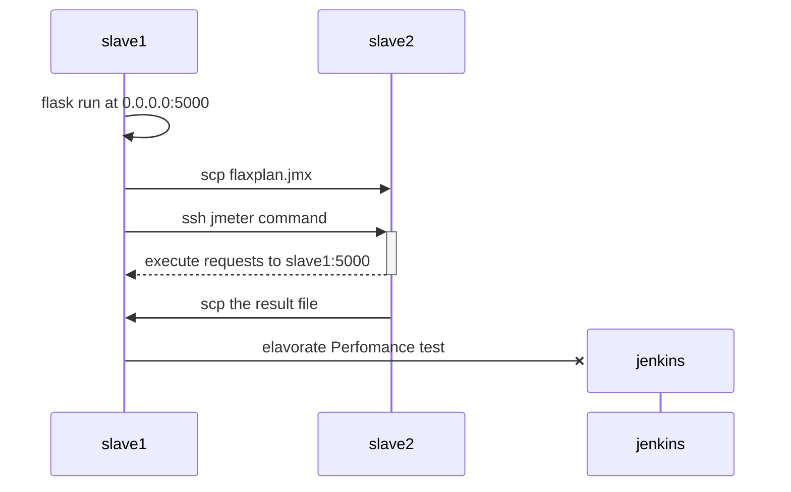

-   [Reto 2 -- Distribución de
    agentes](#reto-2-distribución-de-agentes)
-   [Arquitectura](#arquitectura)
-   [Las tareas a
    realizar](#las-tareas-a-realizar)
    -   [Elegir qué separación de agentes sería la más adecuada en este
        pipeline y justificar por
        qué.](#elegir-qué-separación-de-agentes-sería-la-más-adecuada-en-este-pipeline-y-justificar-por-qué.)
    -   [Paralelizar todas las pruebas, siempre que sea
        posible.](#paralelizar-todas-las-pruebas-siempre-que-sea-posible.)
    -   [Si alguna prueba no se puede paralelizar, explicar por qué y
        extraerla de la ejecución paralela (y dejarla como secuencial) o
        proponer una solución
        mejor.](#si-alguna-prueba-no-se-puede-paralelizar-explicar-por-qué-y-extraerla-de-la-ejecución-paralela-y-dejarla-como-secuencial-o-proponer-una-solución-mejor.)
        -   [Pipeliine Info](#pipeliine-info)
        -   [Get Code](#get-code)
        -   [Perfomance
            checks](#perfomance-checks)
    -   [Actualizar el Jenkinsfile usado en el mismo reto del apartado
        A](#actualizar-el-jenkinsfile-usado-en-el-mismo-reto-del-apartado-a)
    -   [Incluir en cada etapa los comandos whoami, hostname y echo
        \${WORKSPACE}](#incluir-en-cada-etapa-los-comandos-whoami-hostname-y-echo-workspace)

# Reto 2 -- Distribución de agentes

# Arquitectura

Para la ejecución de las pruebas de *Jenkins*, utilizamos:

-   Contenedor docker de *Jenkins* en el nodo *kvm* 192.168.150.228
-   Esclavos en los nodos *kvm*
    -   *slave1*: 192.168.150.205
    -   *slave2*: 192.168.150.229

# Las tareas a realizar

## Elegir qué separación de agentes sería la más adecuada en este pipeline y justificar por qué.

Como se ha comentado anteriormente, nuestra arquitectura de integración
continua consta de un nodo maestro y dos esclavos.\
En base a la arquitectura disponible se ha decidido etiquetar los
nodos de la siguiente manera.

-   *slave1*: linux flask agent1
-   *slave2*: linux agent2 jmeter

Utilizando este etiquetado hemos distribuido los siguientes pasos del
*pipeline* de la siguiente manera

  *step*                 etiqueta   nodo
  ---------------------- ---------- ---------------------
  Pipeline Info          X          cualquiera
  Get Code               *linux*    *slave1* o *slave2*
  Analysis phase                    
  Static code Analysis   *linux*    *slave1* o *slave2*
  Security Analysis      *linux*    *slave1* o *slave2*
  Coberture Analysis     *linux*    *slave1* o *slave2*
  Test phase                        
  Test: Unitary          *linux*    *slave1* o *slave2*
  Test: Integration      *linux*    *slave1* o *slave2*
  Perfomance checks      *flask*    *slave1*

De esta manera lo que queremos conseguir es que en las fase de Analisys
y testeo sea el propio jenkins quien elija el nodo sobre el que se
ejecuta la tarea, aunque existe una excepción en la fase de rendimiento
que se ejecuta de la siguiente manera:

## Paralelizar todas las pruebas, siempre que sea posible.

En nuestra solución se ha dispuesto que las fases de analisis y de test
se ejecuten en paralelo al no existir interacciones/interdepencias entre
ellas.\
En la siguiente imagen se puede observar el flujo de fases y su
paralelización\

## Si alguna prueba no se puede paralelizar, explicar por qué y extraerla de la ejecución paralela (y dejarla como secuencial) o proponer una solución mejor.

Hemos ejecutado varias tareas / fases de forma secuencial

### Pipeliine Info

Esta es una etapa de un solo paso, en la cual se muestra la información
de la *pipeline* más que nada la utilizamos para probar la librería
compartida. No es realmente necesaria

### Get Code

Esta es otra etapa de un solo paso, en ella obtenemos el código de
nuestro repositorio además de realizar una limpieza previa. Si fuesemos
muy puristas se podrían hacer en 2 pasos secuenciales. Uno limpieza y
otro obtención de código, aunque no hemos optado por esta solución para
simplificar la fase.

### Perfomance checks

Esta es la última fase de nuestra *pipeline* . Consta de un solo paso un
tanto peculiar que se describe a continuación.

1.  Se configuran las variables de entorno de *Flask* en el nodo *flask*
2.  Se levanta el servidor *Flask* y se hace un bucle de espera activa
    hasta que está listo
3.  Se copian el fichero **flaskplan.jmx** desde el nodo *flask* al nodo
    donde se ejecutarán las pruebas de *JMeter*
4.  Se ejecutan las pruebas de rendimiento
5.  Se copian los resultados desde el nodo *JMeter* al nodo *flask*
6.  Se genera el reporte

## Actualizar el Jenkinsfile usado en el mismo reto del apartado A

Se realizó esta paralelización en la primera parte del reto, con lo que
ambos ficheros son identicos

## Incluir en cada etapa los comandos whoami, hostname y echo \${WORKSPACE}

Para ello se utiliza la librería compartida con la llamada a la función 
`pipelineBanner()`
