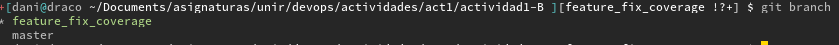
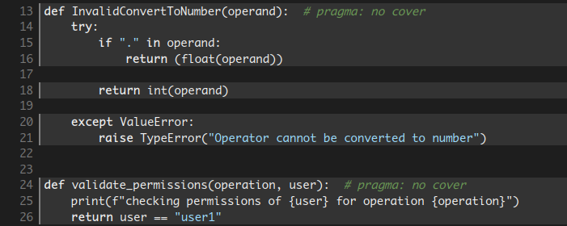
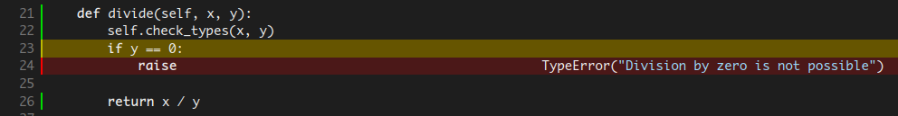
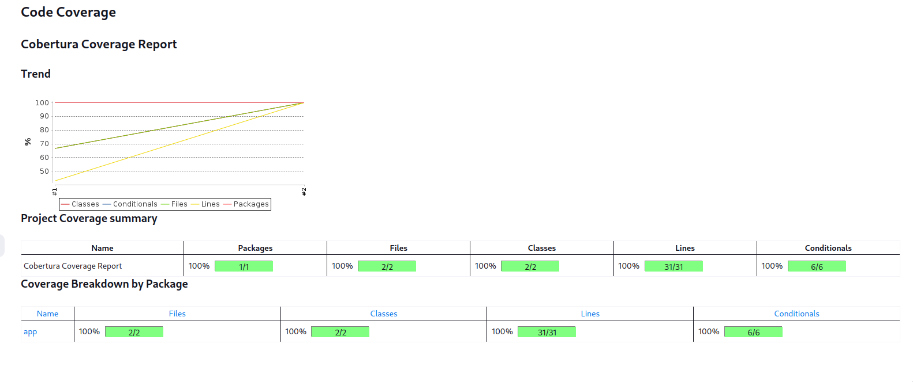

-   [Reto 3 -- Mejora de
    cobertura](#reto-3-mejora-de-cobertura)
    -   [Generar una rama nueva "feature_fix_coverage" a partir de la
        rama
        master](#generar-una-rama-nueva-feature_fix_coverage-a-partir-de-la-rama-master)
    -   [En esta nueva rama, modificar los tests para lograr una
        cobertura
        completa](#en-esta-nueva-rama-modificar-los-tests-para-lograr-una-cobertura-completa)
    -   [Explicar cuál era el problema y cuál ha sido la
        solución.](#explicar-cuál-era-el-problema-y-cuál-ha-sido-la-solución.)
    -   [Adjuntar log de ejecución donde se muestre que la cobertura es
        del 100% y gráficas de evolución (con el plugin cobertura) donde
        se aprecie también este aumento de
        cobertura.](#adjuntar-log-de-ejecución-donde-se-muestre-que-la-cobertura-es-del-100-y-gráficas-de-evolución-con-el-plugin-cobertura-donde-se-aprecie-también-este-aumento-de-cobertura.)

# Reto 3 -- Mejora de cobertura

## Generar una rama nueva "feature_fix_coverage" a partir de la rama master

Se crea la rama, *feature_fix_coverage*, como se observa a continuación


## En esta nueva rama, modificar los tests para lograr una cobertura completa

Con los test y código incial tenemos una cobertura del 93%. Tal y como
se aprecia en el siguiente comando

``` bash
+[dani@draco /tmp/helloworld ][master ?] $ coverage run --source=$(pwd)/app --branch --omit=$(pwd)/app/__init__.py,$(pwd)/app/api.py  -m pytest $(pwd)/test/unit ; coverage html; coverage report
============================================================================================================================== test session starts ==============================================================================================================================
platform linux -- Python 3.12.3, pytest-8.2.1, pluggy-1.5.0
rootdir: /tmp/helloworld
configfile: pytest.ini
plugins: typeguard-4.2.1, xdist-3.5.0
collected 10 items

test/unit/calc_test.py ........                                                                                                                                                                                                                                           [ 80%]
test/unit/util_test.py ..                                                                                                                                                                                                                                                 [100%]

============================================================================================================================== 10 passed in 0.07s ===============================================================================================================================
Wrote HTML report to htmlcov/index.html
Name          Stmts   Miss Branch BrPart  Cover
-----------------------------------------------
app/calc.py      24      1      4      1    93%
app/util.py       7      0      2      0   100%
-----------------------------------------------
TOTAL            31      1      6      1    95%
```

Si profundizamos más, observamos que existen partes del código excluidas
de los test y partes de código que no están cubiertas por los test.



Modificamos los test existentes añadiendo los siguientes

``` python
+[dani@draco /tmp/helloworld ][master ?] $ diff -Bb test/unit/calc_test.py /home/dani/Documents/asignaturas/unir/devops/actividades/act1/actividad1-B/test/unit/calc_test.py
36a38,42
>
>     def test_divide_method_fails_by_zero(self):
>         self.assertRaises(TypeError, self.calc.divide, 4, 0)
>         self.assertRaises(TypeError, self.calc.divide, 0, 0)
>         self.assertRaises(TypeError, self.calc.divide, -0, -0)
```

``` python
+[dani@draco /tmp/helloworld ][master ?] $ diff -Bb test/unit/util_test.py /home/dani/Documents/asignaturas/unir/devops/actividades/act1/actividad1-B/test/unit/util_test.py
25a26,35
>     def test_invalid_convert (self):
>         self.assertRaises(TypeError, util.InvalidConvertToNumber, "foo")
>         self.assertRaises(TypeError, util.InvalidConvertToNumber, ".foo")
>
>
>     def test_validate_permissions (self):
>         self.assertEqual (True, util.validate_permissions("add", "user1"))
>         self.assertEqual (False, util.validate_permissions("add", "foo"))
>
>
```

Si volvemos a ejecutar los test de cobertura obtenemos el siguiente
resultado.

    ==================================================== 13 passed, 2 warnings in 0.08s ====================================================
    Name          Stmts   Miss Branch BrPart  Cover
    -----------------------------------------------
    app/calc.py      24      0      4      0   100%
    app/util.py      17      0      4      0   100%
    -----------------------------------------------
    TOTAL            41      0      8      0   100%

## Explicar cuál era el problema y cuál ha sido la solución.

El principal problema por el cual la cobertura de código no era completa
era por la **exclusión de determinadas funciones** del análisis y la
**falta de test unitarios** para algunas funciones.

En el punto anterior se ha explicado detalladamente los cambios
realizados

## Adjuntar log de ejecución donde se muestre que la cobertura es del 100% y gráficas de evolución (con el plugin cobertura) donde se aprecie también este aumento de cobertura.

Se ha tenido que reajustar en los slaves la versión de cobertura, ya que
la instalada previamente era una versión antigua y apenas se conseguía
obtener una cobertura decente. Despues de instalar una versión mas
moderna se puede observar en la gráfica la evolución de la cobertura
desde un 40% a un 100%



El log de la ejecución se muestra a continuación:

``` bash
Started by user admin
Obtained Jenkinsfile_agentes from git https://github.com/dargamenteria/actividad1-B
Loading library test-pipeline-library@master
Attempting to resolve master from remote references...
 > git --version # timeout=10
 > git --version # 'git version 2.34.1'
 > git ls-remote -h -- https://github.com/dargamenteria/actividad1-B # timeout=10
Found match: refs/heads/master revision f508bb4990b84fe6df3a5117b018daa82bdc6296
Selected Git installation does not exist. Using Default
The recommended git tool is: NONE
No credentials specified
 > git rev-parse --resolve-git-dir /var/lib/jenkins/workspace/Jenkins1_B_cobertura@libs/f681e00ebd197507f856ad5127467ad257716f760a27a1768db2053d2db4914e/.git # timeout=10
Fetching changes from the remote Git repository
 > git config remote.origin.url https://github.com/dargamenteria/actividad1-B # timeout=10
Fetching without tags
Fetching upstream changes from https://github.com/dargamenteria/actividad1-B
 > git --version # timeout=10
 > git --version # 'git version 2.34.1'
 > git fetch --no-tags --force --progress -- https://github.com/dargamenteria/actividad1-B +refs/heads/*:refs/remotes/origin/* # timeout=10
Checking out Revision f508bb4990b84fe6df3a5117b018daa82bdc6296 (master)
 > git config core.sparsecheckout # timeout=10
 > git checkout -f f508bb4990b84fe6df3a5117b018daa82bdc6296 # timeout=10
Commit message: "Docs part 1 B 1"
 > git rev-list --no-walk 379a49d64dfbbf9a4a1bd5f721f3d27e6b64136c # timeout=10
[Pipeline] Start of Pipeline
[Pipeline] node
Running on slave2_ssh in /var/lib/jenkins/workspace/Jenkins1_B_cobertura
[Pipeline] {
[Pipeline] stage
[Pipeline] { (Declarative: Checkout SCM)
[Pipeline] checkout
Selected Git installation does not exist. Using Default
The recommended git tool is: NONE
No credentials specified
Cloning the remote Git repository
Cloning repository https://github.com/dargamenteria/actividad1-B
 > git init /var/lib/jenkins/workspace/Jenkins1_B_cobertura # timeout=10
Fetching upstream changes from https://github.com/dargamenteria/actividad1-B
 > git --version # timeout=10
 > git --version # 'git version 2.34.1'
 > git fetch --tags --force --progress -- https://github.com/dargamenteria/actividad1-B +refs/heads/*:refs/remotes/origin/* # timeout=10
 > git config remote.origin.url https://github.com/dargamenteria/actividad1-B # timeout=10
 > git config --add remote.origin.fetch +refs/heads/*:refs/remotes/origin/* # timeout=10
Avoid second fetch
Checking out Revision 379a49d64dfbbf9a4a1bd5f721f3d27e6b64136c (refs/remotes/origin/feature_fix_coverage)
 > git rev-parse refs/remotes/origin/feature_fix_coverage^{commit} # timeout=10
 > git config core.sparsecheckout # timeout=10
 > git checkout -f 379a49d64dfbbf9a4a1bd5f721f3d27e6b64136c # timeout=10
Commit message: "Bloddy hell and the different versions of packages between distributions"
 > git rev-list --no-walk 379a49d64dfbbf9a4a1bd5f721f3d27e6b64136c # timeout=10
[Pipeline] }
[Pipeline] // stage
[Pipeline] withEnv
[Pipeline] {
[Pipeline] withCredentials
Masking supported pattern matches of $GIT_TOKEN
[Pipeline] {
[Pipeline] stage
[Pipeline] { (Pipeline Info)
[Pipeline] sh
+ echo         pipelineBanner 
        pipelineBanner 
[Pipeline] script
[Pipeline] {
[Pipeline] sh
+ echo ##########################
##########################
+ hostname -f
+ echo #Hostname: slave2.paranoidworld.es
#Hostname: slave2.paranoidworld.es
+ uname -a
+ echo #Hostinfo: Linux slave2.paranoidworld.es 5.15.0-107-generic #117-Ubuntu SMP Fri Apr 26 12:26:49 UTC 2024 x86_64 x86_64 x86_64 GNU/Linux
#Hostinfo: Linux slave2.paranoidworld.es 5.15.0-107-generic #117-Ubuntu SMP Fri Apr 26 12:26:49 UTC 2024 x86_64 x86_64 x86_64 GNU/Linux
+ echo ##########################
##########################
[Pipeline] }
[Pipeline] // script
[Pipeline] }
[Pipeline] // stage
[Pipeline] stage
[Pipeline] { (Get code)
[Pipeline] node
Running on slave2_ssh in /var/lib/jenkins/workspace/Jenkins1_B_cobertura@2
[Pipeline] {
[Pipeline] checkout
Selected Git installation does not exist. Using Default
The recommended git tool is: NONE
No credentials specified
Fetching changes from the remote Git repository
Checking out Revision 379a49d64dfbbf9a4a1bd5f721f3d27e6b64136c (refs/remotes/origin/feature_fix_coverage)
Commit message: "Bloddy hell and the different versions of packages between distributions"
 > git rev-parse --resolve-git-dir /var/lib/jenkins/workspace/Jenkins1_B_cobertura@2/.git # timeout=10
 > git config remote.origin.url https://github.com/dargamenteria/actividad1-B # timeout=10
Fetching upstream changes from https://github.com/dargamenteria/actividad1-B
 > git --version # timeout=10
 > git --version # 'git version 2.34.1'
 > git fetch --tags --force --progress -- https://github.com/dargamenteria/actividad1-B +refs/heads/*:refs/remotes/origin/* # timeout=10
 > git rev-parse refs/remotes/origin/feature_fix_coverage^{commit} # timeout=10
 > git config core.sparsecheckout # timeout=10
 > git checkout -f 379a49d64dfbbf9a4a1bd5f721f3d27e6b64136c # timeout=10
[Pipeline] withEnv
[Pipeline] {
[Pipeline] catchError
[Pipeline] {
[Pipeline] script
[Pipeline] {
[Pipeline] sh
+ echo ##########################
##########################
+ hostname -f
+ echo #Hostname: slave2.paranoidworld.es
#Hostname: slave2.paranoidworld.es
+ uname -a
+ echo #Hostinfo: Linux slave2.paranoidworld.es 5.15.0-107-generic #117-Ubuntu SMP Fri Apr 26 12:26:49 UTC 2024 x86_64 x86_64 x86_64 GNU/Linux
#Hostinfo: Linux slave2.paranoidworld.es 5.15.0-107-generic #117-Ubuntu SMP Fri Apr 26 12:26:49 UTC 2024 x86_64 x86_64 x86_64 GNU/Linux
+ echo ##########################
##########################
[Pipeline] }
[Pipeline] // script
[Pipeline] sh
+ [ -e /var/lib/jenkins/workspace/Jenkins1_B_cobertura@2/gitCode ]
+ rm -fr /var/lib/jenkins/workspace/Jenkins1_B_cobertura@2/gitCode
+ git clone https://****@github.com/dargamenteria/actividad1-B /var/lib/jenkins/workspace/Jenkins1_B_cobertura@2/gitCode
Cloning into '/var/lib/jenkins/workspace/Jenkins1_B_cobertura@2/gitCode'...
[Pipeline] stash
Stashed 75 file(s)
[Pipeline] }
[Pipeline] // catchError
[Pipeline] }
[Pipeline] // withEnv
[Pipeline] }
[Pipeline] // node
[Pipeline] }
[Pipeline] // stage
[Pipeline] stage
[Pipeline] { (Analysis phase)
[Pipeline] parallel
[Pipeline] { (Branch: Static code Analysis)
[Pipeline] { (Branch: Security Analysis)
[Pipeline] { (Branch: Coberture Analysis)
[Pipeline] stage
[Pipeline] { (Static code Analysis)
[Pipeline] stage
[Pipeline] { (Security Analysis)
[Pipeline] stage
[Pipeline] { (Coberture Analysis)
[Pipeline] node
Running on slave1_ssh in /var/lib/jenkins/workspace/Jenkins1_B_cobertura
[Pipeline] node
[Pipeline] node
Running on slave2_ssh in /var/lib/jenkins/workspace/Jenkins1_B_cobertura@2
Running on slave2_ssh in /var/lib/jenkins/workspace/Jenkins1_B_cobertura@3
[Pipeline] {
[Pipeline] {
[Pipeline] {
[Pipeline] checkout
Selected Git installation does not exist. Using Default
The recommended git tool is: NONE
[Pipeline] checkout
Selected Git installation does not exist. Using Default
The recommended git tool is: NONE
No credentials specified
Fetching changes from the remote Git repository
[Pipeline] checkout
Selected Git installation does not exist. Using Default
The recommended git tool is: NONE
No credentials specified
Fetching changes from the remote Git repository
Checking out Revision 379a49d64dfbbf9a4a1bd5f721f3d27e6b64136c (refs/remotes/origin/feature_fix_coverage)
Commit message: "Bloddy hell and the different versions of packages between distributions"
 > git rev-parse --resolve-git-dir /var/lib/jenkins/workspace/Jenkins1_B_cobertura@2/.git # timeout=10
 > git config remote.origin.url https://github.com/dargamenteria/actividad1-B # timeout=10
Fetching upstream changes from https://github.com/dargamenteria/actividad1-B
 > git --version # timeout=10
 > git --version # 'git version 2.34.1'
 > git fetch --tags --force --progress -- https://github.com/dargamenteria/actividad1-B +refs/heads/*:refs/remotes/origin/* # timeout=10
 > git rev-parse refs/remotes/origin/feature_fix_coverage^{commit} # timeout=10
 > git config core.sparsecheckout # timeout=10
 > git checkout -f 379a49d64dfbbf9a4a1bd5f721f3d27e6b64136c # timeout=10
[Pipeline] withEnv
 > git rev-parse --resolve-git-dir /var/lib/jenkins/workspace/Jenkins1_B_cobertura@3/.git # timeout=10
 > git config remote.origin.url https://github.com/dargamenteria/actividad1-B # timeout=10
Fetching upstream changes from https://github.com/dargamenteria/actividad1-B
 > git --version # timeout=10
 > git --version # 'git version 2.34.1'
 > git fetch --tags --force --progress -- https://github.com/dargamenteria/actividad1-B +refs/heads/*:refs/remotes/origin/* # timeout=10
Checking out Revision 379a49d64dfbbf9a4a1bd5f721f3d27e6b64136c (refs/remotes/origin/feature_fix_coverage)
[Pipeline] {
Commit message: "Bloddy hell and the different versions of packages between distributions"
[Pipeline] catchError
 > git rev-parse refs/remotes/origin/feature_fix_coverage^{commit} # timeout=10
 > git config core.sparsecheckout # timeout=10
 > git checkout -f 379a49d64dfbbf9a4a1bd5f721f3d27e6b64136c # timeout=10
[Pipeline] {
[Pipeline] script
[Pipeline] {
[Pipeline] sh
+ echo ##########################
##########################
+ hostname -f
+ echo #Hostname: slave2.paranoidworld.es
#Hostname: slave2.paranoidworld.es
+ uname -a
+ echo #Hostinfo: Linux slave2.paranoidworld.es 5.15.0-107-generic #117-Ubuntu SMP Fri Apr 26 12:26:49 UTC 2024 x86_64 x86_64 x86_64 GNU/Linux
#Hostinfo: Linux slave2.paranoidworld.es 5.15.0-107-generic #117-Ubuntu SMP Fri Apr 26 12:26:49 UTC 2024 x86_64 x86_64 x86_64 GNU/Linux
+ echo ##########################
##########################
[Pipeline] withEnv
[Pipeline] {
[Pipeline] }
[Pipeline] // script
[Pipeline] unstash
[Pipeline] catchError
[Pipeline] {
[Pipeline] script
[Pipeline] {
[Pipeline] sh
+ cd /var/lib/jenkins/workspace/Jenkins1_B_cobertura@2/gitCode
+ pwd
+ bandit -r . --format custom --msg-template {abspath}:{line}: {test_id}[bandit]: {severity}: {msg} -o /var/lib/jenkins/workspace/Jenkins1_B_cobertura@2/gitCode/bandit.out
[Pipeline] sh
+ echo ##########################
##########################
+ hostname -f
+ echo #Hostname: slave2.paranoidworld.es
#Hostname: slave2.paranoidworld.es
+ uname -a
+ echo #Hostinfo: Linux slave2.paranoidworld.es 5.15.0-107-generic #117-Ubuntu SMP Fri Apr 26 12:26:49 UTC 2024 x86_64 x86_64 x86_64 GNU/Linux
#Hostinfo: Linux slave2.paranoidworld.es 5.15.0-107-generic #117-Ubuntu SMP Fri Apr 26 12:26:49 UTC 2024 x86_64 x86_64 x86_64 GNU/Linux
+ echo ##########################
##########################
[Pipeline] }
[Pipeline] // script
[Pipeline] unstash
[Pipeline] sh
No credentials specified
+ cd /var/lib/jenkins/workspace/Jenkins1_B_cobertura@3/gitCode
+ pwd
+ pwd
+ pwd
+ pwd
+ coverage run --source=/var/lib/jenkins/workspace/Jenkins1_B_cobertura@3/gitCode/app --branch --omit=/var/lib/jenkins/workspace/Jenkins1_B_cobertura@3/gitCode/app/__init__.py,/var/lib/jenkins/workspace/Jenkins1_B_cobertura@3/gitCode/app/api.py -m pytest /var/lib/jenkins/workspace/Jenkins1_B_cobertura@3/gitCode/test/unit
 > git rev-parse --resolve-git-dir /var/lib/jenkins/workspace/Jenkins1_B_cobertura/.git # timeout=10
Fetching changes from the remote Git repository
[main]  INFO    profile include tests: None
[main]  INFO    profile exclude tests: None
[main]  INFO    cli include tests: None
[main]  INFO    cli exclude tests: None
[main]  INFO    running on Python 3.10.12
[custom]    INFO    Result written to file: /var/lib/jenkins/workspace/Jenkins1_B_cobertura@2/gitCode/bandit.out
+ echo Controlled exit
Controlled exit
[Pipeline] recordIssues
============================= test session starts ==============================
platform linux -- Python 3.10.12, pytest-6.2.5, py-1.10.0, pluggy-0.13.0
rootdir: /var/lib/jenkins/workspace/Jenkins1_B_cobertura@3/gitCode
collected 11 items

test/unit/calc_test.py .........                                         [ 81%]
test/unit/util_test.py ..                                                [100%]

=============================== warnings summary ===============================
test/unit/calc_test.py:7
  /var/lib/jenkins/workspace/Jenkins1_B_cobertura@3/gitCode/test/unit/calc_test.py:7: PytestUnknownMarkWarning: Unknown pytest.mark.unit - is this a typo?  You can register custom marks to avoid this warning - for details, see https://docs.pytest.org/en/stable/mark.html
    @pytest.mark.unit

test/unit/util_test.py:7
  /var/lib/jenkins/workspace/Jenkins1_B_cobertura@3/gitCode/test/unit/util_test.py:7: PytestUnknownMarkWarning: Unknown pytest.mark.unit - is this a typo?  You can register custom marks to avoid this warning - for details, see https://docs.pytest.org/en/stable/mark.html
    @pytest.mark.unit

-- Docs: https://docs.pytest.org/en/stable/warnings.html
======================== 11 passed, 2 warnings in 0.32s ========================
+ coverage html
Wrote HTML report to htmlcov/index.html
+ coverage report
Name          Stmts   Miss Branch BrPart  Cover
-----------------------------------------------
app/calc.py      24      0      4      0   100%
app/util.py       7      0      2      0   100%
-----------------------------------------------
TOTAL            31      0      6      0   100%
+ pwd
+ coverage xml -o /var/lib/jenkins/workspace/Jenkins1_B_cobertura@3/gitCode/coverage.xml
Wrote XML report to /var/lib/jenkins/workspace/Jenkins1_B_cobertura@3/gitCode/coverage.xml
WARNING: Unknown parameter(s) found for class type 'io.jenkins.plugins.analysis.core.util.WarningsQualityGate': critically
WARNING: Unknown parameter(s) found for class type 'io.jenkins.plugins.analysis.core.util.WarningsQualityGate': critically
 > git config remote.origin.url https://github.com/dargamenteria/actividad1-B # timeout=10
Fetching upstream changes from https://github.com/dargamenteria/actividad1-B
 > git --version # timeout=10
 > git --version # 'git version 2.34.1'
 > git fetch --tags --force --progress -- https://github.com/dargamenteria/actividad1-B +refs/heads/*:refs/remotes/origin/* # timeout=10
Checking out Revision 379a49d64dfbbf9a4a1bd5f721f3d27e6b64136c (refs/remotes/origin/feature_fix_coverage)
[Pipeline] cobertura
[Cobertura] Publishing Cobertura coverage report...

 > git rev-parse refs/remotes/origin/feature_fix_coverage^{commit} # timeout=10
 > git config core.sparsecheckout # timeout=10
 > git checkout -f 379a49d64dfbbf9a4a1bd5f721f3d27e6b64136c # timeout=10
Commit message: "Bloddy hell and the different versions of packages between distributions"
[Pylint] Searching for all files in '/var/lib/jenkins/workspace/Jenkins1_B_cobertura@2' that match the pattern 'gitCode/bandit.out'
[Pylint] Traversing of symbolic links: enabled
[Pylint] -> found 1 file
[Pylint] Successfully parsed file /var/lib/jenkins/workspace/Jenkins1_B_cobertura@2/gitCode/bandit.out
[Pylint] -> found 0 issues (skipped 0 duplicates)
[Pylint] Successfully processed file 'gitCode/bandit.out'
[Pylint] Skipping post processing
[Pylint] No filter has been set, publishing all 0 issues
[Pylint] Repository miner is not configured, skipping repository mining
[Pylint] Searching for all files in '/var/lib/jenkins/workspace/Jenkins1_B_cobertura@2' that match the pattern 'gitCode/bandit.out'
[Pylint] Traversing of symbolic links: enabled
[Pylint] -> found 1 file
[Pylint] Successfully parsed file /var/lib/jenkins/workspace/Jenkins1_B_cobertura@2/gitCode/bandit.out
[Pylint] -> found 0 issues (skipped 0 duplicates)
[Pylint] Successfully processed file 'gitCode/bandit.out'
[Pylint] Skipping post processing
[Pylint] No filter has been set, publishing all 0 issues
[Pylint] Repository miner is not configured, skipping repository mining
[Pylint] Reference build recorder is not configured
[Pylint] No valid reference build found
[Pylint] All reported issues will be considered outstanding
[Pylint] Evaluating quality gates
[Pylint] -> All quality gates have been passed
[Pylint] -> Details for each quality gate:
[Pylint]    - [Total (any severity)]: ≪Success≫ - (Actual value: 0, Quality gate: 1.00)
[Pylint]    - [Total (any severity)]: ≪Success≫ - (Actual value: 0, Quality gate: 2.00)
[Pylint] Health report is disabled - skipping
[Pylint] Created analysis result for 0 issues (found 0 new issues, fixed 0 issues)
[Pylint] Attaching ResultAction with ID 'pylint' to build 'Jenkins1_B_cobertura #3'.
[Cobertura] Publishing Cobertura coverage results...

[Cobertura] Cobertura coverage report found.

[Pipeline] withEnv
[Pipeline] {
[Checks API] No suitable checks publisher found.
[Pipeline] catchError
[Pipeline] {
[Pipeline] stash
Warning: overwriting stash ‘workspace’
Stashed 76 file(s)
[Pipeline] stash
Warning: overwriting stash ‘workspace’
[Pipeline] script
[Pipeline] {
[Pipeline] }
[Pipeline] sh
Stashed 97 file(s)
[Pipeline] // catchError
+ echo ##########################
##########################
+ hostname -f
+ echo #Hostname: slave1.paranoidworld.es
#Hostname: slave1.paranoidworld.es
+ uname -a
+ echo #Hostinfo: Linux slave1.paranoidworld.es 5.15.0-107-generic #117-Ubuntu SMP Fri Apr 26 12:26:49 UTC 2024 x86_64 x86_64 x86_64 GNU/Linux
#Hostinfo: Linux slave1.paranoidworld.es 5.15.0-107-generic #117-Ubuntu SMP Fri Apr 26 12:26:49 UTC 2024 x86_64 x86_64 x86_64 GNU/Linux
+ echo ##########################
##########################
[Pipeline] }
[Pipeline] }
[Pipeline] // withEnv
[Pipeline] }
[Pipeline] }
[Pipeline] // catchError
[Pipeline] }
[Pipeline] // node
[Pipeline] // script
[Pipeline] }
[Pipeline] unstash
[Pipeline] // withEnv
[Pipeline] }
[Pipeline] // stage
[Pipeline] }
[Pipeline] // node
[Pipeline] }
[Pipeline] sh
+ cd /var/lib/jenkins/workspace/Jenkins1_B_cobertura/gitCode
+ pwd
+ pwd
+ flake8 --format=pylint --exit-zero --max-line-length 120 /var/lib/jenkins/workspace/Jenkins1_B_cobertura/gitCode/app
[Pipeline] // stage
[Pipeline] }
[Pipeline] recordIssues
WARNING: Unknown parameter(s) found for class type 'io.jenkins.plugins.analysis.core.util.WarningsQualityGate': critically
WARNING: Unknown parameter(s) found for class type 'io.jenkins.plugins.analysis.core.util.WarningsQualityGate': critically
[Flake8] Searching for all files in '/var/lib/jenkins/workspace/Jenkins1_B_cobertura' that match the pattern 'gitCode/flake8.out'
[Flake8] Traversing of symbolic links: enabled
[Flake8] -> found 1 file
[Flake8] Successfully parsed file /var/lib/jenkins/workspace/Jenkins1_B_cobertura/gitCode/flake8.out
[Flake8] -> found 6 issues (skipped 0 duplicates)
[Flake8] Successfully processed file 'gitCode/flake8.out'
[Flake8] Post processing issues on 'slave1_ssh' with source code encoding 'UTF-8'
[Flake8] Creating SCM blamer to obtain author and commit information for affected files
[Flake8] -> No blamer installed yet. You need to install the 'git-forensics' plugin to enable blaming for Git.
[Flake8] Resolving file names for all issues in workspace '/var/lib/jenkins/workspace/Jenkins1_B_cobertura'
[Flake8] -> resolved paths in source directory (2 found, 0 not found)
[Flake8] Resolving module names from module definitions (build.xml, pom.xml, or Manifest.mf files)
[Flake8] -> resolved module names for 6 issues
[Flake8] Resolving package names (or namespaces) by parsing the affected files
[Flake8] -> resolved package names of 2 affected files
[Flake8] No filter has been set, publishing all 6 issues
[Flake8] Creating fingerprints for all affected code blocks to track issues over different builds
[Flake8] -> created fingerprints for 6 issues (skipped 0 issues)
[Flake8] Copying affected files to Jenkins' build folder '/var/lib/jenkins/jobs/Jenkins1_B_cobertura/builds/3/files-with-issues'
[Flake8] -> 2 copied, 0 not in workspace, 0 not-found, 0 with I/O error
[Flake8] Skipping cleaning of source code files in old builds
[Flake8] Repository miner is not configured, skipping repository mining
[Flake8] Searching for all files in '/var/lib/jenkins/workspace/Jenkins1_B_cobertura' that match the pattern 'gitCode/flake8.out'
[Flake8] Traversing of symbolic links: enabled
[Flake8] -> found 1 file
[Flake8] Successfully parsed file /var/lib/jenkins/workspace/Jenkins1_B_cobertura/gitCode/flake8.out
[Flake8] -> found 6 issues (skipped 0 duplicates)
[Flake8] Successfully processed file 'gitCode/flake8.out'
[Flake8] Post processing issues on 'slave1_ssh' with source code encoding 'UTF-8'
[Flake8] Creating SCM blamer to obtain author and commit information for affected files
[Flake8] -> No blamer installed yet. You need to install the 'git-forensics' plugin to enable blaming for Git.
[Flake8] Resolving file names for all issues in workspace '/var/lib/jenkins/workspace/Jenkins1_B_cobertura'
[Flake8] -> resolved paths in source directory (2 found, 0 not found)
[Flake8] Resolving module names from module definitions (build.xml, pom.xml, or Manifest.mf files)
[Flake8] -> resolved module names for 6 issues
[Flake8] Resolving package names (or namespaces) by parsing the affected files
[Flake8] -> resolved package names of 2 affected files
[Flake8] No filter has been set, publishing all 6 issues
[Flake8] Creating fingerprints for all affected code blocks to track issues over different builds
[Flake8] -> created fingerprints for 6 issues (skipped 0 issues)
[Flake8] Copying affected files to Jenkins' build folder '/var/lib/jenkins/jobs/Jenkins1_B_cobertura/builds/3/files-with-issues'
[Flake8] -> 2 copied, 0 not in workspace, 0 not-found, 0 with I/O error
[Flake8] Skipping cleaning of source code files in old builds
[Flake8] Repository miner is not configured, skipping repository mining
[Flake8] Reference build recorder is not configured
[Flake8] No valid reference build found
[Flake8] All reported issues will be considered outstanding
[Flake8] Evaluating quality gates
[Flake8] -> All quality gates have been passed
[Flake8] -> Details for each quality gate:
[Flake8]    - [Total (any severity)]: ≪Success≫ - (Actual value: 6, Quality gate: 8.00)
[Flake8]    - [Total (any severity)]: ≪Success≫ - (Actual value: 6, Quality gate: 10.00)
[Flake8] Health report is disabled - skipping
[Flake8] Created analysis result for 6 issues (found 0 new issues, fixed 0 issues)
[Flake8] Attaching ResultAction with ID 'flake8' to build 'Jenkins1_B_cobertura #3'.
[Checks API] No suitable checks publisher found.
[Pipeline] stash
Warning: overwriting stash ‘workspace’
Stashed 102 file(s)
[Pipeline] }
[Pipeline] // catchError
[Pipeline] }
[Pipeline] // withEnv
[Pipeline] }
[Pipeline] // node
[Pipeline] }
[Pipeline] // stage
[Pipeline] }
[Pipeline] // parallel
[Pipeline] }
[Pipeline] // stage
[Pipeline] stage
[Pipeline] { (Test phase)
[Pipeline] parallel
[Pipeline] { (Branch: Test: Unitary)
[Pipeline] { (Branch: Test: Integration)
[Pipeline] stage
[Pipeline] { (Test: Unitary)
[Pipeline] stage
[Pipeline] { (Test: Integration)
[Pipeline] node
Running on slave1_ssh in /var/lib/jenkins/workspace/Jenkins1_B_cobertura
[Pipeline] node
Running on slave2_ssh in /var/lib/jenkins/workspace/Jenkins1_B_cobertura@2
[Pipeline] {
[Pipeline] {
[Pipeline] checkout
Selected Git installation does not exist. Using Default
The recommended git tool is: NONE
No credentials specified
Fetching changes from the remote Git repository
[Pipeline] checkout
Selected Git installation does not exist. Using Default
The recommended git tool is: NONE
No credentials specified
Fetching changes from the remote Git repository
Checking out Revision 379a49d64dfbbf9a4a1bd5f721f3d27e6b64136c (refs/remotes/origin/feature_fix_coverage)
Commit message: "Bloddy hell and the different versions of packages between distributions"
Checking out Revision 379a49d64dfbbf9a4a1bd5f721f3d27e6b64136c (refs/remotes/origin/feature_fix_coverage)
Commit message: "Bloddy hell and the different versions of packages between distributions"
 > git rev-parse --resolve-git-dir /var/lib/jenkins/workspace/Jenkins1_B_cobertura/.git # timeout=10
 > git config remote.origin.url https://github.com/dargamenteria/actividad1-B # timeout=10
Fetching upstream changes from https://github.com/dargamenteria/actividad1-B
 > git --version # timeout=10
 > git --version # 'git version 2.34.1'
 > git fetch --tags --force --progress -- https://github.com/dargamenteria/actividad1-B +refs/heads/*:refs/remotes/origin/* # timeout=10
 > git rev-parse refs/remotes/origin/feature_fix_coverage^{commit} # timeout=10
 > git config core.sparsecheckout # timeout=10
 > git checkout -f 379a49d64dfbbf9a4a1bd5f721f3d27e6b64136c # timeout=10
[Pipeline] withEnv
[Pipeline] {
 > git rev-parse --resolve-git-dir /var/lib/jenkins/workspace/Jenkins1_B_cobertura@2/.git # timeout=10
 > git config remote.origin.url https://github.com/dargamenteria/actividad1-B # timeout=10
Fetching upstream changes from https://github.com/dargamenteria/actividad1-B
 > git --version # timeout=10
 > git --version # 'git version 2.34.1'
 > git fetch --tags --force --progress -- https://github.com/dargamenteria/actividad1-B +refs/heads/*:refs/remotes/origin/* # timeout=10
 > git rev-parse refs/remotes/origin/feature_fix_coverage^{commit} # timeout=10
 > git config core.sparsecheckout # timeout=10
 > git checkout -f 379a49d64dfbbf9a4a1bd5f721f3d27e6b64136c # timeout=10
[Pipeline] withEnv
[Pipeline] {
[Pipeline] catchError
[Pipeline] {
[Pipeline] script
[Pipeline] {
[Pipeline] sh
[Pipeline] catchError
+ echo ##########################
##########################
+ hostname -f
+ echo #Hostname: slave1.paranoidworld.es
#Hostname: slave1.paranoidworld.es
+ uname -a
+ echo #Hostinfo: Linux slave1.paranoidworld.es 5.15.0-107-generic #117-Ubuntu SMP Fri Apr 26 12:26:49 UTC 2024 x86_64 x86_64 x86_64 GNU/Linux
#Hostinfo: Linux slave1.paranoidworld.es 5.15.0-107-generic #117-Ubuntu SMP Fri Apr 26 12:26:49 UTC 2024 x86_64 x86_64 x86_64 GNU/Linux
+ echo ##########################
##########################
[Pipeline] {
[Pipeline] script
[Pipeline] {
[Pipeline] }
[Pipeline] sh
[Pipeline] // script
+ echo ##########################
##########################
+ hostname -f
+ echo #Hostname: slave2.paranoidworld.es
#Hostname: slave2.paranoidworld.es
+ uname -a
+ echo #Hostinfo: Linux slave2.paranoidworld.es 5.15.0-107-generic #117-Ubuntu SMP Fri Apr 26 12:26:49 UTC 2024 x86_64 x86_64 x86_64 GNU/Linux
#Hostinfo: Linux slave2.paranoidworld.es 5.15.0-107-generic #117-Ubuntu SMP Fri Apr 26 12:26:49 UTC 2024 x86_64 x86_64 x86_64 GNU/Linux
+ echo ##########################
##########################
[Pipeline] unstash
[Pipeline] }
[Pipeline] // script
[Pipeline] sh
+ echo Test phase
Test phase
+ cd /var/lib/jenkins/workspace/Jenkins1_B_cobertura/gitCode
+ export PYTHONPATH=.
+ pwd
+ pytest-3 --junitxml=result-test.xml /var/lib/jenkins/workspace/Jenkins1_B_cobertura/gitCode/test/unit
[Pipeline] unstash
[Pipeline] lock
Trying to acquire lock on [Resource: test-resources]
============================= test session starts ==============================
platform linux -- Python 3.10.12, pytest-6.2.5, py-1.10.0, pluggy-0.13.0
rootdir: /var/lib/jenkins/workspace/Jenkins1_B_cobertura/gitCode
collected 11 items

test/unit/calc_test.py .........                                         [ 81%]
test/unit/util_test.py ..                                                [100%]

=============================== warnings summary ===============================
../../Jenkins1_B_cobertura@3/gitCode/test/unit/calc_test.py:7
  /var/lib/jenkins/workspace/Jenkins1_B_cobertura@3/gitCode/test/unit/calc_test.py:7: PytestUnknownMarkWarning: Unknown pytest.mark.unit - is this a typo?  You can register custom marks to avoid this warning - for details, see https://docs.pytest.org/en/stable/mark.html

../../Jenkins1_B_cobertura@3/gitCode/test/unit/util_test.py:7
  /var/lib/jenkins/workspace/Jenkins1_B_cobertura@3/gitCode/test/unit/util_test.py:7: PytestUnknownMarkWarning: Unknown pytest.mark.unit - is this a typo?  You can register custom marks to avoid this warning - for details, see https://docs.pytest.org/en/stable/mark.html

-- Docs: https://docs.pytest.org/en/stable/warnings.html
- generated xml file: /var/lib/jenkins/workspace/Jenkins1_B_cobertura/gitCode/result-test.xml -
======================== 11 passed, 2 warnings in 0.04s ========================
Lock acquired on [Resource: test-resources]
[Pipeline] {
[Pipeline] }
[Pipeline] sh
+ echo Test phase
Test phase
+ cd /var/lib/jenkins/workspace/Jenkins1_B_cobertura@2/gitCode
+ export PYTHONPATH=.
+ pwd
+ export FLASK_APP=/var/lib/jenkins/workspace/Jenkins1_B_cobertura@2/gitCode/app/api.py
+ flask run -h 0.0.0.0 -p 5000
+ wc -l
+ grep -E 9090|5000
+ pwd
+ java -jar /apps/wiremock/wiremock-standalone-3.5.4.jar --port 9090 --root-dir /var/lib/jenkins/workspace/Jenkins1_B_cobertura@2/gitCode/test/wiremock
+ ss -lnt
+ [ 0 != 2 ]
+ echo No perative yet
No perative yet
+ sleep 1
[Pipeline] // catchError
[Pipeline] }
[Pipeline] // withEnv
+ wc -l
+ grep -E 9090|5000
+ ss -lnt
+ [ 0 != 2 ]
+ echo No perative yet
No perative yet
+ sleep 1
[Pipeline] }
 * Serving Flask app '/var/lib/jenkins/workspace/Jenkins1_B_cobertura@2/gitCode/app/api.py' (lazy loading)
 * Environment: production
   WARNING: This is a development server. Do not use it in a production deployment.
   Use a production WSGI server instead.
 * Debug mode: off
 * Running on all addresses.
   WARNING: This is a development server. Do not use it in a production deployment.
 * Running on http://192.168.150.228:5000/ (Press CTRL+C to quit)
[Pipeline] // node
+ wc -l
+ grep -E 9090|5000
+ ss -lnt
+ [ 1 != 2 ]
+ echo No perative yet
No perative yet
+ sleep 1
[Pipeline] }
[Pipeline] // stage
[Pipeline] }
+ wc -l
+ grep -E 9090|5000
+ ss -lnt
+ [ 1 != 2 ]
+ echo No perative yet
No perative yet
+ sleep 1
+ wc -l
+ grep -E 9090|5000
+ ss -lnt
+ [ 1 != 2 ]
+ echo No perative yet
No perative yet
+ sleep 1
+ wc -l
+ grep -E 9090|5000
+ ss -lnt
+ [ 1 != 2 ]
+ echo No perative yet
No perative yet
+ sleep 1
+ wc -l
+ grep -E 9090|5000
+ ss -lnt
+ [ 1 != 2 ]
+ echo No perative yet
No perative yet
+ sleep 1

██     ██ ██ ██████  ███████ ███    ███  ██████   ██████ ██   ██ 
██     ██ ██ ██   ██ ██      ████  ████ ██    ██ ██      ██  ██  
██  █  ██ ██ ██████  █████   ██ ████ ██ ██    ██ ██      █████   
██ ███ ██ ██ ██   ██ ██      ██  ██  ██ ██    ██ ██      ██  ██  
 ███ ███  ██ ██   ██ ███████ ██      ██  ██████   ██████ ██   ██ 

----------------------------------------------------------------
|               Cloud: https://wiremock.io/cloud               |
|                                                              |
|               Slack: https://slack.wiremock.org              |
----------------------------------------------------------------

version:                      3.5.4
port:                         9090
enable-browser-proxying:      false
disable-banner:               false
no-request-journal:           false
verbose:                      false

extensions:                   response-template,webhook
+ wc -l
+ grep -E 9090|5000
+ ss -lnt
+ [ 2 != 2 ]
+ pwd
+ pytest-3 --junitxml=result-rest.xml /var/lib/jenkins/workspace/Jenkins1_B_cobertura@2/gitCode/test/rest
============================= test session starts ==============================
platform linux -- Python 3.10.12, pytest-6.2.5, py-1.10.0, pluggy-0.13.0
rootdir: /var/lib/jenkins/workspace/Jenkins1_B_cobertura@2/gitCode
collected 5 items

test/rest/api_test.py 127.0.0.1 - - [31/May/2024 16:35:41] "GET /calc/add/1/2 HTTP/1.1" 200 -
.127.0.0.1 - - [31/May/2024 16:35:41] "GET /calc/divide/4/2 HTTP/1.1" 200 -
.127.0.0.1 - - [31/May/2024 16:35:41] "GET /calc/divide/4/0 HTTP/1.1" 406 -
.127.0.0.1 - - [31/May/2024 16:35:41] "GET /calc/multiply/1/2 HTTP/1.1" 200 -
..                                              [100%]

=============================== warnings summary ===============================
test/rest/api_test.py:13
  /var/lib/jenkins/workspace/Jenkins1_B_cobertura@2/gitCode/test/rest/api_test.py:13: PytestUnknownMarkWarning: Unknown pytest.mark.api - is this a typo?  You can register custom marks to avoid this warning - for details, see https://docs.pytest.org/en/stable/mark.html
    @pytest.mark.api

-- Docs: https://docs.pytest.org/en/stable/warnings.html
- generated xml file: /var/lib/jenkins/workspace/Jenkins1_B_cobertura@2/gitCode/result-rest.xml -
========================= 5 passed, 1 warning in 0.48s =========================
[Pipeline] }
Lock released on resource [Resource: test-resources]
[Pipeline] // lock
[Pipeline] }
[Pipeline] // catchError
[Pipeline] }
[Pipeline] // withEnv
[Pipeline] }
[Pipeline] // node
[Pipeline] }
[Pipeline] // stage
[Pipeline] }
[Pipeline] // parallel
[Pipeline] }
[Pipeline] // stage
[Pipeline] stage
[Pipeline] { (Perfomance checks)
[Pipeline] node
Running on slave1_ssh in /var/lib/jenkins/workspace/Jenkins1_B_cobertura
[Pipeline] {
[Pipeline] checkout
Selected Git installation does not exist. Using Default
The recommended git tool is: NONE
No credentials specified
Fetching changes from the remote Git repository
Checking out Revision 379a49d64dfbbf9a4a1bd5f721f3d27e6b64136c (refs/remotes/origin/feature_fix_coverage)
Commit message: "Bloddy hell and the different versions of packages between distributions"
[Pipeline] withEnv
 > git rev-parse --resolve-git-dir /var/lib/jenkins/workspace/Jenkins1_B_cobertura/.git # timeout=10
 > git config remote.origin.url https://github.com/dargamenteria/actividad1-B # timeout=10
Fetching upstream changes from https://github.com/dargamenteria/actividad1-B
 > git --version # timeout=10
 > git --version # 'git version 2.34.1'
 > git fetch --tags --force --progress -- https://github.com/dargamenteria/actividad1-B +refs/heads/*:refs/remotes/origin/* # timeout=10
 > git rev-parse refs/remotes/origin/feature_fix_coverage^{commit} # timeout=10
 > git config core.sparsecheckout # timeout=10
 > git checkout -f 379a49d64dfbbf9a4a1bd5f721f3d27e6b64136c # timeout=10
[Pipeline] {
[Pipeline] catchError
[Pipeline] {
[Pipeline] script
[Pipeline] {
[Pipeline] sh
+ echo ##########################
##########################
+ hostname -f
+ echo #Hostname: slave1.paranoidworld.es
#Hostname: slave1.paranoidworld.es
+ uname -a
+ echo #Hostinfo: Linux slave1.paranoidworld.es 5.15.0-107-generic #117-Ubuntu SMP Fri Apr 26 12:26:49 UTC 2024 x86_64 x86_64 x86_64 GNU/Linux
#Hostinfo: Linux slave1.paranoidworld.es 5.15.0-107-generic #117-Ubuntu SMP Fri Apr 26 12:26:49 UTC 2024 x86_64 x86_64 x86_64 GNU/Linux
+ echo ##########################
##########################
[Pipeline] }
[Pipeline] // script
[Pipeline] unstash
[Pipeline] sh
+ echo Test phase
Test phase
+ cd /var/lib/jenkins/workspace/Jenkins1_B_cobertura/gitCode
+ export PYTHONPATH=.
+ pwd
+ export FLASK_APP=/var/lib/jenkins/workspace/Jenkins1_B_cobertura/gitCode/app/api.py
+ flask run -h 0.0.0.0 -p 5000
+ wc -l
+ grep -E 5000
+ ss -lnt
+ [ 0 != 1 ]
+ echo No perative yet
No perative yet
+ sleep 1
+ wc -l
+ grep -E 5000
+ ss -lnt
+ [ 0 != 1 ]
+ echo No perative yet
No perative yet
+ sleep 1
 * Serving Flask app '/var/lib/jenkins/workspace/Jenkins1_B_cobertura/gitCode/app/api.py' (lazy loading)
 * Environment: production
   WARNING: This is a development server. Do not use it in a production deployment.
   Use a production WSGI server instead.
 * Debug mode: off
 * Running on all addresses.
   WARNING: This is a development server. Do not use it in a production deployment.
 * Running on http://192.168.150.204:5000/ (Press CTRL+C to quit)
+ wc -l
+ grep -E 5000
+ ss -lnt
+ [ 1 != 1 ]
+ pwd
+ scp /var/lib/jenkins/workspace/Jenkins1_B_cobertura/gitCode/test/jmeter/flaskplan.jmx jenkins@slave2.paranoidworld.es:
+ ssh jenkins@slave2.paranoidworld.es rm ~/flaskplan.jtl; /apps/jmeter/bin/jmeter -n -t ~/flaskplan.jmx -l ~/flaskplan.jtl
Creating summariser <summary>
Created the tree successfully using /home/jenkins/flaskplan.jmx
Starting standalone test @ 2024 May 31 16:36:00 UTC (1717173360302)
Waiting for possible Shutdown/StopTestNow/HeapDump/ThreadDump message on port 4445
Warning: Nashorn engine is planned to be removed from a future JDK release
192.168.150.228 - - [31/May/2024 16:36:03] "GET /calc/add/4/9 HTTP/1.1" 200 -
192.168.150.228 - - [31/May/2024 16:36:03] "GET /calc/add/4/9 HTTP/1.1" 200 -
192.168.150.228 - - [31/May/2024 16:36:03] "GET /calc/substract/25/19 HTTP/1.1" 200 -
192.168.150.228 - - [31/May/2024 16:36:03] "GET /calc/substract/25/19 HTTP/1.1" 200 -
192.168.150.228 - - [31/May/2024 16:36:03] "GET /calc/substract/25/19 HTTP/1.1" 200 -
192.168.150.228 - - [31/May/2024 16:36:03] "GET /calc/add/4/9 HTTP/1.1" 200 -
192.168.150.228 - - [31/May/2024 16:36:03] "GET /calc/substract/25/19 HTTP/1.1" 200 -
192.168.150.228 - - [31/May/2024 16:36:03] "GET /calc/substract/25/19 HTTP/1.1" 200 -
192.168.150.228 - - [31/May/2024 16:36:03] "GET /calc/add/4/9 HTTP/1.1" 200 -
192.168.150.228 - - [31/May/2024 16:36:03] "GET /calc/substract/25/19 HTTP/1.1" 200 -
192.168.150.228 - - [31/May/2024 16:36:03] "GET /calc/substract/25/19 HTTP/1.1" 200 -
192.168.150.228 - - [31/May/2024 16:36:03] "GET /calc/substract/25/19 HTTP/1.1" 200 -
192.168.150.228 - - [31/May/2024 16:36:03] "GET /calc/substract/25/19 HTTP/1.1" 200 -
192.168.150.228 - - [31/May/2024 16:36:03] "GET /calc/add/4/9 HTTP/1.1" 200 -
192.168.150.228 - - [31/May/2024 16:36:03] "GET /calc/substract/25/19 HTTP/1.1" 200 -
192.168.150.228 - - [31/May/2024 16:36:03] "GET /calc/substract/25/19 HTTP/1.1" 200 -
192.168.150.228 - - [31/May/2024 16:36:03] "GET /calc/add/4/9 HTTP/1.1" 200 -
192.168.150.228 - - [31/May/2024 16:36:03] "GET /calc/add/4/9 HTTP/1.1" 200 -
192.168.150.228 - - [31/May/2024 16:36:03] "GET /calc/substract/25/19 HTTP/1.1" 200 -
192.168.150.228 - - [31/May/2024 16:36:03] "GET /calc/substract/25/19 HTTP/1.1" 200 -
192.168.150.228 - - [31/May/2024 16:36:03] "GET /calc/add/4/9 HTTP/1.1" 200 -
192.168.150.228 - - [31/May/2024 16:36:03] "GET /calc/add/4/9 HTTP/1.1" 200 -
192.168.150.228 - - [31/May/2024 16:36:03] "GET /calc/substract/25/19 HTTP/1.1" 200 -
192.168.150.228 - - [31/May/2024 16:36:03] "GET /calc/substract/25/19 HTTP/1.1" 200 -
192.168.150.228 - - [31/May/2024 16:36:03] "GET /calc/substract/25/19 HTTP/1.1" 200 -
192.168.150.228 - - [31/May/2024 16:36:03] "GET /calc/substract/25/19 HTTP/1.1" 200 -
192.168.150.228 - - [31/May/2024 16:36:03] "GET /calc/substract/25/19 HTTP/1.1" 200 -
192.168.150.228 - - [31/May/2024 16:36:03] "GET /calc/substract/25/19 HTTP/1.1" 200 -
192.168.150.228 - - [31/May/2024 16:36:03] "GET /calc/add/4/9 HTTP/1.1" 200 -
192.168.150.228 - - [31/May/2024 16:36:03] "GET /calc/add/4/9 HTTP/1.1" 200 -
192.168.150.228 - - [31/May/2024 16:36:03] "GET /calc/substract/25/19 HTTP/1.1" 200 -
192.168.150.228 - - [31/May/2024 16:36:03] "GET /calc/add/4/9 HTTP/1.1" 200 -
192.168.150.228 - - [31/May/2024 16:36:03] "GET /calc/add/4/9 HTTP/1.1" 200 -
192.168.150.228 - - [31/May/2024 16:36:03] "GET /calc/add/4/9 HTTP/1.1" 200 -
192.168.150.228 - - [31/May/2024 16:36:03] "GET /calc/substract/25/19 HTTP/1.1" 200 -
192.168.150.228 - - [31/May/2024 16:36:03] "GET /calc/add/4/9 HTTP/1.1" 200 -
192.168.150.228 - - [31/May/2024 16:36:03] "GET /calc/substract/25/19 HTTP/1.1" 200 -
192.168.150.228 - - [31/May/2024 16:36:03] "GET /calc/add/4/9 HTTP/1.1" 200 -
192.168.150.228 - - [31/May/2024 16:36:03] "GET /calc/add/4/9 HTTP/1.1" 200 -
192.168.150.228 - - [31/May/2024 16:36:03] "GET /calc/add/4/9 HTTP/1.1" 200 -
192.168.150.228 - - [31/May/2024 16:36:03] "GET /calc/add/4/9 HTTP/1.1" 200 -
192.168.150.228 - - [31/May/2024 16:36:03] "GET /calc/add/4/9 HTTP/1.1" 200 -
192.168.150.228 - - [31/May/2024 16:36:03] "GET /calc/add/4/9 HTTP/1.1" 200 -
192.168.150.228 - - [31/May/2024 16:36:03] "GET /calc/substract/25/19 HTTP/1.1" 200 -
192.168.150.228 - - [31/May/2024 16:36:03] "GET /calc/add/4/9 HTTP/1.1" 200 -
192.168.150.228 - - [31/May/2024 16:36:03] "GET /calc/substract/25/19 HTTP/1.1" 200 -
192.168.150.228 - - [31/May/2024 16:36:03] "GET /calc/add/4/9 HTTP/1.1" 200 -
192.168.150.228 - - [31/May/2024 16:36:03] "GET /calc/add/4/9 HTTP/1.1" 200 -
192.168.150.228 - - [31/May/2024 16:36:03] "GET /calc/substract/25/19 HTTP/1.1" 200 -
192.168.150.228 - - [31/May/2024 16:36:03] "GET /calc/substract/25/19 HTTP/1.1" 200 -
192.168.150.228 - - [31/May/2024 16:36:03] "GET /calc/add/4/9 HTTP/1.1" 200 -
192.168.150.228 - - [31/May/2024 16:36:03] "GET /calc/add/4/9 HTTP/1.1" 200 -
192.168.150.228 - - [31/May/2024 16:36:03] "GET /calc/substract/25/19 HTTP/1.1" 200 -
192.168.150.228 - - [31/May/2024 16:36:03] "GET /calc/substract/25/19 HTTP/1.1" 200 -
192.168.150.228 - - [31/May/2024 16:36:03] "GET /calc/substract/25/19 HTTP/1.1" 200 -
192.168.150.228 - - [31/May/2024 16:36:03] "GET /calc/add/4/9 HTTP/1.1" 200 -
192.168.150.228 - - [31/May/2024 16:36:03] "GET /calc/add/4/9 HTTP/1.1" 200 -
192.168.150.228 - - [31/May/2024 16:36:03] "GET /calc/add/4/9 HTTP/1.1" 200 -
192.168.150.228 - - [31/May/2024 16:36:03] "GET /calc/add/4/9 HTTP/1.1" 200 -
192.168.150.228 - - [31/May/2024 16:36:03] "GET /calc/substract/25/19 HTTP/1.1" 200 -
192.168.150.228 - - [31/May/2024 16:36:03] "GET /calc/substract/25/19 HTTP/1.1" 200 -
192.168.150.228 - - [31/May/2024 16:36:03] "GET /calc/substract/25/19 HTTP/1.1" 200 -
192.168.150.228 - - [31/May/2024 16:36:03] "GET /calc/substract/25/19 HTTP/1.1" 200 -
192.168.150.228 - - [31/May/2024 16:36:03] "GET /calc/substract/25/19 HTTP/1.1" 200 -
192.168.150.228 - - [31/May/2024 16:36:03] "GET /calc/substract/25/19 HTTP/1.1" 200 -
192.168.150.228 - - [31/May/2024 16:36:03] "GET /calc/add/4/9 HTTP/1.1" 200 -
192.168.150.228 - - [31/May/2024 16:36:03] "GET /calc/substract/25/19 HTTP/1.1" 200 -
192.168.150.228 - - [31/May/2024 16:36:03] "GET /calc/add/4/9 HTTP/1.1" 200 -
192.168.150.228 - - [31/May/2024 16:36:03] "GET /calc/substract/25/19 HTTP/1.1" 200 -
192.168.150.228 - - [31/May/2024 16:36:03] "GET /calc/add/4/9 HTTP/1.1" 200 -
192.168.150.228 - - [31/May/2024 16:36:03] "GET /calc/add/4/9 HTTP/1.1" 200 -
192.168.150.228 - - [31/May/2024 16:36:03] "GET /calc/add/4/9 HTTP/1.1" 200 -
192.168.150.228 - - [31/May/2024 16:36:03] "GET /calc/add/4/9 HTTP/1.1" 200 -
192.168.150.228 - - [31/May/2024 16:36:03] "GET /calc/add/4/9 HTTP/1.1" 200 -
192.168.150.228 - - [31/May/2024 16:36:03] "GET /calc/substract/25/19 HTTP/1.1" 200 -
192.168.150.228 - - [31/May/2024 16:36:03] "GET /calc/add/4/9 HTTP/1.1" 200 -
192.168.150.228 - - [31/May/2024 16:36:03] "GET /calc/add/4/9 HTTP/1.1" 200 -
192.168.150.228 - - [31/May/2024 16:36:03] "GET /calc/substract/25/19 HTTP/1.1" 200 -
192.168.150.228 - - [31/May/2024 16:36:03] "GET /calc/substract/25/19 HTTP/1.1" 200 -
192.168.150.228 - - [31/May/2024 16:36:03] "GET /calc/add/4/9 HTTP/1.1" 200 -
192.168.150.228 - - [31/May/2024 16:36:03] "GET /calc/add/4/9 HTTP/1.1" 200 -
192.168.150.228 - - [31/May/2024 16:36:03] "GET /calc/substract/25/19 HTTP/1.1" 200 -
192.168.150.228 - - [31/May/2024 16:36:03] "GET /calc/add/4/9 HTTP/1.1" 200 -
192.168.150.228 - - [31/May/2024 16:36:03] "GET /calc/add/4/9 HTTP/1.1" 200 -
192.168.150.228 - - [31/May/2024 16:36:03] "GET /calc/add/4/9 HTTP/1.1" 200 -
192.168.150.228 - - [31/May/2024 16:36:03] "GET /calc/add/4/9 HTTP/1.1" 200 -
192.168.150.228 - - [31/May/2024 16:36:03] "GET /calc/add/4/9 HTTP/1.1" 200 -
192.168.150.228 - - [31/May/2024 16:36:03] "GET /calc/substract/25/19 HTTP/1.1" 200 -
192.168.150.228 - - [31/May/2024 16:36:03] "GET /calc/add/4/9 HTTP/1.1" 200 -
192.168.150.228 - - [31/May/2024 16:36:03] "GET /calc/add/4/9 HTTP/1.1" 200 -
192.168.150.228 - - [31/May/2024 16:36:03] "GET /calc/add/4/9 HTTP/1.1" 200 -
192.168.150.228 - - [31/May/2024 16:36:03] "GET /calc/add/4/9 HTTP/1.1" 200 -
192.168.150.228 - - [31/May/2024 16:36:03] "GET /calc/add/4/9 HTTP/1.1" 200 -
192.168.150.228 - - [31/May/2024 16:36:03] "GET /calc/substract/25/19 HTTP/1.1" 200 -
192.168.150.228 - - [31/May/2024 16:36:03] "GET /calc/substract/25/19 HTTP/1.1" 200 -
192.168.150.228 - - [31/May/2024 16:36:03] "GET /calc/add/4/9 HTTP/1.1" 200 -
192.168.150.228 - - [31/May/2024 16:36:03] "GET /calc/add/4/9 HTTP/1.1" 200 -
192.168.150.228 - - [31/May/2024 16:36:03] "GET /calc/substract/25/19 HTTP/1.1" 200 -
192.168.150.228 - - [31/May/2024 16:36:03] "GET /calc/add/4/9 HTTP/1.1" 200 -
192.168.150.228 - - [31/May/2024 16:36:03] "GET /calc/add/4/9 HTTP/1.1" 200 -
192.168.150.228 - - [31/May/2024 16:36:03] "GET /calc/substract/25/19 HTTP/1.1" 200 -
192.168.150.228 - - [31/May/2024 16:36:03] "GET /calc/add/4/9 HTTP/1.1" 200 -
192.168.150.228 - - [31/May/2024 16:36:03] "GET /calc/add/4/9 HTTP/1.1" 200 -
192.168.150.228 - - [31/May/2024 16:36:03] "GET /calc/add/4/9 HTTP/1.1" 200 -
192.168.150.228 - - [31/May/2024 16:36:03] "GET /calc/substract/25/19 HTTP/1.1" 200 -
192.168.150.228 - - [31/May/2024 16:36:03] "GET /calc/substract/25/19 HTTP/1.1" 200 -
192.168.150.228 - - [31/May/2024 16:36:03] "GET /calc/substract/25/19 HTTP/1.1" 200 -
192.168.150.228 - - [31/May/2024 16:36:03] "GET /calc/substract/25/19 HTTP/1.1" 200 -
192.168.150.228 - - [31/May/2024 16:36:03] "GET /calc/add/4/9 HTTP/1.1" 200 -
192.168.150.228 - - [31/May/2024 16:36:03] "GET /calc/substract/25/19 HTTP/1.1" 200 -
192.168.150.228 - - [31/May/2024 16:36:03] "GET /calc/add/4/9 HTTP/1.1" 200 -
192.168.150.228 - - [31/May/2024 16:36:03] "GET /calc/substract/25/19 HTTP/1.1" 200 -
192.168.150.228 - - [31/May/2024 16:36:03] "GET /calc/add/4/9 HTTP/1.1" 200 -
192.168.150.228 - - [31/May/2024 16:36:03] "GET /calc/substract/25/19 HTTP/1.1" 200 -
192.168.150.228 - - [31/May/2024 16:36:03] "GET /calc/add/4/9 HTTP/1.1" 200 -
192.168.150.228 - - [31/May/2024 16:36:03] "GET /calc/add/4/9 HTTP/1.1" 200 -
192.168.150.228 - - [31/May/2024 16:36:03] "GET /calc/substract/25/19 HTTP/1.1" 200 -
192.168.150.228 - - [31/May/2024 16:36:03] "GET /calc/add/4/9 HTTP/1.1" 200 -
192.168.150.228 - - [31/May/2024 16:36:03] "GET /calc/add/4/9 HTTP/1.1" 200 -
192.168.150.228 - - [31/May/2024 16:36:03] "GET /calc/substract/25/19 HTTP/1.1" 200 -
192.168.150.228 - - [31/May/2024 16:36:03] "GET /calc/add/4/9 HTTP/1.1" 200 -
192.168.150.228 - - [31/May/2024 16:36:03] "GET /calc/substract/25/19 HTTP/1.1" 200 -
192.168.150.228 - - [31/May/2024 16:36:03] "GET /calc/add/4/9 HTTP/1.1" 200 -
192.168.150.228 - - [31/May/2024 16:36:03] "GET /calc/add/4/9 HTTP/1.1" 200 -
192.168.150.228 - - [31/May/2024 16:36:03] "GET /calc/add/4/9 HTTP/1.1" 200 -
192.168.150.228 - - [31/May/2024 16:36:03] "GET /calc/add/4/9 HTTP/1.1" 200 -
192.168.150.228 - - [31/May/2024 16:36:03] "GET /calc/add/4/9 HTTP/1.1" 200 -
192.168.150.228 - - [31/May/2024 16:36:03] "GET /calc/add/4/9 HTTP/1.1" 200 -
192.168.150.228 - - [31/May/2024 16:36:03] "GET /calc/add/4/9 HTTP/1.1" 200 -
192.168.150.228 - - [31/May/2024 16:36:03] "GET /calc/substract/25/19 HTTP/1.1" 200 -
192.168.150.228 - - [31/May/2024 16:36:03] "GET /calc/substract/25/19 HTTP/1.1" 200 -
192.168.150.228 - - [31/May/2024 16:36:03] "GET /calc/substract/25/19 HTTP/1.1" 200 -
192.168.150.228 - - [31/May/2024 16:36:03] "GET /calc/substract/25/19 HTTP/1.1" 200 -
192.168.150.228 - - [31/May/2024 16:36:03] "GET /calc/add/4/9 HTTP/1.1" 200 -
192.168.150.228 - - [31/May/2024 16:36:03] "GET /calc/substract/25/19 HTTP/1.1" 200 -
192.168.150.228 - - [31/May/2024 16:36:03] "GET /calc/add/4/9 HTTP/1.1" 200 -
192.168.150.228 - - [31/May/2024 16:36:03] "GET /calc/substract/25/19 HTTP/1.1" 200 -
192.168.150.228 - - [31/May/2024 16:36:03] "GET /calc/add/4/9 HTTP/1.1" 200 -
192.168.150.228 - - [31/May/2024 16:36:03] "GET /calc/add/4/9 HTTP/1.1" 200 -
192.168.150.228 - - [31/May/2024 16:36:03] "GET /calc/add/4/9 HTTP/1.1" 200 -
192.168.150.228 - - [31/May/2024 16:36:03] "GET /calc/substract/25/19 HTTP/1.1" 200 -
192.168.150.228 - - [31/May/2024 16:36:03] "GET /calc/substract/25/19 HTTP/1.1" 200 -
192.168.150.228 - - [31/May/2024 16:36:03] "GET /calc/add/4/9 HTTP/1.1" 200 -
192.168.150.228 - - [31/May/2024 16:36:03] "GET /calc/add/4/9 HTTP/1.1" 200 -
192.168.150.228 - - [31/May/2024 16:36:03] "GET /calc/add/4/9 HTTP/1.1" 200 -
192.168.150.228 - - [31/May/2024 16:36:03] "GET /calc/add/4/9 HTTP/1.1" 200 -
192.168.150.228 - - [31/May/2024 16:36:03] "GET /calc/add/4/9 HTTP/1.1" 200 -
192.168.150.228 - - [31/May/2024 16:36:03] "GET /calc/substract/25/19 HTTP/1.1" 200 -
192.168.150.228 - - [31/May/2024 16:36:03] "GET /calc/substract/25/19 HTTP/1.1" 200 -
192.168.150.228 - - [31/May/2024 16:36:03] "GET /calc/substract/25/19 HTTP/1.1" 200 -
192.168.150.228 - - [31/May/2024 16:36:03] "GET /calc/add/4/9 HTTP/1.1" 200 -
192.168.150.228 - - [31/May/2024 16:36:03] "GET /calc/substract/25/19 HTTP/1.1" 200 -
192.168.150.228 - - [31/May/2024 16:36:03] "GET /calc/substract/25/19 HTTP/1.1" 200 -
192.168.150.228 - - [31/May/2024 16:36:03] "GET /calc/substract/25/19 HTTP/1.1" 200 -
192.168.150.228 - - [31/May/2024 16:36:03] "GET /calc/add/4/9 HTTP/1.1" 200 -
192.168.150.228 - - [31/May/2024 16:36:03] "GET /calc/add/4/9 HTTP/1.1" 200 -
192.168.150.228 - - [31/May/2024 16:36:03] "GET /calc/substract/25/19 HTTP/1.1" 200 -
192.168.150.228 - - [31/May/2024 16:36:03] "GET /calc/add/4/9 HTTP/1.1" 200 -
192.168.150.228 - - [31/May/2024 16:36:03] "GET /calc/substract/25/19 HTTP/1.1" 200 -
192.168.150.228 - - [31/May/2024 16:36:03] "GET /calc/add/4/9 HTTP/1.1" 200 -
192.168.150.228 - - [31/May/2024 16:36:03] "GET /calc/add/4/9 HTTP/1.1" 200 -
192.168.150.228 - - [31/May/2024 16:36:03] "GET /calc/substract/25/19 HTTP/1.1" 200 -
192.168.150.228 - - [31/May/2024 16:36:03] "GET /calc/substract/25/19 HTTP/1.1" 200 -
192.168.150.228 - - [31/May/2024 16:36:03] "GET /calc/substract/25/19 HTTP/1.1" 200 -
192.168.150.228 - - [31/May/2024 16:36:03] "GET /calc/add/4/9 HTTP/1.1" 200 -
192.168.150.228 - - [31/May/2024 16:36:03] "GET /calc/add/4/9 HTTP/1.1" 200 -
192.168.150.228 - - [31/May/2024 16:36:03] "GET /calc/substract/25/19 HTTP/1.1" 200 -
192.168.150.228 - - [31/May/2024 16:36:03] "GET /calc/add/4/9 HTTP/1.1" 200 -
192.168.150.228 - - [31/May/2024 16:36:03] "GET /calc/substract/25/19 HTTP/1.1" 200 -
192.168.150.228 - - [31/May/2024 16:36:03] "GET /calc/substract/25/19 HTTP/1.1" 200 -
192.168.150.228 - - [31/May/2024 16:36:03] "GET /calc/substract/25/19 HTTP/1.1" 200 -
192.168.150.228 - - [31/May/2024 16:36:03] "GET /calc/add/4/9 HTTP/1.1" 200 -
192.168.150.228 - - [31/May/2024 16:36:03] "GET /calc/substract/25/19 HTTP/1.1" 200 -
192.168.150.228 - - [31/May/2024 16:36:03] "GET /calc/add/4/9 HTTP/1.1" 200 -
192.168.150.228 - - [31/May/2024 16:36:03] "GET /calc/substract/25/19 HTTP/1.1" 200 -
192.168.150.228 - - [31/May/2024 16:36:03] "GET /calc/substract/25/19 HTTP/1.1" 200 -
192.168.150.228 - - [31/May/2024 16:36:03] "GET /calc/substract/25/19 HTTP/1.1" 200 -
192.168.150.228 - - [31/May/2024 16:36:03] "GET /calc/substract/25/19 HTTP/1.1" 200 -
192.168.150.228 - - [31/May/2024 16:36:03] "GET /calc/substract/25/19 HTTP/1.1" 200 -
192.168.150.228 - - [31/May/2024 16:36:03] "GET /calc/substract/25/19 HTTP/1.1" 200 -
192.168.150.228 - - [31/May/2024 16:36:03] "GET /calc/substract/25/19 HTTP/1.1" 200 -
192.168.150.228 - - [31/May/2024 16:36:03] "GET /calc/substract/25/19 HTTP/1.1" 200 -
192.168.150.228 - - [31/May/2024 16:36:03] "GET /calc/substract/25/19 HTTP/1.1" 200 -
192.168.150.228 - - [31/May/2024 16:36:03] "GET /calc/substract/25/19 HTTP/1.1" 200 -
192.168.150.228 - - [31/May/2024 16:36:03] "GET /calc/substract/25/19 HTTP/1.1" 200 -
192.168.150.228 - - [31/May/2024 16:36:03] "GET /calc/substract/25/19 HTTP/1.1" 200 -
192.168.150.228 - - [31/May/2024 16:36:03] "GET /calc/substract/25/19 HTTP/1.1" 200 -
192.168.150.228 - - [31/May/2024 16:36:03] "GET /calc/add/4/9 HTTP/1.1" 200 -
192.168.150.228 - - [31/May/2024 16:36:03] "GET /calc/substract/25/19 HTTP/1.1" 200 -
192.168.150.228 - - [31/May/2024 16:36:03] "GET /calc/substract/25/19 HTTP/1.1" 200 -
192.168.150.228 - - [31/May/2024 16:36:03] "GET /calc/substract/25/19 HTTP/1.1" 200 -
192.168.150.228 - - [31/May/2024 16:36:03] "GET /calc/substract/25/19 HTTP/1.1" 200 -
192.168.150.228 - - [31/May/2024 16:36:03] "GET /calc/substract/25/19 HTTP/1.1" 200 -
192.168.150.228 - - [31/May/2024 16:36:03] "GET /calc/substract/25/19 HTTP/1.1" 200 -
192.168.150.228 - - [31/May/2024 16:36:03] "GET /calc/substract/25/19 HTTP/1.1" 200 -
192.168.150.228 - - [31/May/2024 16:36:03] "GET /calc/add/4/9 HTTP/1.1" 200 -
192.168.150.228 - - [31/May/2024 16:36:03] "GET /calc/add/4/9 HTTP/1.1" 200 -
192.168.150.228 - - [31/May/2024 16:36:03] "GET /calc/substract/25/19 HTTP/1.1" 200 -
192.168.150.228 - - [31/May/2024 16:36:03] "GET /calc/add/4/9 HTTP/1.1" 200 -
192.168.150.228 - - [31/May/2024 16:36:03] "GET /calc/add/4/9 HTTP/1.1" 200 -
192.168.150.228 - - [31/May/2024 16:36:03] "GET /calc/substract/25/19 HTTP/1.1" 200 -
192.168.150.228 - - [31/May/2024 16:36:03] "GET /calc/substract/25/19 HTTP/1.1" 200 -
192.168.150.228 - - [31/May/2024 16:36:03] "GET /calc/substract/25/19 HTTP/1.1" 200 -
192.168.150.228 - - [31/May/2024 16:36:03] "GET /calc/substract/25/19 HTTP/1.1" 200 -
192.168.150.228 - - [31/May/2024 16:36:03] "GET /calc/substract/25/19 HTTP/1.1" 200 -
192.168.150.228 - - [31/May/2024 16:36:03] "GET /calc/substract/25/19 HTTP/1.1" 200 -
192.168.150.228 - - [31/May/2024 16:36:03] "GET /calc/substract/25/19 HTTP/1.1" 200 -
192.168.150.228 - - [31/May/2024 16:36:03] "GET /calc/substract/25/19 HTTP/1.1" 200 -
192.168.150.228 - - [31/May/2024 16:36:03] "GET /calc/substract/25/19 HTTP/1.1" 200 -
192.168.150.228 - - [31/May/2024 16:36:03] "GET /calc/substract/25/19 HTTP/1.1" 200 -
192.168.150.228 - - [31/May/2024 16:36:03] "GET /calc/substract/25/19 HTTP/1.1" 200 -
192.168.150.228 - - [31/May/2024 16:36:03] "GET /calc/substract/25/19 HTTP/1.1" 200 -
192.168.150.228 - - [31/May/2024 16:36:03] "GET /calc/substract/25/19 HTTP/1.1" 200 -
192.168.150.228 - - [31/May/2024 16:36:03] "GET /calc/substract/25/19 HTTP/1.1" 200 -
192.168.150.228 - - [31/May/2024 16:36:03] "GET /calc/substract/25/19 HTTP/1.1" 200 -
192.168.150.228 - - [31/May/2024 16:36:03] "GET /calc/substract/25/19 HTTP/1.1" 200 -
192.168.150.228 - - [31/May/2024 16:36:03] "GET /calc/substract/25/19 HTTP/1.1" 200 -
192.168.150.228 - - [31/May/2024 16:36:03] "GET /calc/add/4/9 HTTP/1.1" 200 -
192.168.150.228 - - [31/May/2024 16:36:03] "GET /calc/substract/25/19 HTTP/1.1" 200 -
192.168.150.228 - - [31/May/2024 16:36:03] "GET /calc/substract/25/19 HTTP/1.1" 200 -
192.168.150.228 - - [31/May/2024 16:36:03] "GET /calc/substract/25/19 HTTP/1.1" 200 -
192.168.150.228 - - [31/May/2024 16:36:03] "GET /calc/substract/25/19 HTTP/1.1" 200 -
192.168.150.228 - - [31/May/2024 16:36:03] "GET /calc/substract/25/19 HTTP/1.1" 200 -
192.168.150.228 - - [31/May/2024 16:36:03] "GET /calc/substract/25/19 HTTP/1.1" 200 -
192.168.150.228 - - [31/May/2024 16:36:03] "GET /calc/substract/25/19 HTTP/1.1" 200 -
192.168.150.228 - - [31/May/2024 16:36:03] "GET /calc/substract/25/19 HTTP/1.1" 200 -
192.168.150.228 - - [31/May/2024 16:36:03] "GET /calc/substract/25/19 HTTP/1.1" 200 -
192.168.150.228 - - [31/May/2024 16:36:03] "GET /calc/substract/25/19 HTTP/1.1" 200 -
192.168.150.228 - - [31/May/2024 16:36:03] "GET /calc/substract/25/19 HTTP/1.1" 200 -
192.168.150.228 - - [31/May/2024 16:36:03] "GET /calc/substract/25/19 HTTP/1.1" 200 -
192.168.150.228 - - [31/May/2024 16:36:03] "GET /calc/add/4/9 HTTP/1.1" 200 -
192.168.150.228 - - [31/May/2024 16:36:03] "GET /calc/substract/25/19 HTTP/1.1" 200 -
192.168.150.228 - - [31/May/2024 16:36:03] "GET /calc/substract/25/19 HTTP/1.1" 200 -
192.168.150.228 - - [31/May/2024 16:36:03] "GET /calc/substract/25/19 HTTP/1.1" 200 -
192.168.150.228 - - [31/May/2024 16:36:03] "GET /calc/substract/25/19 HTTP/1.1" 200 -
192.168.150.228 - - [31/May/2024 16:36:03] "GET /calc/substract/25/19 HTTP/1.1" 200 -
192.168.150.228 - - [31/May/2024 16:36:03] "GET /calc/substract/25/19 HTTP/1.1" 200 -
192.168.150.228 - - [31/May/2024 16:36:03] "GET /calc/substract/25/19 HTTP/1.1" 200 -
192.168.150.228 - - [31/May/2024 16:36:03] "GET /calc/substract/25/19 HTTP/1.1" 200 -
192.168.150.228 - - [31/May/2024 16:36:03] "GET /calc/substract/25/19 HTTP/1.1" 200 -
192.168.150.228 - - [31/May/2024 16:36:03] "GET /calc/substract/25/19 HTTP/1.1" 200 -
192.168.150.228 - - [31/May/2024 16:36:03] "GET /calc/substract/25/19 HTTP/1.1" 200 -
192.168.150.228 - - [31/May/2024 16:36:03] "GET /calc/substract/25/19 HTTP/1.1" 200 -
192.168.150.228 - - [31/May/2024 16:36:03] "GET /calc/substract/25/19 HTTP/1.1" 200 -
192.168.150.228 - - [31/May/2024 16:36:03] "GET /calc/substract/25/19 HTTP/1.1" 200 -
192.168.150.228 - - [31/May/2024 16:36:03] "GET /calc/substract/25/19 HTTP/1.1" 200 -
192.168.150.228 - - [31/May/2024 16:36:03] "GET /calc/substract/25/19 HTTP/1.1" 200 -
192.168.150.228 - - [31/May/2024 16:36:03] "GET /calc/substract/25/19 HTTP/1.1" 200 -
192.168.150.228 - - [31/May/2024 16:36:03] "GET /calc/add/4/9 HTTP/1.1" 200 -
192.168.150.228 - - [31/May/2024 16:36:03] "GET /calc/substract/25/19 HTTP/1.1" 200 -
192.168.150.228 - - [31/May/2024 16:36:03] "GET /calc/substract/25/19 HTTP/1.1" 200 -
192.168.150.228 - - [31/May/2024 16:36:03] "GET /calc/substract/25/19 HTTP/1.1" 200 -
192.168.150.228 - - [31/May/2024 16:36:03] "GET /calc/substract/25/19 HTTP/1.1" 200 -
192.168.150.228 - - [31/May/2024 16:36:03] "GET /calc/add/4/9 HTTP/1.1" 200 -
192.168.150.228 - - [31/May/2024 16:36:03] "GET /calc/add/4/9 HTTP/1.1" 200 -
192.168.150.228 - - [31/May/2024 16:36:03] "GET /calc/add/4/9 HTTP/1.1" 200 -
192.168.150.228 - - [31/May/2024 16:36:03] "GET /calc/add/4/9 HTTP/1.1" 200 -
192.168.150.228 - - [31/May/2024 16:36:03] "GET /calc/add/4/9 HTTP/1.1" 200 -
192.168.150.228 - - [31/May/2024 16:36:03] "GET /calc/add/4/9 HTTP/1.1" 200 -
192.168.150.228 - - [31/May/2024 16:36:03] "GET /calc/add/4/9 HTTP/1.1" 200 -
192.168.150.228 - - [31/May/2024 16:36:03] "GET /calc/add/4/9 HTTP/1.1" 200 -
192.168.150.228 - - [31/May/2024 16:36:03] "GET /calc/add/4/9 HTTP/1.1" 200 -
192.168.150.228 - - [31/May/2024 16:36:03] "GET /calc/add/4/9 HTTP/1.1" 200 -
192.168.150.228 - - [31/May/2024 16:36:03] "GET /calc/add/4/9 HTTP/1.1" 200 -
192.168.150.228 - - [31/May/2024 16:36:03] "GET /calc/add/4/9 HTTP/1.1" 200 -
192.168.150.228 - - [31/May/2024 16:36:03] "GET /calc/add/4/9 HTTP/1.1" 200 -
192.168.150.228 - - [31/May/2024 16:36:03] "GET /calc/add/4/9 HTTP/1.1" 200 -
192.168.150.228 - - [31/May/2024 16:36:03] "GET /calc/add/4/9 HTTP/1.1" 200 -
192.168.150.228 - - [31/May/2024 16:36:03] "GET /calc/add/4/9 HTTP/1.1" 200 -
192.168.150.228 - - [31/May/2024 16:36:03] "GET /calc/substract/25/19 HTTP/1.1" 200 -
192.168.150.228 - - [31/May/2024 16:36:03] "GET /calc/add/4/9 HTTP/1.1" 200 -
192.168.150.228 - - [31/May/2024 16:36:03] "GET /calc/substract/25/19 HTTP/1.1" 200 -
192.168.150.228 - - [31/May/2024 16:36:03] "GET /calc/add/4/9 HTTP/1.1" 200 -
summary +      1 in 00:00:02 =    0.4/s Avg:   751 Min:   751 Max:   751 Err:     0 (0.00%) Active: 400 Started: 400 Finished: 0192.168.150.228 - - [31/May/2024 16:36:03] "GET /calc/substract/25/19 HTTP/1.1" 200 -
192.168.150.228 - - [31/May/2024 16:36:03] "GET /calc/add/4/9 HTTP/1.1" 200 -
192.168.150.228 - - [31/May/2024 16:36:03] "GET /calc/add/4/9 HTTP/1.1" 200 -
192.168.150.228 - - [31/May/2024 16:36:03] "GET /calc/substract/25/19 HTTP/1.1" 200 -
192.168.150.228 - - [31/May/2024 16:36:03] "GET /calc/substract/25/19 HTTP/1.1" 200 -
192.168.150.228 - - [31/May/2024 16:36:03] "GET /calc/substract/25/19 HTTP/1.1" 200 -
192.168.150.228 - - [31/May/2024 16:36:03] "GET /calc/add/4/9 HTTP/1.1" 200 -
192.168.150.228 - - [31/May/2024 16:36:03] "GET /calc/add/4/9 HTTP/1.1" 200 -
192.168.150.228 - - [31/May/2024 16:36:03] "GET /calc/add/4/9 HTTP/1.1" 200 -
192.168.150.228 - - [31/May/2024 16:36:03] "GET /calc/add/4/9 HTTP/1.1" 200 -
192.168.150.228 - - [31/May/2024 16:36:03] "GET /calc/add/4/9 HTTP/1.1" 200 -
192.168.150.228 - - [31/May/2024 16:36:03] "GET /calc/add/4/9 HTTP/1.1" 200 -
192.168.150.228 - - [31/May/2024 16:36:03] "GET /calc/add/4/9 HTTP/1.1" 200 -
192.168.150.228 - - [31/May/2024 16:36:03] "GET /calc/substract/25/19 HTTP/1.1" 200 -
192.168.150.228 - - [31/May/2024 16:36:03] "GET /calc/substract/25/19 HTTP/1.1" 200 -

192.168.150.228 - - [31/May/2024 16:36:04] "GET /calc/substract/25/19 HTTP/1.1" 200 -
192.168.150.228 - - [31/May/2024 16:36:04] "GET /calc/substract/25/19 HTTP/1.1" 200 -
192.168.150.228 - - [31/May/2024 16:36:04] "GET /calc/substract/25/19 HTTP/1.1" 200 -
192.168.150.228 - - [31/May/2024 16:36:04] "GET /calc/substract/25/19 HTTP/1.1" 200 -
192.168.150.228 - - [31/May/2024 16:36:04] "GET /calc/substract/25/19 HTTP/1.1" 200 -
192.168.150.228 - - [31/May/2024 16:36:04] "GET /calc/substract/25/19 HTTP/1.1" 200 -
192.168.150.228 - - [31/May/2024 16:36:04] "GET /calc/substract/25/19 HTTP/1.1" 200 -
192.168.150.228 - - [31/May/2024 16:36:04] "GET /calc/substract/25/19 HTTP/1.1" 200 -
192.168.150.228 - - [31/May/2024 16:36:04] "GET /calc/substract/25/19 HTTP/1.1" 200 -
192.168.150.228 - - [31/May/2024 16:36:04] "GET /calc/substract/25/19 HTTP/1.1" 200 -
192.168.150.228 - - [31/May/2024 16:36:04] "GET /calc/substract/25/19 HTTP/1.1" 200 -
192.168.150.228 - - [31/May/2024 16:36:04] "GET /calc/substract/25/19 HTTP/1.1" 200 -
192.168.150.228 - - [31/May/2024 16:36:04] "GET /calc/add/4/9 HTTP/1.1" 200 -
192.168.150.228 - - [31/May/2024 16:36:04] "GET /calc/add/4/9 HTTP/1.1" 200 -
192.168.150.228 - - [31/May/2024 16:36:04] "GET /calc/add/4/9 HTTP/1.1" 200 -
192.168.150.228 - - [31/May/2024 16:36:04] "GET /calc/add/4/9 HTTP/1.1" 200 -
192.168.150.228 - - [31/May/2024 16:36:04] "GET /calc/add/4/9 HTTP/1.1" 200 -
192.168.150.228 - - [31/May/2024 16:36:04] "GET /calc/add/4/9 HTTP/1.1" 200 -
192.168.150.228 - - [31/May/2024 16:36:04] "GET /calc/add/4/9 HTTP/1.1" 200 -
192.168.150.228 - - [31/May/2024 16:36:04] "GET /calc/add/4/9 HTTP/1.1" 200 -
192.168.150.228 - - [31/May/2024 16:36:04] "GET /calc/add/4/9 HTTP/1.1" 200 -
192.168.150.228 - - [31/May/2024 16:36:04] "GET /calc/add/4/9 HTTP/1.1" 200 -
192.168.150.228 - - [31/May/2024 16:36:04] "GET /calc/add/4/9 HTTP/1.1" 200 -
192.168.150.228 - - [31/May/2024 16:36:04] "GET /calc/add/4/9 HTTP/1.1" 200 -
192.168.150.228 - - [31/May/2024 16:36:04] "GET /calc/add/4/9 HTTP/1.1" 200 -
192.168.150.228 - - [31/May/2024 16:36:04] "GET /calc/add/4/9 HTTP/1.1" 200 -
192.168.150.228 - - [31/May/2024 16:36:04] "GET /calc/add/4/9 HTTP/1.1" 200 -
192.168.150.228 - - [31/May/2024 16:36:04] "GET /calc/add/4/9 HTTP/1.1" 200 -
192.168.150.228 - - [31/May/2024 16:36:04] "GET /calc/add/4/9 HTTP/1.1" 200 -
192.168.150.228 - - [31/May/2024 16:36:04] "GET /calc/add/4/9 HTTP/1.1" 200 -
192.168.150.228 - - [31/May/2024 16:36:04] "GET /calc/add/4/9 HTTP/1.1" 200 -
192.168.150.228 - - [31/May/2024 16:36:04] "GET /calc/add/4/9 HTTP/1.1" 200 -
192.168.150.228 - - [31/May/2024 16:36:04] "GET /calc/add/4/9 HTTP/1.1" 200 -
192.168.150.228 - - [31/May/2024 16:36:04] "GET /calc/add/4/9 HTTP/1.1" 200 -
192.168.150.228 - - [31/May/2024 16:36:04] "GET /calc/add/4/9 HTTP/1.1" 200 -
192.168.150.228 - - [31/May/2024 16:36:04] "GET /calc/add/4/9 HTTP/1.1" 200 -
192.168.150.228 - - [31/May/2024 16:36:04] "GET /calc/add/4/9 HTTP/1.1" 200 -
192.168.150.228 - - [31/May/2024 16:36:04] "GET /calc/add/4/9 HTTP/1.1" 200 -
192.168.150.228 - - [31/May/2024 16:36:04] "GET /calc/add/4/9 HTTP/1.1" 200 -
192.168.150.228 - - [31/May/2024 16:36:04] "GET /calc/add/4/9 HTTP/1.1" 200 -
192.168.150.228 - - [31/May/2024 16:36:04] "GET /calc/add/4/9 HTTP/1.1" 200 -
192.168.150.228 - - [31/May/2024 16:36:04] "GET /calc/add/4/9 HTTP/1.1" 200 -
192.168.150.228 - - [31/May/2024 16:36:04] "GET /calc/add/4/9 HTTP/1.1" 200 -
192.168.150.228 - - [31/May/2024 16:36:04] "GET /calc/add/4/9 HTTP/1.1" 200 -
192.168.150.228 - - [31/May/2024 16:36:04] "GET /calc/add/4/9 HTTP/1.1" 200 -
192.168.150.228 - - [31/May/2024 16:36:04] "GET /calc/add/4/9 HTTP/1.1" 200 -
192.168.150.228 - - [31/May/2024 16:36:04] "GET /calc/add/4/9 HTTP/1.1" 200 -
192.168.150.228 - - [31/May/2024 16:36:04] "GET /calc/add/4/9 HTTP/1.1" 200 -
192.168.150.228 - - [31/May/2024 16:36:04] "GET /calc/add/4/9 HTTP/1.1" 200 -
192.168.150.228 - - [31/May/2024 16:36:04] "GET /calc/add/4/9 HTTP/1.1" 200 -
192.168.150.228 - - [31/May/2024 16:36:04] "GET /calc/add/4/9 HTTP/1.1" 200 -
192.168.150.228 - - [31/May/2024 16:36:04] "GET /calc/add/4/9 HTTP/1.1" 200 -
192.168.150.228 - - [31/May/2024 16:36:04] "GET /calc/add/4/9 HTTP/1.1" 200 -
192.168.150.228 - - [31/May/2024 16:36:04] "GET /calc/add/4/9 HTTP/1.1" 200 -
192.168.150.228 - - [31/May/2024 16:36:04] "GET /calc/add/4/9 HTTP/1.1" 200 -
192.168.150.228 - - [31/May/2024 16:36:04] "GET /calc/add/4/9 HTTP/1.1" 200 -
192.168.150.228 - - [31/May/2024 16:36:04] "GET /calc/add/4/9 HTTP/1.1" 200 -
192.168.150.228 - - [31/May/2024 16:36:04] "GET /calc/add/4/9 HTTP/1.1" 200 -
192.168.150.228 - - [31/May/2024 16:36:04] "GET /calc/add/4/9 HTTP/1.1" 200 -
192.168.150.228 - - [31/May/2024 16:36:04] "GET /calc/add/4/9 HTTP/1.1" 200 -
192.168.150.228 - - [31/May/2024 16:36:04] "GET /calc/add/4/9 HTTP/1.1" 200 -
192.168.150.228 - - [31/May/2024 16:36:04] "GET /calc/add/4/9 HTTP/1.1" 200 -
192.168.150.228 - - [31/May/2024 16:36:04] "GET /calc/add/4/9 HTTP/1.1" 200 -
192.168.150.228 - - [31/May/2024 16:36:04] "GET /calc/add/4/9 HTTP/1.1" 200 -
192.168.150.228 - - [31/May/2024 16:36:04] "GET /calc/add/4/9 HTTP/1.1" 200 -
192.168.150.228 - - [31/May/2024 16:36:04] "GET /calc/add/4/9 HTTP/1.1" 200 -
192.168.150.228 - - [31/May/2024 16:36:04] "GET /calc/add/4/9 HTTP/1.1" 200 -
192.168.150.228 - - [31/May/2024 16:36:04] "GET /calc/add/4/9 HTTP/1.1" 200 -
192.168.150.228 - - [31/May/2024 16:36:04] "GET /calc/add/4/9 HTTP/1.1" 200 -
192.168.150.228 - - [31/May/2024 16:36:04] "GET /calc/add/4/9 HTTP/1.1" 200 -
192.168.150.228 - - [31/May/2024 16:36:04] "GET /calc/add/4/9 HTTP/1.1" 200 -
192.168.150.228 - - [31/May/2024 16:36:04] "GET /calc/add/4/9 HTTP/1.1" 200 -
192.168.150.228 - - [31/May/2024 16:36:04] "GET /calc/add/4/9 HTTP/1.1" 200 -
192.168.150.228 - - [31/May/2024 16:36:04] "GET /calc/add/4/9 HTTP/1.1" 200 -
192.168.150.228 - - [31/May/2024 16:36:04] "GET /calc/add/4/9 HTTP/1.1" 200 -
192.168.150.228 - - [31/May/2024 16:36:04] "GET /calc/add/4/9 HTTP/1.1" 200 -
192.168.150.228 - - [31/May/2024 16:36:04] "GET /calc/add/4/9 HTTP/1.1" 200 -
192.168.150.228 - - [31/May/2024 16:36:04] "GET /calc/substract/25/19 HTTP/1.1" 200 -
192.168.150.228 - - [31/May/2024 16:36:04] "GET /calc/add/4/9 HTTP/1.1" 200 -
192.168.150.228 - - [31/May/2024 16:36:04] "GET /calc/substract/25/19 HTTP/1.1" 200 -
192.168.150.228 - - [31/May/2024 16:36:04] "GET /calc/substract/25/19 HTTP/1.1" 200 -
192.168.150.228 - - [31/May/2024 16:36:04] "GET /calc/substract/25/19 HTTP/1.1" 200 -
192.168.150.228 - - [31/May/2024 16:36:04] "GET /calc/substract/25/19 HTTP/1.1" 200 -
192.168.150.228 - - [31/May/2024 16:36:04] "GET /calc/substract/25/19 HTTP/1.1" 200 -
192.168.150.228 - - [31/May/2024 16:36:04] "GET /calc/substract/25/19 HTTP/1.1" 200 -
192.168.150.228 - - [31/May/2024 16:36:04] "GET /calc/substract/25/19 HTTP/1.1" 200 -
192.168.150.228 - - [31/May/2024 16:36:04] "GET /calc/substract/25/19 HTTP/1.1" 200 -
192.168.150.228 - - [31/May/2024 16:36:04] "GET /calc/substract/25/19 HTTP/1.1" 200 -
192.168.150.228 - - [31/May/2024 16:36:04] "GET /calc/add/4/9 HTTP/1.1" 200 -
192.168.150.228 - - [31/May/2024 16:36:04] "GET /calc/substract/25/19 HTTP/1.1" 200 -
192.168.150.228 - - [31/May/2024 16:36:04] "GET /calc/substract/25/19 HTTP/1.1" 200 -
192.168.150.228 - - [31/May/2024 16:36:04] "GET /calc/substract/25/19 HTTP/1.1" 200 -
192.168.150.228 - - [31/May/2024 16:36:04] "GET /calc/substract/25/19 HTTP/1.1" 200 -
192.168.150.228 - - [31/May/2024 16:36:04] "GET /calc/add/4/9 HTTP/1.1" 200 -
192.168.150.228 - - [31/May/2024 16:36:04] "GET /calc/add/4/9 HTTP/1.1" 200 -
192.168.150.228 - - [31/May/2024 16:36:04] "GET /calc/add/4/9 HTTP/1.1" 200 -
192.168.150.228 - - [31/May/2024 16:36:04] "GET /calc/add/4/9 HTTP/1.1" 200 -
192.168.150.228 - - [31/May/2024 16:36:04] "GET /calc/substract/25/19 HTTP/1.1" 200 -
192.168.150.228 - - [31/May/2024 16:36:04] "GET /calc/substract/25/19 HTTP/1.1" 200 -
192.168.150.228 - - [31/May/2024 16:36:04] "GET /calc/substract/25/19 HTTP/1.1" 200 -
192.168.150.228 - - [31/May/2024 16:36:04] "GET /calc/substract/25/19 HTTP/1.1" 200 -
192.168.150.228 - - [31/May/2024 16:36:04] "GET /calc/substract/25/19 HTTP/1.1" 200 -
192.168.150.228 - - [31/May/2024 16:36:04] "GET /calc/substract/25/19 HTTP/1.1" 200 -
192.168.150.228 - - [31/May/2024 16:36:04] "GET /calc/substract/25/19 HTTP/1.1" 200 -
192.168.150.228 - - [31/May/2024 16:36:04] "GET /calc/substract/25/19 HTTP/1.1" 200 -
192.168.150.228 - - [31/May/2024 16:36:04] "GET /calc/substract/25/19 HTTP/1.1" 200 -
192.168.150.228 - - [31/May/2024 16:36:04] "GET /calc/substract/25/19 HTTP/1.1" 200 -
192.168.150.228 - - [31/May/2024 16:36:04] "GET /calc/substract/25/19 HTTP/1.1" 200 -
192.168.150.228 - - [31/May/2024 16:36:04] "GET /calc/substract/25/19 HTTP/1.1" 200 -
192.168.150.228 - - [31/May/2024 16:36:04] "GET /calc/substract/25/19 HTTP/1.1" 200 -
192.168.150.228 - - [31/May/2024 16:36:04] "GET /calc/substract/25/19 HTTP/1.1" 200 -
192.168.150.228 - - [31/May/2024 16:36:04] "GET /calc/substract/25/19 HTTP/1.1" 200 -
summary +    399 in 00:00:01 =  461.3/s Avg:   988 Min:   748 Max:  1619 Err:     0 (0.00%) Active: 0 Started: 400 Finished: 400
summary =    400 in 00:00:03 =  121.8/s Avg:   988 Min:   748 Max:  1619 Err:     0 (0.00%)
Tidying up ...    @ 2024 May 31 16:36:04 UTC (1717173364740)
... end of run
+ scp jenkins@slave2.paranoidworld.es:flaskplan.jtl .
[Pipeline] perfReport
Creating parser with percentiles:'0,50,90,95,100,' filterRegex:null
Performance: Recording JMeterCsv reports 'gitCode/flaskplan.jtl'
Performance: JMeterCsv copying reports to master, files '[/var/lib/jenkins/workspace/Jenkins1_B_cobertura/gitCode/flaskplan.jtl]'
Performance: JMeterCsv parsing local reports '[/var/lib/jenkins/jobs/Jenkins1_B_cobertura/builds/3/performance-reports/JMeterCSV/flaskplan.jtl]'
Performance: Parsing report file '/var/lib/jenkins/jobs/Jenkins1_B_cobertura/builds/3/performance-reports/JMeterCSV/flaskplan.jtl' with filterRegex 'null'.
Performance: No threshold configured for making the test unstable
Performance: No threshold configured for making the test failure
Performance: File flaskplan.jtl reported 0.0% of errors [SUCCESS]. Build status is: SUCCESS
[Pipeline] }
[Pipeline] // catchError
[Pipeline] }
[Pipeline] // withEnv
[Pipeline] }
[Pipeline] // node
[Pipeline] }
[Pipeline] // stage
[Pipeline] stage
[Pipeline] { (Declarative: Post Actions)
[Pipeline] cleanWs
[WS-CLEANUP] Deleting project workspace...
[WS-CLEANUP] Deferred wipeout is used...
[WS-CLEANUP] done
[Pipeline] }
[Pipeline] // stage
[Pipeline] }
[Pipeline] // withCredentials
[Pipeline] }
[Pipeline] // withEnv
[Pipeline] }
[Pipeline] // node
[Pipeline] End of Pipeline
Finished: SUCCESS
```
